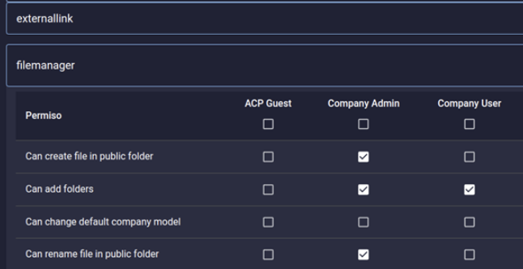

# Access Management Policy

## Purpose

The purpose of this policy is to define required access control measures to protect the privacy, security, and confidentiality of all technology resources.

## Definitions

- **Access**: The ability to use, modify or manipulate an information resource or to gain entry to a physical area or location.
- **Access Control**: The process of granting or denying specific requests for obtaining and using information. The purpose of access controls is to prevent unauthorized access to IT systems.
- **Availability**: Protection of IT systems and data to ensure timely and reliable access to and use of information to authorized users.
- **Confidentiality**: Protection of sensitive information so that it is not disclosed to unauthorized individuals, entities or processes.
- **Principle of Least Privilege**: Access privileges for any user should be limited to resources absolutely essential for completion of assigned duties or functions, and nothing more.
- **Principle of Separation of Duties**: Whenever practical, no one person should be responsible for completing or controlling a task, or set of tasks, from beginning to end when it involves the potential for fraud, abuse, or other harm.

## Identification

Identification is the process of assigning an identifier to every individual or system to enable decisions about the levels of access that should be given. Identifiers must contain the following:

- **Uniqueness**: Each identifier is unique; that is, each identifier is associated with a single person.
- **One Identifier per Individual**: An individual may have no more than one identification number.
- **Non-Reassignment**: Once an identifier is assigned to a particular person it is always associated with that person. It is never subsequently reassigned to identify another person.

## Authentication

The authentication process determines whether someone or something is, in fact, who or what it is declared to be. Authentication validates the identity of the person. Authentication methods involve presenting both a public identifier such as a user name and private authentication information, such as a password.

Pyplan allows authentication through an Identity Provider using **SAML 2.0** protocol. This ensures that the application adheres to all the authentication policies existing in the company. In case of not using authentication via Identity Provider (IdP), Pyplan allows the use of its own authentication system.

To ensure that passwords are of adequate strength, passwords for users, systems, applications, and devices must meet, to the degree technically feasible, the following requirements:

- At least 10 characters
- At least one upper case character
- At least one lower case character
- At least one special character
- Reset after 3 failed login tries
- No password recovery (in case of loss, a new password must be generated)
- Expiration every 90 days
- Multifactor authentication (MFA)

In case of not using authentication via Identity Provider (IdP), Pyplan uses the PBKDF2 algorithm with a SHA256 hash, a password stretching mechanism recommended by NIST, to store the password.

Pyplan uses the Role concept to restrict the access of users to certain application functions. Departments are used for information restriction. Pyplan uses the **principle of least privilege**.

### Concepts

- **Company**: It identifies the company to which the user belongs. It is the highest-level entity and it groups the rest of the entities.
- **Roles**: These are a set of permissions that deny or enable different functionalities of the application. Pyplan has an administrator that allows to define which Roles can have access to which application functions.

  

- **Departments**: It allows to group users to limit the information access in different application sections. Users belonging to a department can:
  - Have access to certain files in the file manager
  - Have access to certain model nodes
  - See certain form records

- **Users**: It unequivocally identifies each application user. In case of using the own Pyplan user authentication system, the minimum information of each user shall be its login, full name, e-mail address and status (active/inactive).

### User Activity Monitoring

Pyplan provides a tool that allows system administrators to monitor each action performed by every user. This information is saved and stored for a **6-month period** by default and this information is not modifiable.
