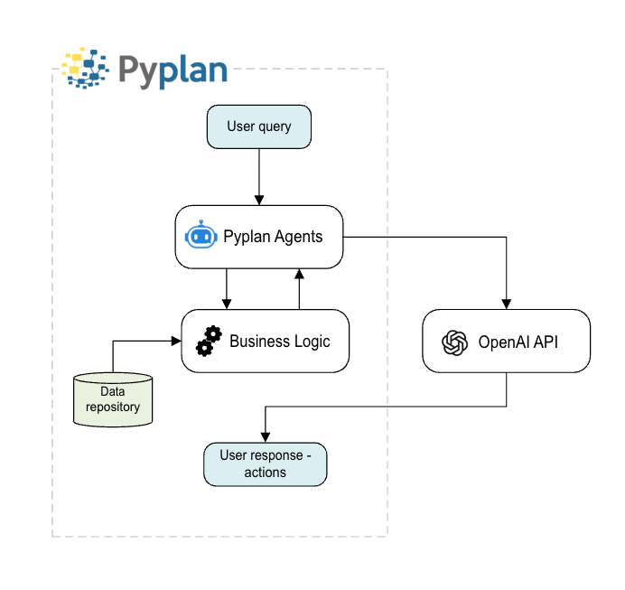

# AI Agents and Data Privacy Policy

## How Pyplan Uses AI Agents

Pyplan integrates intelligent agents ("Pyplan Agents") that assist users in analyzing and interacting with their data. These agents may leverage OpenAI's API services to generate insights, explanations, or execute specific actions based on user queries.

## Data Handling and Security

- **No Data Sharing**: Pyplan does not share, sell, or expose your data to OpenAI or any other third parties beyond what is strictly necessary for processing a given request through the API.
- **API-Based Processing**: When a Pyplan Agent uses the OpenAI API, it may temporarily send relevant context (such as text descriptions or small data samples) to generate a response. This data is processed ephemerally — it is not stored or used by OpenAI for training or any other purposes.
- **Data Residency**: All user data remains stored securely within Pyplan's infrastructure. Our agents access this data only as needed to perform the requested task (e.g., analyzing a dataframe, generating an explanation, or activating a tool).

## OpenAI Data Use Policy

According to [OpenAI's data usage policy](https://openai.com/enterprise-privacy), data submitted via the OpenAI API is not used for model training. Pyplan uses the API under this policy and instructs OpenAI to handle all transmitted data accordingly.

## Transparency and Control

Users maintain full ownership and control over their data. Pyplan's AI agents operate exclusively within the boundaries of the user's workspace and the permissions granted by the user.

The following diagram illustrates how Pyplan Agents interact with the OpenAI API and internal business logic while keeping data securely managed within the Pyplan environment:

