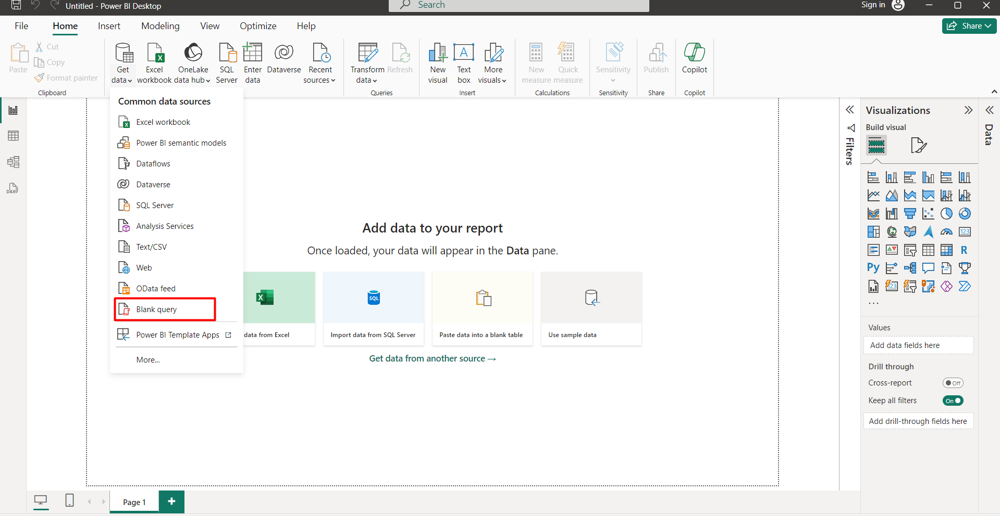
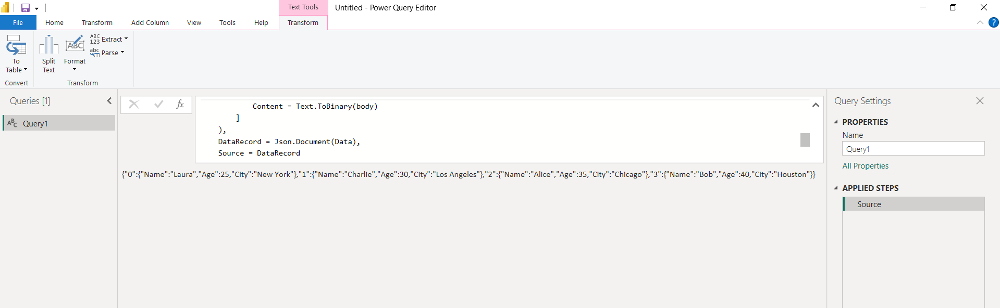
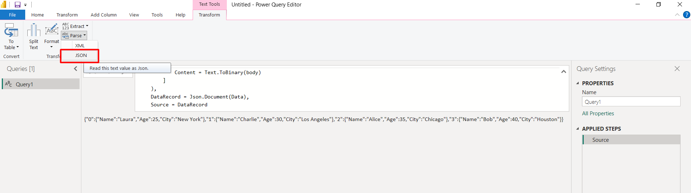
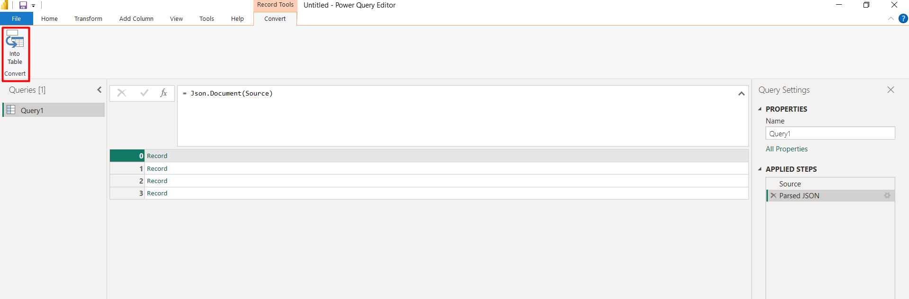
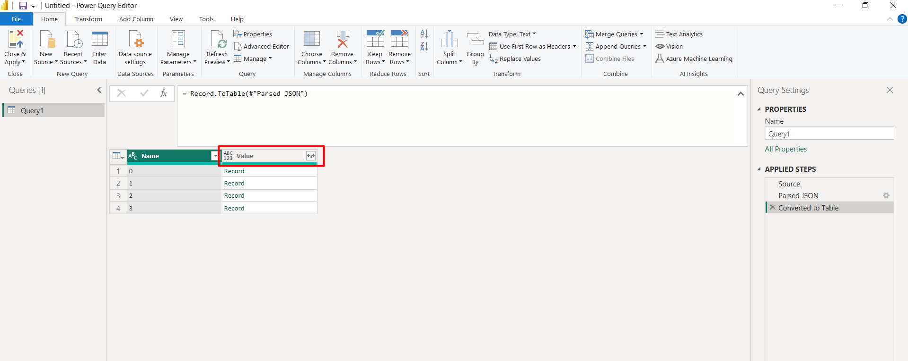
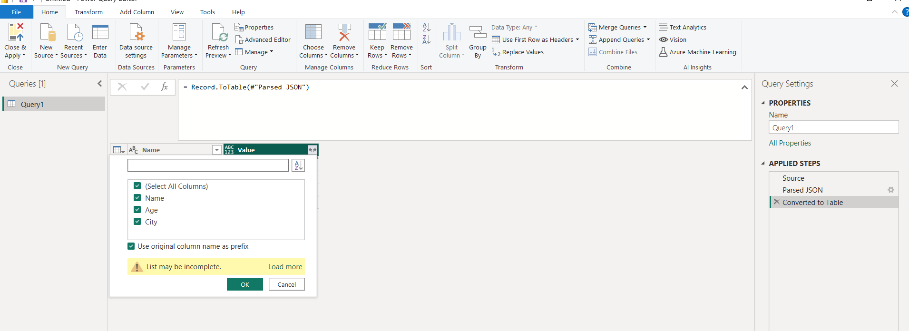
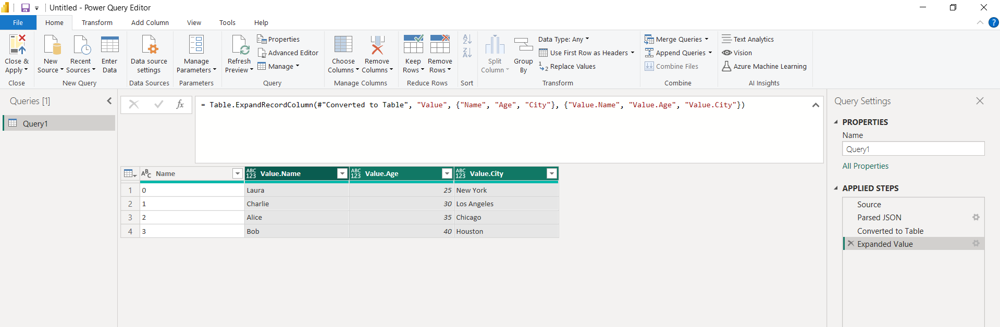
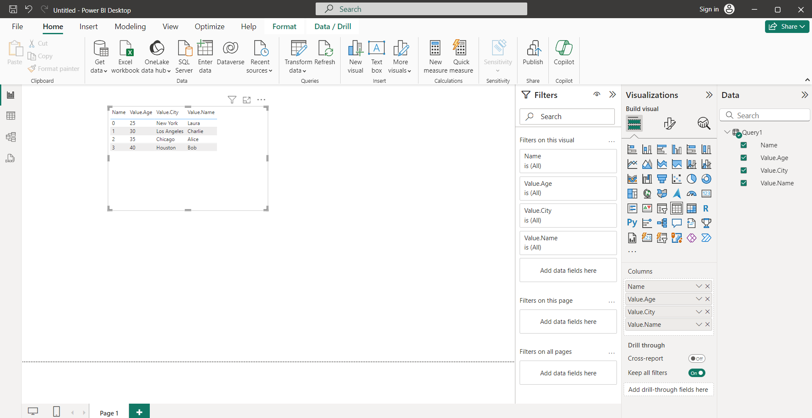

# Connecting with Power BI

Pyplan allows you to retrieve data in JSON format, which can then be seamlessly imported and analyzed in Power BI. Follow the steps below to connect Pyplan with Power BI and retrieve data using an API endpoint.

## Define the API Endpoint Function

Begin by defining a function in Pyplan that returns data from a dataframe in JSON format. For example:

```python
def _fn(name1, name2):
    data = {
        'Name': [name1, name2, 'Alice', 'Bob'],
        'Age': [25, 30, 35, 40],
        'City': ['New York', 'Los Angeles', 'Chicago', 'Houston']
    }

    # Create a dataframe from the dictionary
    df = pd.DataFrame(data)

    return df.to_json(orient="index")

result = _fn
```

## Prepare Power BI

Open Power BI and select **Get Data**. Choose **Blank Query**.



## Enter Code into Function Window

In the new window, input the following Power Query M code, replacing the URL with the one corresponding to your API endpoint and adjusting the list of parameters accordingly.

```
= let

    // Api endpoint url
    url = "https://dev.pyplan.com/api/result/6e0c783b-d74f-487e-a9f3-2dad1834c9f8/",
    // Define the dictionary of parameters to pass to the function
    params = [
        name1 = "Laura",
        name2 = "Charlie"
    ],

    // API token
    token = "XXX",

    // Convert the dictionary to a JSON string
    body = Text.FromBinary(Json.FromValue(params)),
    Data = Web.Contents(
        url,
        [
            Headers = [
                #"Content-Type" = "application/json",
                #"x-api-key" = token
            ],
            Content = Text.ToBinary(body)
        ]
    ),
    DataRecord = Json.Document(Data),
    Source = DataRecord

in
    Source
```

## Run the Code

Execute the code to retrieve the JSON data from the function.



## Parse JSON Data

After retrieving the data, select **Parse JSON**.



## Transform Data into Table Format

Choose **Into Table** to format the data into a table.



## Expand Data

Expand the data to include all columns from the values.





## View Data

Now that the data is in a table format within Power BI, you can proceed to create customized dashboards and reports based on your analysis needs.




