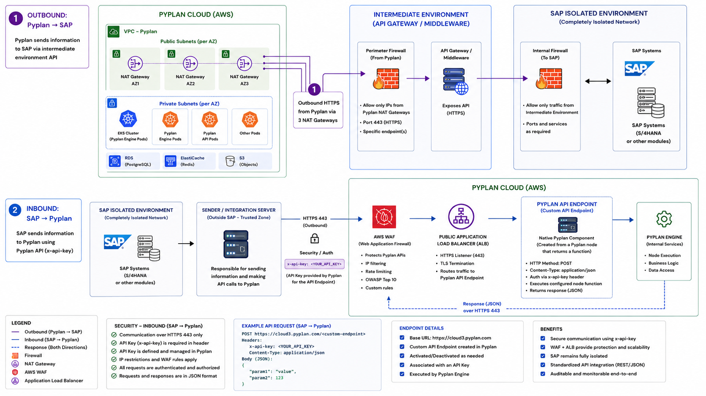

# SAP Integration via APIs

Pyplan can integrate with SAP through REST APIs in two complementary ways:

- **Outbound (`Pyplan -> SAP`)**: Pyplan sends information to an API exposed by an intermediate environment, such as an API Gateway, middleware, or integration server, which then communicates with SAP.
- **Inbound (`SAP -> Pyplan`)**: SAP, or a trusted integration server in front of SAP, calls a Pyplan API endpoint to send data or trigger business logic inside Pyplan.

This pattern is especially useful when SAP is deployed in an isolated network and direct connectivity between SAP and Pyplan is not allowed.

## Reference architecture



## Outbound: Pyplan to SAP

In this flow, Pyplan initiates the communication. Since SAP is commonly protected inside a private network, Pyplan should call an API exposed by an intermediate layer managed by the customer.

### Requirements

- An HTTPS endpoint exposed by the customer's API Gateway, middleware, or integration server.
- Port `443` enabled on the perimeter firewall.
- Allowlist for the outbound IPs used by Pyplan. Request the corresponding public IPs from the Pyplan team.
- Internal connectivity from the intermediate environment to the required SAP services.
- Credentials or tokens stored securely in Pyplan secrets.

### Typical use cases

- Read master data from SAP.
- Send planning results from Pyplan to SAP.
- Trigger SAP-side processes through a controlled API.

### Example

```python
import requests

url = "https://customer-api.example.com/sap/integration"
headers = {
    "Authorization": "Bearer <token>",
    "Content-Type": "application/json",
}
payload = {
    "scenario": "budget_2026",
    "company_code": "1000",
    "version": "approved",
}

response = requests.post(url, headers=headers, json=payload, timeout=60)
response.raise_for_status()

result = response.json()
```

## Inbound: SAP to Pyplan

In this flow, SAP sends information to Pyplan using a Pyplan API endpoint. This is the mechanism documented in [API Endpoints](/user-guide/app-management/api-endpoints).

The recommended approach is for SAP to send the request through a trusted integration server or middleware layer, which then invokes Pyplan over HTTPS.

### How it works

- Create a Pyplan node whose result is a Python function.
- Generate the API endpoint from that node using **Get API Endpoint**.
- API endpoints are available only for the **Default version** of the app.
- Protect the endpoint with an API key.
- Send a `POST` request from the SAP-side integration layer with `Content-Type: application/json`.
- Pyplan executes the node function and returns the response in JSON format.

### Example request

```http
POST https://<your-pyplan-host>/<generated-or-custom-endpoint>
x-api-key: <YOUR_API_KEY>
Content-Type: application/json

{
  "param1": "value",
  "param2": 123
}
```

### Notes

- Use the `x-api-key` header to authenticate the request.
- API endpoints can be activated or deactivated as needed from the API Endpoints manager.
- The endpoint can run under a specific executor user.
- The function should return JSON when the caller expects a response payload.

## Security considerations

- Use HTTPS for both directions.
- Restrict inbound calls with `x-api-key` and, when needed, additional WAF or IP filtering rules.
- Restrict outbound access to specific SAP integration endpoints only.
- Keep SAP isolated behind the customer's firewall and expose only the required APIs.
- Use the intermediary environment to centralize audit, routing, and security policies.

## Related articles

- [API Endpoints](/user-guide/app-management/api-endpoints)
