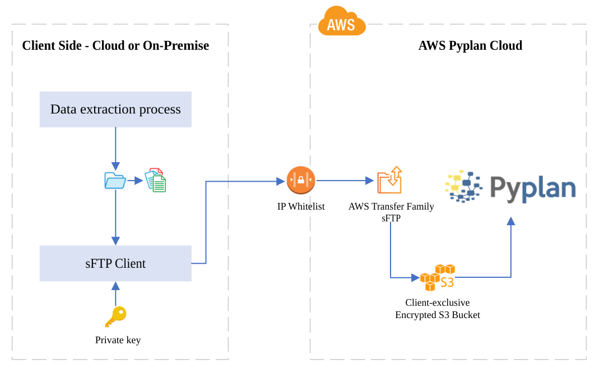
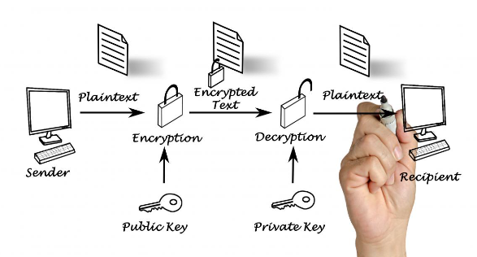

# Secure File Transfer Protocol (sFTP)

## AWS Transfer Family

### Purpose

The Amazon Transfer Family provides users with a fully managed, highly available file transfer service with auto-scaling capabilities, eliminating the need for users to manage file transfer related infrastructure. End-user workflows remain unchanged, while data uploaded and downloaded via the chosen protocols are stored in the user's Amazon S3 bucket or Amazon EFS file system. With the data in Amazon Web Services, users can now easily use it with the broad array of Amazon Web Services services for data processing, content management, analytics, machine learning, and archival, in an environment that can meet their compliance requirements.

### Security

#### SOC

Amazon Transfer Family is PCI-DSS compliant. The service is also SOC 1, 2, and 3 compliant.

#### Supported algorithms

Server security policies in Amazon Transfer Family allow users to limit the set of cryptographic algorithms (message authentication codes (MACs), key exchanges (KEXs), and cipher suites) associated with their server. For a list of supported cryptographic algorithms, see [Cryptographic algorithms](https://docs.amazonaws.cn/en_us/transfer/latest/userguide/security-policies.html#cryptographic-algorithms). For a list of supported key algorithms for use with server host keys and service-managed user keys, see [Supported algorithms for user and server keys](https://docs.amazonaws.cn/en_us/transfer/latest/userguide/key-management.html#key-algorithms).

For more information: https://www.amazonaws.cn/en/amazon-transfer-family/

---

## Information Synchronization Diagram

The following is a diagram representing the flow of information and the technologies used for data transfer between the client side and Pyplan Cloud. Please note that information can flow in both directions if necessary.



### Notes

- Authentication to the sFTP service is exclusively done using certificates (`cert.pem`). User and password authentication is not allowed.
  :::note
  Review the supported algorithms in the section above.
  :::
- Only authorized IPs (whitelist) will have access to the sFTP service.
- The S3 bucket:
  - It is created exclusively for the client and is for internal use only (access is restricted to Pyplan's internal network).
  - It is fully encrypted and there is a daily backup in case of emergency.

---

## Client-side implementation

To implement data synchronization, follow the next steps:

1. Provide the public IP address from which you will connect to the AWS sFTP service.
2. Request the creation of a user.
3. The Pyplan team will send the host URL, username and `cert.pem` file to the responsible person(s), which will allow them to connect to the AWS sFTP service.
4. Configure and test the sFTP client tool. In case the user doesn't have an approved tool, the following is an example of a Linux script that establishes the connection and sends information:

Create a test file:

```bash
echo "This is a sample file" > file.txt
```

Connect to the sFTP server and transfer the file:

```bash
#!/bin/bash

# Variables
HOST="sftp.example.com"
USERNAME="your_username"
KEYFILE="path/to/your/cert.pem"
LOCAL_FILE="file.txt"

# Connect and transfer
sftp -i $KEYFILE $USERNAME@$HOST <<EOF
put $LOCAL_FILE
ls
quit
EOF
```

---

## Data encryption using PGP (Optional)

Pyplan allows users to add a layer of security by encrypting files using PGP keys before sending them.


