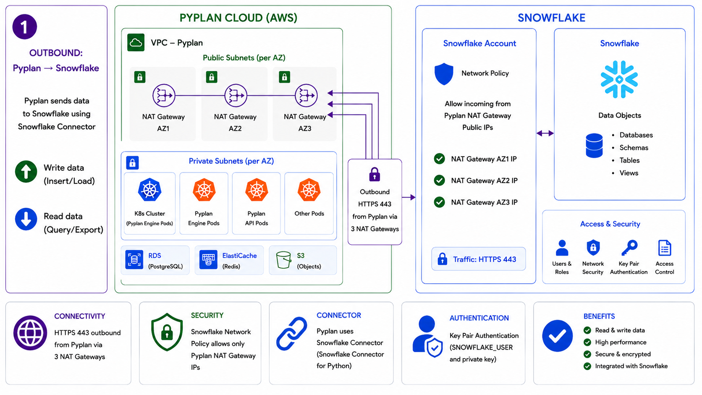

# Snowflake Connection

Pyplan connects to Snowflake using the Snowflake Connector for Python. This integration is outbound from Pyplan to Snowflake and supports both reading data from Snowflake and writing data into Snowflake objects.

For IT and infrastructure teams, the key point is that access should be restricted from the Snowflake side: Pyplan reaches Snowflake over `HTTPS 443`, and the Snowflake account should allow only the public IPs used by Pyplan NAT Gateways through a Network Policy.

## Reference architecture



## Integration flow

1. Pyplan runs inside Pyplan Cloud on AWS.
2. Outbound traffic leaves Pyplan through public NAT Gateways.
3. Snowflake Network Policy allows access only from those registered public IPs.
4. Pyplan authenticates using key pair authentication with a Snowflake user and private key.
5. Pyplan reads from or writes to Snowflake objects such as databases, schemas, tables, and views.

## Network and security requirements

- Communication is outbound only: `Pyplan -> Snowflake`.
- Protocol: `HTTPS`
- Port: `443`
- Snowflake Network Policy should allow only the public IPs used by Pyplan NAT Gateways. Request the corresponding IPs from the Pyplan team.
- Authentication is performed with a Snowflake user and private RSA key.
- Access to Snowflake data is governed through users, roles, and object-level permissions defined in Snowflake.
- Data exchange remains protected by Snowflake network security and account controls.

## Requirements

### Default

- `account`: Organization Account (e.g. `xxx.snowflakecomputing.com`)
- `user`: User who will access the database
- `private_key`: Private key (usually an RSA key of type `.p8`)
- `database`: Database name
- `schema`: Schema name
- Enable the Network Policy or firewall restrictions in the Snowflake account: Request the corresponding IPs from the Pyplan team.

## Authentication for IT teams

Pyplan uses Snowflake key pair authentication.

The customer should provision a Snowflake user with the required roles and share with Pyplan:

- `account`
- `user`
- `private_key`
- `database`
- `schema`
- Any additional context required by the environment, such as a specific role or warehouse when applicable

## What this integration enables

- Query data from Snowflake tables and views.
- Export Snowflake data into Pyplan processes.
- Insert or load data generated in Pyplan into Snowflake.
- Keep network restrictions, roles, and access policies under the customer's Snowflake administration.

---

## Connections according to credential type

### Connection - Private Key RSA

Integration with the Snowflake Python connector using an RSA key:

```python
import snowflake.connector as sc
from cryptography.hazmat.primitives import serialization

key_path = "rsa_key_pyplan.p8"  # Set as secret on the Pyplan platform
key_pass = b'xxxx'              # Set as secret on the Pyplan platform

# Open the private key file
with open(key_path, "rb") as key:
    private_key = serialization.load_pem_private_key(
        key.read(),
        password=key_pass
    )

# Connect using the private_key object
ctx = sc.connect(
    account='xxx.snowflakecomputing.com',
    user='PYPLAN_XXX',
    private_key=private_key,
    database='xxx',
    schema='xxx'
)

# Query
cs = ctx.cursor()
try:
    cs.execute("SELECT current_version()")
    print("Snowflake version:", cs.fetchone()[0])
finally:
    cs.close()
    ctx.close()
```

---

## Related articles

- [Snowflake Python Connector — Connecting](https://docs.snowflake.com/en/developer-guide/python-connector/python-connector-connect)
