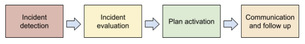
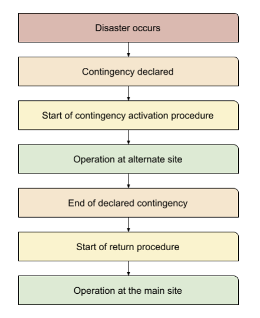

# Disaster Recovery Plan

This section contains the plan and description regarding the operational activities for Pyplan application disaster recovery.

## Introduction

This section describes the operational procedures for Pyplan application recovery when a disaster event occurs that affects an entire IaaS Cloud Availability Zone where Pyplan production environment resides.

## Target Time

The temporal objectives to recover the entire application are:

- **RPO** = 24 hours
- **RTO** = 36 hours

## Conditions for Reactivating Services

To reactivate the Pyplan application service, the following conditions must be met:

- There must be an uninterrupted availability zone.
- All services used by Pyplan must be working correctly in the new availability zone.

## Event Classification

| Type | Description | Examples | Response |
|------|-------------|----------|----------|
| **DISASTER** | Event that disables the Data Center to provide its services | Earthquakes, general fire, power failure, natural catastrophes | Activation of disaster recovery plan |
| **INTERRUPTION** | Event that needs to be evaluated to be handled as a disaster or as a contingency. Depends on the impact determined in incident management. | Systems or service failure | Activation of disaster recovery plan or contingency application |
| **CONTINGENCY** | Event that impacts a resource necessary for the provision of services | Module failure or temporary failure | Contingency application |

## Activation Phases

## Notification Procedure

Notification of the unavailability of information systems or IT services can come from different sources, depending on the nature of the event, the time at which it occurs and the source that causes it.

## Activation Process

The following is a description of the process by which the management plan is activated, after notification of the disaster:

## Operating Tasks

The following table shows the operational tasks that will be carried out in the event of applying the disaster recovery plan:

| Task | Duration (hours) |
|------|-----------------|
| Deployment of architecture in a new availability zone | 20 |
| Data restoration using the latest available backup | 12 |
| Manual operation tests | 2 |
| Run the automatic stress tests | 1 |
| URL release for production use | 1 |

**Total estimated recovery time: ~36 hours (RTO)**

## Test of the Disaster Recovery Plan

Pyplan performs **annual disaster recovery plan tests** to validate the procedures and ensure readiness.
