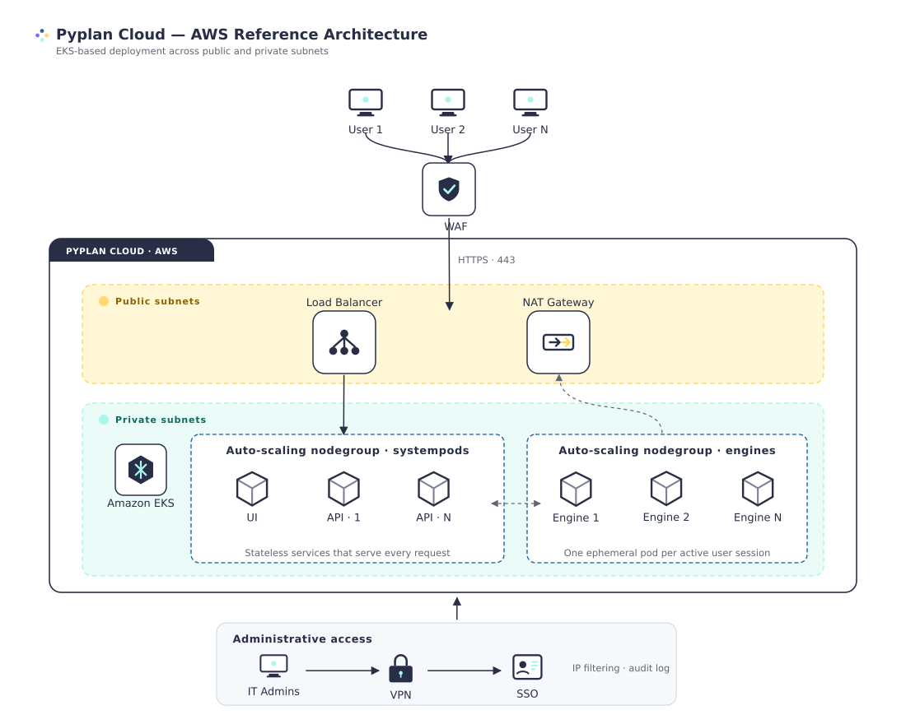
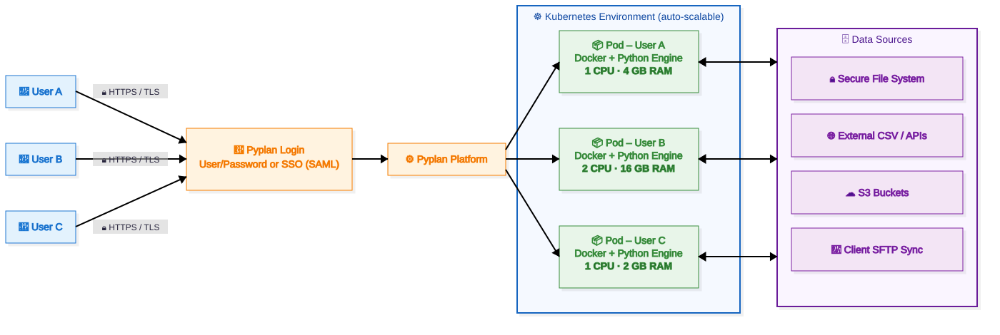
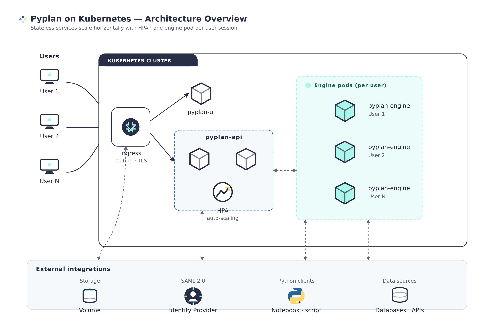
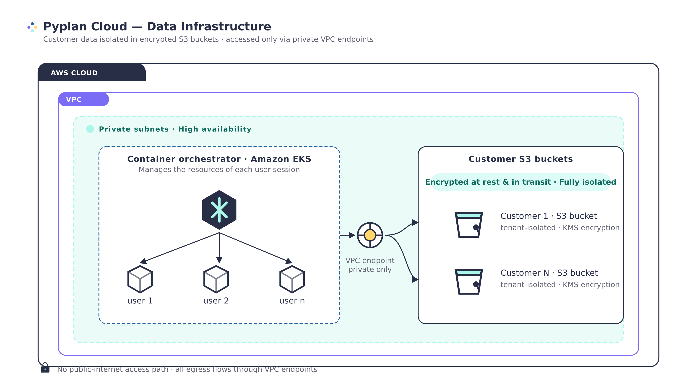
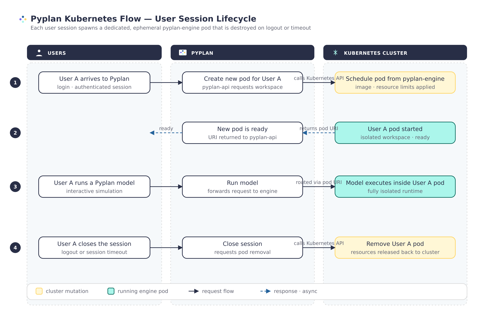

# Pyplan Cloud Architecture

In order to ensure a strong, secure foundation, Pyplan Cloud shares security responsibilities with an industry-leading cloud infrastructure vendor and valued partner: Amazon Web Services (AWS). These cloud computing services are used by Pyplan for internal purposes as well as Pyplan clients for their own cloud deployments.

Pyplan Cloud relies on cloud infrastructure for secure physical access, redundant (fault tolerant) infrastructure and scalability.

Our cloud partner's network design and monitoring mitigate common types of network security issues such as Distributed Denial of Service (DDoS), Man in the Middle (MITM), IP Spoofing, Port Scanning or packet sniffing.

The geographical location of Pyplan Cloud's storage and infrastructure is in the United States. In case this location is not standardized by the customer (in relation to General Data Protection Regulation - GDPR), the customer may opt for an on-premise installation in a location that is in accordance with its internal rules.

A reference diagram for our Cloud deployment is shown below:

The access to infrastructure management is performed exclusively by qualified staff, implementing all the security measures offered by the supplier (i.e., VPN, Multi-factor Authentication (MFA), IP filtering, etc.).

## How Pyplan Cloud Works

This section provides a functional overview of how Pyplan Cloud operates during a user session. The purpose is to describe the experience in a simple way while preserving the main security and infrastructure concepts.

1. **Secure Sign-In**

	Users sign in to Pyplan using either a username and password or their company's **Single Sign-On (SSO)** through **SAML**. All communication is encrypted end-to-end with **HTTPS** and **TLS**.

2. **On-Demand Private Workspace**

	Once a user opens a Python application, Pyplan automatically creates a dedicated Kubernetes pod for that session. Each pod runs a Docker container with the Python engine that powers the application.

	Resources such as CPU and RAM are predefined per department or per application. For example, a lighter application may use 1 CPU and 4 GB of RAM, while a heavier modeling workload may use 4 CPUs and 16 GB of RAM. The platform scales automatically as more users connect.

3. **Elastic Scaling as Demand Grows**

	As usage increases, Pyplan scales horizontally by creating additional pods and, when required, expanding the underlying infrastructure capacity. This allows multiple users and more demanding workloads to run simultaneously while maintaining performance, resource isolation, and service availability.

4. **The Application Runs Inside the Pod**

	Each pod provides more than compute capacity. It is the secure environment where the application becomes available, including both the business rules and the user interfaces that define each Pyplan application. From there, users can:

	- Build or modify business rules, calculations, and logic.
	- Design, edit, or consume the application's interfaces, such as dashboards, forms, and reports.
	- Explore and analyze results in real time.

	All of this happens inside the user's private pod, helping ensure that logic, data, and interaction remain isolated within that environment.

5. **Full Isolation Between Users**

	Each user receives an independent pod. Processing space, memory, business logic, and session data are not shared across users. This design helps guarantee privacy and security by default.

6. **Flexible Data Integration**

	From within their private workspace, users can read data from multiple sources, including:

	- A secure file system mounted within Pyplan.
	- External sources such as public flat files or APIs.
	- S3 buckets, including data synchronized through the client's SFTP process.

7. **Built-In Collaboration with Native Data Entry Forms**

	Pyplan includes native data entry forms that allow users to persist information directly into a shared database. Multiple users can read and write to this database at the same time, enabling real-time collaboration across teams.

	This capability is especially useful in scenarios such as:

	- Demand planning, where sales, marketing, and operations contribute forecasts in parallel.
	- Budgeting and financial planning, where different departments enter their own figures.
	- S&OP processes, where multiple stakeholders align values in a shared source of truth.

	Each user works from an isolated pod, while all users contribute to the same shared data layer. This combines private execution environments with collaborative data workflows.

8. **Automatic Cleanup**

	When the session ends, the pod is destroyed automatically. This frees infrastructure resources and ensures that no session data persists outside its secure environment. The shared database remains available for the rest of the team.

9. **End-to-End Encryption**

	Every interaction, from sign-in to data access, travels through encrypted HTTPS/TLS channels, helping protect information at all times.

A reference diagram for this workflow is shown below:

### Key Benefits

| Benefit | Description |
| --- | --- |
| Security and isolation | Each user works in a dedicated encrypted environment with independent business logic and interfaces. |
| Scalability | The platform grows on demand as pods are created and destroyed according to active sessions. |
| Full application experience | Users can build, modify, and consume business logic and interfaces from within their secure pod. |
| Real-time collaboration | Native data entry forms allow multiple users to contribute simultaneously to a shared database. |
| Data integration | Pyplan connects to internal file systems, S3, SFTP-based data flows, external APIs, and shared databases. |
| Resource efficiency | Infrastructure resources are consumed only while a session is active. |
| Cloud agnostic architecture | Pyplan can run on major cloud providers without depending on a single vendor. |

## Pyplan and Kubernetes

Pyplan uses Kubernetes to grant a both scalable and high-availability service. The architecture based on containers allows Pyplan to get optimal use of resources, enabling it to define how much CPU and memory grant to certain user groups. A key feature of this platform is the ability to horizontally scale up as workloads increase and scale back down as they reduce, which is used in Pyplan to ensure consistent performance for our customers regardless of the number of users on the platform. Automated monitoring and adjustment of resources allows all components of the platform to have the right resources at the right time.

A reference diagram for our Kubernetes deployment is shown below:

Some of the key technologies used in Pyplan are:

- **Kubernetes**: Provides automated container deployment, scaling, and management. See [https://kubernetes.io/](https://kubernetes.io/)
- **Redis**: An in-memory data structure store used as a database, cache and message broker. See [https://redis.io/](https://redis.io/)
- **PostgreSQL**: A powerful object-relational database system used as the repository within Pyplan. See [https://www.postgresql.org/](https://www.postgresql.org/)

## Data Management

The information is fully isolated within encrypted S3 buckets (both in transit and at rest), with access strictly limited to private endpoints deployed within the same VPCs as the container orchestrators. This architecture ensures that no access is possible from the public internet.

## Backup Policies

Pyplan Cloud performs daily backups. Such backup information is stored encrypted for 1 month after which it is moved to a cold storage for 5 additional months. After such period, the backup information is deleted.

## Service Level Agreement (SLA)

Pyplan Cloud will use reasonable efforts to make the application available with a monthly uptime percentage of at least **97.5%**.

### SLA Exclusions

The Service Commitment does not apply to any unavailability or suspension of Pyplan Cloud:

- Caused by factors outside of our reasonable control, including any force majeure event or Internet access or related problems beyond the demarcation point of Pyplan Cloud
- That result from any voluntary actions or inactions from you or any third party
- That result from your equipment, software or other technology and/or third-party equipment, software or other technology (other than third-party equipment within our direct control)

## Status Page

Service status of Pyplan Cloud can be found at [https://status.pyplan.com](https://status.pyplan.com).

## Predictable Performance at Scale

To ensure the best possible end user experience, Pyplan is exhaustively stress tested in order to be performant and scale accordingly. Several different configurations are tested to make sure that the tenants can cope with the expected use cases and loads. Some of the parameters tested include:

- User ramp-up (number of users accessing the tenant per time unit)
- User type
- Number of concurrent users
- Number and size of apps
- Number, frequency and size of concurrent reloads

## Our Web Architecture

Pyplan is accessible from any device via a web browser.

Security is the key consideration in our architecture. Authentication is through the tenant's identity provider mechanism (using SAML 2.0) or through Pyplan's own system. Session duration can be accomplished by a company-wide configuration.

As with a regular browser connection, both HTTP and WebSocket traffic to Pyplan is encrypted over Transport Level Security (TLS). For that reason, the Transmission Control Protocol (TCP) port used by Pyplan is port **443**.

## Pyplan Architecture

Pyplan runs over a Kubernetes cluster. The containers listed below are the main structure of the application, where Kubernetes will ensure its deployment into pods or another Kubernetes resource and verify their status:

- `PYPLAN-UI`
- `PYPLAN-API`
- `PYPLAN-WS`
- `PYPLAN-CELERY`
- `PYPLAN-DB`
- `PYPLAN-REDIS`

In Kubernetes, a Pod represents a set of running containers on your cluster. Every time a user opens an application, Pyplan needs to interact with the Kubernetes Application Programming Interface (API) in order to instruct Kubernetes to generate a new pod — `PYPLAN-ENGINE` — that will be its workspace. Furthermore, when a user logs out or a timeout occurs, Pyplan destroys the pod belonging to that user, which results in a release of resources.

## Scaling

Pyplan uses Kubernetes to provide a scalable as well as a high-availability service. It uses HPA (Horizontal Pod Autoscaler) to ensure that all API requests are optimally answered. On installations in providers such as AWS, Azure, GCP, Pyplan uses node and nodepools scaling to allocate each user's computing resources.

## Monitoring Tools

Supported by monitoring tools available for Kubernetes, Pyplan includes a default dashboard tool to monitor the Kubernetes cluster. Other tools such as Grafana, Prometheus, Jaeger, etc. can also be used.

:::note
These tools will only be available for qualified staff.
:::
