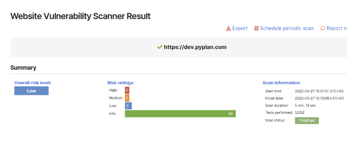

# Security & Compliance

## Data Sovereignty

User's data, including the backup system data, models and disaster recovery, are kept within Pyplan Enterprise's region. There is no transfer out of the region.

## Data Privacy

Pyplan has created exhaustive internal processes to guarantee customer data security. Pyplan undertakes to protect customer data and to communicate openly and transparently.

## Data Separation, Storage & Transport

Pyplan Enterprise is a multi-tenant platform. As a multi-tenant platform, it is crucial that each customer's data is separated from other customer's data. Each tenant has a working space completely isolated from others. When a user logs in to Pyplan, the corresponding working space is set up as a disc unit, making it impossible to move it to other working spaces.

Pyplan uses an encrypted file system, relying on the services of a leading provider such as Amazon Web Services (AWS). The encryption of the file system has the following features:

- **Encrypting data at rest**: The AWS key management infrastructure uses Federal Information Processing Standards (FIPS) 140-2 approved cryptographic algorithms. The infrastructure is consistent with National Institute of Standards and Technology (NIST) 800-57 recommendations.
- **Encrypting data in transit**: AWS uses TLS version 1.2 to encrypt data in transit.
- **Rotation**: AWS generates new cryptographic material for the key every year.

Access to encrypting password management is restricted to qualified staff.

## Content Deletion

The creation and removal of content that resides in the tenant is controlled by the customer. Content can be deleted by the customer at any time. Backups are removed after a period of time in accordance with Pyplan Cloud internal data retention policies.

## Penetration Tests

Pyplan performs penetration tests every three months (among other tests) to guarantee all the infrastructure security. The customer can request test result reports whenever necessary.

## Data Security Breach Management Policy and Procedure

This section details the requirements for identifying, assessing, remediating, reporting and recording data breaches from Pyplan server.

### Scope

This procedure applies to all staff including employees, contractors, trainees and any other personnel who are granted access to Pyplan server.

### Assessment

A security incident is any event or occurrence that affects or tends to affect data protection, or may compromise the availability, integrity, and confidentiality of data. It includes incidents that would result in a data breach, if not for safeguards that have been put in place.

A data breach happens when there is a breach of security leading to the accidental or unlawful destruction, loss, alteration, unauthorized disclosure of, or access to, data transmitted, stored, or otherwise processed.

### Notification of Breaches

Any person who becomes aware of a possible breach of privacy involving personal information in the custody or control of Pyplan will immediately inform Pyplan personnel through email to [support@pyplan.com](mailto:support@pyplan.com) with the subject **"DATA BREACH WARNING"**.

In the body of the email the incident and the name of the accounts estimated to be exposed should be explained.

### Investigation Procedure

The investigation procedure will begin immediately after receiving notification. The investigation procedure includes:

- Pyplan Access logs review to validate and confirm data breach
- User access restriction and password reset
- User activity logs review (IP addresses, access time, activity logs) to determine type of breach

### Containing the Breach

Pyplan will take the following steps to limit the scope and effect of the breach:

- Shutting down the system that was breached
- Correcting weaknesses in security in case they exist
- Stopping unauthorized access
- Restoring the system to previous status in case data was modified or deleted
- Recovering the records
- Close monitoring of user activities to detect unusual behaviors

### Reporting Breaches

After the system has been fixed and the service has been reset, a report will be submitted informing the client the details of the event to decide any further action.

## Pyplan Cloud Network Security Policies

In order to ensure a strong, secure foundation, Pyplan Cloud shares security responsibilities with an industry-leading cloud infrastructure vendor and valued partner. All data is stored using AWS services, in private networks that can only be accessed through the application.

All remote access to Pyplan cloud infrastructure will either be through a secure VPN connection on a Pyplan owned device that has up-to-date anti-virus software. Remote access using VPN can only be performed from authorized IP addresses.

- Users must not install network hardware or software that provides network services without IT approval.
- Users must not download, install, or run security programs or utilities that reveal weaknesses in the security of a system.
- Secure remote access must be strictly controlled with Multi-Factor Authentication (MFA).
- Only IT-approved VPN clients may be used.

## Teleworking Policy

No organizational or customer data is stored in our offices. The offices are used as a work meeting point or to provide a suitable workplace. However, the following policies related to teleworking apply:

- The employee shall designate a workspace, within the remote work location, for placement and installation of equipment to be used while teleworking.
- The employee shall maintain this workspace in a safe condition, free from hazards and other dangers to the employee and equipment.
- All applicable policies for acceptable use, protection of member information, security, etc., shall be observed.
- Personally owned equipment may not be connected to Pyplan owned equipment.
- The employee is responsible for securing the equipment provided by the IT Department.
- The employee will not modify any equipment without written authorization from the IT Department.

### Network and Applications Security Audits

The IT department performs periodic network and application security audits. The controls performed in these audits allow:

- Identify potential threats
- Ensure the protection of data
- Find network inefficiencies
- Improve weak company policies and practices

The following are some of the tasks performed in the audit process:

- **Determine threats**: A list of the most common potential threats is made.
- **Inspect your servers**: Ensures that all network configurations are set up correctly.
- **Penetration testing**: Penetration tests are one of the main methods of finding vulnerabilities in a network. These tests assess the viability of a system and identify security gaps.
- **Static application security testing (SAST)**: Tests are performed using code vulnerability detection tools.
- **Assess backup strategies**: The backup strategies are reviewed and checked for any shortcomings.
- **Reinforce firewalls**: Logs, current rules and permissions are reviewed for weaknesses.
- **Set up log monitoring**: The process of monitoring event logs is reviewed.
- **Review and edit internal policies**: Internal protocols are reviewed for systematic failures.
