# Microsoft Entra ID / Azure AD

# Requirements

To integrate Pyplan with Microsoft AD it will be necessary to create an **Azure Enterprise App**.

# Instructions

## Azure Portal — Microsoft Azure

Access the Azure Active Directory — App Registrations:  
[https://portal.azure.com/#blade/Microsoft_AAD_IAM/ActiveDirectoryMenuBlade/RegisteredApps](https://portal.azure.com/#blade/Microsoft_AAD_IAM/ActiveDirectoryMenuBlade/RegisteredApps)

## Create the New App

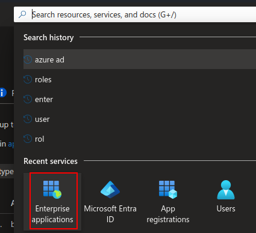

*Enterprise Apps service*

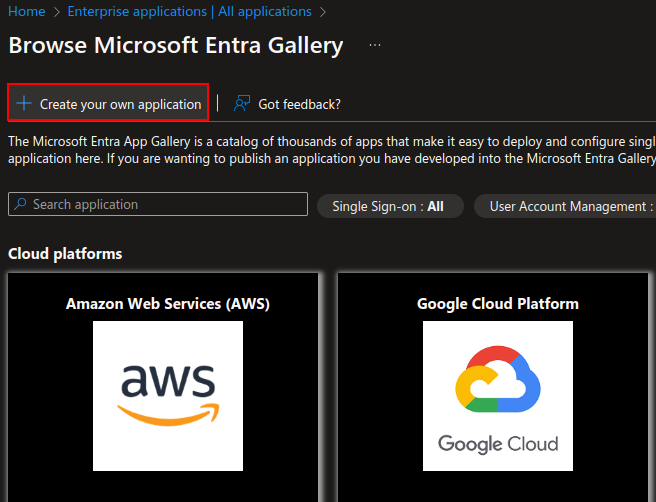

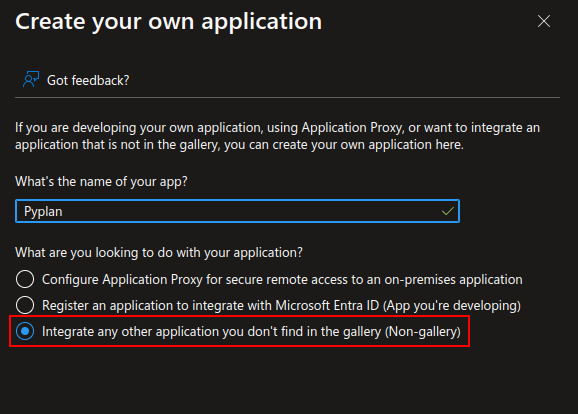

## Assign Users and Groups

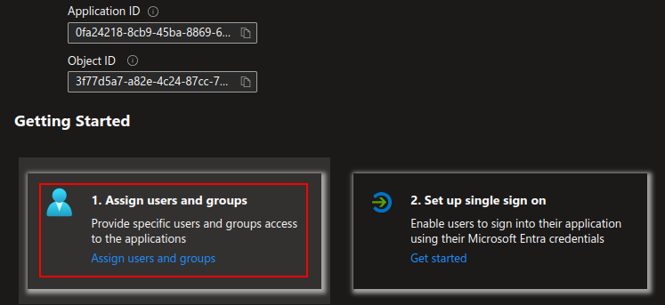

## SSO Configuration

The following section edits the connections between the IDP and Pyplan.

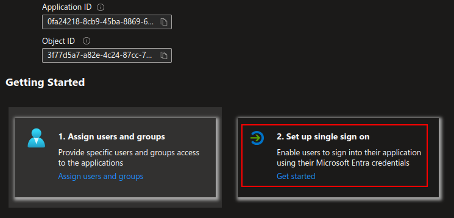

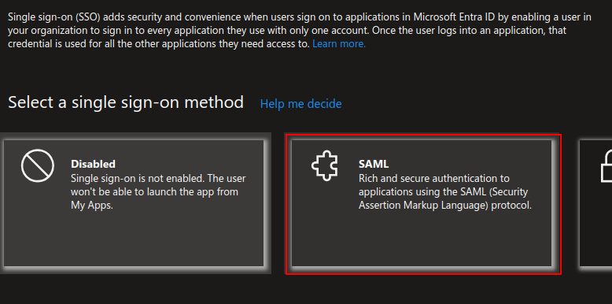

Select the SAML configuration:

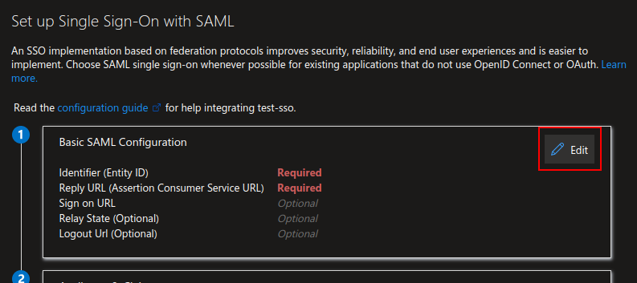

Configure it with the following parameters:

| Field | Value |
|---|---|
| **Identifier (Entity ID)** | `https://[DNS_CLUSTER_INGRESS]/api/saml2/metadata/?code=[COMPANY_NAME]` |
| **Reply URL** | `https://[DNS_CLUSTER_INGRESS]/api/saml2/acs/?code=[COMPANY_NAME]` |
| **Sign On URL** | `https://[DNS_CLUSTER_INGRESS]/api/saml2/login/?next=[DNS_CLUSTER_INGRESS]&code=[COMPANY_NAME]` |
| **Relay State** | *(Empty)* |
| **Logout URL** | `https://[DNS_CLUSTER_INGRESS]/api/saml2/ls/?code=[COMPANY_NAME]` |

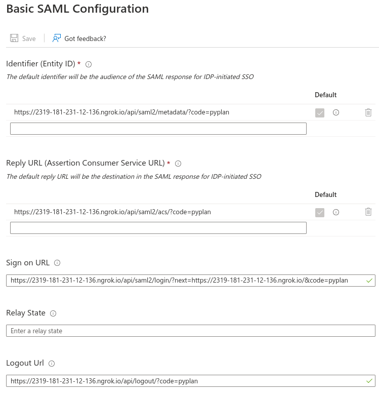

*Example*

## SAML Certificates

Edit the **Signing Option** and the **Algorithm**.

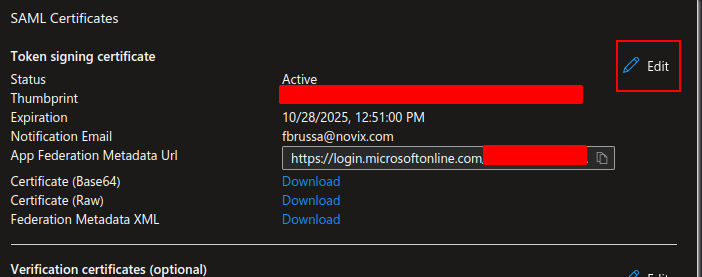

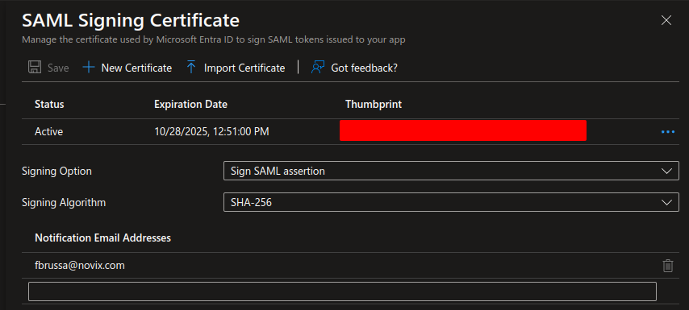

:::info
The **Sign SAML assertion** setting is mandatory.
:::

## Azure Groups (Optional)

Pyplan allows matching an Azure group with a set of specific permissions within the application to facilitate the tasks of the security team.

For more information: [Security Options](/user-guide/security-options)

### Configure the Default Role & Department

The next step is to add two **Claims** to the environment with these parameters:

- **Namespace:** `http://schemas.xmlsoap.org/ws/2005/05/identity/claims`
- **Source attribute for Role & Department:** `user.usertype` *(consent with the customer)*

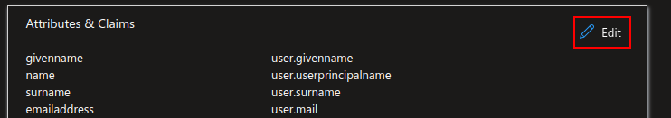

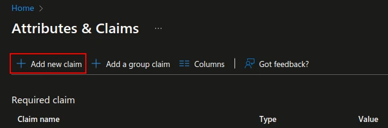

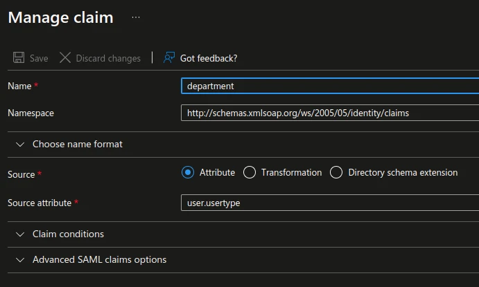

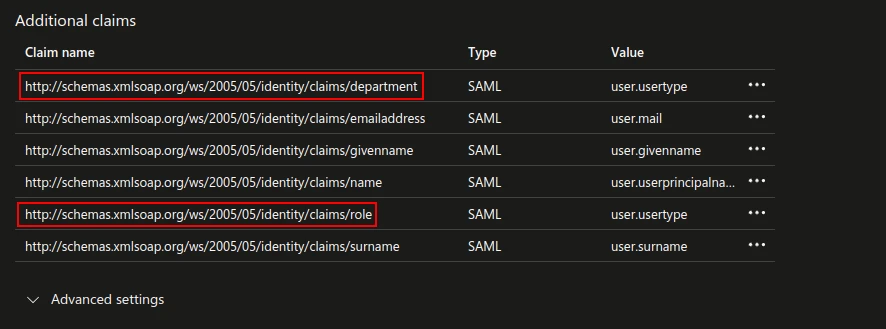

