# Microsoft Entra ID / Azure AD

# Requirements

To integrate Pyplan with Microsoft AD it will be necessary to create an **Azure Enterprise App**.

# Instructions

## Azure Portal — Microsoft Azure

Access the Azure Active Directory — App Registrations:  
[https://portal.azure.com/#blade/Microsoft_AAD_IAM/ActiveDirectoryMenuBlade/RegisteredApps](https://portal.azure.com/#blade/Microsoft_AAD_IAM/ActiveDirectoryMenuBlade/RegisteredApps)

## Create the New App

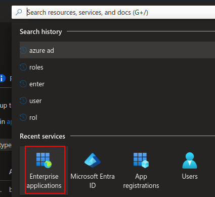

*Enterprise Apps service*

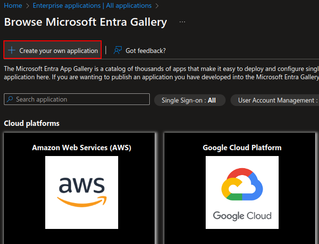

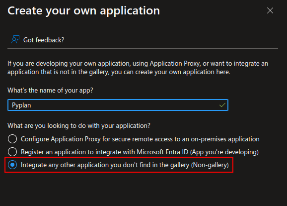

## Assign Users and Groups

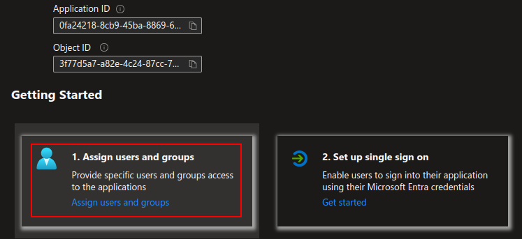

## SSO Configuration

The following section edits the connections between the IDP and Pyplan.

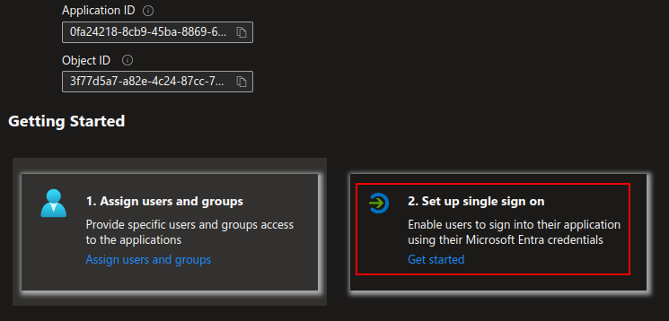

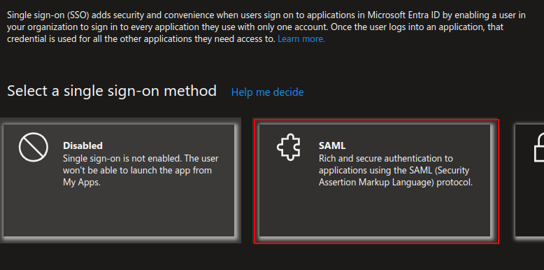

Select the SAML configuration:

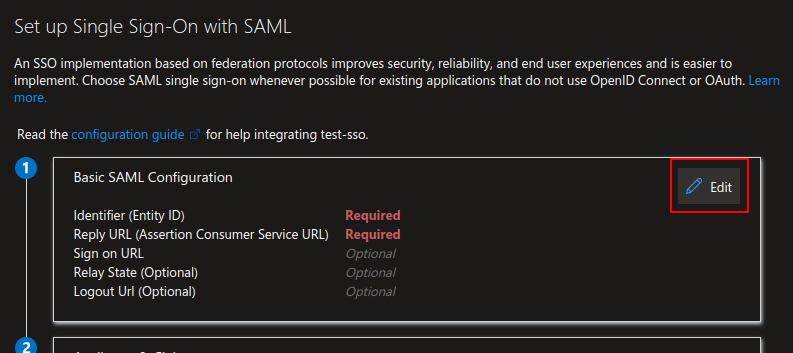

Configure it with the following parameters:

| Field | Value |
|---|---|
| **Identifier (Entity ID)** | `https://[DNS_CLUSTER_INGRESS]/api/saml2/metadata/?code=[COMPANY_NAME]` |
| **Reply URL** | `https://[DNS_CLUSTER_INGRESS]/api/saml2/acs/?code=[COMPANY_NAME]` |
| **Sign On URL** | `https://[DNS_CLUSTER_INGRESS]/api/saml2/login/?next=[DNS_CLUSTER_INGRESS]&code=[COMPANY_NAME]` |
| **Relay State** | *(Empty)* |
| **Logout URL** | `https://[DNS_CLUSTER_INGRESS]/api/saml2/ls/?code=[COMPANY_NAME]` |

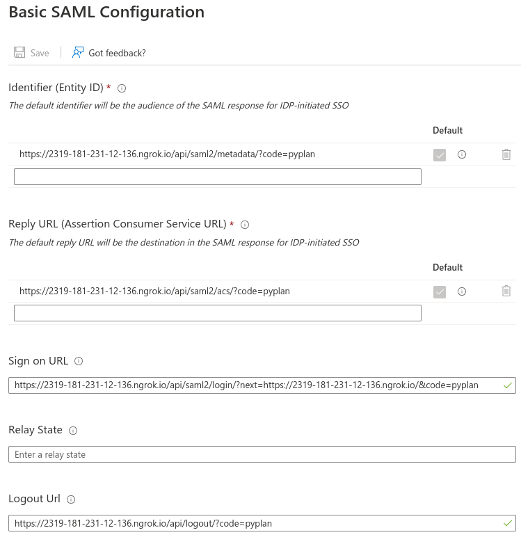

*Example*

## SAML Certificates

Edit the **Signing Option** and the **Algorithm**.

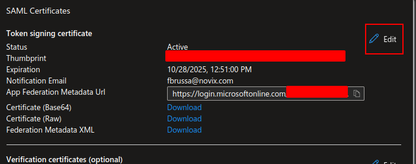

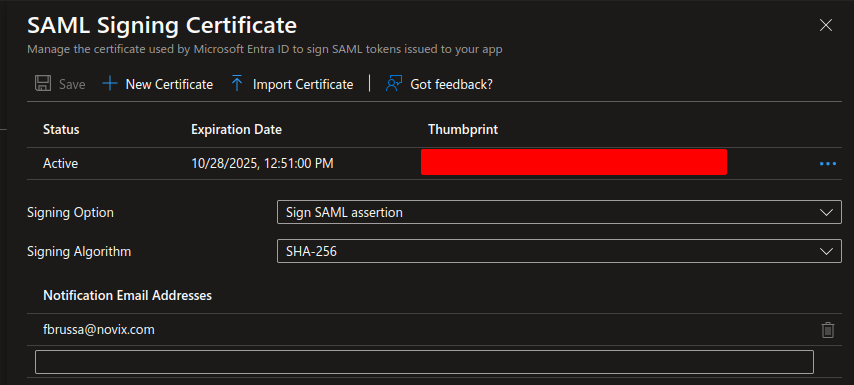

:::info
The **Sign SAML assertion** setting is mandatory.
:::

## SCIM 2.0 Automatic Provisioning

In addition to SAML sign-in, Pyplan supports **SCIM 2.0 automatic provisioning** from Microsoft Entra ID. SCIM keeps user access synchronized with Entra ID, including user creation, updates, deactivation, reactivation, and removal from a company.

:::info
Automatic provisioning to a custom SCIM application requires Microsoft Entra ID P1, or a Microsoft subscription that includes it. Licenses are required only for the users being provisioned.
:::

### Create Authentication Credentials in Pyplan

We configure authentication credentials for each company in Pyplan. Go to **Companies**, select the company, and then select **SCIM tokens**.

Pyplan supports two authentication methods. Each credential is restricted to one company.

#### Secret Token

The **Secret Token** tab creates a bearer token that we paste directly into the Entra provisioning configuration.

1. Select the **Secret Token** tab.
2. Select **Create** and enter a descriptive name for the credential.
3. Optionally, configure an expiration date.
4. Copy and store the token when Pyplan displays it. The complete value is available only once.

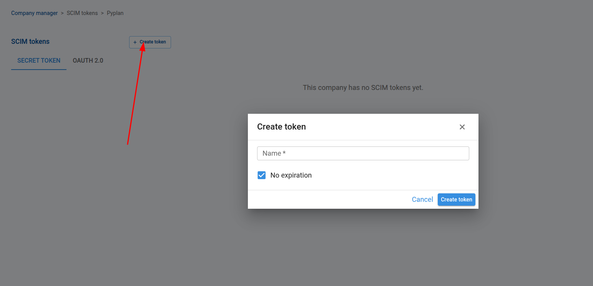

#### OAuth 2.0 Client Credentials

The **OAuth 2.0 Client Credentials** tab creates a client identifier and secret. Entra exchanges these values for a short-lived access token before calling the SCIM endpoints.

1. Select the **OAuth 2.0 Client Credentials** tab.
2. Select **Create** and enter a descriptive name for the client.
3. Copy and securely store the displayed `client_id` and `client_secret`. The secret is available only once.

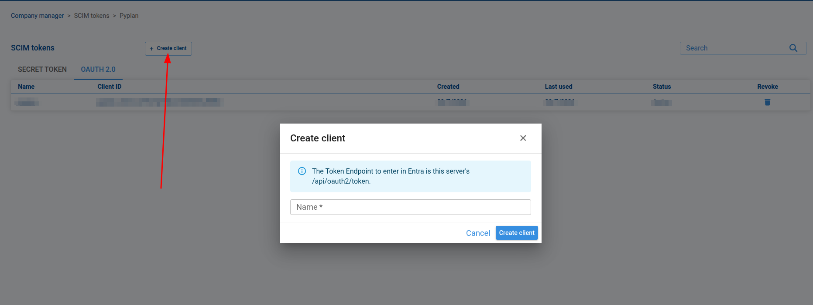

### Configure Provisioning in Microsoft Entra ID

In the Enterprise Application, open **Provisioning** and select **Get started**. Under **Admin Credentials**, select the authentication method that matches the credential created in Pyplan.

| Field | Secret Token | OAuth 2.0 Client Credentials Grant |
|---|---|---|
| **Tenant URL** | `https://[DNS_CLUSTER_INGRESS]/api/scim/v2/` | `https://[DNS_CLUSTER_INGRESS]/api/scim/v2/` |
| **Authentication method** | **Secret Token** | **OAuth2 Client Credentials Grant** |
| **Secret Token** | The token created in Pyplan | Not used |
| **Token Endpoint** | Not used | `https://[DNS_CLUSTER_INGRESS]/api/oauth2/token` |
| **Client Identifier** | Not used | The `client_id` created in Pyplan |
| **Client Secret** | Not used | The `client_secret` created in Pyplan |

After entering the values, select **Test Connection**. When the connection succeeds, save the configuration.

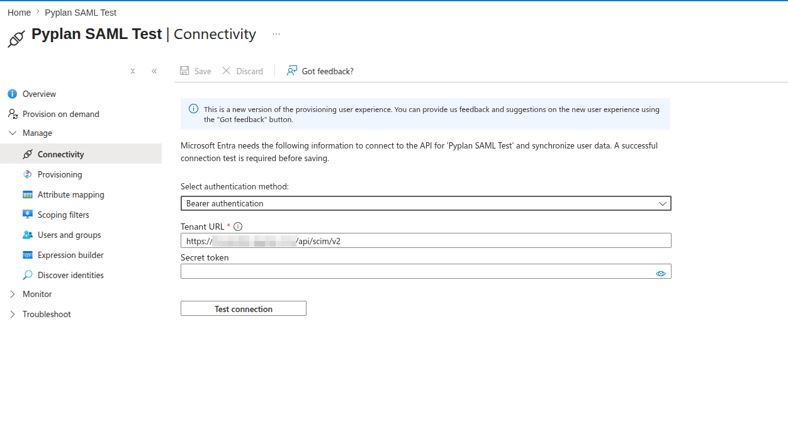

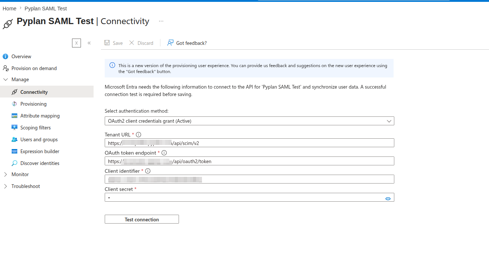

### Configure Roles and Attribute Mapping

SCIM sends a raw Entra role value to Pyplan through the `role` attribute of the Pyplan SCIM extension. Pyplan resolves that value to the final role and departments through the company's `saml_role_mapping` configuration.

Create the corresponding **App Roles** in the Microsoft Entra ID application registration. In this example, we create the `IT`, `QA`, and `Trainee` roles.

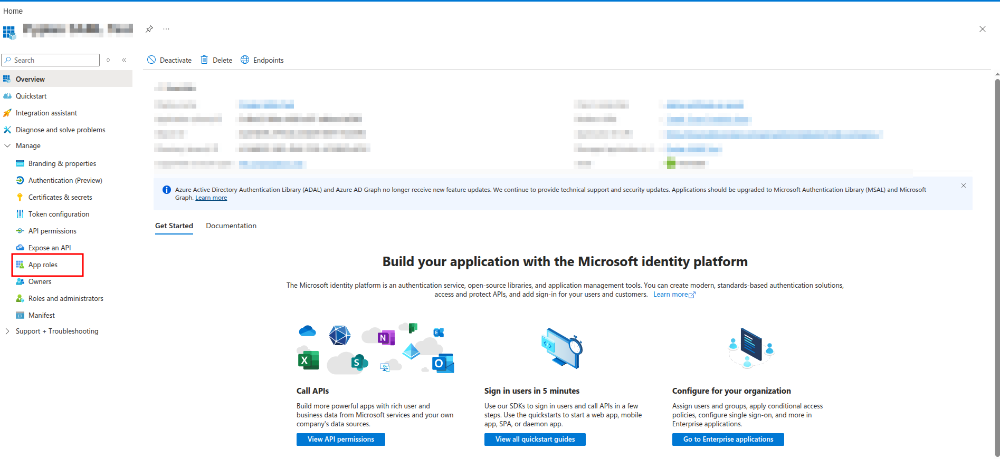
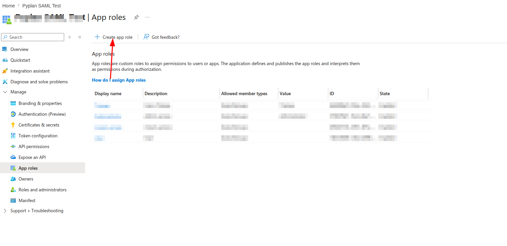
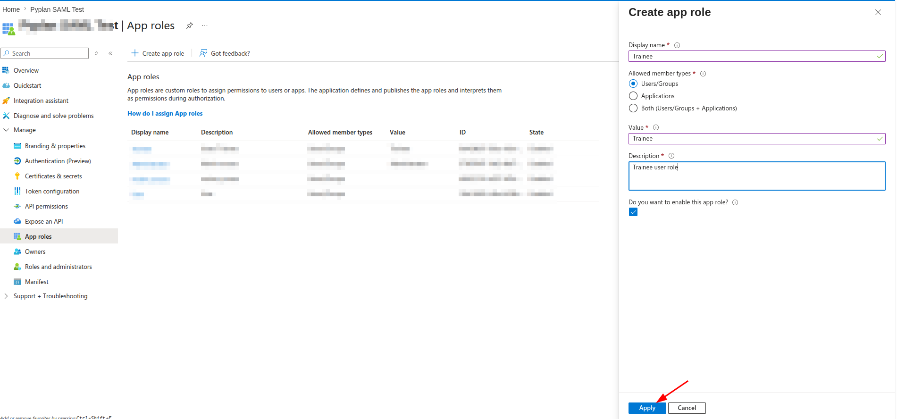

In **Provisioning** > **Mappings**, edit the user attribute mapping so that Entra sends the assigned App Role in each SCIM request:

| Field | Value |
|---|---|
| **Source Attribute** | `SingleAppRoleAssignment([appRoleAssignments])` |
| **Target attribute** | `role` |
| **Mapping Type** | **Expression** |

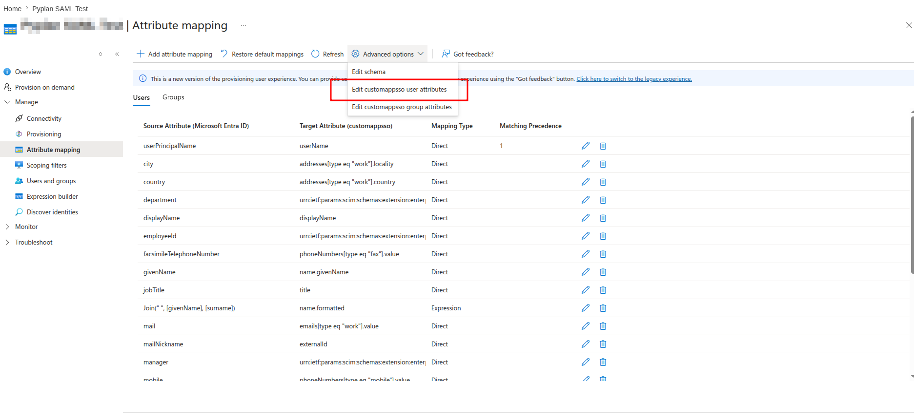
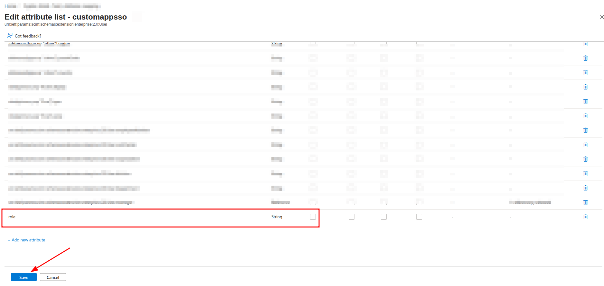
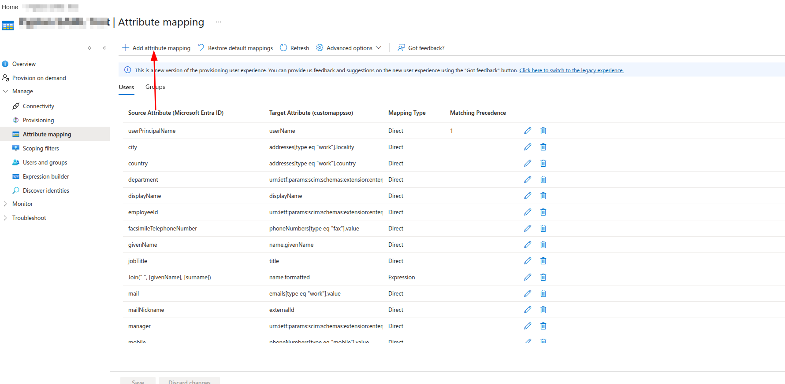
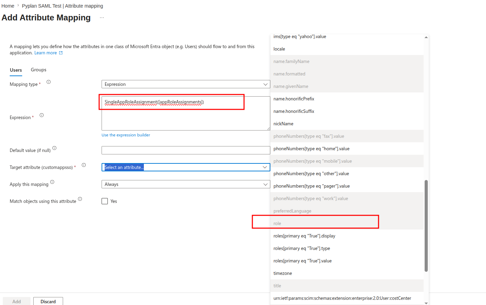

Configure the company role mapping in Pyplan with the Entra App Role values as keys:

```json
{
	"role": {
		"IT": "Administrator",
		"QA": "App Administrator",
		"Trainee": "Explorer"
	},
	"department": {
		"IT": ["pyplan-default", "guest", "social_account"],
		"QA": "guest",
		"Trainee": "pyplan-default"
	}
}
```

In **Provisioning** > **Mappings**, map the Entra App Role value to the `role` attribute in the Pyplan SCIM extension. Pyplan uses this value to apply the role and department mapping.

:::tip
Use a controlled vocabulary for the App Role values and keep it aligned with the keys in the Pyplan role mapping.
:::

### Assign Users and Roles

Create or select a test user in Microsoft Entra ID before assigning access to the Enterprise Application.

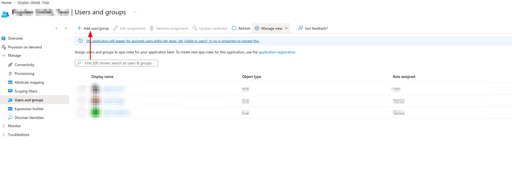

In the Enterprise Application, select **Users and groups**, add the user, and assign the corresponding App Role. Enable provisioning for the assigned users and run an on-demand provisioning cycle to validate the configuration.

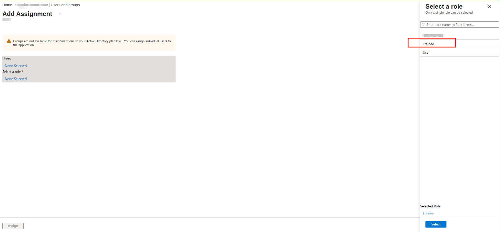

### Provisioning Lifecycle

When provisioning runs, Pyplan creates or updates the user and company access. Entra changes to the assigned App Role update the Pyplan role and department through the configured mapping. When Entra sends `active: false`, Pyplan deactivates both the user account and the access to the current company. Removing a user from the application follows the same deprovisioning process.

:::warning
The literal App Role value `User` is treated as an empty claim because Entra can send it when no explicit App Role is assigned. Use a specific App Role such as `IT`, `QA`, or `Trainee` for users whose Pyplan access must be determined by the mapping.
:::

## Azure Groups (Optional)

Pyplan allows matching an Azure group with a set of specific permissions within the application to facilitate the tasks of the security team.

For more information: [Security Options](/user-guide/security-options)

Choose one of the following patterns for each tenant and keep it consistent across the SAML configuration:

| Flow | What Azure sends in the SAML token | Recommended use |
|---|---|---|
| **Group Claims** | A `groups` claim with the Azure application group name. | Use this when Pyplan should receive the group name and resolve the final role and department internally. |
| **Extension Attribute** | The same profile value in both the `role` and `department` claims. | Use this when the tenant already maintains a normalized profile attribute and wants Azure to send the effective profile directly. |


### Azure Groups — Group Claims

The **Group Claims** flow keeps profile management in Azure groups. Microsoft Entra ID sends the application group name in the SAML token, and Pyplan maps that value to the final role and department internally.

Below we show the high-level integration flow for Group Claims:

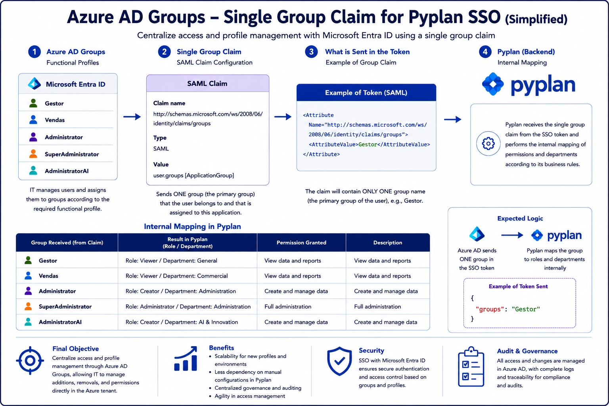

Expected claim:

| Claim name | Type | Value |
|---|---|---|
| `http://schemas.microsoft.com/ws/2008/06/identity/claims/groups` | `SAML` | `user.groups [ApplicationGroup]` |

Typical steps:

1. In the Azure Enterprise App go to **Attributes & Claims** and select **Add a group claim**.
2. Limit the claim to **Groups assigned to the application** and emit **Cloud-only group display names**.
3. Confirm the generated claim is `http://schemas.microsoft.com/ws/2008/06/identity/claims/groups` and the value is `user.groups [ApplicationGroup]`.
4. Test the SAML response and confirm the expected group name is present in the assertion.

The following Azure screenshots show the step-by-step configuration inside the Enterprise App for the Group Claims flow:

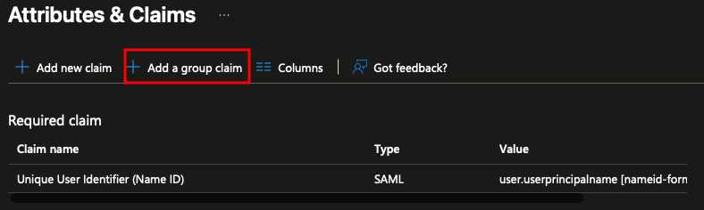
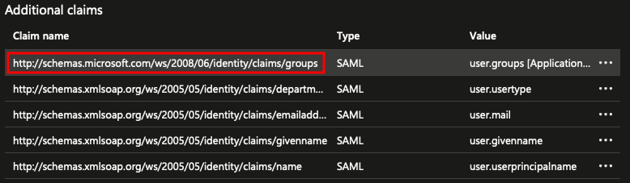
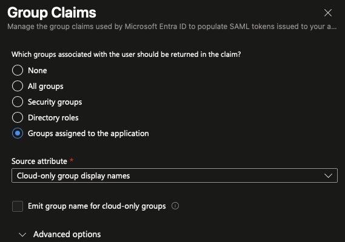

:::info
The Group Claims flow sends application-scoped group information in the SAML assertion. Ensure each tenant either assigns at most one application-scoped group per user or implements a deterministic precedence policy (for example: priority order, explicit group→role mappings, or a conflict-resolution lookup). Test sign-ins and inspect the SAML assertion to verify the expected group is emitted before enabling the integration.
:::


### Azure Groups — Extension Attribute

The **Extension Attribute** flow uses a single user attribute as the source of the effective profile. Microsoft Entra ID sends that same value in both the `role` and `department` claims, and Pyplan applies its internal permission mapping from those values.

Below we show the high-level integration flow for Extension Attributes:

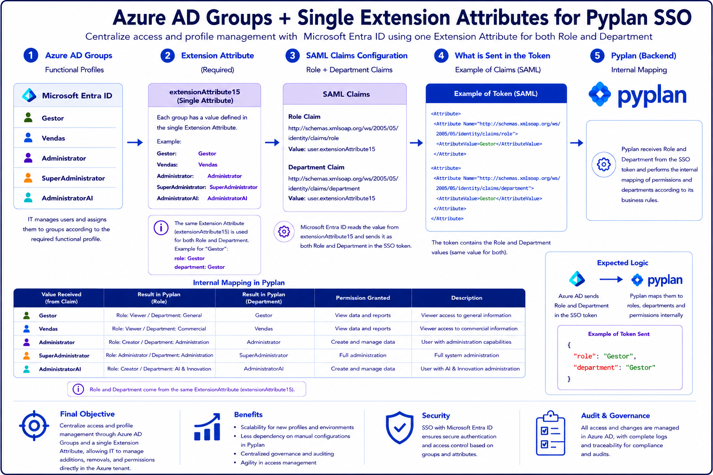

Expected claims:

| Claim name | Type | Source attribute |
|---|---|---|
| `http://schemas.xmlsoap.org/ws/2005/05/identity/claims/role` | `SAML` | `user.extensionAttribute15` `user.extensionAttributeX` `user.usertype` |
| `http://schemas.xmlsoap.org/ws/2005/05/identity/claims/department` | `SAML` | `user.extensionAttribute15` `user.extensionAttributeX` `user.usertype` |

Typical steps:

1. Choose one source attribute for the tenant and populate it with the functional profile value to be sent to Pyplan.
2. In the Azure Enterprise App add the `role` claim and point it to that source attribute.
3. Add the `department` claim and point it to the same source attribute so both claims carry the same value.
4. Test the sign-in flow and inspect the SAML response to verify both claims are present and consistently populated.

The following Azure screenshots show the step-by-step configuration inside the Enterprise App for the Extension Attribute flow. These examples use `user.usertype`; if the tenant uses `user.extensionAttribute15` or another approved extension attribute, the configuration steps are the same and only the source attribute changes:

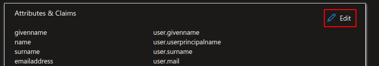
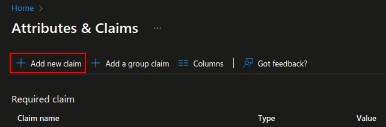
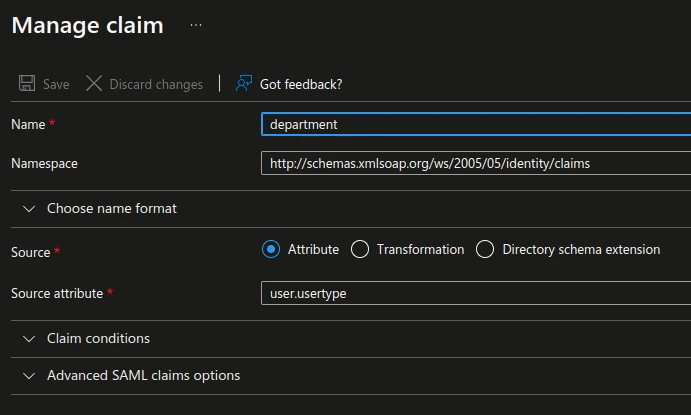
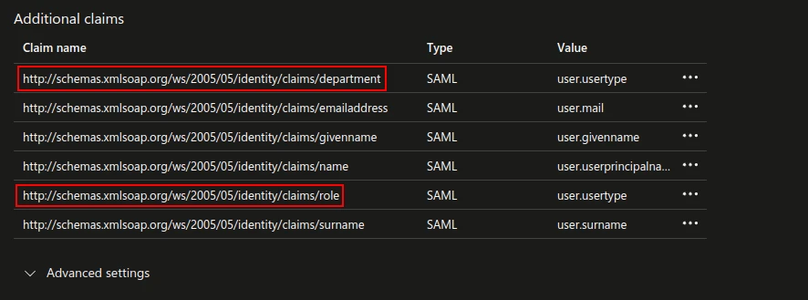

:::tip
Use a single controlled vocabulary for the profile values sent in `role` and `department` so the Azure configuration and the Pyplan mapping stay aligned.
:::

