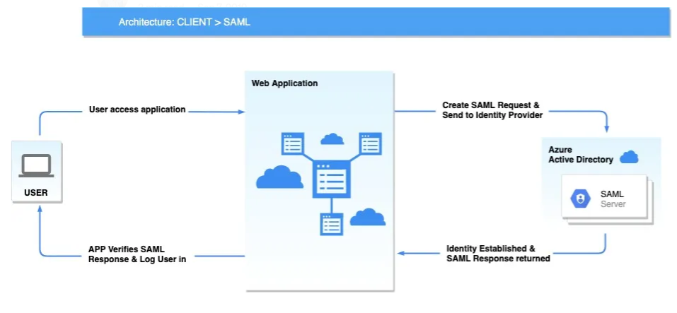

# Single Sign-On (SSO)

## Protocol Used

**SAML 2.0** is the protocol chosen by Pyplan for SSO integrations.



## Requirements

The Identity Provider (IDP) must have the ability to edit attributes and make the following parameters available. The following values are simply examples:

- **STS URL**
  ```
  https://sts.windows.net/b1fa7456-6j32-43d6-8134-d124b17c5515/
  ```

- **SSO config**
  ```
  Key   -> "urn:oasis:names:tc:SAML:2.0:bindings:HTTP-Redirect"
  Value -> "https://login.microsoftonline.com/b1fa7456-6j32-43d6-8134-d124b17c5515/saml2"
  ```

- **SLO config**
  ```
  Key   -> "urn:oasis:names:tc:SAML:2.0:bindings:HTTP-POST"
  Value -> "https://login.microsoftonline.com/common/wsfederation?wa=wsignout1.0"
  ```

- **Metadata URL**
  ```
  https://login.microsoftonline.com/b1fa7456-6j32-43d6-8134-d124b17c5515/federationmetadata/2007-06/federationmetadata.xml?appid=367ej8g3-fe39-4e7b-6d05-f99910433d66
  ```

## IDP Configuration

Select the most suitable integration for your environment:

- [Microsoft Entra ID / Azure AD](./microsoft-entra-id.md) — Configuration guide for Microsoft Entra ID (formerly Azure Active Directory).
- [General Configuration](./general-configuration.md) — Generic SSO configuration guide for other identity providers.
