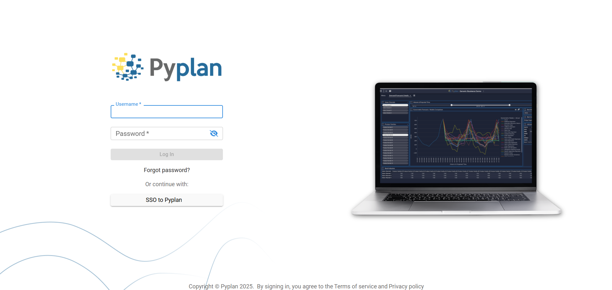
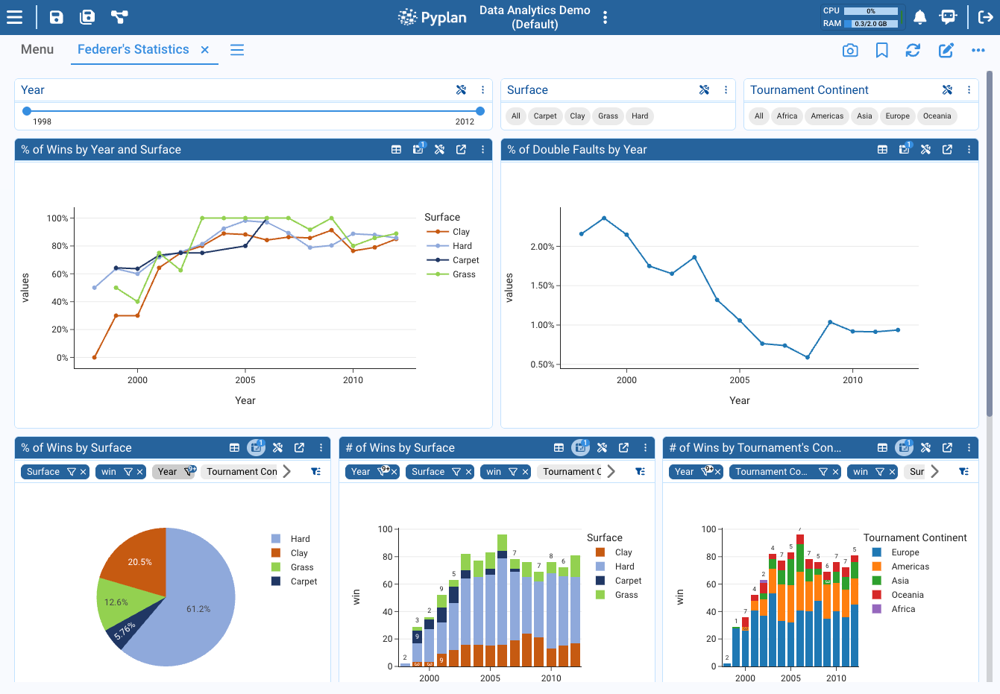
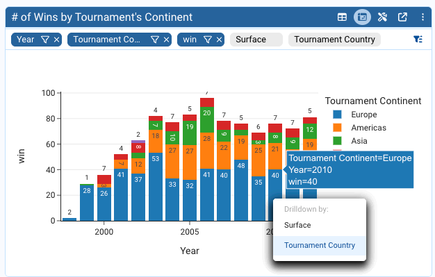
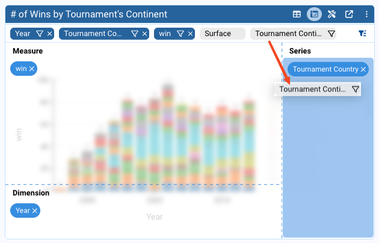
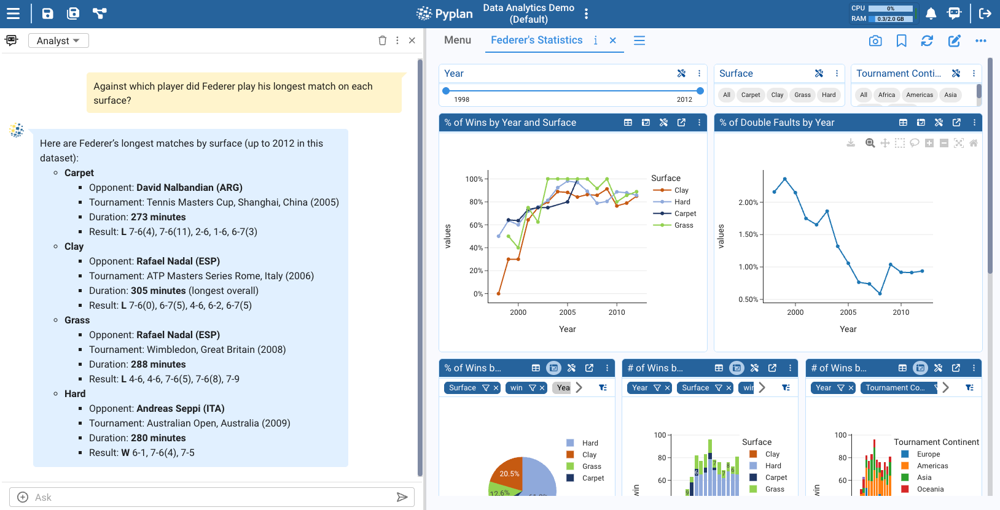

# Getting Started With Pyplan: From Login to Analyst Agent

In this tutorial we walk through the full "first-time user" journey in Pyplan.
We start with core concepts (what Pyplan and its applications are) and then move into step-by-step guides to:

- Access Pyplan
- Recognize and use Pyplan Home
- Open an existing application
- Navigate an application menu
- Interact with an interface
- Use the **Analyst Agent**

---

## 1. What Pyplan Is

Pyplan is a **no-code / low-code platform** for building and sharing **Planning and Analytics applications**.

With Pyplan we:

- Connect to data sources (files, databases, APIs).
- Transform and model data using **nodes** arranged in an **influence diagram**.
- Build **interactive interfaces** (dashboards, forms, charts) for business users.
- Run **what-if** and **scenario** analysis.
- Orchestrate processes, tasks, and scheduled jobs.

Technically:

- Each node contains Python code or a configured behavior.
- Users without coding skills can work mostly through AI agents, wizards, forms, and interfaces.

---

## 2. What Pyplan Applications Are

A **Pyplan application** is a self-contained solution to a business problem.
Typical examples include:

- Demand Planning
- Sales & Operations Planning
- Financial Planning and Budgeting
- Pricing and Profitability analysis
- Forecasting models
- Others

Each application contains:

- **Logic**: an influence diagram with nodes (data reading, variables, reports, input forms, buttons, etc.).
- **Interfaces**: dashboards and screens where users view and enter data.
- **Versions and scenarios**: to manage planning cycles, development cycles, and what-if comparisons.
- **Files and resources**: scripts, data files, documentation, etc.

Applications live in **workspaces**:

- **Public workspace** – applications available to everyone in the company (depending on permissions).
- **My workspace** – our personal area.
- **Teams** – shared folders for specific departments/teams.

---

## 3. How We Access Pyplan

In this section we assume:

- Our company already has a Pyplan instance (e.g. `https://company.pyplan.com`).
- We received a username and password, or we will use SSO.

### 3.1 Open the Pyplan URL

1. Open a web browser (Chrome, Edge, or similar).
2. In the address bar, enter your company's Pyplan URL, for example:
   [`https://dev.pyplan.com`](https://dev.pyplan.com)
3. Press **Enter**.

### 3.2 Log in With Username and Password

1. On the login page, locate the fields:
   - **Username**
   - **Password**
2. Enter the credentials provided by your administrator.
3. (Optional) If this is your first login, you may be asked to:
   - **Change your password**, and
   - **Configure multifactor authentication (MFA)** using an authenticator app.
4. Click **Sign in**.

> If your company uses **SSO (Single Sign-On)**, use the corresponding button or SSO URL your IT team provides.

### 3.3 Confirm Access to the Main Workspace

After successful login, we land in **Pyplan Home**. In the next section we describe how to recognize it and what we can do from there.

---

## 4. How We Recognize and Use the Pyplan Home

Pyplan Home is our **entrance hub** to apps, tools, and personal settings.

### 4.1 Recognize the Home Layout

When we log in, we typically see:

- A **top bar** with:
  - The **Pyplan logo** (often acts as a "Home" shortcut).
  - Global menus (e.g. **username/profile**, **Apps**, **Interfaces**, **Tools**, **Security**, depending on our role).

- A **main area** with:
  - Left sidebar:
    - Recently opened: shows the last applications we have opened; clicking any card opens that app again.
    - Pyplan resources: quick links such as Examples and Documentation

  - Central panel – Workspaces and apps
    - At the top of this panel we see the title **WORKSPACES**.
    - On the left of this panel there is a vertical list of **workspace groups** (e.g. `MY APPS`, `PUBLIC APPS`, `...and your teams (if you're part of any)`).
    - On the right we see a **mosaic of application cards** for the selected workspace group (clicking a card is one of the ways to open that application)

### 4.2 Switch Between My Workspace, Public and Teams

1. Identify the tabs:
   - **My apps**
   - **Public apps**
   - **Teams**

2. Click **My apps** to see our personal apps and folders.
3. Click **Public** to access applications available to all company users.
4. Click **Teams** to see shared spaces for the departments we belong to.

---

## 5. How We Open an Existing Application

We usually open applications from the **Pyplan Home**. To continue, we select the **Public Apps** workspace and click the **Data Analytics Demo** application to open it.

---

## 6. How We Navigate an Application Menu

When we open a Pyplan application, we typically land on a default interface that includes a navigation menu. This menu is our starting point to explore and work with the different interfaces defined in the current application.

The menu lists all available interfaces, allowing us to switch context quickly without leaving the application. Each interface usually corresponds to a specific analysis, report, or workflow built on top of the node-based model.

Opening the "Federer's Statistics" Interface:
To open the Federer's Statistics interface from the default view, we follow these steps:

1. Locate the menu on the default interface.
2. In the menu, find and click the Federer's Statistics entry.
3. Pyplan opens the Federer's Statistics interface in a new tab within the application workspace.

Each opened interface is shown as a separate tab, so we can:

- Keep multiple interfaces open at the same time.
- Switch between them by clicking the corresponding tab.
- Compare or cross-check results across different analysis views without reloading them.

---

## 7. How We Interact With an Interface

An **interface** is a screen that combines input components (filters, forms, selectors, etc) and output components (tables, charts, indicators).

### 7.1 Recognize Common Interface Components

Typical components we see:

- **Node view**: a table or chart showing a node's result.
- **Index / Filter components**: selectors to filter by, for example, periods, regions, products, etc.
- **Input Data components**: scalar inputs, selectors, forms, cubes.
- **Buttons**: actions such as "Run model", "Save scenario", etc.
- **HTML blocks**: titles, descriptions, instructions.

### 7.2 Apply Filters With Index / Quick filter

**A. Using individual Index components**

1. Find a selector labeled, for example, **Surface** or **Year**.
2. Depending on format:
   - **Tags**: click on one or more tags to select them.
   - **Select dropdown**: open the dropdown and pick one or more values.
   - **Range slider**: drag the handles to choose a start and end value.
3. The interface components (tables, charts, etc.) update according to the selected values.

**B. Using quick filter**

Some Pyplan UI components support quick filtering directly from a small filter icon on each element (for example, in tables or charts). This feature lets us explore data interactively without changing the underlying model logic.

We search for the table in the bottom section of the interface and then interact with the available filters.

### 7.3 Drilldown in Charts and Tables

In some components (depending on the dimensions of the data) we can perform a drilldown to explore the data in more detail.

1. In the interface "Federer's Statistics" look for the bar chart "# of Wins by Tournament's Continent".
2. Click on the bar where we want to see more detail.
3. Choose the dimension we want to explore. For example: Tournament country.

Then, using the undo and reset icons we can navigate through the drilldowns.

In the case of tables, we can perform a drilldown by clicking on a cell in a column (when it is enabled).

### 7.4 Pivoting

Pivoting allows us to change how we view multidimensional data in a Pyplan interface component (for example, a table or chart). When a component has more available dimensions than the ones currently displayed, we can pivot those extra dimensions to analyze the data from different perspectives.

In Pyplan, each visual component (table, chart, etc.) can expose several dimensions. Some of these dimensions may be:

- Displayed on the current axes or series.
- Available but not yet visible in the chart or table.

Pivoting a dimension means dragging it from its current position and dropping it into another area of the component (such as Series, X-axis, Columns, or Rows) to change how data is grouped and visualized.

Step-by-step Procedure (Example with a Chart)

1. In the interface "Federer's Statistics", locate the bar chart "# of Wins by Tournament's Continent".
2. Drag the dimension "Tournament Continent" to the Series section of the chart.
3. The chart automatically updates and now displays the data grouped by the selected dimension.

### 7.5 Change Input Values and See the New Calculated Result

In Pyplan, when we change an input value (form, selector, etc.), all nodes that depend on the changed node are recalculated automatically.

To see this in action:

1. In the menu, look for the interface "Prize simulation".

> By clicking the application name in the top bar, we quickly navigate to the default interface (menu).

2. In the form, make a change for the year 2015 (for example, specify the performance as year 2006).
3. We will see the impact of the change in the chart.

To achieve this, Pyplan detects the change in the form and performs the necessary calculations (following the business rules) up to the chart displayed on the right.

---

## 8. Analyst Agent

The Analyst Agent is an AI assistant specialized in data analysis within Pyplan. It helps us:

- Explore datasets and their summaries.
- Ask questions in natural language.
- Obtain descriptions of trends, outliers, and comparisons.
- And much more.

The Analyst Agent can access the same data that we see in the current Pyplan interface. This means we can ask questions about those data and receive contextual answers without writing additional code or navigating to other nodes.

In this section we describe how to open the Analyst Agent and how to interact with it step by step.

1. We open the Analyst Agent by clicking its icon on the right side of the top bar. This opens a panel where we can interact with the agent.

2. Ensure we are using the Analyst Agent.

3. Ask a question about the current data: In the input box of the Analyst Agent, we write a question related to the data visible on screen. For instance: "Against which player did Federer play his longest match on each surface?" The agent interprets the question using the available dataset, analyzes only the relevant data, and then generates a response.

4. Review the answers and refine our queries.

---

## Summary

In this tutorial we:

1. Understood what **Pyplan** is and what a **Pyplan application** includes.
2. Learned how to:
   - Access Pyplan,
   - Recognize and use Pyplan Home,
   - Open an existing application,
   - Navigate an application menu,
   - Interact with interfaces (filters, inputs, tables, charts).
3. Saw how to work with the **Analyst Agent** to ask data questions in natural language and get analytic insights inside our apps.

With these steps we are ready to start exploring existing applications and, over time, move into building and modifying our own Pyplan models and interfaces.
