# Pyplan Data Analyst I – Module 1

What a Pyplan App Is, Its Parts (Code & Interfaces), Workspaces, and No‑Code Calculations

In this module we introduce the core concepts that every Pyplan data analyst needs:

- What a Pyplan application is and how it is structured (code and interfaces).
- How workspaces work (Private/My, Public, Teams) and how permissions affect what we see and can do.
- How to navigate the influence diagram, understand node types, and evaluate nodes.
- How to generate calculations without code using wizards and the Code Assistant.

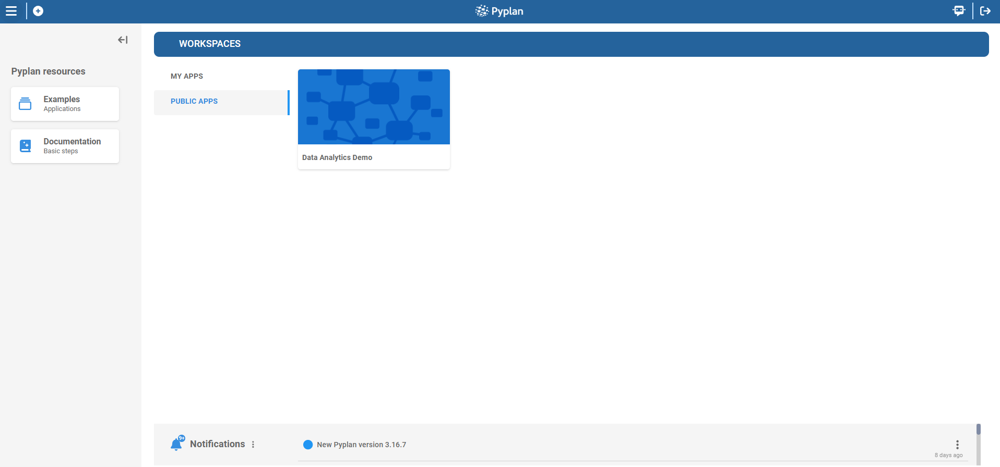

---

## 1. Understanding a Pyplan Application

A Pyplan application is a complete analytical or planning solution that combines:

- Code (business logic) organized as an influence diagram of nodes.
- Interfaces that allow users to view results and input data.
- Files and resources (data files, requirements, etc.).
- Versions and scenarios (for different cycles and comparisons).

Typical use cases:

- Demand planning, S&OP, financial planning, pricing, budgeting, forecasting, etc.

### 1.1 Parts of a Pyplan App

Every app has two main "faces":

1. **Code side**
   - Influence diagram
   - Nodes (variables, inputs, data reading, reports, etc.)
   - Node definitions (Python code) and results

   

2. **Interface side**
   - Dashboards and pages (Interfaces)
   - Components: tables, charts, indicators, filters, forms, buttons, menus, etc.

   

### 1.2 How We Open an Application

1. Log into Pyplan.
2. In Home → Workspaces, choose:
   - **MY APPS** for private apps.
   - **PUBLIC APPS** for shared, company‑wide apps.
   - A **TEAMS** area if you belong to any team.
3. Click an application card to open it.


---

## 2. Workspaces: Types, Permissions, and Application Manager

In Pyplan, workspaces organize where applications and files live, and who can see or edit them.

### 2.1 Types of Workspaces

1. **My workspace (My apps)**
   - Personal space.
   - We can create, modify, and test applications privately.

2. **Public workspace (Public apps)**
   - Shared area visible to all authorized users.
   - Apps here are typically "published" solutions.

3. **Teams**
   - Shared workspaces for specific departments or groups.
   - Access is based on department membership and team configuration.

### 2.2 Application Manager Basics

The Application Manager is where we browse and manage applications:

- Create new applications or folders.
- Rename, copy, cut, download, delete.
- Manage apps in My apps, Public apps, and Teams.

**Step‑by‑step: open Application Manager**

1. From Home, click into Workspaces (central area).
2. Switch between **MY APPS** and **PUBLIC APPS** using the tabs.
3. Click on **Create** or the **+** icon to:
   - Create App
   - New Folder

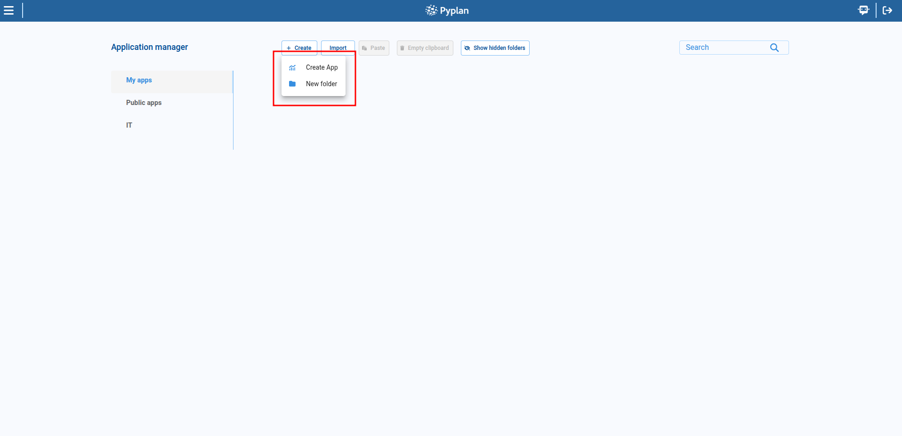

### 2.3 "Save As" and Copying Apps

We often need to create a personal copy of an existing app.

**Option A – Save as (from inside the app)**

1. Open the application.
2. In the top‑left code toolbar, click **Save as**.
3. Choose:
   - Save as new version (same app, new version), or
   - Save application in my workspace, or
   - Save application in my team.
4. Confirm.

**Option B – Copy from Application Manager**

1. Go to Application Manager.
2. Find the app.
3. Open its context menu (**…**).
4. Choose **Copy** or Other copy options (e.g., copy to Team, to Public).
5. Navigate to the target folder and paste.

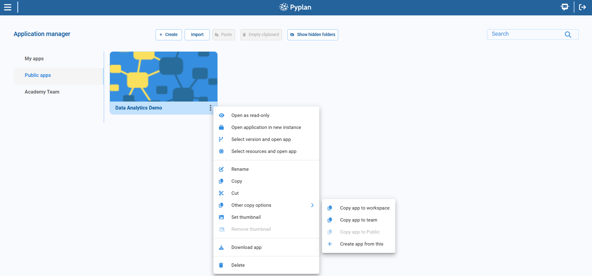

### 2.4 Permissions Overview

Permissions are defined by roles and departments:

- Some users can create apps; others only view.
- Access to apps and folders can be:
  - Allowed only to certain departments.
  - Denied to others.

As analysts, we should know:

- Where we are allowed to save apps (My workspace vs Public vs Teams).
- When we cannot edit an app (it opens in read‑only).

---

## 3. Code: Influence Diagram, Nodes, and Evaluation

Now we focus on the code side of a Pyplan app: the influence diagram.

### 3.1 What Is the Influence Diagram?

The influence diagram is a graphical representation of the calculation process:

- Each node = one step in data loading, transformation, or calculation.
- Arrows show dependencies between nodes.
- Nodes contain Python code or configured logic.

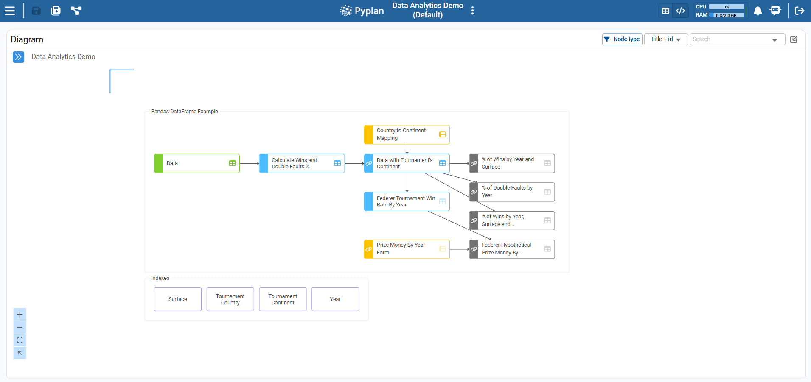

### 3.2 Navigating the Diagram

**Basic navigation**

- **Click** a node: select it.
- **Double‑click**:
  - On a module node: enter that module.
  - On a codable node: run it and expand its result widget. Press ESC to return to normal view.
- **Right‑click**: open node menu (properties, wizards, etc.).
- **Ctrl+Scroll**: zoom in/out.
- **Middle‑click + drag** or two‑finger drag: pan the diagram.

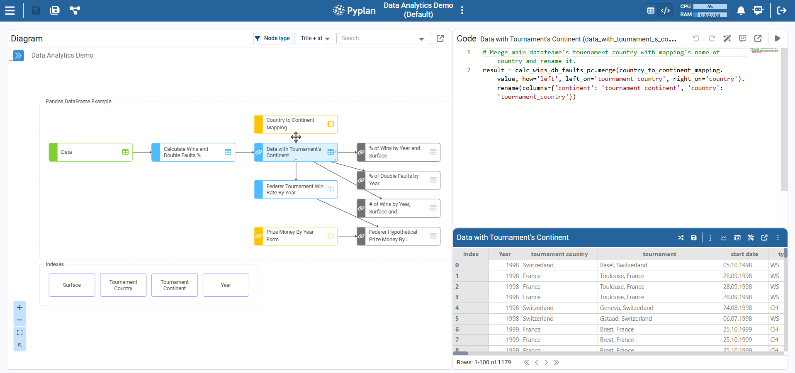

### 3.3 Node Types (Conceptual Overview)

Key node types we use as analysts:

- **Input data** – Manual inputs (scalar, selector, form, cube).
- **Data reading** – Connects to external data (CSV, Excel, DB, etc.). Configured via wizard, returns DataFrames or xarray objects.
- **Variable** – Generic Python logic. Most common type (blue/gray/red depending on role in diagram).
- **Report** – Combines multiple nodes into a structured report (xarray or DataFrame).
- **Index** – Stores lists/dimensions like Product, Region, Year.
- **Button** – Executes code when clicked (actions, refresh, etc.).
- **Text** – Documentation or labels only.
- **Module** – Container node grouping other nodes (hierarchical organization).

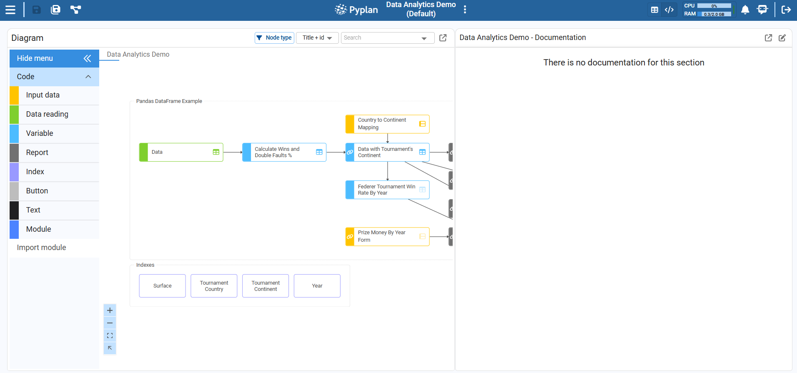

### 3.4 Selecting and Evaluating Nodes

**Step‑by‑step: evaluate a node**

1. In the influence diagram, click a codable node (e.g., "Data").
2. In the right panel, switch to **Code + Result** or **Result** view.
3. Run the node using one of:
   - Double‑click the node in the diagram.
   - Click the **Run (Play)** icon in the node toolbar.
   - Press **Ctrl+Enter** while the node is active.

After execution:

- The node status becomes **Calculated**.
- The Result panel shows a table, cube, or scalar.

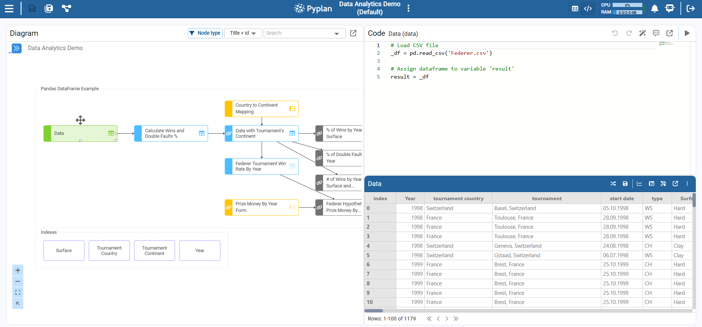

### 3.5 Node Views: Code + Result vs Result

At the top‑right of the node panel we can choose:

- **Result** – Focus on the output (table, chart) and documentation.
- **Code + Result** – Code editor at the top, result at the bottom. Central for debugging, transformations, and wizards.


### 3.6 Syntax Rule: `result =`

Every node that runs Python must assign its final output to `result`. Pyplan uses the value of `result` as the node's output.

Example:

```python
# Node definition example
_columns = ["Item", "Type", "Value"]
_data = [
    ["Item 1", "Type 1", 10],
    ["Item 2", "Type 1", 20],
    ["Item 3", "Type 2", 30],
]
_df = pd.DataFrame(_data, columns=_columns)

result = _df
```

Key conventions:

- Local variables start with `_` (e.g., `_df`, `_data`).
- The last line of the definition must be: `result = <local_variable>`

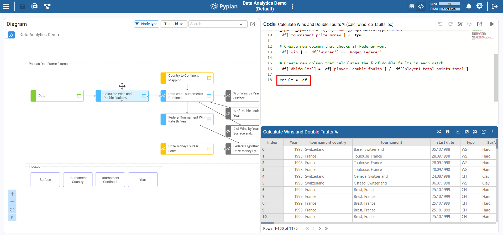

---

## 4. Interfaces: The User-Facing Side of the App

Once the logic is built, users interact mainly with interfaces.

### 4.1 What Is an Interface?

An interface is a screen made of components (widgets) arranged in a grid:

- **Input components:** Index components (filters), input fields, forms, cubes, selectors, buttons.
- **Output components:** Tables, charts, indicators, HTML text, menus, notifications, tasks, etc.

Interfaces talk to nodes:

- When we change inputs → Pyplan recalculates affected nodes.
- When nodes change → tables/charts/indicators update.

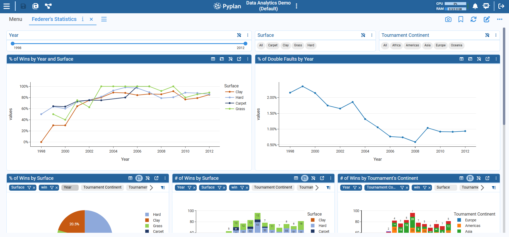

### 4.2 Opening and Switching Interfaces

Inside an app, there are two main ways to navigate to interfaces:

- **Using the Interface Manager** – Access the Interface Manager to view and open all available interfaces.

  

- **Using a Menu Component** – From within an app, you can navigate through a Menu placed in a "home" interface or dashboard.

  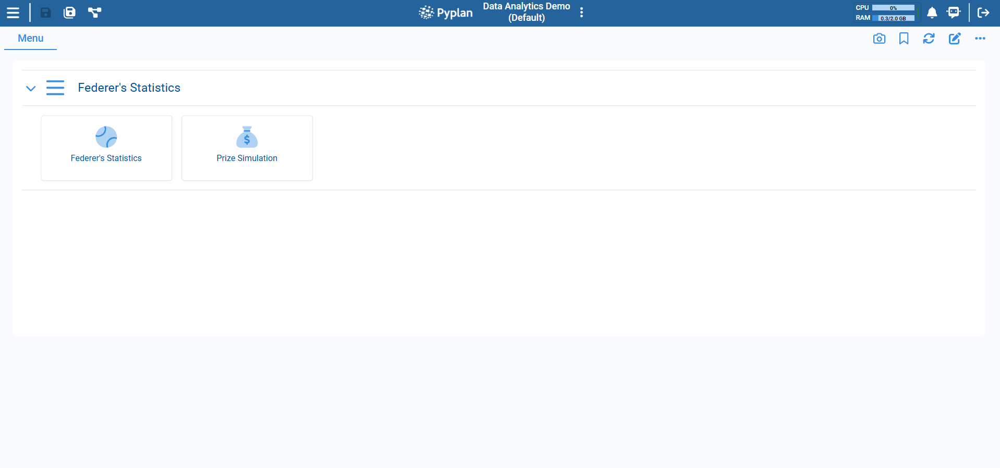

---

## 5. Generating Calculations Without Code

Pyplan is designed so we can create many transformations without writing Python. We use:

- Wizards for tables and cubes.
- The Code Assistant.

### 5.1 Using Table Wizards (No-Code for DataFrames)

Wizards are available when a node returns a `pandas.DataFrame`.

#### Step-by-step: Run A DataFrame Wizard

##### 1. Create a new node that returns a DataFrame

1. Create a new node of type "variable" in the model, named **Data Test**. (We can do this by right-clicking/creating a node or dragging a variable-type node.)
2. In the node definition, just return our DataFrame of the node `data` with: `result = data`
3. Run the node so its result is calculated.

##### 2. Open the Handling Data Wizard

1. Select the `Data Test` node. (Make sure the node is calculated.)
2. In the node toolbar, open **Handling Data**. (This will display a window with the data in table format.)
3. Choose the DataFrame wizard we want to apply by clicking on the icon.
4. Select the **Select columns** wizard.
5. Select the columns `year`, `tournament country`, and (scrolling down) the column `player1 aces`; then click **Confirm**.
6. Click on the wizard icon again to perform another operation and select the **Group/Aggregate** wizard.
7. Check group by `year` and sum `player 1 aces`; then click **Confirm**.
8. Click on the confirm button (top right) to confirm all changes.
9. In the following pop-up, we can select whether to overwrite the current node or create a new node with these changes. Select **Overwrite current node definition**.

As a final result, we will see the automatically generated Python code, depending on the actions performed in the wizards.

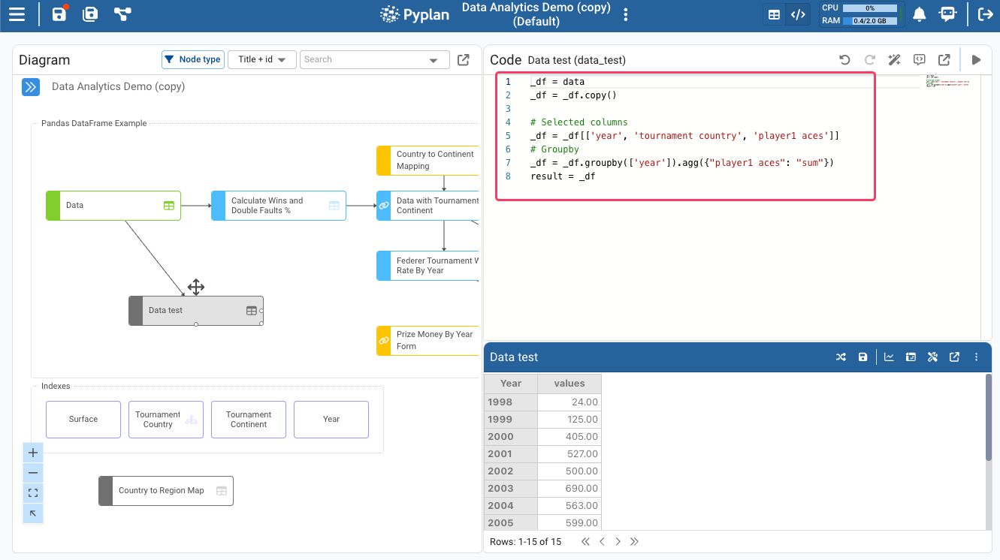

Alternatively, use the right-arrow menu on the right side of the node to create the result in a new node instead.

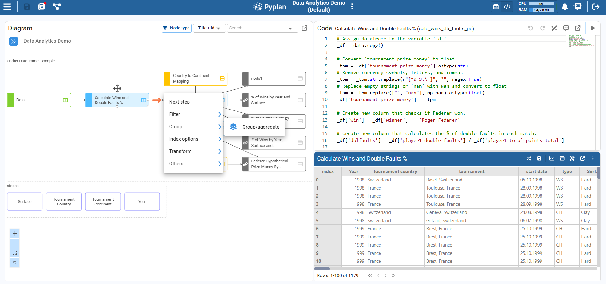

### Example: Add A Calculated Field With A Wizard

This wizard lets us add a new calculated column to a DataFrame returned by a node.

#### Step-by-step

1. Select the node that returns the source DataFrame. For example, select the node `Data with Tournament's Continent`.
2. Run the node so that the node is calculated and its result is a valid DataFrame.
3. Open the **Calculated field** wizard. With the node selected, in the node toolbar open **Wizards** and choose the **Calculated field** wizard.
4. Configure the new column:
   1. Specify the name of the new column.
   2. Define the calculation for each row — typically an expression combining existing columns. For example, to create a `lost_points` column, subtract `player1 total points won` from `player1 total points total`.
   3. Confirm the wizard.

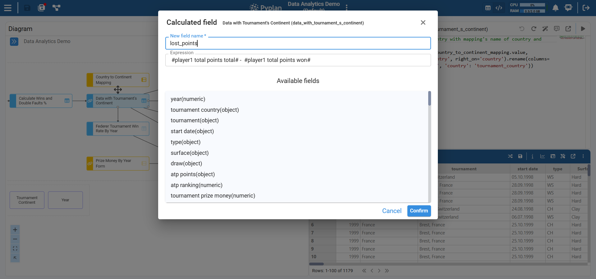

After we confirm, the node's definition is updated with code similar to:

```python
_df = data_with_tournament_s_continent
_df = _df.copy()
# Generated new column
_df['lost_points'] = _df['player1 total points total'] - _df['player1 total points won']

result = _df
```

### 5.2 Using The Code Assistant

The Code Assistant helps us write or modify node code from natural-language instructions.

#### Step-by-step: Generate Code With The Code Assistant

1. **Create a new node with a basic definition**

   Start by creating a new node of type "variable" and adding a simple base definition. For example, if we plan to work from another node (`data_with_tournament_s_continent`):

   ```python
   _df = data_with_tournament_s_continent

   result = _df
   ```

   This gives the Code Assistant some initial context (variables, structure, etc.).

2. **Run the node**

   Run the node so that the base result is calculated. This improves the Code Assistant's ability to understand and use the available data structures.

3. **Open the Code Assistant**

   With the node selected, open **Code + Result** view. In the top‑right of the coding area, click the **Show/hide code assistant** icon to display the assistant panel. (We can also use the shortcut **Ctrl+I** or **Cmd+I** on Mac.)

   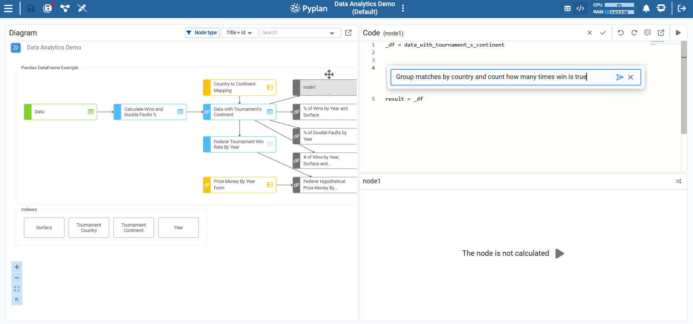

4. **Describe what we want in natural language**

   In the prompt bar, describe the transformation or logic we need, for example:

   > "Group matches by country and count how many times win is true."

5. **Submit the prompt**

   Submit the prompt so the Code Assistant generates Python code for the current node.

6. **Review the generated code**

   Carefully review the generated node definition. Check that:
   - Input nodes are referenced correctly (e.g. `data_with_tournament_s_continent`).
   - The resulting structure is what we expect.
   - The definition still ends with `result = <variable>`.

7. **Accept or refine**
   - If the code is correct, keep it as our node definition.
   - If we need changes, refine the natural‑language prompt and submit again, or manually adjust the code.
   - Remember to run the node to see the result.

8. **Use Undo/Redo to navigate versions**

   We can use Undo/Redo in the editor to move between previous and new versions of the generated code, making it easy to compare and revert changes if needed.

### 5.3 Using The `Developer` Agent

The "developer" agent allows us to interact with the application's business rules, performing actions such as creating new nodes, explaining what a node does, etc.

#### Step-by-step: Create a node using the developer agent

1. In the top bar, click on the icon to display the agents.
2. A chat window will appear. Make sure that the **"developer"** agent is selected.
3. Select the `Data` node and write a prompt in the chat input, for example: *"Taking the selected node, create a node called Aces per year that calculates the number of aces for player 1 grouped by year"*.
4. In a few seconds, the developer agent will create the node and display it in the diagram.

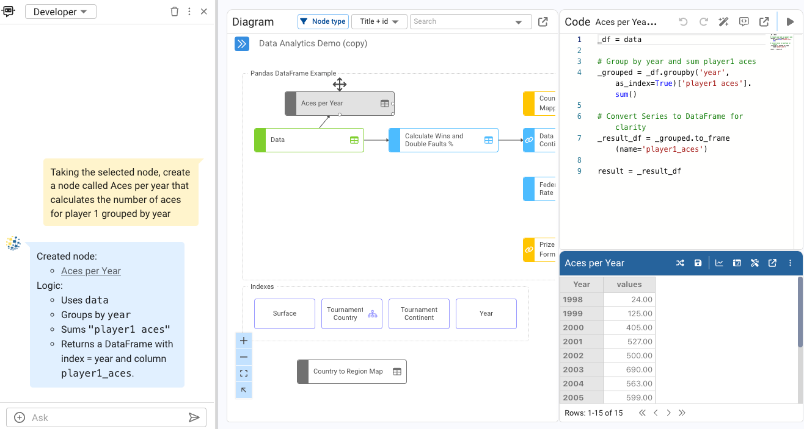

---

## Summary

In this tutorial we:

- **Explained what a Pyplan application is** and its main parts:
  - Code (influence diagram and nodes)
  - Interfaces (dashboards and components)
- **Reviewed workspaces:** My workspace, Public workspace, Teams, and how to copy/save apps.
- **Learned how to navigate the influence diagram:**
  - Node types, selection, evaluation, and views (Result vs Code + Result)
  - The required `result =` syntax in every node definition
- **Explored no-code and low-code options:**
  - DataFrame wizards
  - The Code Assistant for natural-language-driven Python generation
  - Using the developer agent to create nodes

With these concepts, we are ready to deepen our work as Pyplan data analysts in the following modules, focusing on more advanced modeling, interfaces, and scenario analysis.
