# Pyplan Data Analyst I – Module 2

Interfaces: What They Are, How to Manage and Create Them, and How to Use Indexes, Inputs, and the Analyst Agent

In this module we focus on the user‑facing side of a Pyplan application: interfaces. We work step by step through:

- What interfaces are and how to manage them with the Interface Manager.
- How to create an interface and add components.
- Basic component configuration and visualization options.
- How indexes work in interfaces, including hierarchies and synchronization.
- How to create simple manual data inputs.
- How to use the Analyst Agent, including how it uses context from the current interface.

---

## 1. What Interfaces Are in Pyplan

An interface is a screen or dashboard where users:

- See results (tables, charts, indicators, reports).
- Filter and explore data (index selectors, filters, menus).
- Input data (forms, scalar inputs, upload managers).
- Trigger actions (buttons, processes, scheduled tasks).

Technically, an interface:

- Is linked to one application version.
- Is built from components (widgets) placed in a grid.
- Reads and writes data through nodes in the influence diagram.

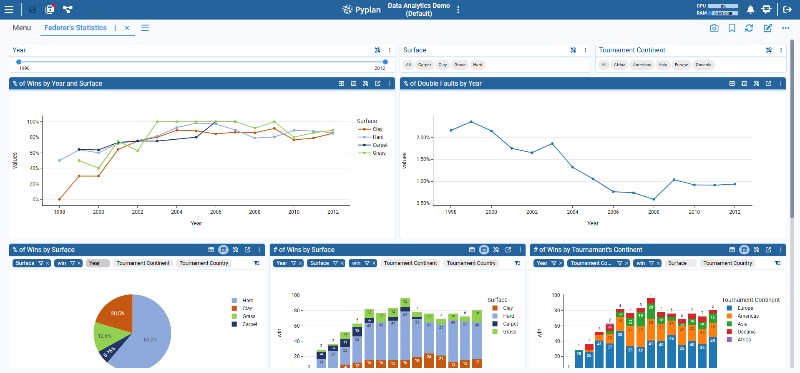

---

## 2. Interface Manager: Viewing and Organizing Interfaces

The Interface Manager is where we:

- See all interfaces in the current app.
- Open, edit, duplicate, export, or delete interfaces.
- Manage documentation, permissions, and links.

### 2.1 Opening the Interface Manager

**Step‑by‑step**

1. Open a Pyplan application (in this case, *Data Analytics Demo*).
2. In the main menu, click **Interfaces**.
3. The Interface Manager appears with a list of existing interfaces.

Each row in the Interface Manager shows an interface with options in its context menu.

### 2.2 Key Actions in the Interface Manager

From the context menu of an interface we can:

- **Edit** – open in design (edit) mode.
- **Duplicate** – create a copy (useful for variations).
- **Export** – download the interface definition.
- **Add/Edit Documentation** – attach explanatory text.
- **Delete** – remove the interface.
- **Set Permissions** – control which departments can access it.
- **Copy Interface ID** – copy the unique id (useful for links and advanced config).
- **Interface Link** – manage public links to that interface.

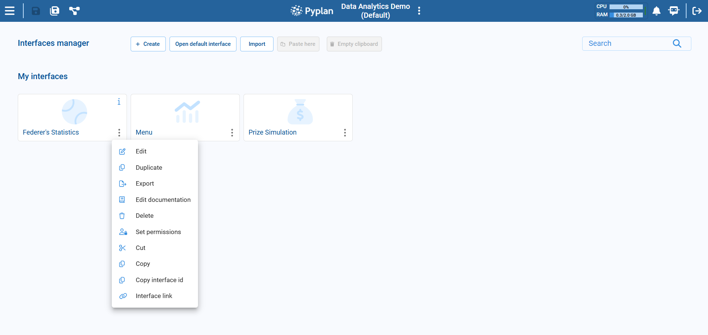

---

## 3. Creating a New Interface

We now create a simple interface from scratch.

### 3.1 Create an Interface

**Step‑by‑step**

1. In Interface Manager, click **Create** (usually top‑left) and select **New Interface**.
2. In the dialog:
   - Enter a **Name**, e.g. `Federer's Overview`.
   - (Optional) Select an icon that represents the interface.
3. Confirm to create it.

Pyplan creates a new, empty interface and opens it.

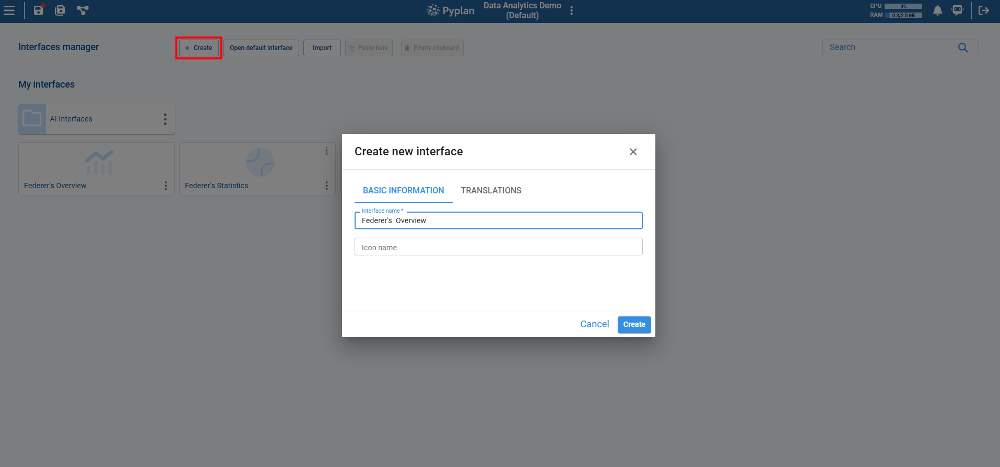

### 3.2 Enter Edit Mode

By default, the interface opens in **Edit Mode**. If it does not:

1. In the interface's top‑right corner, click the **Edit** icon.
2. The editing grid and component toolbox appear.

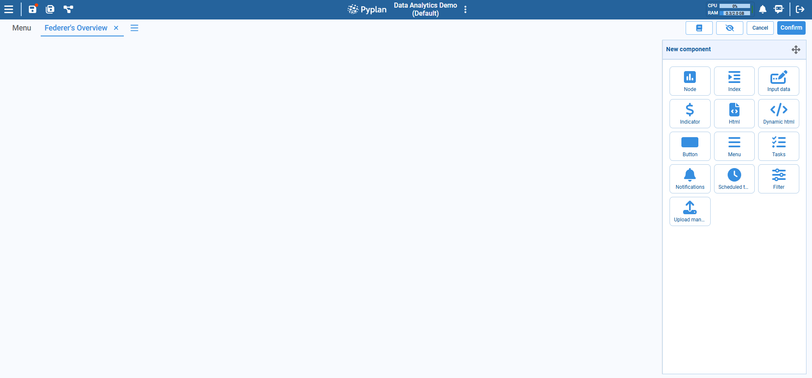

We are now ready to add components.

---

## 4. Adding Components to an Interface

Components (widgets) are the building blocks of interfaces. We drag them from the toolbox to the grid.

### 4.1 Types of Components (Overview)

Common component categories:

- **Data display**
  - Table (node result)
  - Chart / Graph
  - Indicator (single KPI)
  - HTML / HTML Dynamic
- **Filtering and navigation**
  - Index component
  - Filter component
  - Menu component
- **Input and actions**
  - Input Data component (scalar input)
  - Forms, Cubes (through nodes + table components)
  - Button
  - Upload manager
- **Process and monitoring**
  - Tasks, Notifications, Scheduled tasks

In this module we focus on:

- Basic data components (tables, charts, indicators).
- Filters based on indexes.
- Simple manual input.
- Analyst Agent.

### 4.2 Adding a Basic Table Component

1. In **Edit** mode, go to the **New Component** panel (toolbox).
2. Drag a **Node** component onto the grid.
3. After dragging, a diagram opens. Select the node that contains a table result (in this case select the *Data with Tournament's Continent*).
4. With the node selected, open the **Component Configuration** panel. Under **General**, adjust the title if necessary.

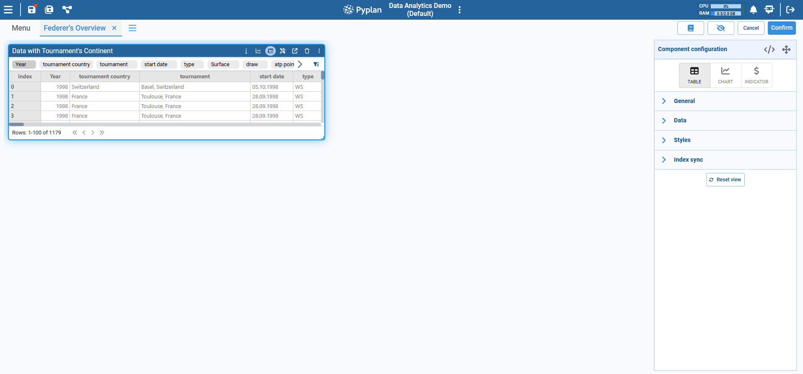

### 4.3 Adding a Basic Chart Component

1. In **Edit** mode, open the **New Component** panel toolbox (if a component is selected, press **ESC** or click outside the component to return to the "New Component" panel).
2. Drag a **Node** component onto the grid.
3. After dragging, a diagram opens. Select the node **Calculate wins and Double Faluts %**.
4. In the **Component Configuration** panel:
   - Select a **Chart Type** (for example, Column, Bar, or Line).
   - Configure the axes and measures as follows (to pivot the chart, we can use the advanced pivot function):
     - **Dimension:** `Year`
     - **Measure:** `Win`
     - **Series:** `Surface`

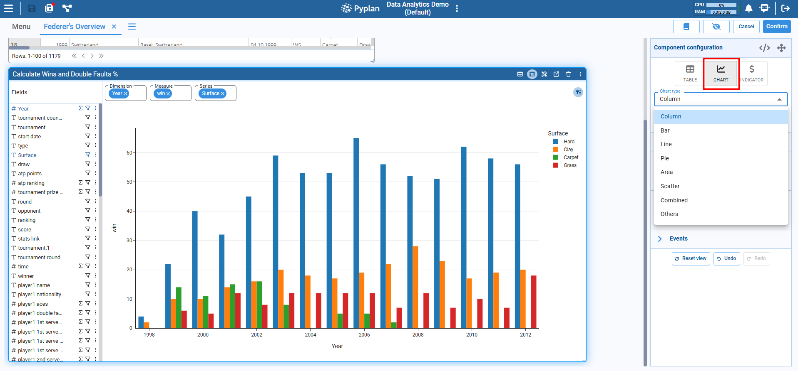

### 4.4 Adjusting Visualization: Styles and Formats

Most visual components share similar configuration sections, especially **Styles**:

- **Value format** – Number, Percentage, Currency, etc.
- **Font size and font style** – Emphasize key data.
- **Text alignment** – Left, center, right.
- **Colors** – Font color and background color.
- **Conditional formatting** (for tables and indicators) – Change style based on value.
- **Heatmap / Progress bar** – For tables, to highlight magnitude.

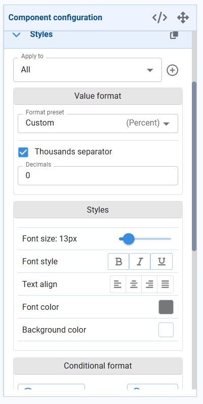

**Example: adjust a KPI Indicator**

1. Add an **Indicator** component.
2. Select a node that returns a scalar (or a slice of a cube). Select the node **Federer Hypothetical Earnings**.
3. In **Styles**:
   - Set **Value format** to Currency.
   - Increase **Font size** to 30 px.
   - Set a blue background color.
4. Optionally add **Conditional format**:
   - If value < 0 → red text.
   - If value > 0 → green text.

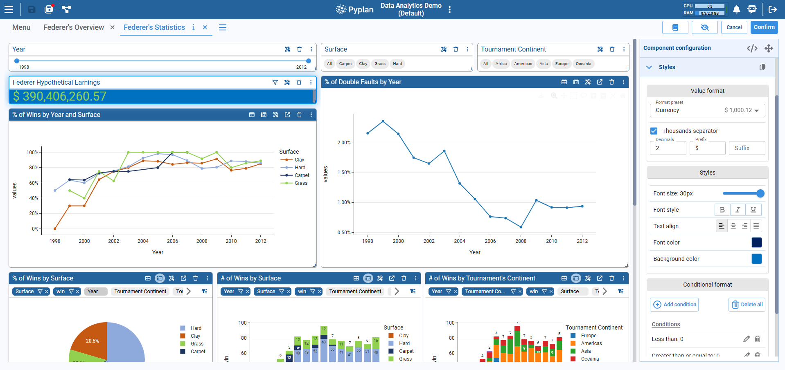

---

## 5. Indexes in Interfaces: Filtering, Hierarchies, and Synchronization

Indexes define dimensions like Product, Region, Year, etc. In interfaces, they drive filters and slicing of tables and charts.

### 5.1 Index Nodes and the Index Component

In the model:

- An **Index node** holds a list of elements (`pandas.Index`).
- Many tables and cubes use those indexes as dimensions.

In the interface:

- The **Index component** lets users select one or more values from an index:
  - Single select
  - Multi select
  - Different display formats (tags, range, dropdown, options list, slider)

**Step‑by‑step: add an Index component**

1. In edit mode, drag an **Index** component to the top of the interface.
2. In the configuration panel:
   - Select the **Index node** (e.g., `Year`).
   - Choose **Mode**: Single select or Multi select.
   - Choose **Format**: Default tags, Select (dropdown), Range slider, Options list, etc.
3. Optionally adjust **Orientation** (horizontal or vertical).

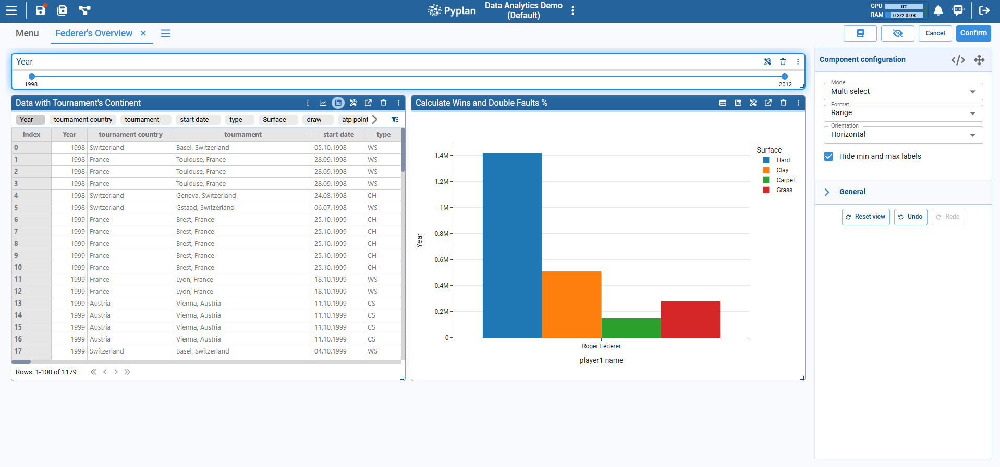

### 5.2 Hierarchies in Indexes

In the model, an index can have a hierarchy, e.g.:

- Country → Region → Continent
- Month → Quarter → Year

This is defined via a mapping table in the index properties. In the diagram, hierarchical indexes are marked with a special icon.

In interfaces, hierarchies allow us to:

- Filter by a higher‑level index (e.g. Continent) and see data aggregated or filtered at that level.
- Drill down into lower levels (e.g. from Continent to Country).

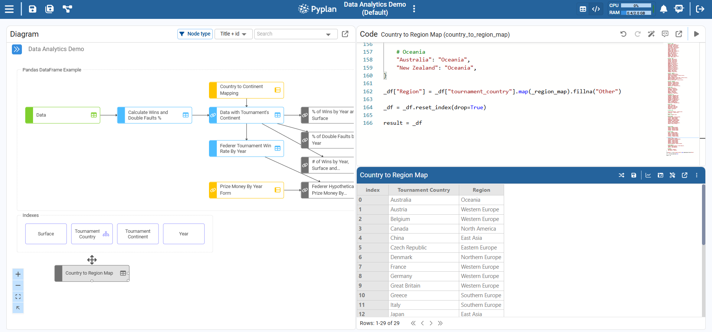

**Typical pattern**

- One interface has:
  - An Index component for a higher‑level index (e.g., Continent).
  - Another Index component for a lower‑level index (e.g., Country), often dependent on the first.
- The underlying cubes or tables aggregate along these dimensions.

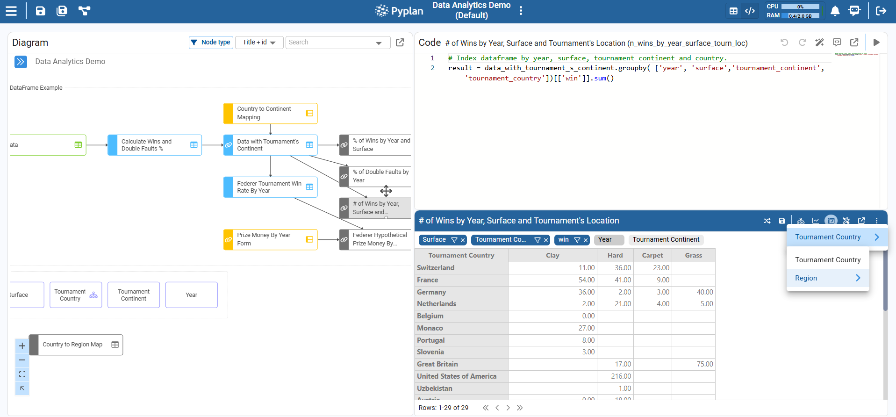

### 5.3 Index Synchronization (Index Sync)

Index synchronization ensures that:

- When we change a selection in one Index component, related components update consistently.
- Tables and charts that share the same index dimension reflect the same filter.

In tables and charts we can configure **Index sync**:

- Which index dimensions should be synchronized.
- Whether a component listens to global index selection or not.

**Step‑by‑step: sync a table with an Index**

1. Add an **Index** component for, say, `Year`.
2. Add a **Table** component bound to a node that has `Year` as an index. In this case, add the node: **% of Wins by Year and Surface**.
3. With the table selected, open the configuration panel.
4. Go to the **Index sync** tab.
5. Ensure the `Year` index is checked or associated with the interface‑level filter.
6. Exit edit mode.
7. Change the selected year in the Index component → the table updates automatically.

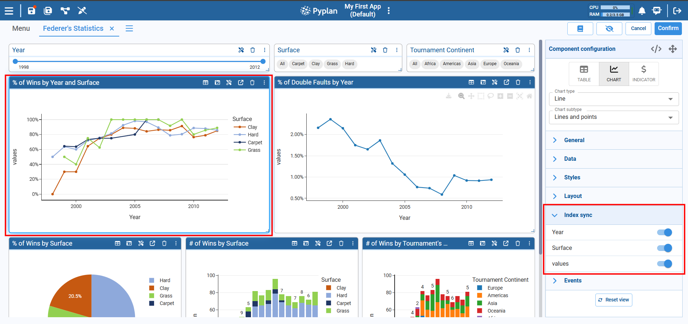

When multiple components share the same indexes and sync configuration, they all respond together to the same filter selections.

---

## 6. Simple Manual Data Entry

We now focus on simple manual inputs inside interfaces, where users can type or modify values directly.

### 6.1 Scalar Input

For single values (rates, thresholds, flags, etc.), we use the **Input Data** component linked to a node that represents an input.

**Step‑by‑step: add a simple numeric input**

1. Go to code and create a new **Input Scalar Node**.
2. Add it as an **Input Data** component to the interface.
3. In **General**: Set a Title, e.g. `Percentage`.
4. In **Validations**:
   - Data type → `Float`.
   - Rule → `Range`, e.g. min 0, max 100 (for 0–100%).
5. In **Styles**: Adjust font size and alignment if needed.

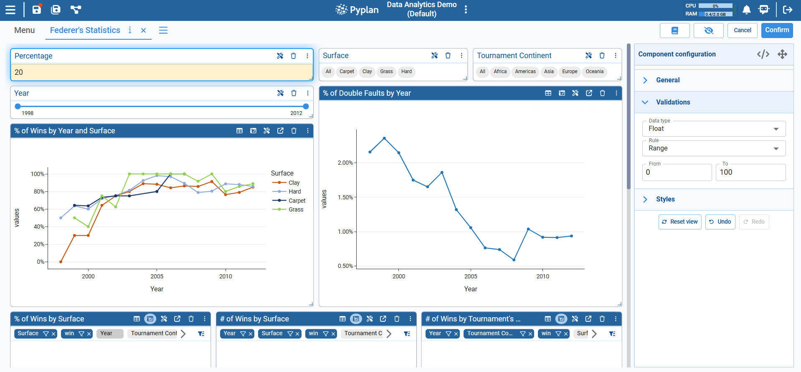

Typically, this component is bound to a node or used as part of a configuration so that changing its value triggers recalculation downstream.

### 6.2 Manual Data Entry with Forms and Cubes (Conceptual)

For more complex input (tables or multidimensional cubes):

- We define **Input data** nodes of type:
  - **Form** – tabular input stored in a DB.
  - **Cube** – multidimensional input stored in a DB.
- We then display them through:
  - A **Table** component bound to the form/cube node.
  - Or specific input components when configured.

**Basic steps (conceptual):**

1. In the influence diagram, create an **Input data** node.
2. Choose **Form** or **Cube** and configure fields/indexes in the wizard.
3. In an interface, add a **Table** component.
4. End users can edit the table cells directly.

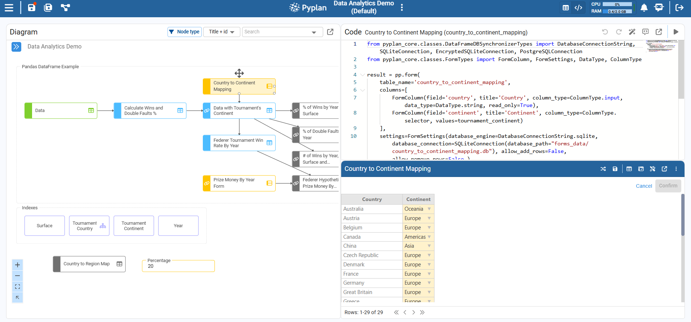

---

## 7. Analyst Agent: Functioning and Context

The Analyst Agent is an AI assistant specialized in interpreting and explaining data. It can:

- Answer natural language questions about the data displayed in the current interface.
- Provide summaries, trends, comparisons, and insights.
- Use context from nodes and the current view.

### 7.1 Opening the Analyst Agent

**Step‑by‑step**

1. While working in an interface, locate the **AI / Agent** icon in the top bar (usually on the right).
2. Click it to open the **Agent** panel.
3. Select the **Analyst Agent** (if multiple agents are available).

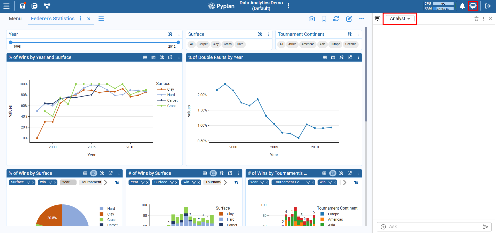

### 7.2 How the Analyst Agent Uses Context

The Analyst Agent can access:

- Data from the nodes underlying the current components (tables, charts).
- Other contextual nodes configured for the agent.

### 7.3 Asking Questions to the Analyst Agent

**Step‑by‑step example**

1. Go to the *Federer's Statistics* interface. Ensure the interface displays relevant data.
2. Open the **Analyst Agent** panel.
3. In the input box, type:
   > "Summarize the percentage of wins by Surface"
4. Submit the question.
5. The agent:
   - Reads the contextual data (nodes, filters).
   - Performs the required calculations.
   - Returns a concise explanation (and sometimes suggestions).

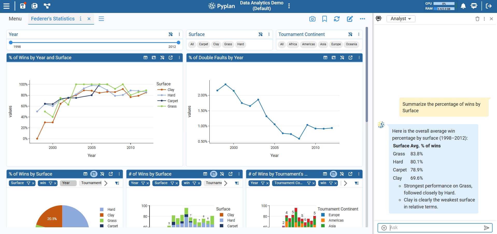

6. Optionally refine the question:
   - *"Which country has more match wins?"*
   - *"Is there a correlation between wins and double faults?"*

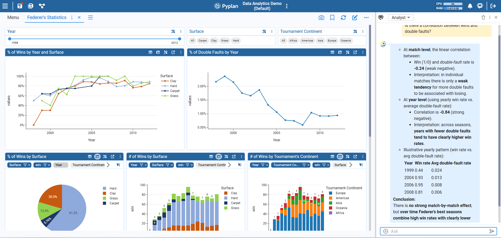

### 7.4 Best Practices When Using the Analyst Agent

- Be specific about:
  - Time windows (e.g., "last 2 years").
  - Dimensions (e.g., "by region and product line").
- Ensure the interface is showing the data you want the agent to focus on.
- Use it to:
  - Check intuition ("Is there a seasonality pattern?").
  - Generate quick narratives ("Write a summary for management").

---

## 8. Suggested Practice Exercise

To consolidate this module, follow this small exercise.

## Exercise: Federer Performance Overview

Create a new interface called **Federer Performance Overview**.

### Add the following components:

- A **Table** component bound to a Roger Federer statistics node (DataFrame or cube), such as match-level or season-level statistics.
- A **Chart** component (e.g. bar or line) using the same node to visualize performance metrics (e.g. wins, win percentage, aces, or double faults).

### Add two Index components:

- **Year**
  - Single select
  - Format "Select"
- **Surface**
  - Multi select
  - Format "Options list"

(Alternatively, Surface can be replaced with Tournament or Tournament Country)

### Configure behavior:

- Configure **Index sync** on both the table and the chart so they are filtered by Year and Surface.

### Final steps:

- Save the interface and exit edit mode.

### Use the Analyst Agent:

- Ask: *"Explain the differences in Federer's performance across surfaces for the selected year."*
- Adjust the filters and ask follow-up questions to compare seasons or surfaces.

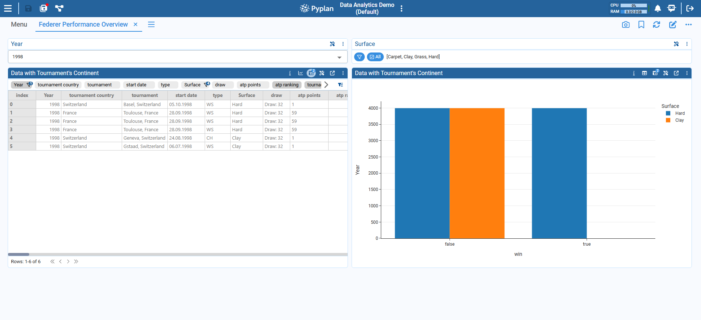

---

## Summary

In this tutorial we:

- **Defined what an interface is** in Pyplan and how it connects to nodes.
- **Used the Interface Manager** to view, create, edit, duplicate, and manage interfaces.
- **Built a simple interface** by:
  - Adding tables, charts, and indicator components.
  - Configuring styles and visualization options.
- **Explored indexes in interfaces:**
  - Index components, hierarchies, and Index sync across components.
- **Created simple manual inputs** using the Input Data component (and understood forms/cubes conceptually).
- **Learned how to work with the Analyst Agent:**
  - Opening it,
  - Asking context‑aware questions about current interface data,
  - Interpreting the answers.

With Modules 1 and 2 we now understand both sides of a Pyplan app: the code / influence diagram and the interfaces / user experience, plus how to leverage no‑code tools and AI agents to analyze data effectively.
