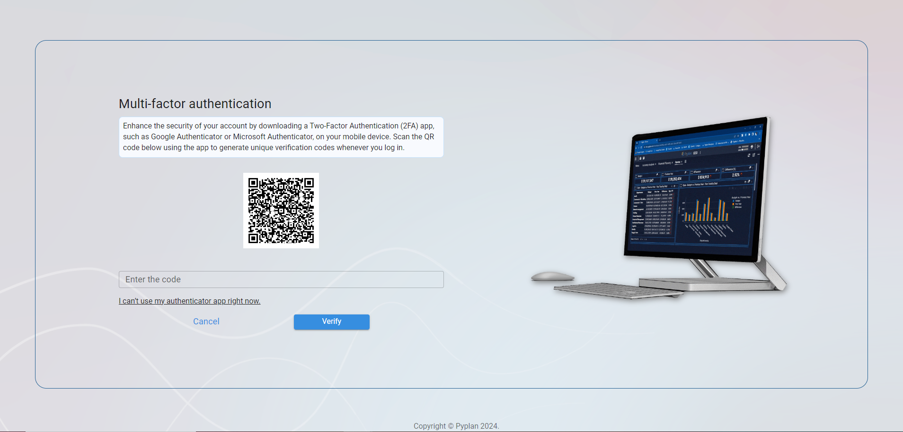
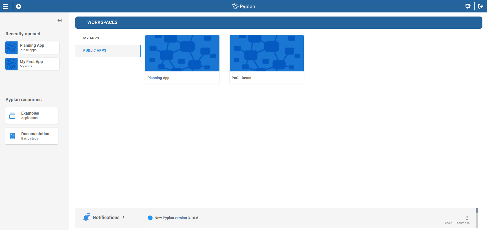
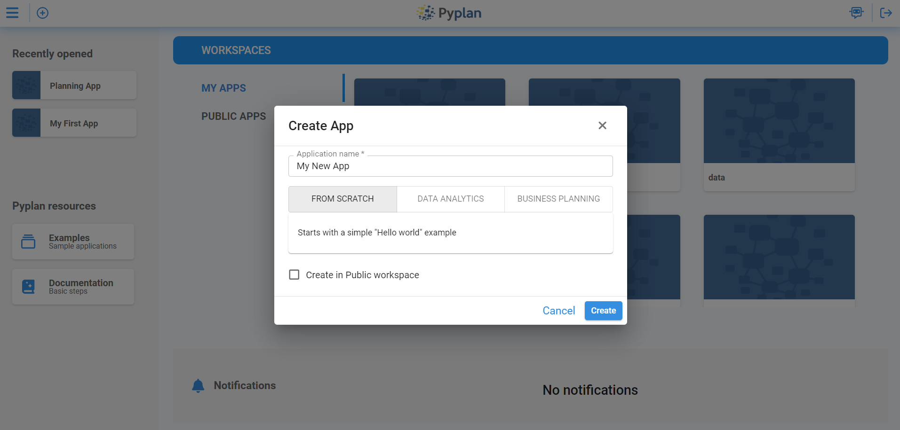
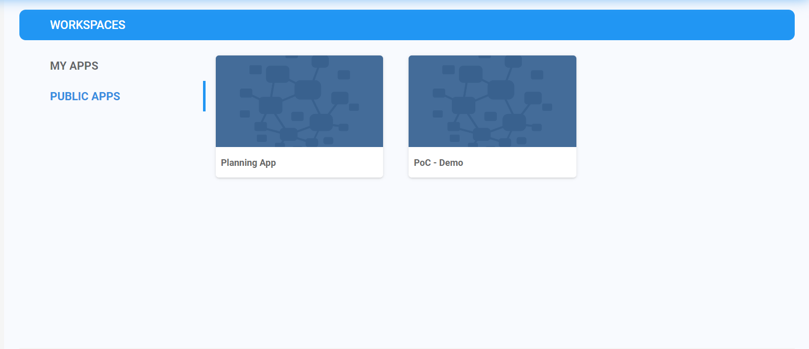
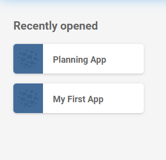
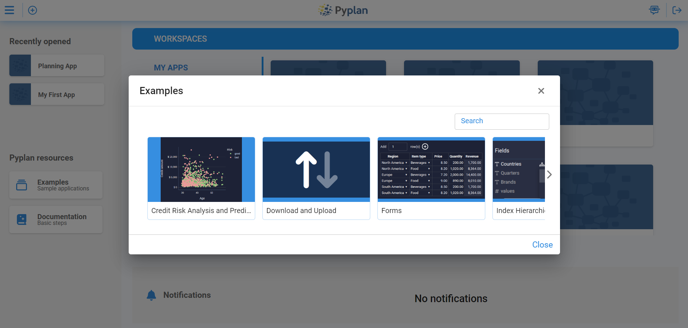
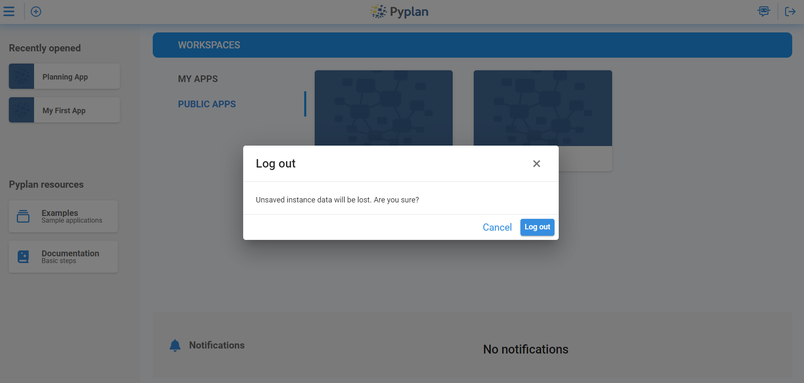

To access Pyplan, we first go to the web address of the server where it is installed. On that page, we enter our credentials in the login form.

On our first login, Pyplan asks us to scan a QR code to link a two-factor authentication (2FA) app, such as Google Authenticator or Microsoft Authenticator. After linking the app, we must enter the code generated by the authenticator to complete the login and access Pyplan.

Pyplan also supports Single Sign-On (SSO), which allows us to authenticate using our organization's identity provider. When SSO is correctly configured, Pyplan automatically recognizes users that belong to the domain and delegates authentication to the corporate system.

> When we use Single Sign-On (SSO), we must append /saml/\[company code\] to the URL. Example: [https://dev.pyplan.com/saml/pyplan](https://dev.pyplan.com/saml/pyplan)

## Home Section

After logging in, we arrive at the Pyplan Home section. This page is our main entry point to the platform and is organized into clearly defined areas:

- A left sidebar with **Recently opened** applications and **Pyplan resources**.
- A central **Workspaces** area where we see our applications.
- A **Notifications** panel at the bottom.

From this single page we can open existing apps, create new ones, access help resources, and review activity on our account.

## Accessing Functionalities

From the Home section, we access Pyplan's main functionalities through:

- The **top bar**, where we find the "+" button to create new applications and the menu icon to open additional options.
- The **Workspaces** area in the center, where we browse and open our apps.
- The **left sidebar**, which provides shortcuts to recent apps and learning resources.
- The **Notifications** panel at the bottom, which summarizes relevant events.

This layout is designed so that we can start working on our models and analyses in just a few clicks.

### Creating New Applications

To create a new application, we click the **"+"** icon in the top-left area of the screen (in the main toolbar). This opens the new application dialog, where we specify:

- **Application name**: how our new app will be identified.
- **Starting point**: whether we want to create the application from scratch or use a base model as a template.
- **Location**: whether the application will be created in the **Public** area or within our personal workspace.

Once we confirm these options, Pyplan creates the new application and opens it so we can start defining nodes and building our influence diagram.

### Workspaces

The **Workspaces** section occupies the main central area of the Home page. It is divided into tabs that help us organize our applications:

- **MY APPS**: shows the applications we own or that are assigned to our personal workspace.
- **PUBLIC APPS**: lists applications that are publicly available to all users with access to the server.

Each application appears as a card with its name. From here we can:

- Open an app by clicking its card.
- Browse through our applications visually.
- Quickly move between personal and public apps using the **MY APPS** and **PUBLIC APPS** links.

This structure gives us a clear overview of all the applications we can work with.

### Recently Opened

The **Recently opened** section is located in the left sidebar. It displays a list of the applications we have accessed most recently.

By clicking any of these items, we reopen the corresponding application directly, without searching in Workspaces. This helps us:

- Resume ongoing work quickly.
- Return to frequently used models in a single click.

### Notifications

The **Notifications** section is where we review and manage all alerts generated within Pyplan. Here we see updates on shared applications, collaboration requests, and important system announcements in a single, consolidated view. By centralizing this information, we stay informed about relevant activity, respond more quickly to changes, and maintain smoother collaboration with other users across the platform.

### Pyplan Resources

The **Pyplan resources** section is also located in the left sidebar. It provides quick access to learning and support materials, typically including:

- **Examples – Sample applications**: opens example apps that we can explore and run to understand how Pyplan models are structured.
- **Documentation – Basic steps**: opens the official Pyplan documentation to guide us through the main concepts and workflows.

These resources are especially useful when we start using Pyplan or when we want to discover recommended modeling patterns.

### Logging Out

To log out of Pyplan, we use the logout option in the top-right corner of the interface. Clicking this option:

- Safely ends our current session.
- Protects our account and data, especially on shared or public devices.

We should always log out when we finish working, to ensure that our applications and credentials remain secure.

