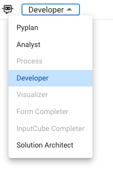
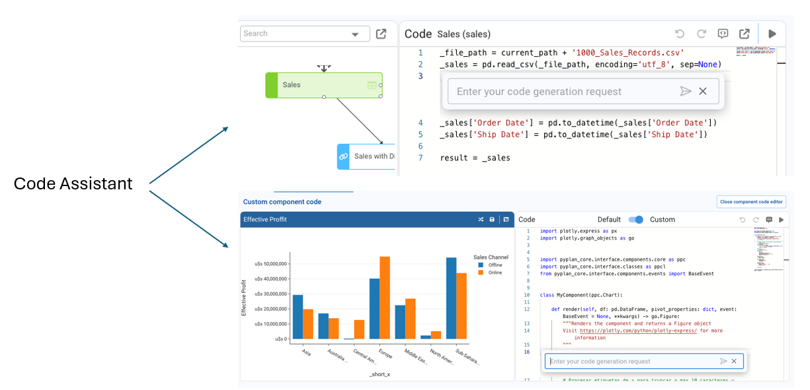
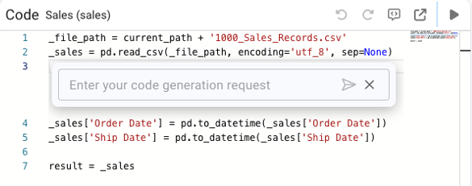

# AI Agents

Pyplan includes several built-in agent types designed to assist users across different workflows. These agents come pre-configured with specialized roles, optimized behaviors, and access capabilities tailored to their purpose. They simplify user interactions, automate complex tasks, and guide users through model logic, analysis, or interface creation.





## Pyplan Agent

The **Pyplan Agent** focuses on platform-level knowledge. It understands the structure and capabilities of Pyplan and is able to:

- Answer questions about navigation, model organization, and core features.
- Explain how to use nodes, interfaces, dashboards, and tools.
- Provide guidance on best practices for building and organizing a Pyplan model.
- Help new users understand the platform's workflow and concepts.

This agent acts as the user's first point of contact when learning or troubleshooting Pyplan functionality.

## Analyst Agent

The **Analyst Agent** specializes in data analysis, offering analytical insights directly within Pyplan. Its capabilities include:

- Exploring datasets and generating summaries, trends, and descriptive statistics.
- Producing output in the form of interfaces, tables, or charts.
- Assisting with segmentation, comparison, anomaly detection, and basic modeling.
- Helping users interpret numerical results inside the context of the application.

It is ideal for applications that require quick, natural-language-driven analytical support.

## Process Agent

The **Process Agent** guides users through the workflow of the current application, ensuring proper execution of steps. It can:

- Explain how to interact with specific interfaces or nodes.
- Provide step-by-step instructions based on documentation embedded in the app.
- Validate whether the user is following the expected workflow.
- Reduce friction by helping non-technical users execute complex processes.

This agent is useful in operational applications where consistency and guidance are important.

## Developer Agent

The **Developer Agent** assists in the technical construction and maintenance of the Pyplan model. It is designed for advanced users and can:

- Help write node formulas or custom Python code.
- Explain logic flows, dependencies, and advanced modeling concepts.
- Suggest optimizations or improvements to node structure.

It accelerates model development and promotes best practices.

## Visualizer Agent

The **Visualizer Agent** focuses on interface creation and layout design. It assists with:

- Suggesting and generating charts, tables, filters, and other UI components.
- Guiding users on best practices for dashboard clarity and usability.
- Configuring interface properties such as formatting, interactions, and layout.
- Helping align visualizations with the analytical purpose of the application.

Ideal for users who need to build dashboards but are not experts in interface design.

## Form Completer / Input Cube Completer

The **Form Completer** and **Input Cube Completer** agents are designed to assist users in filling out forms and data input cubes automatically, based on the user's needs and the context of the application. Their capabilities include:

- Interpreting the structure of a form or input cube and proposing values for each field.
- Using available context — such as previously loaded data, node values, or user instructions — to generate coherent and consistent entries.
- Reducing manual data entry effort in planning, budgeting, or operational input scenarios.
- Validating that proposed values align with expected formats, ranges, or business rules defined in the model.

These agents are especially useful in planning and budgeting applications where users need to complete large input cubes efficiently.

## Solution Architect

The **Solution Architect** agent is designed for users who need to translate a business problem into a complete, working Pyplan solution. It operates in two phases:

1. **Design phase**: The agent analyzes the problem described by the user, proposes a full solution design that includes the model structure, node logic, Python code, and the required interfaces and dashboards.
2. **Implementation phase**: Once the user reviews and confirms the proposed design, the agent proceeds to build the entire solution autonomously — creating nodes, writing formulas, and assembling the interfaces.

Its capabilities include:

- Understanding complex business requirements expressed in natural language.
- Producing a coherent end-to-end solution blueprint before any code is written.
- Generating node code, interface layouts, and application structure based on the confirmed design.
- Iterating on the design based on user feedback before committing to implementation.

This agent is ideal for advanced users and developers who want to accelerate the initial construction of a new Pyplan application.

## Code Assistants

**Code Assistants** support Python-related tasks within Pyplan. They can:

- Generate node code or component-level Python.
- Suggest algorithms, formulas, scripts, or refactors.
- Assist in debugging or improving performance of Python routines.
- Reduce development time by automating repetitive coding tasks.

They are especially useful for developers working on logic-heavy or computational models.



## Custom Agents

Custom Agents allow application developers to create their own specialized AI assistants. They can:

- Use custom instructions for domain-specific behavior.
- Access selected model nodes to read or analyze data.
- Execute Python tools, automate tasks, and interact with other agents.
- Incorporate RAG (Retrieval-Augmented Generation) to enhance knowledge with documents.

This flexibility enables fully tailored agents for finance, operations, demand planning, forecasting, and more.

### `Agent` Class

```python
class Agent(BaseModel):
    name: Optional[str] = None
    code: Optional[str] = None
    description: Optional[str] = None
    handoff_description: Optional[str] = None
    model: str = "gpt-4.1"
    instructions: Optional[str] = None
    tools: Optional[List[AgentTool]] = None
    handoffs: Optional[List[Agent]] = None
    agents_as_tool: Optional[List[AgentAsTool]] = None
    rag_settings: Optional[RAGSettings] = None
    visible: bool = True
    disabled: bool = False
    enable_on_sections: Optional[List[str]] = ['*']
    context_node_ids: Optional[List[str]] = None
    context_settings: ContextSettings = ContextSettings()
    output_type: Optional[Any] = None
```

### Parameter Summary

| Parameter | Type | Description |
|---|---|---|
| `name` | str \| None | Human-readable name of the agent. |
| `code` | str \| None | Internal unique identifier. |
| `description` | str \| None | Description of the agent's purpose. |
| `handoff_description` | str \| None | Explanation used when the agent participates in handoffs. |
| `model` | str | LLM model used by the agent. Default: `gpt-4.1`. |
| `instructions` | str \| None | System-level instructions defining agent behavior. |
| `tools` | List[AgentTool] \| None | Python functions available to the agent (nodes). |
| `handoffs` | List[Agent] \| None | Other agents this agent may delegate to. |
| `agents_as_tool` | List[AgentAsTool] \| None | Exposes agents so they can be invoked as tools by other agents. |
| `rag_settings` | RAGSettings \| None | Configuration for RAG document retrieval. |
| `visible` | bool | Sets whether the agent is visible in the UI. |
| `disabled` | bool | Enables or disables the agent. |
| `enable_on_sections` | List[str] \| None | Restricts which model sections can activate the agent. |
| `context_node_ids` | List[str] \| None | Nodes whose data the agent can read. |
| `context_settings` | ContextSettings | Controls how node context is loaded. |
| `output_type` | Any \| None | Expected type of the agent's final output. |

### Custom Agent Examples

**Color Specialist Agent:**

```python
from pyplan_core.classes.ai.Agent import Agent

result = Agent(
    model="gpt-4.1",
    instructions="You are a color specialist. The user will provide a color name and you must return its HEX value.",
)
```

**Agent with Access to Selected Nodes:**

```python
from pyplan_core.classes.ai.Agent import Agent

result = Agent(
    model="gpt-4.1",
    instructions="You are an expert in data analysis with Python. Answer questions very concisely.",
    context_node_ids=[]
)
```

**RAG-Enabled Agent:**

```python
from pyplan_core.classes.ai.Agent import Agent, RAGSettings

result = Agent(
    model="gpt-4.1",
    instructions=RAGSettings.DEFAULT_INSTRUCTIONS,
    rag_settings=RAGSettings(
        source_path=current_path + 'rag/source',
        chroma_db_path=current_path + 'rag/db',
    )
)
```

**Sentiment Classification Agent:**

```python
from pyplan_core.classes.ai.Agent import Agent

result = Agent(
    model="gpt-4.1",
    instructions="""
You classify the user's emotional state from the text.
Possible states: happy, neutral, angry, indeterminate.
Return an object with:
- state
- justification
"""
)
```

**Correlation Analysis Agent with Email Output:**

```python
from pyplan_core.classes.ai.Agent import Agent

result = Agent(
    model="gpt-4.1",
    instructions="""
ROLE: You are a data analyst agent. Analyze sales data and temperature data,
then generate an executive summary in Spanish and email it.

INSTRUCTIONS:
- Summary: total sales, margin, top/bottom regions.
- Trends over time.
- Correlation sales vs temperature.
- Anomalies.
- Produce a 200-300 word executive summary.
- Use send_email tool to send the report.
""",
    context_node_ids=[],
    tools=[]
)
```

### Agent Tool

The `agent_tool` decorator transforms a Python function into an `AgentTool` object that can be used inside Pyplan agents.

```python
from pyplan_core.classes.ai.Agent import agent_tool
from typing import Annotated
from function_schema import Doc

@agent_tool
def send_email(
    subject: Annotated[str, Doc('Email subject')],
    address: Annotated[str, Doc('Email address')],
    content: Annotated[str, Doc('HTML email body')],
):
    """Send an email according to the parameters provided"""
    return pp.send_email(html_content=content, emails_to=[address], subject=subject)
```

Add the tool to an agent:

```python
agent = Agent(
    model="gpt-4.1",
    instructions="Your role...",
    tools=[send_email],
)
```
