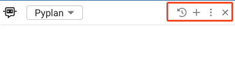
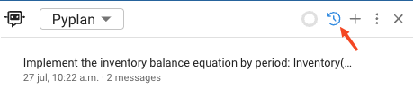
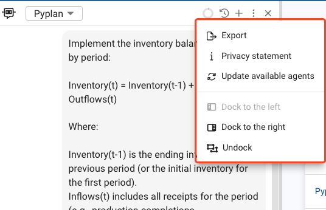
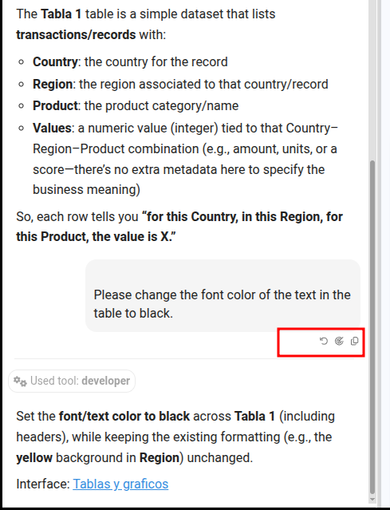
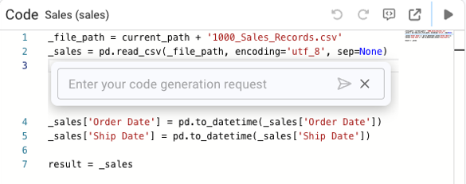

# AI Agents

Pyplan includes a built-in **Pyplan Agent**: a single, unified AI assistant that helps users across every workflow — from understanding the platform to analyzing data and building models and interfaces. Alongside it, **Code Assistants** provide inline help while writing code, and **Custom Agents** let application developers create their own specialized assistants.

The Pyplan Agent comes pre-configured with the knowledge and tools it needs to work directly on the open application, so users can interact in natural language without switching between different assistants for questions, analysis, or building.

## Agent Window Header

The agent window header gives us quick access to the main chat actions. In this section we describe the actions available in the header, excluding the agent selector.



### Session history

To review previous conversations, we click **Session history** in the header.

From this panel, we can:

- Open a previous conversation and continue working on it.
- Rename an existing session to identify it more easily later.
- Delete a stored session when it is no longer needed.
- Review the last update date and the number of messages in each session.



:::info
When we open a previous session, the current chat view is replaced with the selected conversation.
:::

### New chat

To start from a clean conversation, we click **New chat**.

This action clears the current session for the selected agent and opens an empty chat so we can begin a new interaction. If the session history panel is open, Pyplan returns to the main chat view.

### Header options menu

To access additional actions, we click **Options** in the header.



From this menu, we can use the following actions:

- **Export**: downloads the current conversation as a Markdown file.
- **Privacy statement**: opens the Pyplan privacy statement in a new browser tab.
- **Update available agents**: refreshes the list of agents available in the selector.
- **Dock to the left**: moves the agent window to the left side of the workspace.
- **Dock to the right**: moves the agent window to the right side of the workspace.
- **Undock**: changes the agent window to floating mode.

:::tip
The **Export** action is available only when the conversation has finished and the chat already contains messages.
:::

## Actions Available In User Messages

In each **user message**, Pyplan provides a set of contextual actions that become visible when we hover over the message.



The available actions are the following:

- **Restore conversation**: This action allows us to restart the conversation from a selected user message. When we confirm the action, Pyplan restores the session checkpoint for that message and removes all subsequent messages in the conversation. If the agent modified an interface during that turn, Pyplan checks whether a snapshot of the interface state exists for that checkpoint. If one is found, the confirmation dialog includes a **Revert interface changes** checkbox that we can enable to also restore the interface to the state it had before those modifications. This restoration is applied in memory only — the interface file on disk is not modified until we explicitly save the application.
- **View traces**: If traces are available and we have permission to access them, we can open the trace detail associated with that message.
- **Copy message**: This action copies the full content of the user message to the clipboard.

:::warning
When we restore a previous conversation point, all messages below that point in the session are removed after confirmation.
:::

:::info
The **Revert interface changes** checkbox is only shown when there is a saved snapshot for that checkpoint in the current chat session. Snapshots are created automatically before each agent turn and are discarded when a turn completes without any interface changes.
:::

## Pyplan Agent

The **Pyplan Agent** is the single assistant available in the chat. It brings together capabilities that were previously split across separate agents, so a single conversation can move naturally from a question, to an analysis, to building something in the model — without switching assistants.

It can:

- **Understand the platform**: answer questions about navigation, model organization, nodes, interfaces, dashboards, and tools, and guide new users through Pyplan's concepts and best practices.
- **Analyze data**: explore the open application's data, generate summaries, trends, and comparisons, identify best/worst cases and anomalies, and explain results in business language — rendering charts or tables directly in the chat when it helps.
- **Build and maintain the model**: create and update nodes, write node formulas and Python code, explain logic and dependencies, and follow Pyplan's modeling conventions.
- **Build interfaces**: create and edit dashboards, including fully custom [HTML interfaces](./interfaces/html-interfaces.md). Before building a new interface it proposes a short plan and waits for our confirmation.
- **Edit data**: add, update, or remove rows and values in the application's Form and Input Cube components.
- **Guide processes and workflows**: report our tasks and processes, highlight delays, and search the application's own documentation to explain how it works.

The Pyplan Agent works only on the application and company that are currently open, and uses the diagram nodes, interface components, and files we have attached to the conversation as context.

:::info
When a request takes several steps, the agent's work (its reasoning and the tools it runs) is grouped into a single collapsible activity block shown above the answer. We can expand it to review exactly what the agent did.
:::

### What the agent remembers

The Pyplan Agent keeps a **memory of each application**: durable lessons about how to work in it — conventions, sequences that must be respected, and mistakes already made there — which it takes into account in every later conversation about that application.

We do not have to do anything for this to happen. When a conversation actually teaches something — we state a rule, we correct the agent, or it has to redo work it had just finished — Pyplan stores it on its own. When we want to be explicit, we type `/remember` in the chat followed by what should be kept:

```
/remember charts in this app are built with Plotly
```

Whenever something is stored, a note appears under the agent's answer with the memory text and a **Manage** link.

Everything the agent has learned can be reviewed, edited or deleted from the **Memory** tab — see [Memory](./ai-management/memory.md). Custom Agents keep their own separate memory in the same way; the inline Code Assistants do not.

## Code Assistants

**Code Assistants** support Python-related tasks within Pyplan. They can:

- Generate node code or component-level Python.
- Suggest algorithms, formulas, scripts, or refactors.
- Assist in debugging or improving performance of Python routines.
- Reduce development time by automating repetitive coding tasks.

They are especially useful for developers working on logic-heavy or computational models.



## Custom Agents

Custom Agents allow application developers to create their own specialized AI assistants. They can:

- Use custom instructions for domain-specific behavior.
- Access selected model nodes to read or analyze data.
- Execute Python tools, automate tasks, and interact with other agents.
- Incorporate RAG (Retrieval-Augmented Generation) to enhance knowledge with documents.

This flexibility enables fully tailored agents for finance, operations, demand planning, forecasting, and more.

### `Agent` Class

```python
class Agent(BaseModel):
    name: Optional[str] = None
    code: Optional[str] = None
    description: Optional[str] = None
    handoff_description: Optional[str] = None
    model: str = "gpt-4.1"
    instructions: Optional[str] = None
    tools: Optional[List[AgentTool]] = None
    handoffs: Optional[List[Agent]] = None
    agents_as_tool: Optional[List[AgentAsTool]] = None
    rag_settings: Optional[RAGSettings] = None
    visible: bool = True
    disabled: bool = False
    enable_on_sections: Optional[List[str]] = ['*']
    context_node_ids: Optional[List[str]] = None
    context_settings: ContextSettings = ContextSettings()
    output_type: Optional[Any] = None
```

### Parameter Summary

| Parameter | Type | Description |
|---|---|---|
| `name` | str \| None | Human-readable name of the agent. |
| `code` | str \| None | Internal unique identifier. |
| `description` | str \| None | Description of the agent's purpose. |
| `handoff_description` | str \| None | Explanation used when the agent participates in handoffs. |
| `model` | str | LLM model used by the agent. Default: `gpt-4.1`. |
| `instructions` | str \| None | System-level instructions defining agent behavior. |
| `tools` | List[AgentTool] \| None | Python functions available to the agent (nodes). |
| `handoffs` | List[Agent] \| None | Other agents this agent may delegate to. |
| `agents_as_tool` | List[AgentAsTool] \| None | Exposes agents so they can be invoked as tools by other agents. |
| `rag_settings` | RAGSettings \| None | Configuration for RAG document retrieval. |
| `visible` | bool | Sets whether the agent is visible in the UI. |
| `disabled` | bool | Enables or disables the agent. |
| `enable_on_sections` | List[str] \| None | Restricts which model sections can activate the agent. |
| `context_node_ids` | List[str] \| None | Nodes whose data the agent can read. |
| `context_settings` | ContextSettings | Controls how node context is loaded. |
| `output_type` | Any \| None | Expected type of the agent's final output. |

### Custom Agent Examples

**Color Specialist Agent:**

```python
from pyplan_core.classes.ai.Agent import Agent

result = Agent(
    model="gpt-4.1",
    instructions="You are a color specialist. The user will provide a color name and you must return its HEX value.",
)
```

**Agent with Access to Selected Nodes:**

```python
from pyplan_core.classes.ai.Agent import Agent

result = Agent(
    model="gpt-4.1",
    instructions="You are an expert in data analysis with Python. Answer questions very concisely.",
    context_node_ids=[]
)
```

**RAG-Enabled Agent:**

```python
from pyplan_core.classes.ai.Agent import Agent, RAGSettings

result = Agent(
    model="gpt-4.1",
    instructions=RAGSettings.DEFAULT_INSTRUCTIONS,
    rag_settings=RAGSettings(
        source_path=current_path + 'rag/source',
        chroma_db_path=current_path + 'rag/db',
    )
)
```

**Sentiment Classification Agent:**

```python
from pyplan_core.classes.ai.Agent import Agent

result = Agent(
    model="gpt-4.1",
    instructions="""
You classify the user's emotional state from the text.
Possible states: happy, neutral, angry, indeterminate.
Return an object with:
- state
- justification
"""
)
```

**Correlation Analysis Agent with Email Output:**

```python
from pyplan_core.classes.ai.Agent import Agent

result = Agent(
    model="gpt-4.1",
    instructions="""
ROLE: You are a data analyst agent. Analyze sales data and temperature data,
then generate an executive summary in Spanish and email it.

INSTRUCTIONS:
- Summary: total sales, margin, top/bottom regions.
- Trends over time.
- Correlation sales vs temperature.
- Anomalies.
- Produce a 200-300 word executive summary.
- Use send_email tool to send the report.
""",
    context_node_ids=[],
    tools=[]
)
```

### Agent Tool

The `agent_tool` decorator transforms a Python function into an `AgentTool` object that can be used inside Pyplan agents.

```python
from pyplan_core.classes.ai.Agent import agent_tool
from typing import Annotated

@agent_tool
def send_email(
    subject: Annotated[str, 'Email subject'],
    address: Annotated[str, 'Email address'],
    content: Annotated[str, 'HTML email body'],
):
    """Send an email according to the parameters provided"""
    return pp.send_email(html_content=content, emails_to=[address], subject=subject)
```

Add the tool to an agent:

```python
agent = Agent(
    model="gpt-4.1",
    instructions="Your role...",
    tools=[send_email],
)
```
