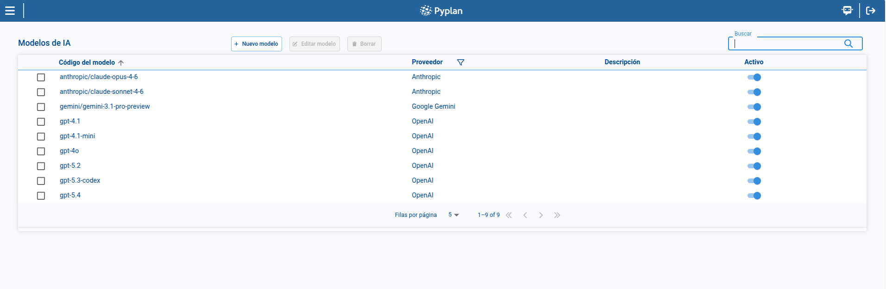
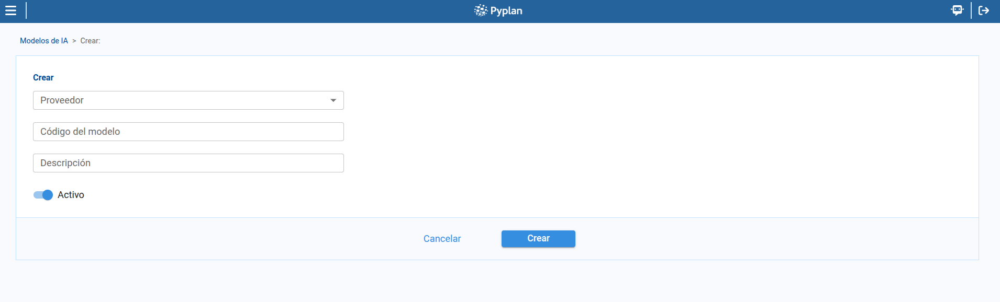

# Models

The **Models** page defines which AI models are available in Pyplan and how they are associated with providers. From this page, we can review model records, filter them by provider, create or edit models, change their active status, and delete models that are no longer required.

To access this page, we open **AI Management** and select **Models**.

## 1. Model list

The main table displays the models configured in the platform.

In the list, we can review:

- **Model code**
- **Provider**
- **Description**
- **Active** status

From this page, we can also search, sort, paginate, and select a model to enable management actions.

## 2. Filtering by provider

The page includes a provider filter to narrow the result set.

This filter helps us focus on the models associated with a specific AI vendor.

## 3. Creating or editing a model

To create a model:

1. We click **New model**.
2. We select the **Provider**.
3. We enter the **Model code**.
4. We optionally complete the **Description**.
5. We define whether the model is **Active**.
6. We save the record.

To edit a model, we select a row and click **Edit model**.

## 4. Activating or deactivating models

From the list, we can change the active status of a model directly.

This allows us to keep a model definition available in configuration while controlling whether it can be used operationally.

## 5. Deleting a model

To remove a model:

1. We select a model from the table.
2. We open the delete action.
3. We confirm the deletion in the dialog.

## Summary

With **Models**, we can manage the operational model catalog:

- We review available models and their provider.
- We filter the list by provider.
- We create and edit model records.
- We activate or deactivate models directly from the list.
- We delete models through a confirmation step.