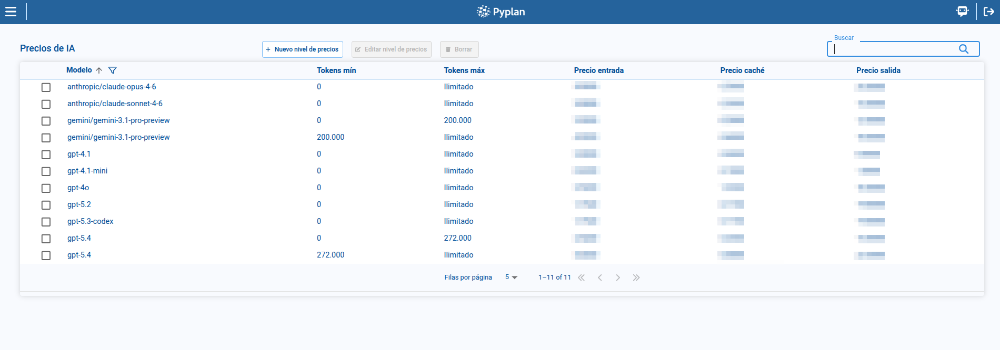
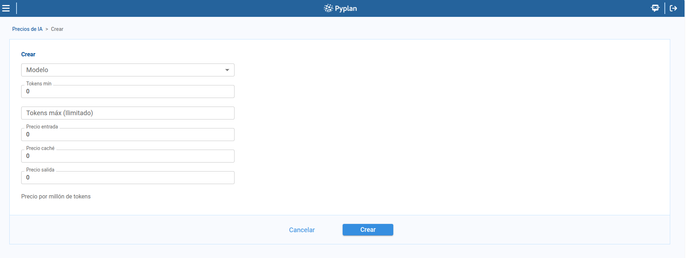

# Pricing

The **Pricing** page manages token-based pricing tiers for each AI model. From this page, we can review configured tiers, filter them by model, create new tiers, edit existing ones, and remove obsolete ranges.

To access this page, we open **AI Management** and select **Pricing**.

## 1. Pricing tier list

The main table shows the pricing tiers defined in the platform.

Each tier includes:

- **Model**
- **Tokens min**
- **Tokens max**
- **Input price**
- **Cache price**
- **Output price**

From this page, we can search, sort, paginate, and select a tier to enable edition or deletion actions.

## 2. Filtering by model

The page includes a model filter that helps us focus on the tiers associated with a specific model or subset of models.

This filter is useful when the environment contains many models with several pricing ranges each.

## 3. Creating or editing a pricing tier

To create a tier:

1. We click **New tier**.
2. We select the **Model**.
3. We define **Tokens min**.
4. We optionally define **Tokens max**.
5. We enter **Input price**, **Cache price**, and **Output price**.
6. We save the record.

To edit a tier, we select a row and click **Edit tier**.

## 4. Deleting a pricing tier

To delete a tier:

1. We select a tier from the table.
2. We open the delete action.
3. We confirm in the dialog.

This confirmation step helps us avoid removing a pricing range accidentally.

## 5. Validation rules for pricing ranges

When we define ranges, Pyplan validates them to preserve consistency.

- **Tokens max** must be greater than **Tokens min**.
- Tiers for the same model must not overlap.

:::warning
If ranges overlap for the same model, the platform rejects the change until the token intervals are corrected.
:::

## Summary

With **Pricing**, we can maintain model cost definitions in an organized way:

- We review the list of pricing tiers.
- We filter the list by model.
- We create, edit, and delete tiers.
- We rely on validation rules to keep token ranges consistent.