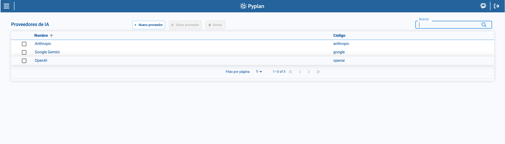
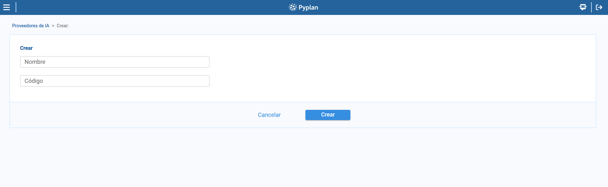

# Providers

The **Providers** page is where we manage the AI vendors available in Pyplan. From this page, we can review the existing providers, create new ones, update existing records, and delete providers that are no longer needed.

To access this page, we open **AI Management** and select **Providers**.

## 1. Provider list

The main table displays the providers configured in the platform.

In the list, we can review:

- **Name**
- **Code**

From this page, we can also search, sort columns, paginate through the result set, and select a provider to enable page actions.

## 2. Creating a provider

To create a provider:

1. We click **New provider**.
2. We complete the required fields.
3. We save the record.

The provider creation form includes the following fields:

- **Name**
- **Code**

## 3. Editing a provider

To edit a provider:

1. We select a provider from the table.
2. We click **Edit provider**.
3. We update the necessary fields.
4. We save the changes.

The same maintenance form is used for both creation and edition.

## 4. Deleting a provider

To remove a provider:

1. We select a provider from the table.
2. We open the delete action.
3. We confirm the operation in the confirmation dialog.

Pyplan displays a confirmation dialog before deleting the selected provider.

:::warning
We should delete a provider only when we are sure it is no longer needed by the models configured in the environment.
:::

## Summary

With **Providers**, we maintain the AI vendors available in the platform through a simple management flow:

- We review the list of configured providers.
- We create and edit provider records.
- We delete providers through an explicit confirmation step.