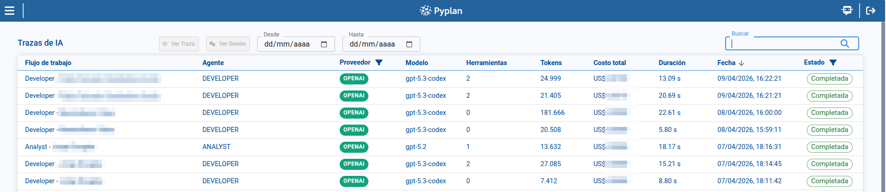
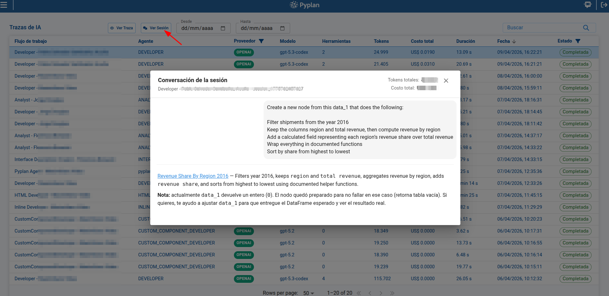
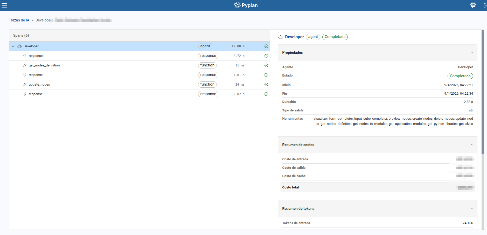

# AI Traces

The **AI Traces** page helps us inspect AI execution history and investigate how agents, models, and tools behave during each run. From this page, we can review trace results, apply filters, open session conversations, and inspect the internal span structure of a trace.

To access this page, we open **AI Management** and select **AI Traces**.

## 1. Trace list

The main table shows the traces returned by the platform and lets us select one row at a time.

In the list, we can review key execution data such as:

- Workflow name
- Agent
- Provider
- Model
- Tools count
- Token usage
- Duration
- Execution date
- Status

We can also use the page search box to search traces by text, sort columns to prioritize relevant executions, and move through pages when the result set is large.

## 2. Filters and refresh behavior

The page includes filters that help us narrow the trace list before opening a specific execution.

Available filters are:

- **Provider**
- **Status**
- **Date from**
- **Date to**

These filters can be combined with the search box and table sorting to focus on a specific provider, status, or period.

The page also refreshes automatically when new trace updates arrive, which helps us monitor executions that are still running.

## 3. Actions available for a selected trace

When we select a row, the page enables two actions in the header:

- **View trace**: opens the selected execution detail page.
- **View session**: opens the chat session associated with that trace.

This lets us move from a high-level operational view to either the underlying execution detail or the user-facing conversation.

### 3.1 Viewing the associated session

When we click **View session**, Pyplan opens a dialog with the conversation messages linked to the selected trace.

This dialog is useful to compare:

- The user interaction that triggered the trace
- The assistant responses generated during that execution
- The session summary associated with the trace

## 4. Trace detail page

When we click **View trace**, Pyplan opens the trace detail page for the selected execution.

This page includes breadcrumbs that allow us to return to the trace list and a two-panel layout for analyzing the execution.

### 4.1 Span tree

On the left panel, we can review the **span tree** of the execution.

From this panel, we can:

- Inspect the hierarchical relationship between spans
- Expand or collapse spans that contain child items
- Review each span name and type
- Check duration values
- Identify the current status of each span
- Detect error conditions directly from the list

The selected span is highlighted so we can focus on one execution step at a time.

### 4.2 Span detail panel

On the right panel, Pyplan displays the detail of the selected span.

This detail view helps us analyze the execution step in more depth, including the payload and the information available for that specific span.

### 4.3 Real-time updates

When the trace is still running, the detail page updates span data in real time as new events arrive. This allows us to monitor status changes and new spans without leaving the page.

:::warning
If a trace ends with an error or is stopped before completion, the final status is reflected both in the trace list and in the span detail page.
:::

## Summary

With **AI Traces**, we can move from operational monitoring to execution analysis:

- We review trace results in the main list.
- We narrow the scope with filters and search.
- We open the related conversation through **View session**.
- We inspect the internal execution flow through **View trace** and the span detail page.