# API Endpoints

This section explains how to consume data generated in a Pyplan app from outside of Pyplan.

## Creating an API Endpoint

To create an API endpoint, you need to create a node whose result is a Python function that can optionally receive parameters.

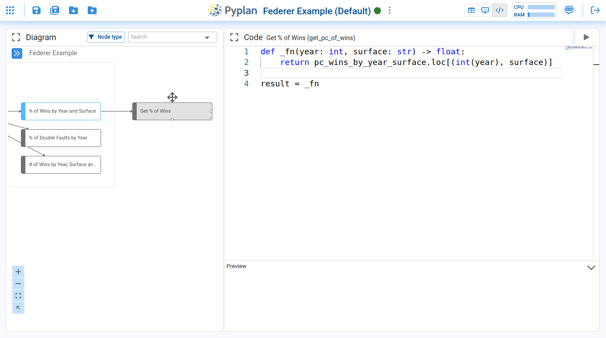

If the function must return a value, it should be in JSON format. For example:

```python
def _fn(name1, name2):
    data = {
        'Name': [name1, name2, 'Alice', 'Bob'],
        'Age': [25, 30, 35, 40],
        'City': ['New York', 'Los Angeles', 'Chicago', 'Houston']
    }
    df = pd.DataFrame(data)
    return df.to_json(orient="index")

result = _fn
```

Then, right-click on the created node and choose the **Get API Endpoint** option:

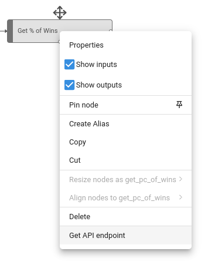

The following window will be displayed:

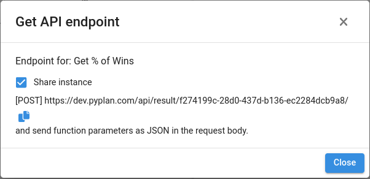

The **Share instance** option allows multiple calls to the API endpoint to be served from the same instance without creating a new one for each call.

:::caution
API endpoints are only available for the **Default version** of the app.
:::

## Structure of the API Endpoint Call

- **HTTP method**: POST
- **Content-Type**: application/json
- **Headers** (optional): If the endpoint has an assigned API key, send it as the `x-api-key` parameter.
- **Body** (optional): form-data. Where the parameters to feed the function are sent.

Example using Postman:

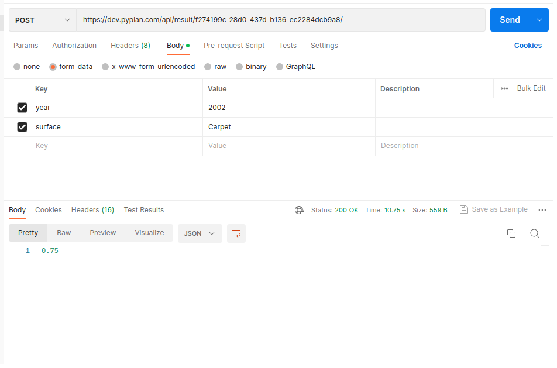

## API Endpoints Manager

In the **API endpoints** section, you can edit and delete the created API endpoints of the current application.

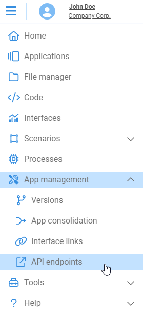

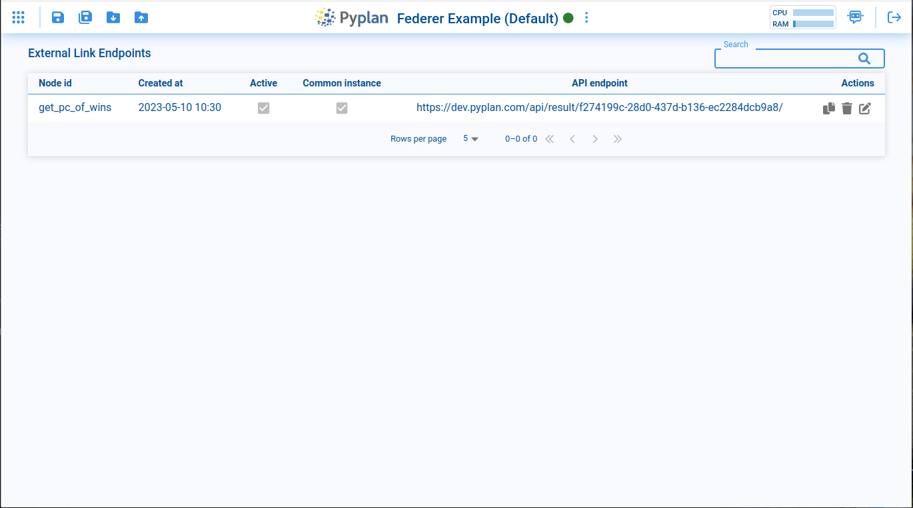

To edit an API endpoint, select it and click the **Edit** button.

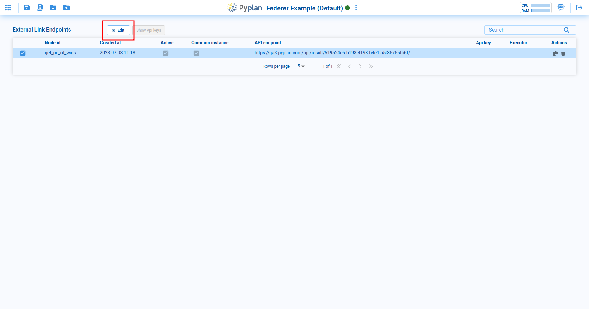

The available options are:

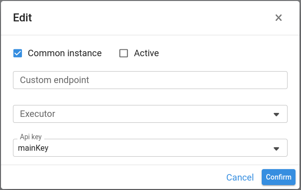

| Option | Description |
|---|---|
| **Common instance** | Allows enabling/disabling sharing of the instance when making multiple calls. |
| **Active** | Allows enabling/disabling the API endpoint completely. |
| **Custom endpoint** | Allows assigning a custom name to the external link endpoint. |
| **Executor** | Allows choosing which user will open the instance. |
| **API key** | Allows selecting a previously created key to send as a `x-api-key` header. |

To delete an API endpoint, click the delete icon.

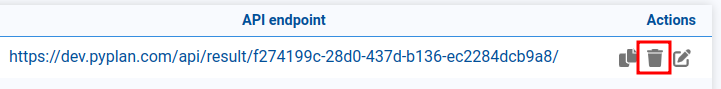

## API Key Manager

To create, edit, or delete API keys, click the **Show API keys** button:

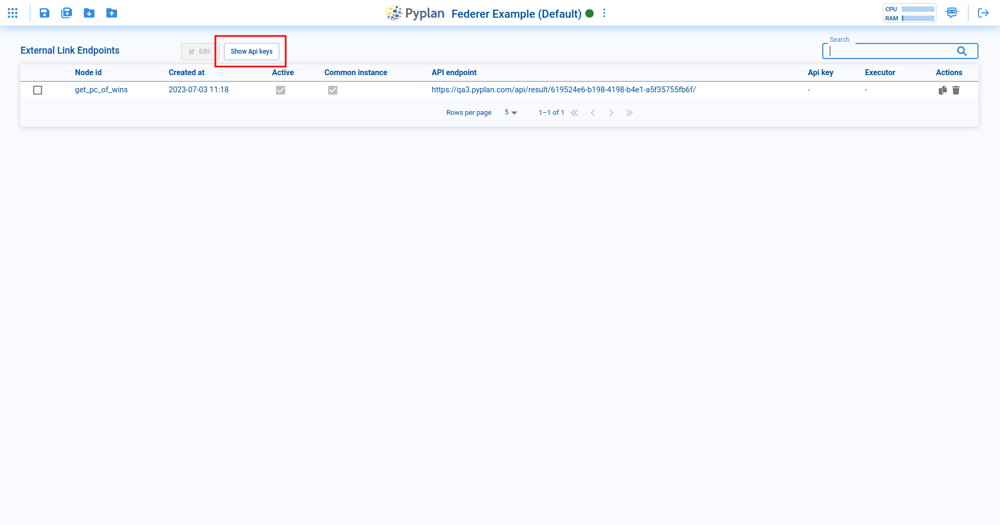

To create a new API key, click **Create API key**:

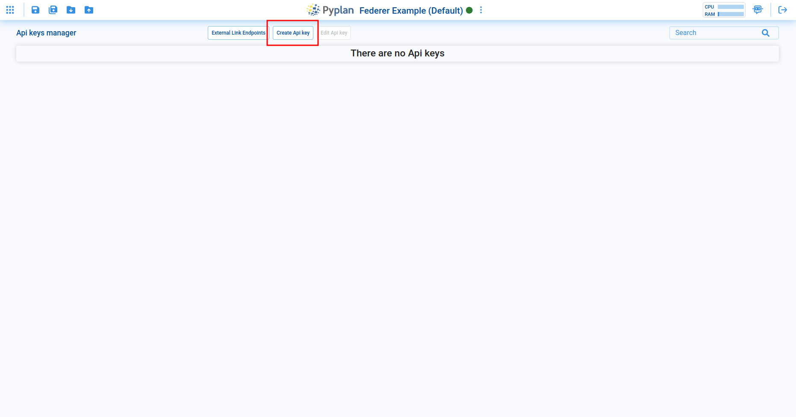

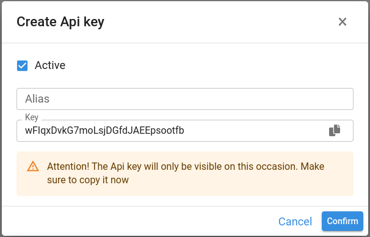

| Option | Description |
|---|---|
| **Active** | Allows enabling/disabling the API key. |
| **Alias** | Allows assigning a personalized name to the API key for easier recognition. |
| **Key** | The actual API key. It can be edited with a custom value. Save this key securely — it cannot be viewed again after creation, only replaced or deleted. |

To edit an API key, select it and click **Edit API key**:

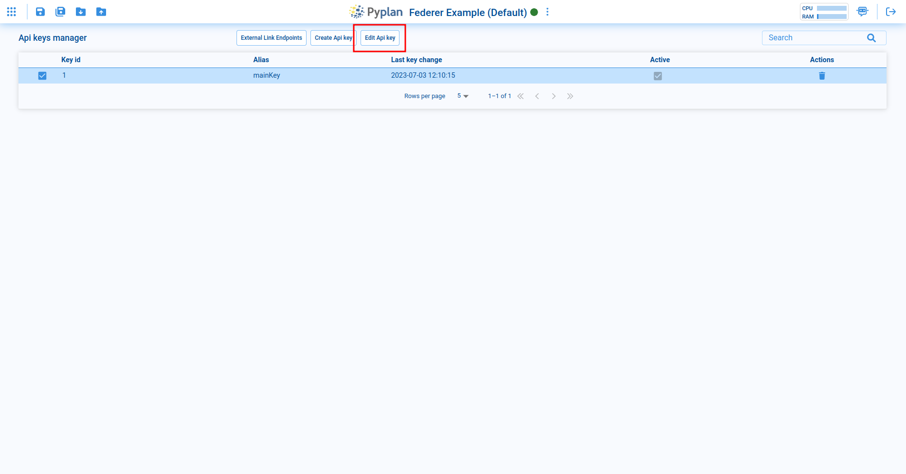

To delete an API key, click the delete icon:

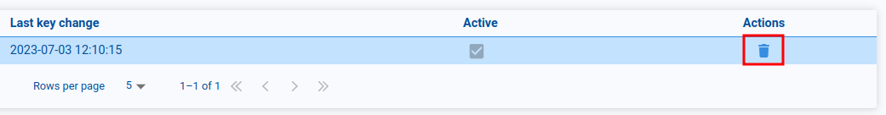

To assign an API key to an API endpoint, edit the API endpoint and select the desired API key:

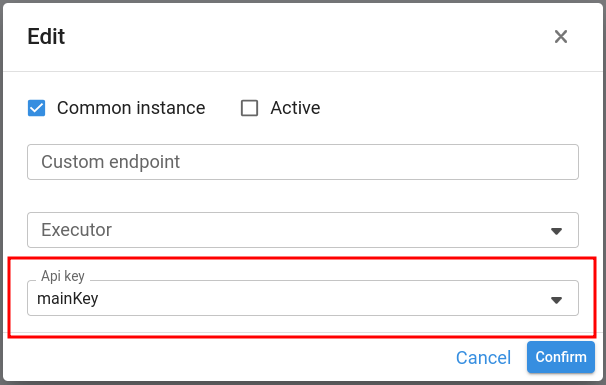
