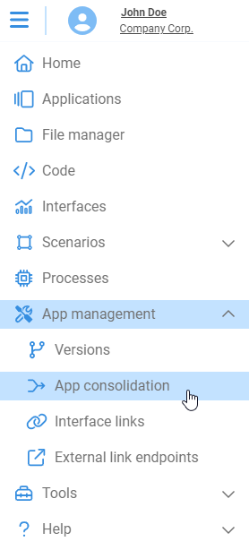
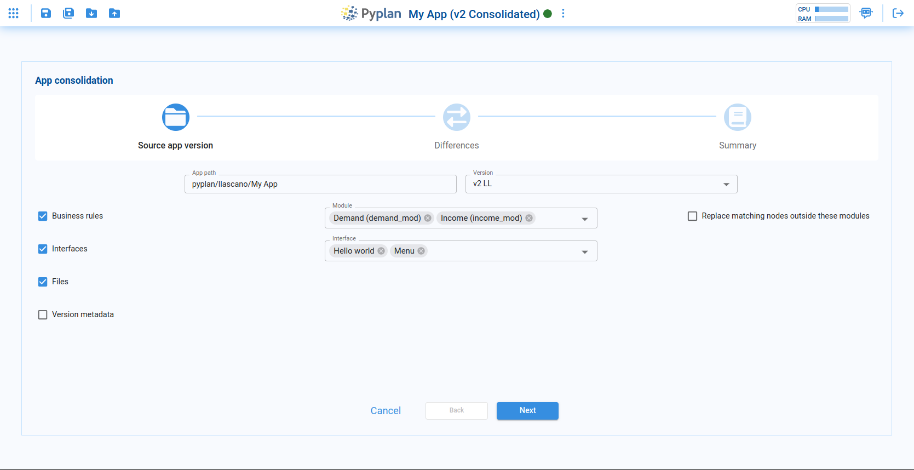
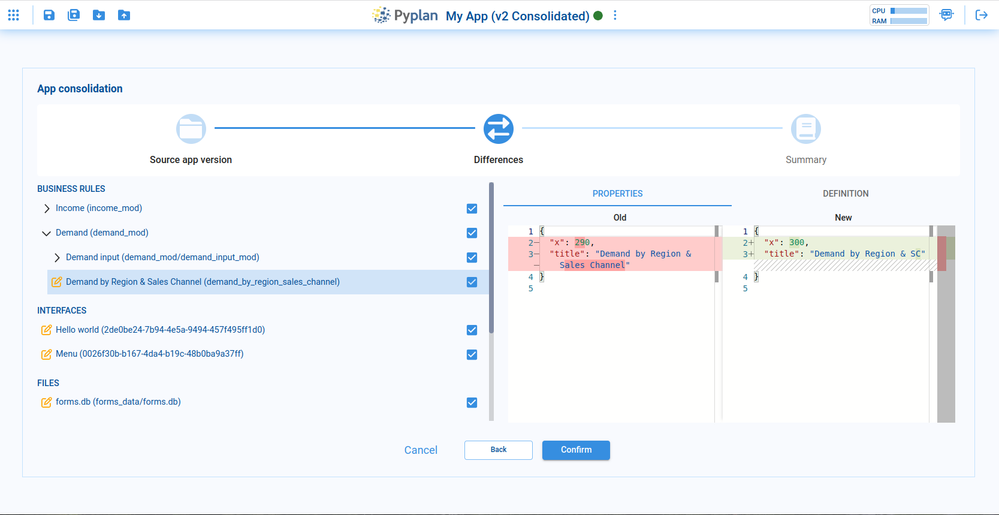
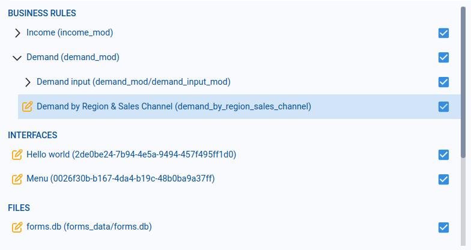
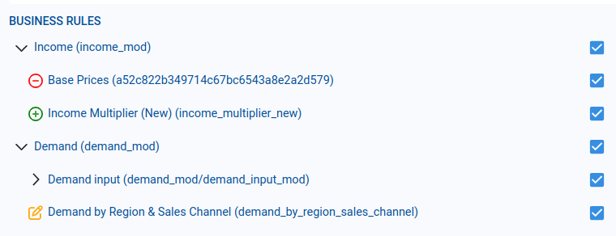
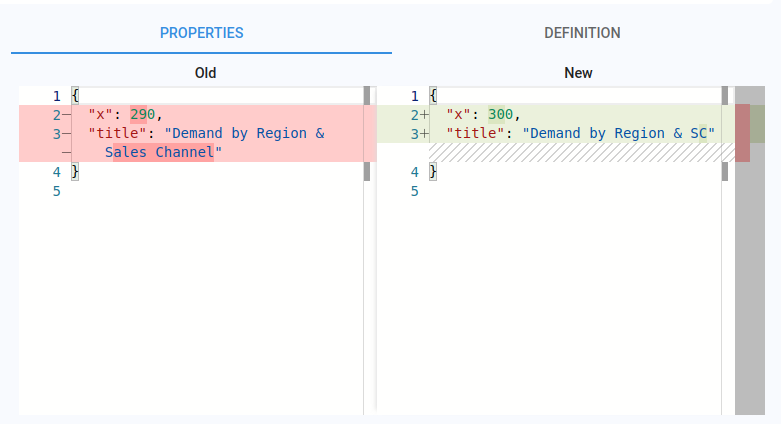
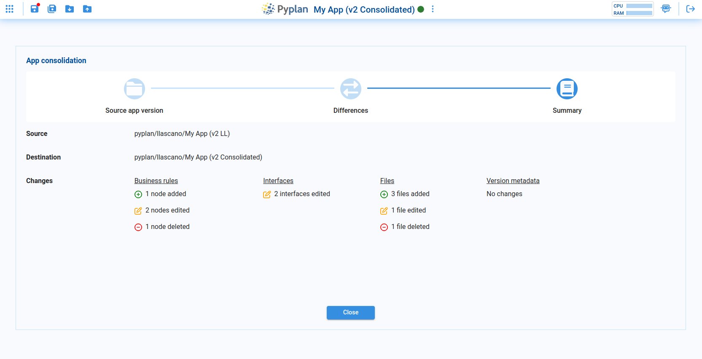

# App Consolidation

This section explains how to consolidate business rules, interfaces, and files from one version of an application into the version that is currently open.

## Step 1: Selection of Source Application and Version

In the first step you choose the source application and version from which changes will be imported into the current version.

### Parameters

| Parameter | Description |
|---|---|
| **App path** | Path of the source application. Clicking this field opens a file-browser dialog. |
| **Version** | Version of the source application from which you want to bring changes. |
| **Business rules – Modules** | Selector to choose which modules (in the influence diagram) will be considered for consolidation. |
| **Business rules – Replace matching nodes outside these modules** | If checked, matching nodes in the target version that are outside the selected modules will be replaced by nodes from the source version. If unchecked, new nodes from the source will be created with the suffix `"_new"` to avoid overwriting existing nodes. |
| **Interfaces** | Selector to choose which interfaces from the source version to incorporate. |
| **Files** | When checked, all files in the source version are compared against the target version files. |
| **Version metadata** | When checked, the `metadata.json` file from the source version is compared with the target version's `metadata.json`. |

After configuring these options, click **Next**. Pyplan analyzes the two versions, detects differences, and displays them in the next step.

## Step 2: Comparison and Selection of Differences

In this step, Pyplan shows all differences between the source version and the currently open version.

### List of Elements with Differences

On the left side, nodes, interfaces, and files where there are differences between the two versions are displayed.

### Meaning of Icons by Color

The icon color next to each item indicates the type of change:

- **Green** – a new element that will be added to the target version.
- **Yellow** – an existing element that will be modified.
- **Red** – an element that will be deleted from the target version.

### Comparison of the Chosen Element

On the right side, Pyplan shows a detailed comparison for the selected item:

- The **Old** column shows properties from the current (target) version.
- The **New** column shows properties from the source version.

If you apply the change, the values under New will replace the values under Old.

For business rules (nodes), the comparison is split into two tabs:
- **Properties** – node properties such as title, position, and size.
- **Definition** – the node's Python code.

For Interfaces, Files, and Version metadata, differences are shown only under the Properties tab.

### Confirmation of Changes

When satisfied with the selection, click **Confirm**. Pyplan applies the chosen changes to the current version.

:::caution Important
- Changes applied to **Files** and **Version metadata** are **irreversible** from the consolidation tool.
- Changes applied to **Business rules** and **Interfaces** can still be reverted as long as the application has not been saved. If you close the app without saving, these changes are discarded.
:::

## Step 3: Consolidation Summary

After the consolidation is executed, Pyplan shows a summary of all changes that were applied to the current version.

The summary distinguishes between:
- Changes to Files and Version metadata (always final).
- Changes to Business rules and Interfaces, which become permanent only when the application is saved.

## Database with Applied Changes

Inside the folder of the current version, Pyplan records all consolidation operations in a database file named `consolidations.db`.

- This file stores the history of changes applied through consolidations.
- Even if you later discard unsaved changes to Business rules or Interfaces, the operations themselves will still be recorded in `consolidations.db` as part of the audit trail.
