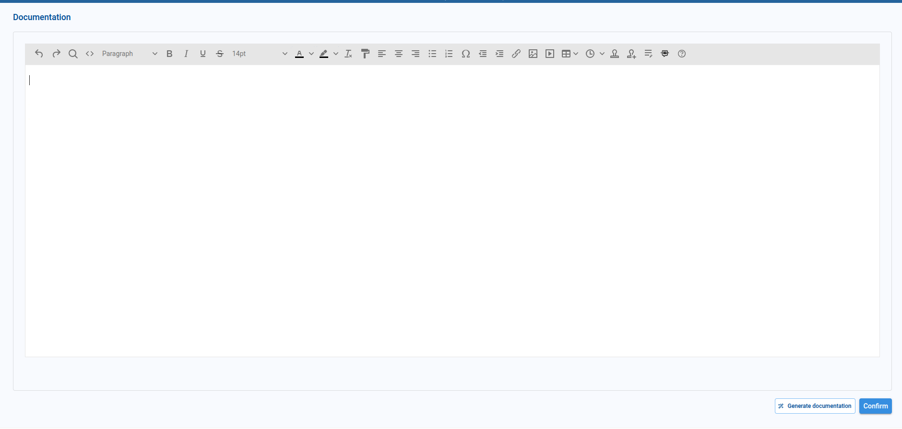
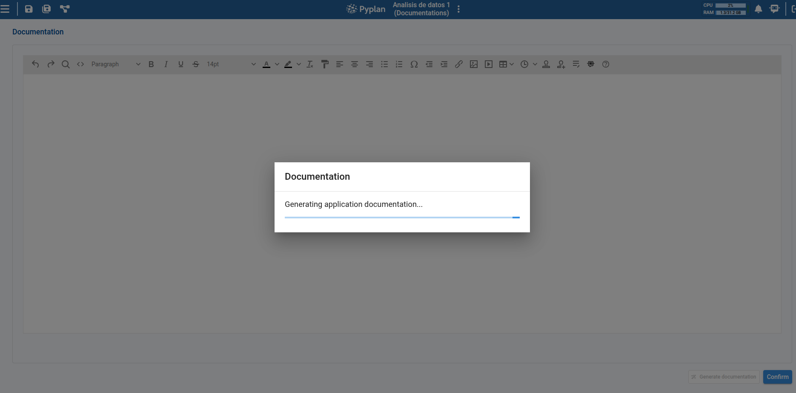

# App Documentation

The **App Documentation** section lets us write and maintain a description of the whole application. This documentation summarizes what the app is about, what it does and how it is organized. It is used by Pyplan's AI agents as context when users interact with the app (for example, to answer questions about it), and it can also serve as a human-readable overview for the team.

We open it from the **App management** menu and choose **Documentation**.

## Editing the Documentation

The page shows a rich text editor where we can write the application documentation. We can use the toolbar to format text, add headings, lists, tables, links and images, exactly like in any other Pyplan HTML editor.

Once we are happy with the content, we click **Confirm** to save the documentation. Pyplan stores it as the official documentation of the application and indexes it so that it is available to the AI agents.

## Generating the Documentation Automatically

We can ask Pyplan to write a first version of the application documentation for us by clicking the **Generate documentation** button at the bottom of the page.

When we trigger this action, Pyplan analyzes the application — taking into account its interfaces and their documentation — and produces a complete document that describes the app's purpose, its main sections and how the interfaces relate to each other. While the process runs, a dialog informs us that the application documentation is being generated.

Once the process finishes, the generated text is loaded into the editor. We can then review it, edit it as needed and click **Confirm** to save it.

:::info
To use the automatic generation, the application must have a **default language** configured in **App properties**. If no language is configured, Pyplan shows a warning and the action is cancelled.
:::

:::tip
Before generating the application documentation automatically, it is a good idea to first document the interfaces (and ideally the modules and nodes), so the AI has richer context to summarize. See the [Interface Manager](../interfaces/manager.md) and [Automatic Documentation](../code/automatic-documentation.md) articles for details.
:::
