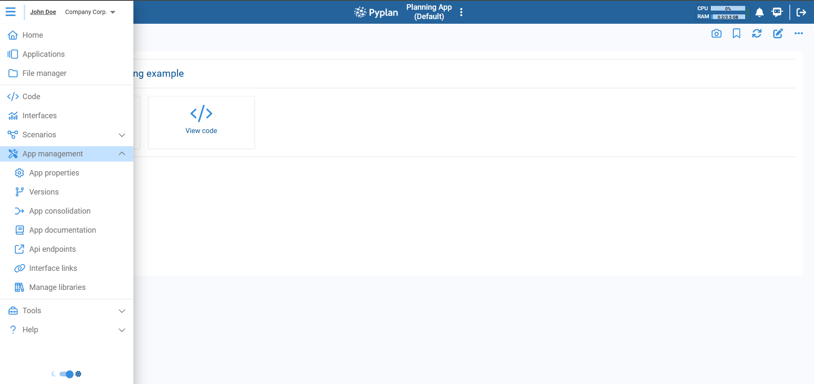
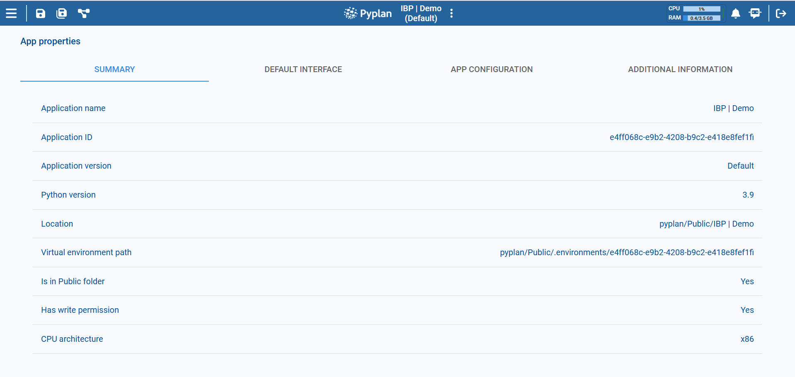
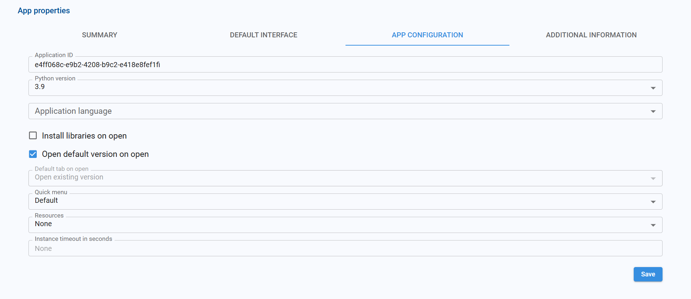
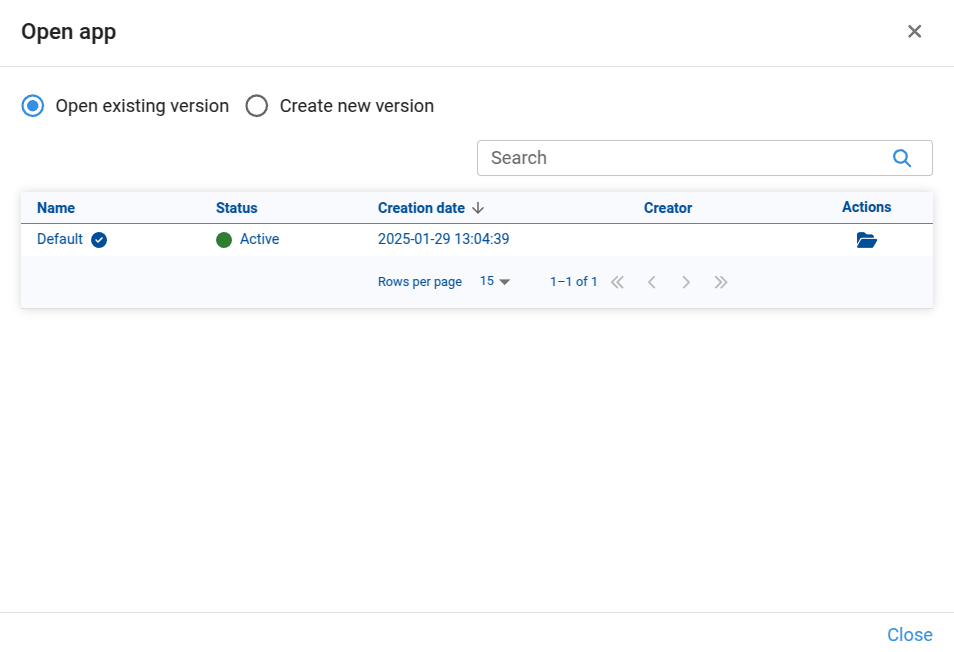
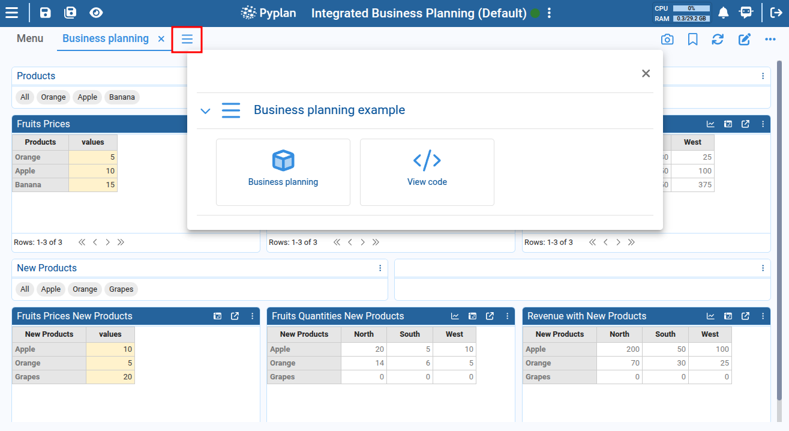
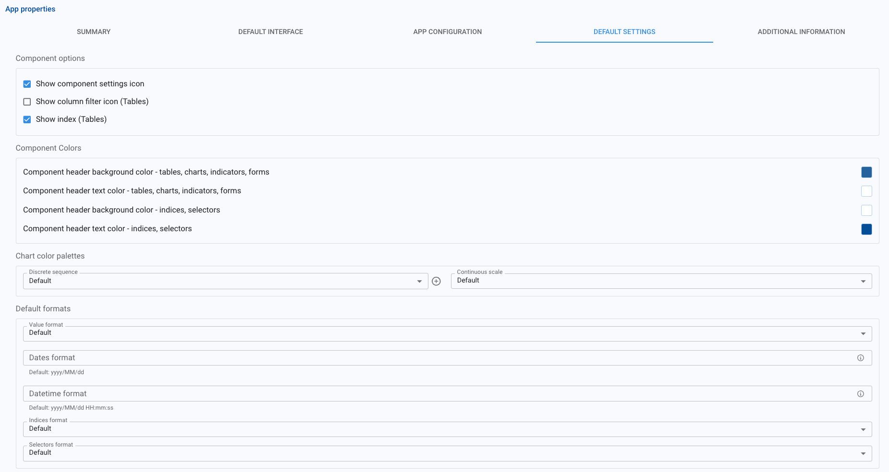
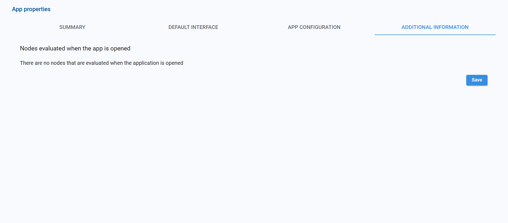

# App Properties

This section explains how to manage an application's main properties from within Pyplan.

To open the properties dialog, click the three-dot menu to the right of the application name in the top bar and choose **App properties**.

The dialog opens with several tabs:

- **Summary**
- **Default interface**
- **App configuration**
- **Default settings**
- **Additional information**

## Summary

The **Summary** tab provides a read-only overview of key application properties.

| Field | Description |
|---|---|
| **Application name** | The name of the application. It corresponds to the folder that contains the app and its `app.ppl` file. |
| **Application ID** | Unique identifier of the application, used to link the virtual environment, workflow processes, module/interface access restrictions, and thumbnail images. |
| **Application version** | Name of the currently open version (e.g., `Default`). |
| **Python version** | Python version configured for this app (e.g., `3.9`). |
| **Location** | File system path where the app folder is stored. |
| **Virtual environment path** | Path to the virtual environment associated with this Application ID. |
| **Is in Public folder** | Indicates whether the app is under the Public workspace. |
| **Has write permission** | Shows whether the current user has write permissions in the app folder. |
| **CPU architecture** | CPU architecture used to run the app, such as `x86` or `ARM`. Configured at department level. |

## Default Interface

The **Default interface** tab lets you choose which interface is opened first when users open the application.

Here you configure:

- A default interface for **All** users.
- Optional overrides for specific departments.

For example:
- `All` → `Menu`
- `Data Analytics` → `Operations`

With this setup, a user in the Data Analytics department will see the Operations interface when opening the app, while users from any other department will see the Menu interface.

You can add rows for more departments or remove them using the trash icon. Click **Save** to store the configuration.

:::tip
Ideally, the default interface should contain a Menu component so users can navigate to the rest of the interfaces in the app.
:::

## App Configuration

The **App configuration** tab lets you change technical and behavioral settings for the application.

| Option | Description |
|---|---|
| **Application ID** | The same ID shown in the Summary. Used for virtual environment, workflows, access restrictions, AI assistants, and thumbnails. |
| **Python version** | Python version the app will use. If changed, the application must be reloaded. A new virtual environment is created for the selected version if it does not exist yet. |
| **Application language** | Default language for node titles, node documentation, interface titles, component titles, and menu items. |
| **Install libraries on open** | When enabled, Pyplan installs the libraries listed in `requirements.txt` every time the application is opened. |
| **Open default version on open** | When enabled, the default version opens automatically. When disabled, a version selection dialog appears. |
| **Quick menu** | Defines which interface provides the Quick menu used when navigating between interfaces. Options: Default (from the app's default interface) or From interface (choose a specific interface). |
| **Resources** | Optional resource set to associate with the application. |
| **Instance timeout in seconds** | Maximum idle time before an application instance is automatically closed. |

## Default Settings

The **Default settings** tab lets us define default visual and behavioral settings for the entire application.

| Option | Description |
|---|---|
| **Show component settings icon** | Shows or hides, by default, the icon used to open the component configuration sidebar in interfaces. |
| **Show column filter icon (Tables)** | Shows or hides, by default, the column filter icon in table components. |
| **Show index (Tables)** | Shows or hides, by default, the 'index' column in non-pivot tables. |
| **Component colors** | Lets us define default colors for component headers in tables, charts, indicators, forms, indexes, and selectors. |
| **Chart color palettes** | Lets us choose default palettes for discrete and continuous chart color scales. |
| **Default formats** | Lets us define default value formats for tables, charts, indicators, indexes, and selectors. |

These defaults are applied as a baseline for the application and help us maintain a consistent look and behavior across interfaces. If a component has its own custom value for any of these properties, the custom value prevails over the default application value.

## Additional Information

The **Additional information** tab shows extra technical details about how the app behaves when it is opened.

For example, it lists any nodes that are automatically evaluated at startup (e.g., pre-loading data or configuration nodes). If the message *"There are no nodes that are evaluated when the application is opened"* appears, the app does not run any node automatically at open time.

After making changes in any tab, click **Save** to apply them.
