# App Properties

This section explains how to manage an application's main properties from within Pyplan.

To open the properties dialog, click the three-dot menu to the right of the application name in the top bar and choose **App properties**.

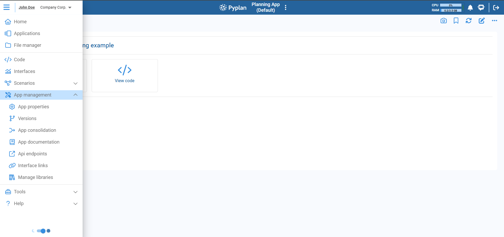

The dialog opens with several tabs:

- **Summary**
- **Default interface**
- **App configuration**
- **Default settings**
- **Additional information**

## Summary

The **Summary** tab provides a read-only overview of key application properties.

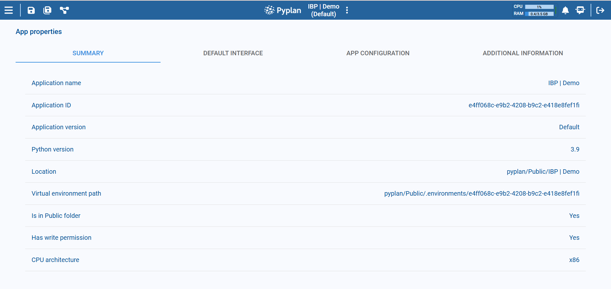

| Field | Description |
|---|---|
| **Application name** | The name of the application. It corresponds to the folder that contains the app and its `app.ppl` file. |
| **Application ID** | Unique identifier of the application, used to link the virtual environment, workflow processes, module/interface access restrictions, and thumbnail images. |
| **Application version** | Name of the currently open version (e.g., `Default`). |
| **Python version** | Python version configured for this app (e.g., `3.9`). |
| **Location** | File system path where the app folder is stored. |
| **Virtual environment path** | Path to the virtual environment associated with this Application ID. |
| **Is in Public folder** | Indicates whether the app is under the Public workspace. |
| **Has write permission** | Shows whether the current user has write permissions in the app folder. |
| **CPU architecture** | CPU architecture the open instance is running on, such as `x86` or `ARM`. It comes from the app's **CPU architecture** setting when one is defined, and from the resources in effect otherwise. |

## Default Interface

The **Default interface** tab lets you choose which interface is opened first when users open the application.

Here you configure:

- A default interface for **All** users.
- Optional overrides for specific departments.

For example:
- `All` → `Menu`
- `Data Analytics` → `Operations`

With this setup, a user in the Data Analytics department will see the Operations interface when opening the app, while users from any other department will see the Menu interface.

You can add rows for more departments or remove them using the trash icon. Click **Save** to store the configuration.

:::tip
Ideally, the default interface should contain a Menu component so users can navigate to the rest of the interfaces in the app.
:::

## App Configuration

The **App configuration** tab lets you change technical and behavioral settings for the application.

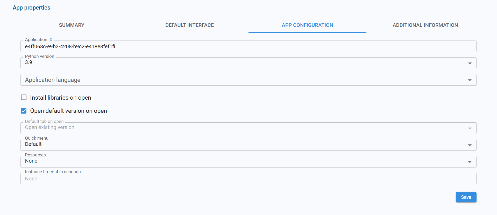

| Option | Description |
|---|---|
| **Application ID** | The same ID shown in the Summary. Used for virtual environment, workflows, access restrictions, AI assistants, and thumbnails. |
| **Python version** | Python version the app will use. If changed, the application must be reloaded. A new virtual environment is created for the selected version if it does not exist yet. |
| **CPU architecture** | Processor family the app runs on: `x86`, `ARM`, or *None* to take it from the resources in effect. If changed, the application must be reloaded: it runs on a different engine and uses a different virtual environment. |
| **Application language** | Default language for node titles, node documentation, interface titles, component titles, and menu items. |
| **Install libraries on open** | When enabled, Pyplan installs the libraries listed in `requirements.txt` every time the application is opened. |
| **Open default version on open** | When enabled, the default version opens automatically. When disabled, a version selection dialog appears. |
| **Quick menu** | Defines which interface provides the Quick menu used when navigating between interfaces. Options: Default (from the app's default interface) or From interface (choose a specific interface). |
| **Resources** | Optional resource set (CPU and memory) the application's instance runs with. It overrides the resources assigned by the user's department. If changed, the application must be reloaded. |
| **Instance timeout in seconds** | Maximum idle time before an application instance is automatically closed. |

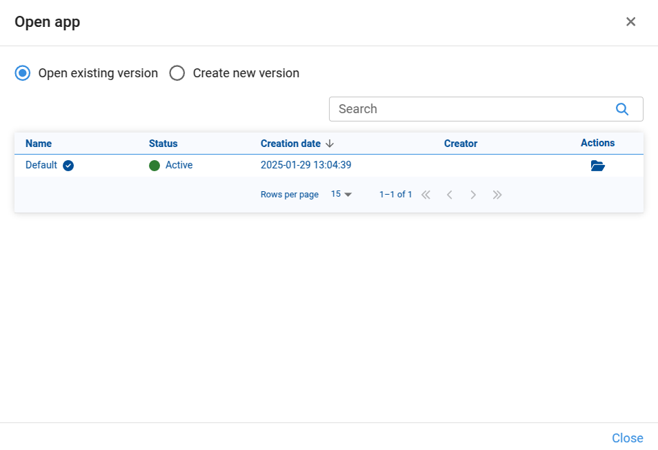

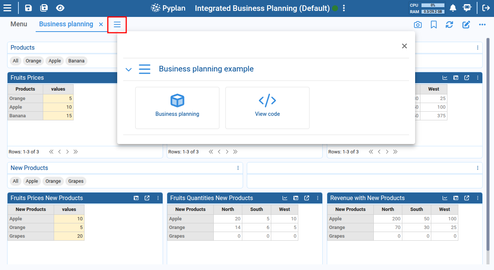

### How resources and CPU architecture are resolved

**Resources** and **CPU architecture** look related, but they answer different questions: resources define *how much* CPU and memory the instance gets, while the CPU architecture defines *which processor family* it runs on. Each one is resolved on its own.

Resources are resolved from these levels, where each one overrides the previous:

1. The resources assigned to the user's [department](../security-options.md#departments). When the user belongs to several departments, the Main Department's resources are used.
2. The app's **Resources** setting.
3. The resources chosen for a single run: *Select resources and open app* in the [application menu](../applications.md#actions-on-applications), or the **Resources** of a [scheduled task](../tools/scheduled-tasks.md).

The CPU architecture is resolved from two levels:

1. The architecture of the resources in effect.
2. The app's **CPU architecture** setting, which always prevails when it is not *None*.

So each part of the instance is decided as follows:

| | Decided by |
|---|---|
| CPU and memory | The resources in effect |
| Processor family, and the machines the app runs on | The app's **CPU architecture** when set; the resources otherwise |
| Engine and virtual environment | The same architecture as above |

:::info
Every resource is labeled with the architecture it was defined for, for example *1 CPU, 8 GB RAM (x86)*. When the app defines its own CPU architecture, that label no longer tells us where the app runs: only the CPU and memory of the resource are applied, and the app runs on the architecture it declares. An app set to `ARM` that uses the resource above runs with 1 CPU and 8 GB of RAM on ARM.
:::

:::tip
Each architecture keeps its own [virtual environment](./virtual-environments.md), so the first time an app opens after switching between `x86` and `ARM` its libraries are installed again and the app takes longer to open.
:::

## Default Settings

The **Default settings** tab lets us define default visual and behavioral settings for the entire application. These defaults act as a baseline: any component that does not define its own value for a property inherits the value set here.

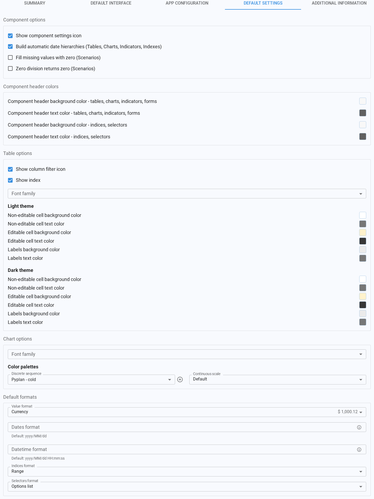

The tab is organized into five sections.

### Component options

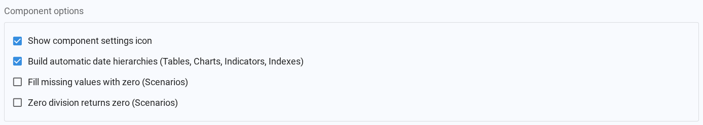

| Option | Default | Description |
|---|---|---|
| **Show component settings icon** | Enabled | Shows or hides the icon used to open the component configuration sidebar in interfaces. |
| **Build automatic date hierarchies (Tables, Charts, Indicators, Indexes)** | Enabled | When a date column is used in a table, chart, indicator or index, automatically builds a hierarchy with year, quarter, month and day levels. |
| **Fill missing values with zero (Scenarios)** | Disabled | In scenario comparison calculations, replaces missing values (null/NaN) with zero before computing the difference. |
| **Zero division returns zero (Scenarios)** | Disabled | In scenario comparison calculations, returns zero instead of an undefined value when the percentage difference has a zero denominator. |

### Component header colors

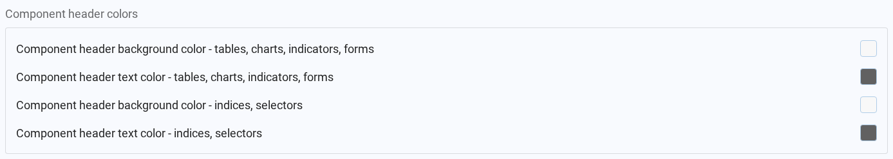

| Option | Description |
|---|---|
| **Component header background color - tables, charts, indicators, forms** | Default header background color for table, chart, indicator and form components. |
| **Component header text color - tables, charts, indicators, forms** | Default header text color for table, chart, indicator and form components. |
| **Component header background color - indices, selectors** | Default header background color for index, filter and selector components. |
| **Component header text color - indices, selectors** | Default header text color for index, filter and selector components. |

### Table options

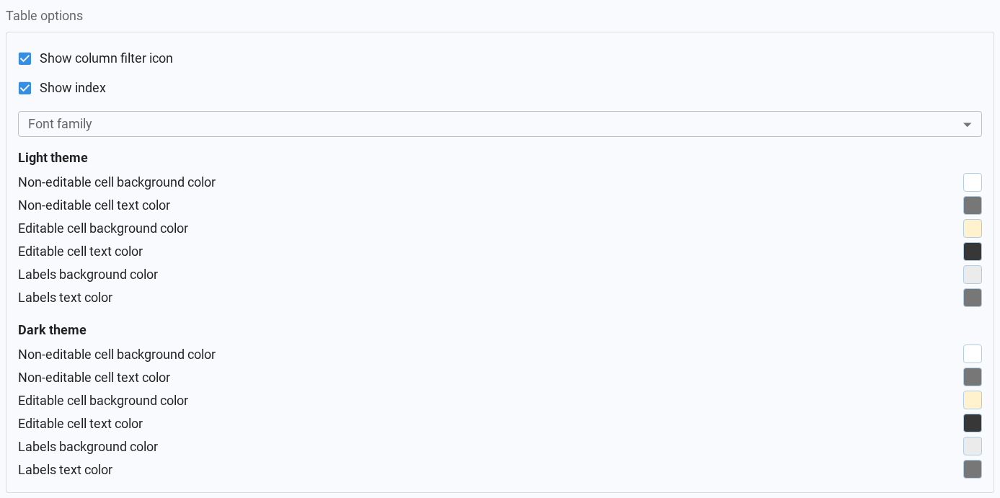

| Option | Default | Description |
|---|---|---|
| **Show column filter icon** | Disabled | Shows or hides the column filter icon in table components. |
| **Show index** | Enabled | Shows or hides the 'index' column in non-pivot tables. |
| **Font family** | Theme default | Font used to render table cells. |

Below these options, cell colors can be defined separately for **Light theme** and **Dark theme**, so tables look right regardless of the theme each user has selected. Both groups offer the same six colors:

| Option | Description |
|---|---|
| **Non-editable cell background color** | Background color for read-only cells. |
| **Non-editable cell text color** | Text color for read-only cells. |
| **Editable cell background color** | Background color for cells that accept input. |
| **Editable cell text color** | Text color for cells that accept input. |
| **Labels background color** | Background color for row and column label cells. |
| **Labels text color** | Text color for row and column label cells. |

### Chart options

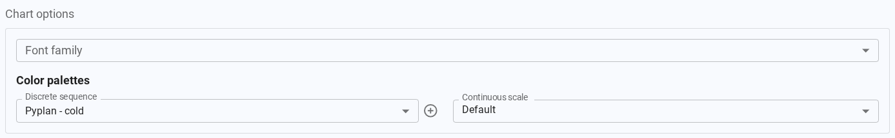

| Option | Description |
|---|---|
| **Font family** | Font used to render chart labels, legends and axes. |
| **Discrete sequence** | Default color palette applied when a chart colors its data by category. |
| **Continuous scale** | Default color scale applied when a chart colors its data by a continuous value. |

The **Discrete sequence** field also lets us manage custom palettes: the **+** button creates a new one, and when a custom palette is selected, the pencil and trash icons let us edit or delete it. Built-in palettes are marked with a chart icon and custom ones with a star.

### Default formats

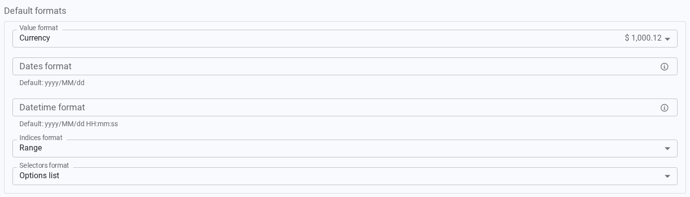

| Option | Description |
|---|---|
| **Value format** | Default value format preset (number, currency, percentage, date, etc.) for tables, charts, indicators and forms. |
| **Dates format** | Default date pattern, used only when the value format type is *date*. Defaults to `yyyy/MM/dd`. |
| **Datetime format** | Default date and time pattern, used only when the value format type is *datetime*. Defaults to `yyyy/MM/dd HH:mm:ss`. |
| **Indices format** | Default format applied to indexes when they are displayed in interfaces. |
| **Selectors format** | Default format applied to selectors when they are displayed in interfaces. |

### How defaults are applied

These defaults help us maintain a consistent look and behavior across interfaces. They are only applied to components that have no explicit value of their own: if a component defines a custom value for any of these properties, the custom value always prevails over the application default.

## Additional Information

The **Additional information** tab shows extra technical details about how the app behaves when it is opened.

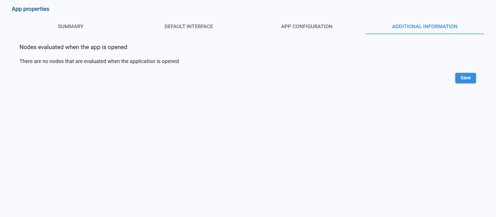

For example, it lists any nodes that are automatically evaluated at startup (e.g., pre-loading data or configuration nodes). If the message *"There are no nodes that are evaluated when the application is opened"* appears, the app does not run any node automatically at open time.

After making changes in any tab, click **Save** to apply them.
