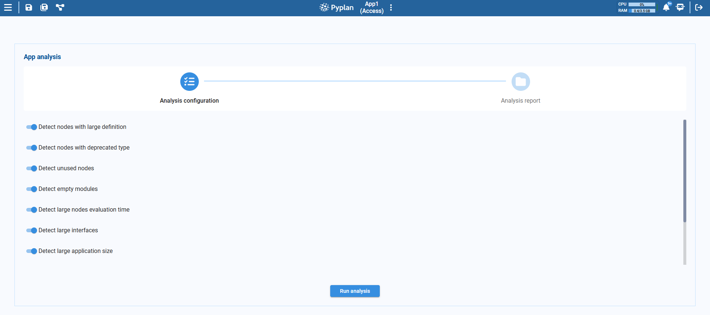
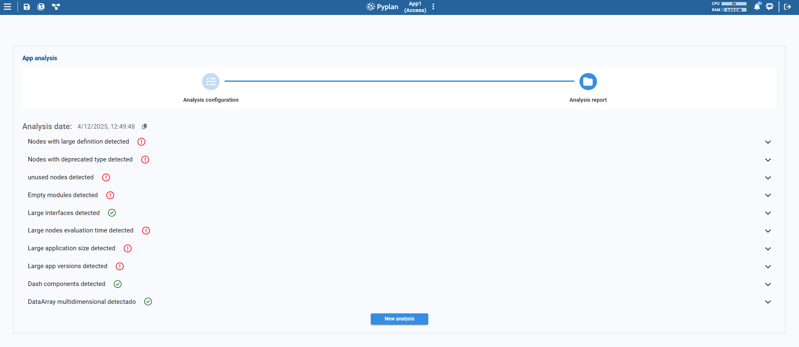
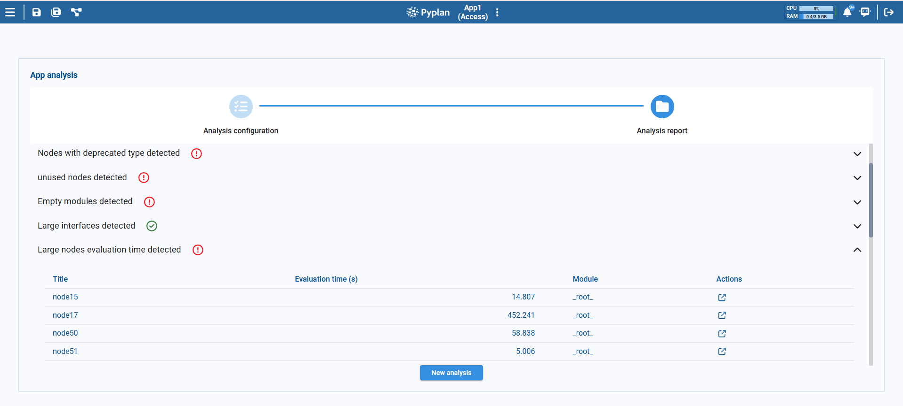

# Application Analysis

The Application Analysis feature helps you review an application to detect potential inefficiencies, outdated components, and unused elements. It provides a set of focused checks that support performance tuning, better organization, and alignment with current modeling standards.

## Analysis Options

You can run one or several analyses at the same time by selecting from the following options:

| Analysis | Description |
|---|---|
| **Detect nodes with large definitions** | Scans for nodes whose Definition code is very long (e.g., more than 50 lines) and may be hard to maintain. Reports each node with its line count and module. |
| **Detect nodes with deprecated types** | Identifies nodes that use deprecated or unsupported node types. Reports the node title, type, and module. |
| **Detect unused nodes** | Finds nodes that are not used by any other node and are not referenced by interfaces. These can often be removed to reduce clutter. |
| **Detect empty modules** | Highlights modules that contain no nodes. These can be safely deleted to simplify the application structure. |
| **Detect nodes with large evaluation time** | Identifies nodes that take a long time to evaluate. Results are grouped into: **Medium** (5–10 seconds) and **High** (more than 10 seconds). |
| **Detect large interfaces** | Analyzes interfaces with many components: **Medium** (10–15 components) and **High** (more than 15 components). |
| **Detect multidimensional DataArrays** | Locates nodes whose result is a multidimensional `DataArray`, especially those exceeding a specified dimension threshold. |
| **Detect large application size** | Flags the application when its total size on disk is greater than 1 GB. |
| **Detect large app versions** | Highlights specific application versions that occupy a lot of disk space (more than 200 MB). Reports each version with its path and size. |

:::tip
Before running the analysis, make sure that the main nodes have been executed. Some checks, such as Detect nodes with large evaluation time, rely on execution data to produce accurate results.
:::

## Detailed Reporting

Each selected analysis produces a detailed report listing the relevant nodes, modules, or interfaces, helping you quickly locate issues and providing concrete, actionable information.

The results are organized as follows:

- A summary area shows all the reports generated for the selected options, grouped by analysis type.
- Each section can be expanded to see the detailed list of items flagged by that analysis.

:::info
Reports are stored locally in the browser. You can keep up to five reports in total. Each report is associated with an application ID and version, so results remain relevant to the exact version analyzed. For a given application version, only the most recent report is kept — but you can store reports for different applications or for different versions of the same application simultaneously.
:::
