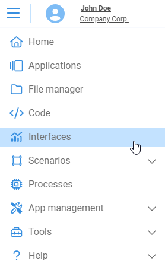
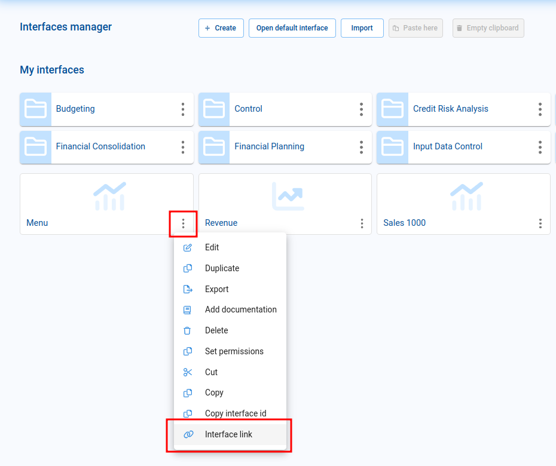
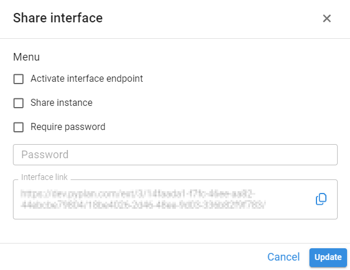
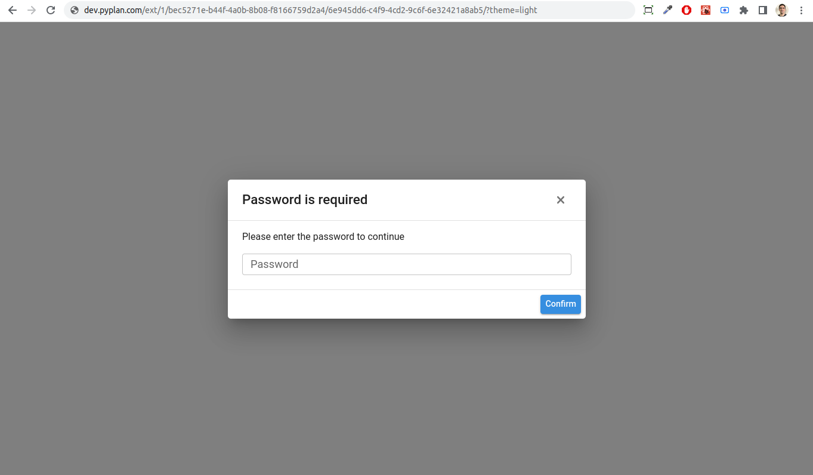
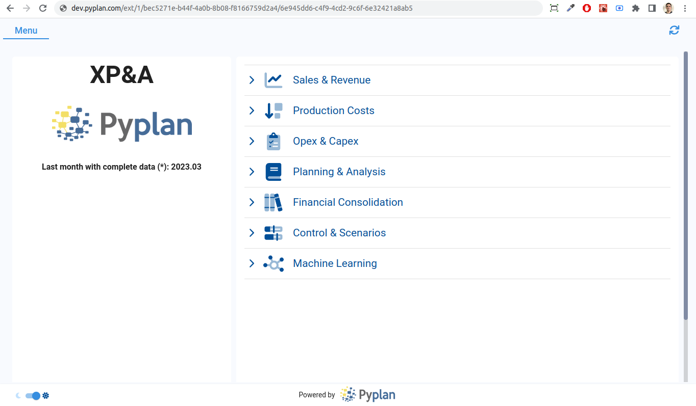
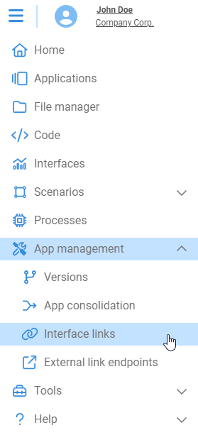
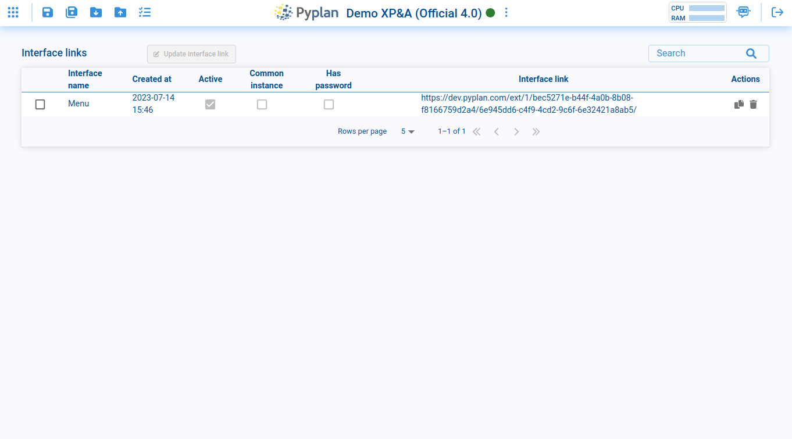
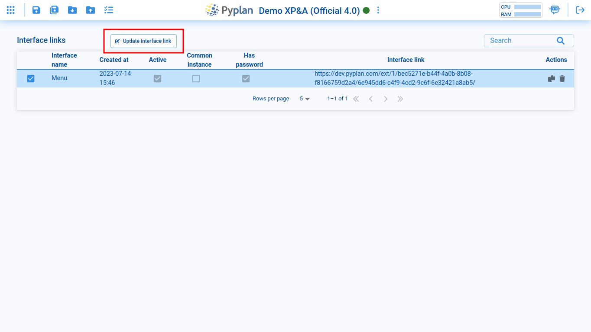
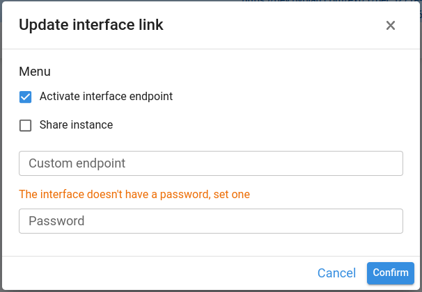

# Interface Links

Interface links allow access to an interface of a given application using a link (or a link + a password).

Users accessing the interface through an Interface link only have permissions to view that specific interface and any other interfaces they can navigate to through the application menu, if it is present in the original shared interface.

## Creating an Interface Link

To create an interface link, go to the **Interfaces** section.

Select the interface you want to share, click on the interface options, and choose the **Interface link** option.

The following window will be displayed:

- **Share instance**: when enabled, multiple users using this link are served from the same instance without creating a new one for each user. Disabling this option makes each user create a new instance.
- **Password**: you can add a password that will be required when loading the link. Save this password securely — it will not be visible once created. You can only replace it with a new one or remove it.

The URL in the window is the link you can share with non-Pyplan users. You can customize the default theme by adding the `theme` parameter at the end of the URL with values `"light"` or `"dark"`.

## Using an Interface Link

To use the Interface Link, copy and paste it into the address bar of your web browser.

If a password has been set, it will be prompted when you access the link.

After a few moments, the shared interface will be displayed.

## Interface Links Manager

In the **Interface links** section, you can edit and delete the created Interface links for the current application.

To edit an Interface Link, select the link and click the **Update interface link** button.

The following options are available:

| Option | Description |
|---|---|
| **Activate interface endpoint** | Allows enabling/disabling the link entirely. |
| **Share instance** | Allows enabling/disabling the sharing of the instance when multiple users access the link. |
| **Custom endpoint** | Allows assigning a personalized name to the shared link. |
| **Password** | Allows entering a password that will be required when loading the link. Save this password securely — it cannot be viewed again after creation, only replaced or removed. |
