# Translations Manager

The Translations Manager in Pyplan allows you to efficiently manage translations within the platform, ensuring that nodes, interface elements, and components are accessible in multiple languages.

## Configuring Translations

Before adding translations to an application, you must first set a default language in the application properties:

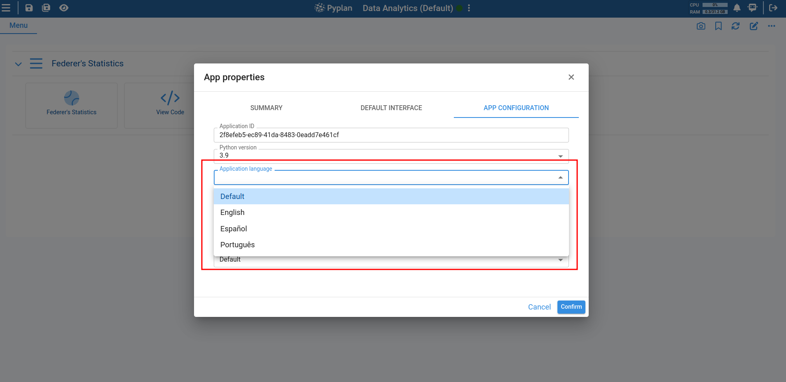

This enables translations for the following elements:

- Nodes
- Interfaces
- Interface components
- Menu components

### Nodes

To translate the node title, go to the node properties and navigate to the **Translations** tab. There, you can specify the corresponding translations for the node title:

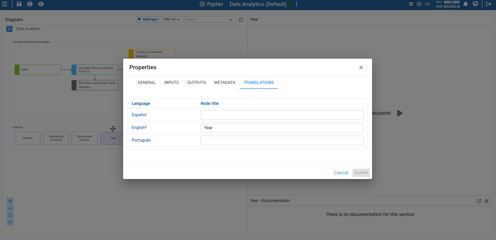

To translate the node documentation, access it the same way as the regular node documentation. The documentation editor will have three tabs, each corresponding to a different language.

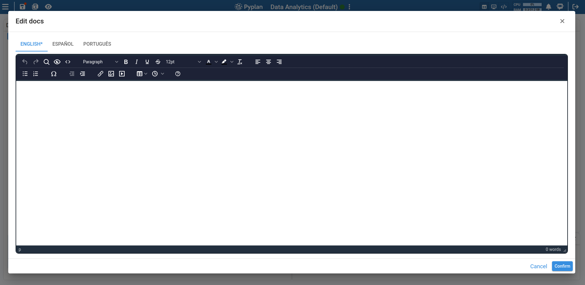

### Interfaces

To translate the interface name, access the Interface Manager and open the interface editor. Navigate to the **Translations** tab to enter translations.

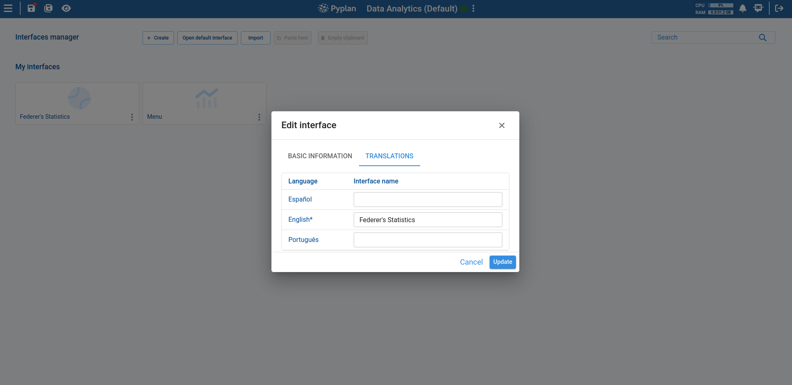

For interface documentation translation, the process is the same as for nodes.

### Interface Components

Custom titles for components are modified from the interface component editing section, within the general settings.

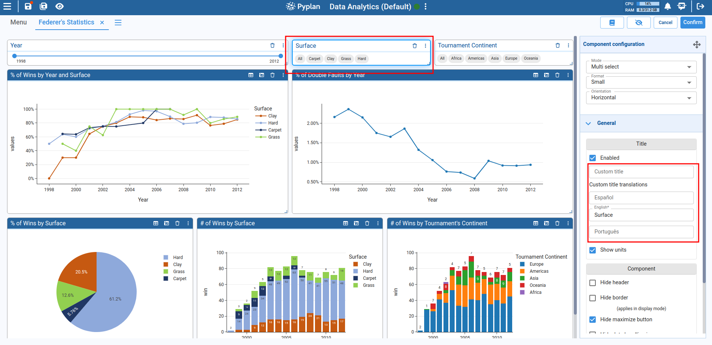

### Menu Components

**Item text and item subtitles:**

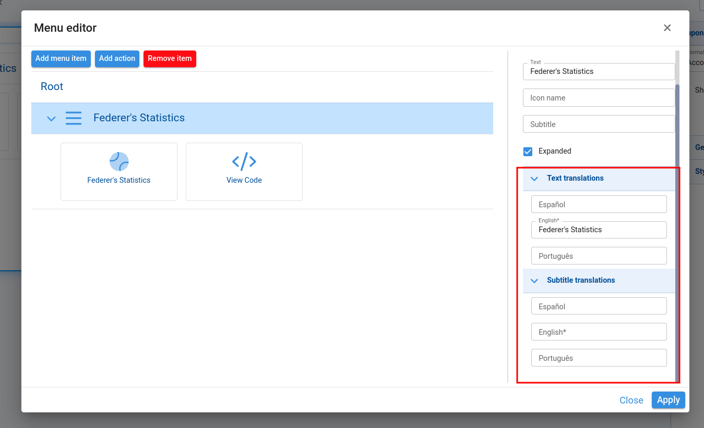

**Action text and action subtitles:**

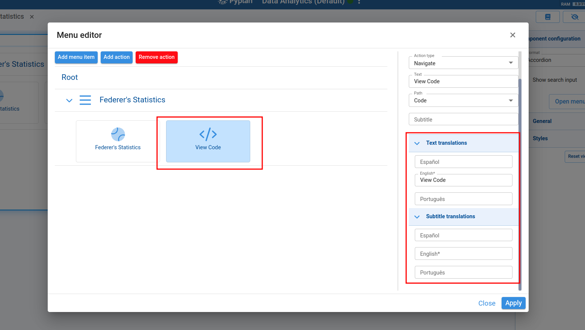

## Using the Translations Manager

To unify translation management, the Translations Manager was created. This tool lists all translatable items within the application.

To access the Translations Manager, go to **App Management → Translations Manager**:

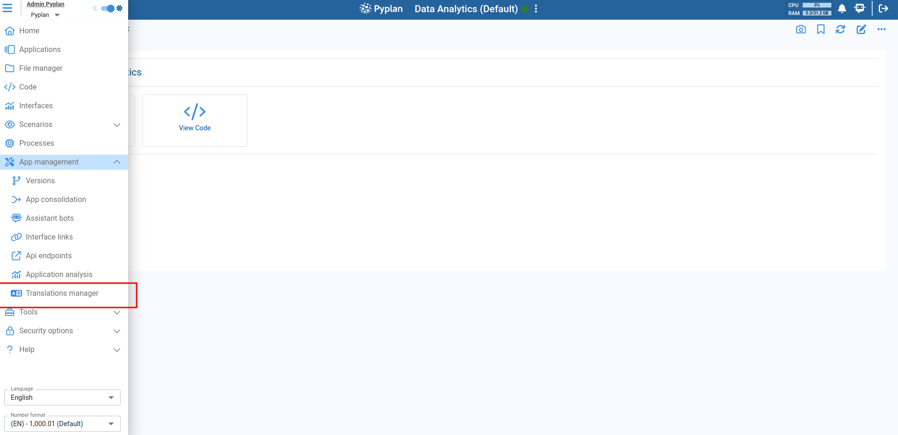

Items are categorized into Nodes, Interfaces, Components, Menu Item Text, Menu Item Subtitles, Menu Action Text, and Menu Action Subtitles.

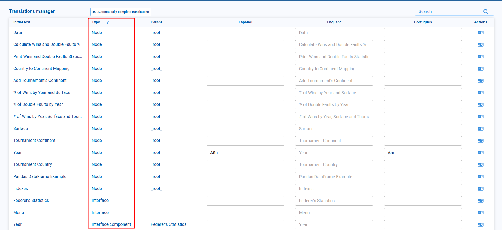

Each row contains a default language column (disabled) and additional columns for other translatable languages. The default language column is automatically populated with values from the respective field.

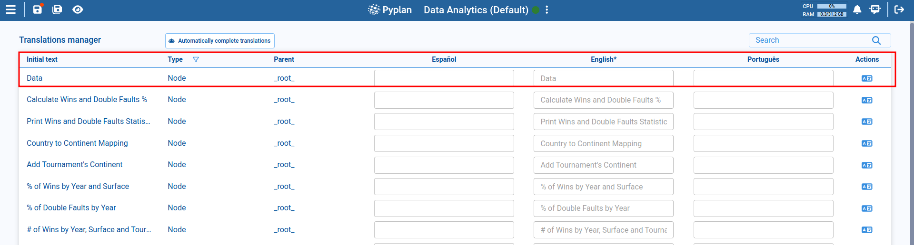

## Manually Editing Translations

Type translations in the available fields. When you finish editing a field and click outside of it, the value is automatically saved in application memory. These values are not permanently saved until you click the **Save App** button.

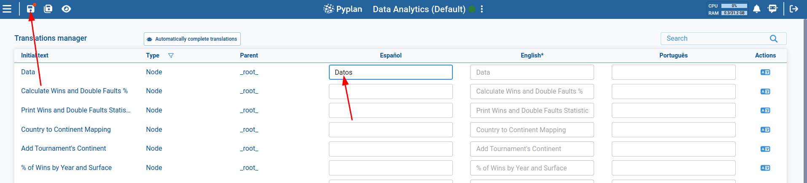

## Automatically Translating Items

Click the translation icon in the **Actions** column to automatically translate only the selected item.

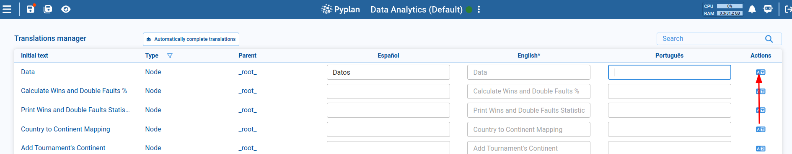

## Filtering and Searching Items

The **Type** column allows you to filter items by category (Nodes, Interfaces, Components, etc.).

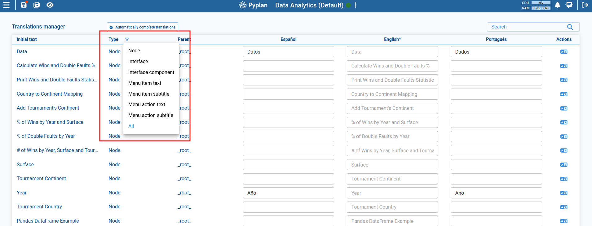

You can also search by initial text or parent text to find specific items more easily.

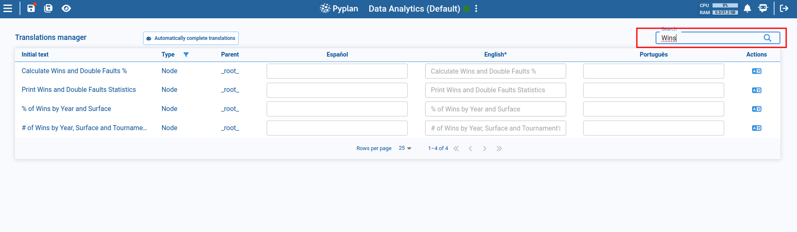

## Automatically Translating Multiple Items

To automatically translate all filtered items, click the **Automatically complete translations** button.

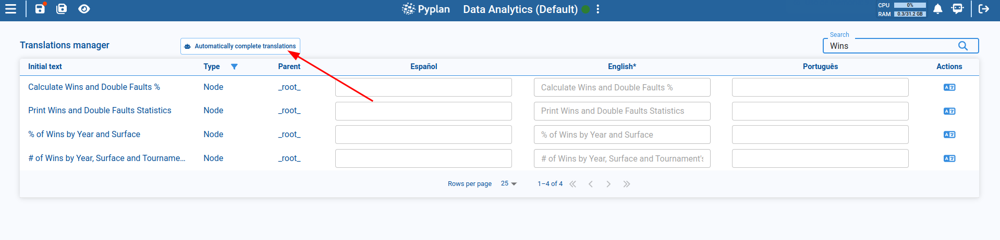

A dialog will appear showing the number of elements of each type that will be translated.

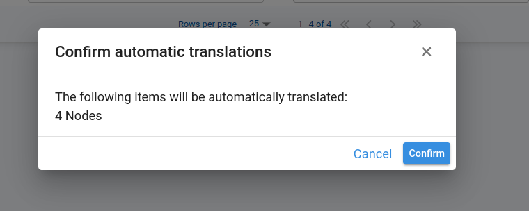

Once confirmed, automatic translations will be generated. These translations will not be permanently saved until you click the **Save App** button.

## Editing Documentation Translations

The Translations Manager also allows you to edit and add translations for interface and node documentation. This feature is only available for items that already contain existing documentation.

Items with documentation will display an additional icon in the Actions column to open the Documentation Editor.

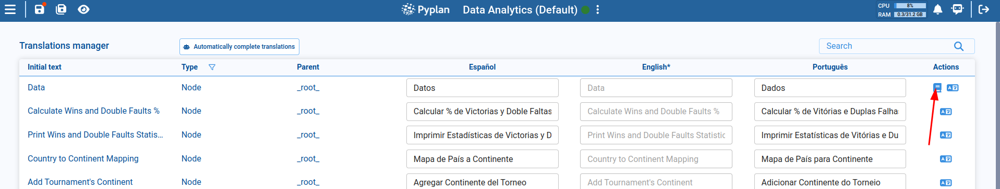

## Viewing Translated Items

To view the translated items, set the desired user interface language from the main menu.

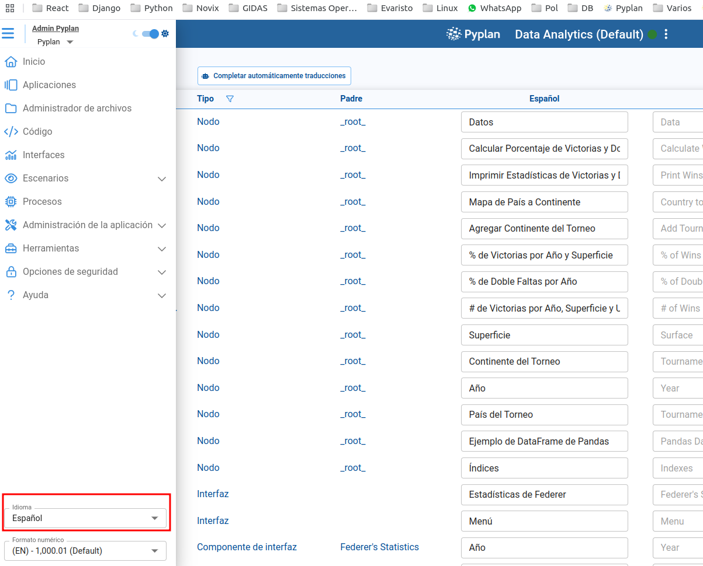

All items now display their titles in the selected language.

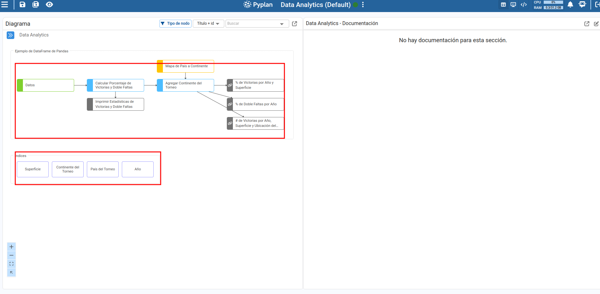
