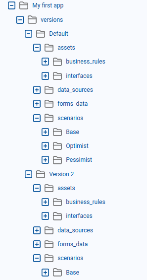
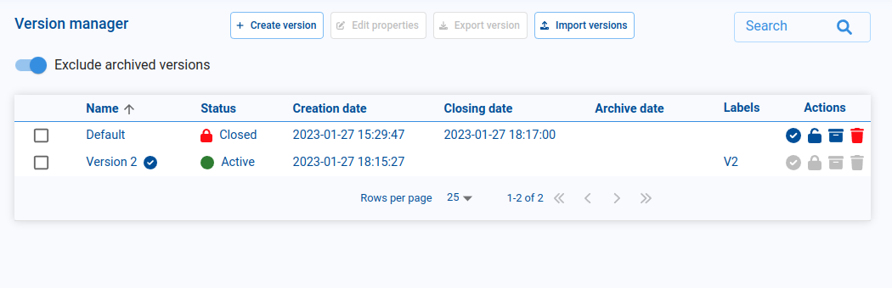
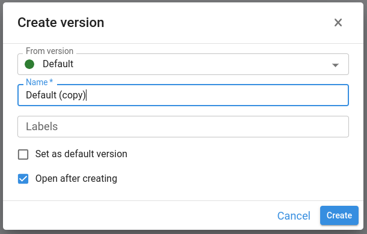

# Versions

When we create an application, Pyplan automatically creates a default version. Every time we open the application, we are always working in one specific version, which is shown in the top bar next to the app name.

An application can contain multiple versions. Each version is a complete snapshot of the app that includes:

- Calculation logic (nodes and influence diagrams)
- Interfaces
- Scenarios
- Data and form definitions
- Other input elements and configuration

The structure of an application is as follows:

Versioning can be used in different ways, for example as part of a development cycle (dev / test / prod), or to manage planning cycles (one version per period, scenario, or plan).

:::info Concurrent use
Two users can work (and save changes) at the same time on different versions of the same application, without interfering with each other.
:::

## Version Manager

To open the Version Manager, go to the main menu and click **Versions**.

From the Version Manager you can:

- Create new versions.
- Edit version properties (name, tags, status).
- Export and import versions.
- Change the status of a version (Active, Closed, Archived).

### Creating a New Version

To create a new version, click **Create version** in the Version Manager.

A dialog opens where you configure:

- **Base version**: every new version is created from an existing one, so all content of the selected base version is copied to the new version.
- **Name**: the name of the new version.
- **Tags**: optional labels to help search and organize versions (type a tag and press Enter to add it).
- **Set as default version**: if enabled, this new version becomes the default version that opens when the application is launched.
- **Open after creating**: if enabled, the new version is opened immediately after creation.

Click **Confirm** to create the version.

## Version Status

Each version can have one of the following statuses:

| Status | Description |
|---|---|
| **Active** | The version is in use and can be modified. Typically used for ongoing development or planning cycles. |
| **Closed** | The version is locked. It remains visible in the lists, but no further changes can be made. Useful for freezing a version at the end of a cycle while still allowing users to open and review it. |
| **Archived** | The version is closed and archived. It cannot be modified and is hidden from the main listings, helping keep the Version Manager clean while still preserving historical versions for audit or reference. |

By combining versions and statuses, you can manage the full lifecycle of an application — from development and testing to locked and archived snapshots — while allowing multiple users to work safely in parallel on different versions.
