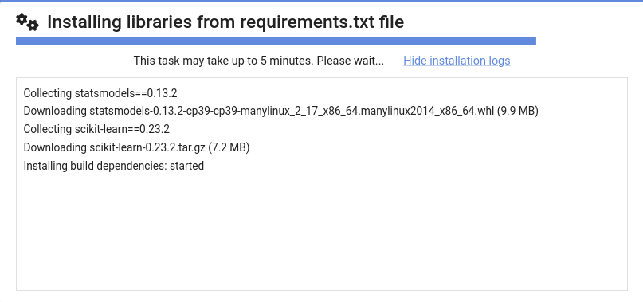
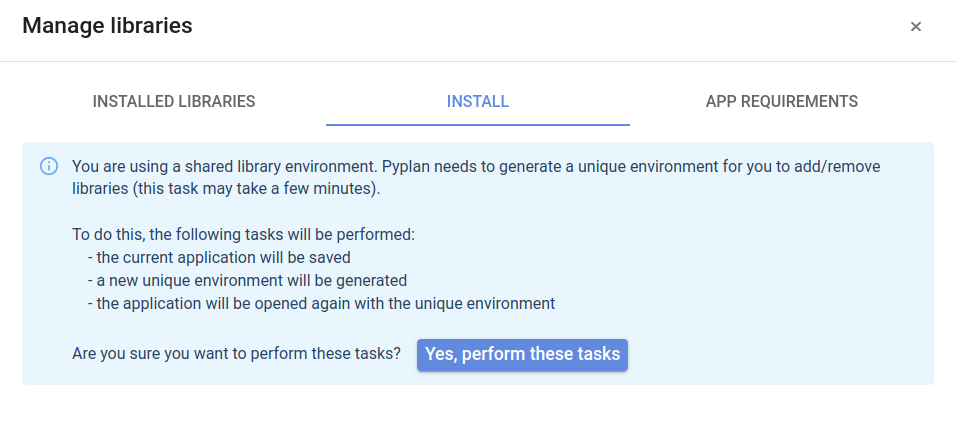
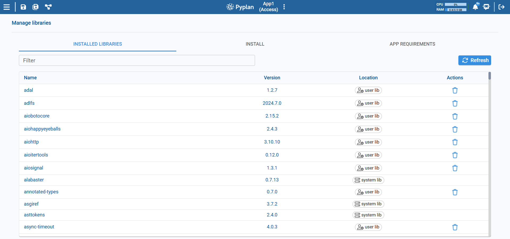
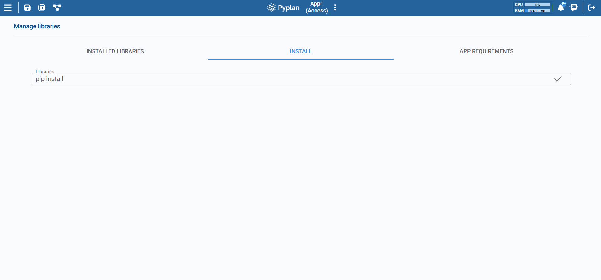
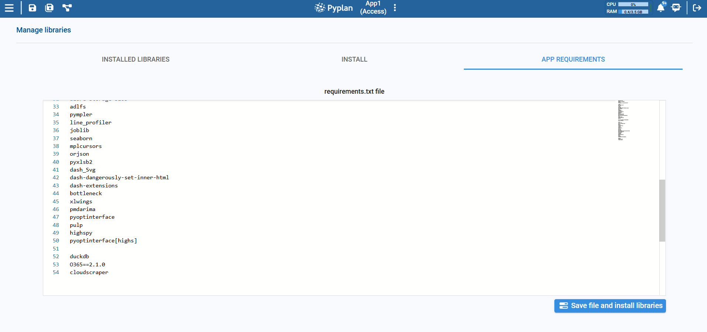

# Virtual Environments

Virtual environments in Pyplan are dedicated spaces where the Python libraries required by each application are installed. Pyplan automatically manages these environments and loads the appropriate one every time an app is opened.

From Pyplan 3.3.1 onward, each application has its own virtual environment. This allows every app to maintain its own set of libraries, simplifying dependency management and ensuring an isolated, reproducible runtime.

## Operation

All virtual environments are stored in the `.venvs` folder, located either in the Public area or within a user's workspace. Within `.venvs`, environments are also organized by CPU architecture. This means an app running on `x86` mounts a different environment than the same app running on `ARM`, ensuring that all libraries remain compatible with the system's underlying architecture.

There are three main scenarios:

### 1. App opened from Public — environment does not exist yet

Pyplan creates a new virtual environment for the app. This process can take a few minutes. You can monitor its progress using **Show installation log / Hide installation log**.

### 2. App opened from Public — environment already exists

Pyplan mounts the existing virtual environment and compares the installed libraries with those listed in `requirements.txt`. If there are missing libraries, Pyplan installs them automatically.

### 3. App opened from user workspace

- If a virtual environment for that app already exists in the user workspace, Pyplan mounts it.
- If it does not exist locally, Pyplan tries to mount the corresponding environment from Public.
- If no environment exists in Public either, Pyplan creates a new environment in the user workspace.

In scenario 3, when the app is opened from the user workspace but the environment is still being used from Public, trying to change libraries (via `pip install` or by editing `requirements.txt`) triggers a warning message.

This message indicates that, to modify libraries, Pyplan must first create a dedicated environment in the user workspace. The process starts automatically when you click **Yes, perform these tasks**.

:::warning
Run this action only if you really need to add or modify libraries.
:::

## Installing Libraries

Manage an application's Python libraries from **Manage libraries**, which contains three tabs: **Installed libraries**, **Install**, and **App requirements**.

The **Installed libraries** tab lets you review what is currently installed and remove packages using the trash icon. When you add or remove packages through the UI, Pyplan updates `requirements.txt` automatically.

### 1. Install Library

1. Open **Manage libraries → Install**.
2. In the Libraries field, type the name of the package to install (e.g., `pandas`, `scikit-learn==1.4.0`).
3. Confirm the action using the check icon.

Pyplan installs the package into the current virtual environment.

### 2. Edit requirements.txt

1. Open **Manage libraries → App requirements**.
2. The editor shows the current content of `requirements.txt` (one library per line).
3. Add, remove, or change packages and versions as needed.
4. Click **Save file and install libraries** to save the updated file and install/update libraries.

:::tip
The complete set of libraries an application depends on is defined in `requirements.txt`. This file is automatically regenerated when you install a library from the Install tab or remove one from Installed libraries.
:::

## Application ID

Each Pyplan application has a unique **Application ID**, visible in **App properties** under the Summary or App configuration tab.

- The ID is generated automatically when a new application is created.
- It is used to link the application with its virtual environment and other resources (workflows, access rules, thumbnails, etc.).

:::caution
If you copy an app manually (e.g., duplicating folders) and reuse the same ID, both apps will point to the same environment, which can cause conflicts. Use **Create from** to create a new app from an existing one — this creates a new app with its own unique ID.
:::

## Using Environments for the First Time

When you open an application created with a Pyplan version prior to 3.3.1, Pyplan needs to create a new virtual environment for it the first time.

- This creation happens automatically when you open the app.
- The time required depends on the number and size of the libraries defined in `requirements.txt`.

Once the environment is created and libraries are installed, subsequent opens of the application will reuse the same environment, making loading much faster.
