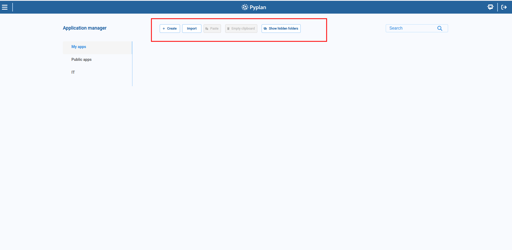
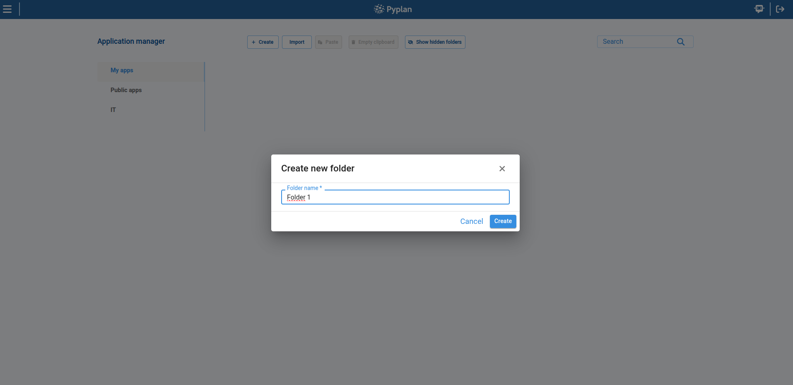
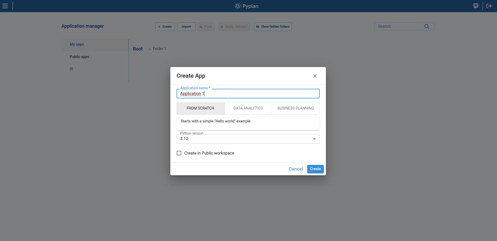
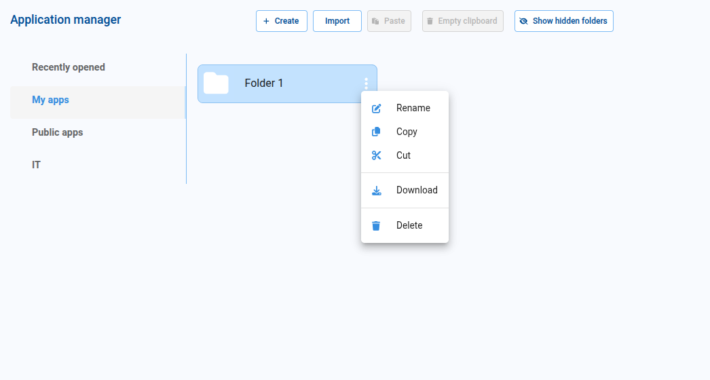
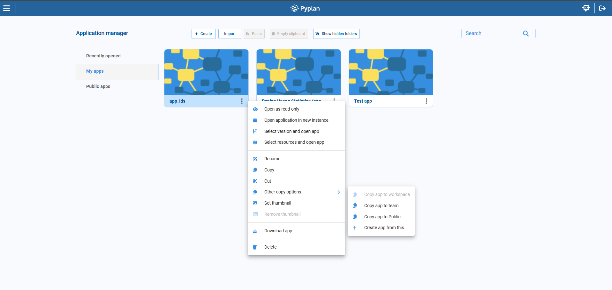
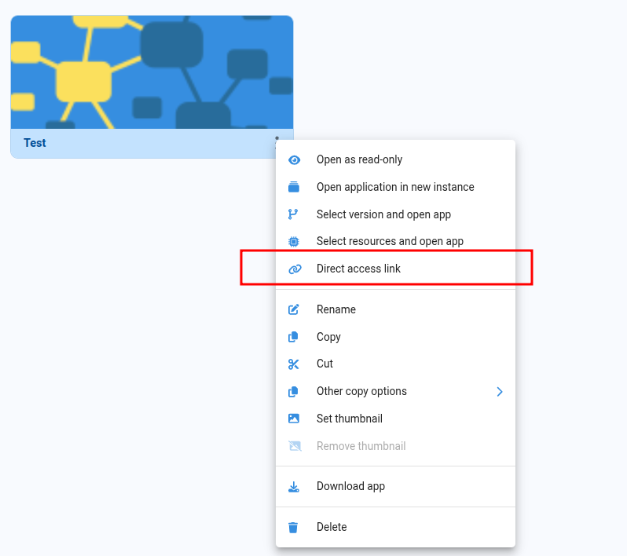
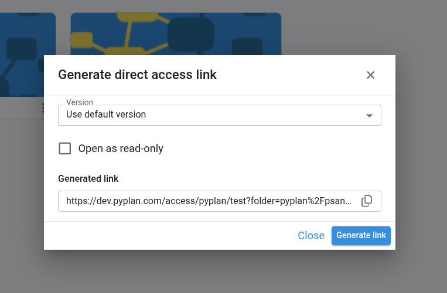
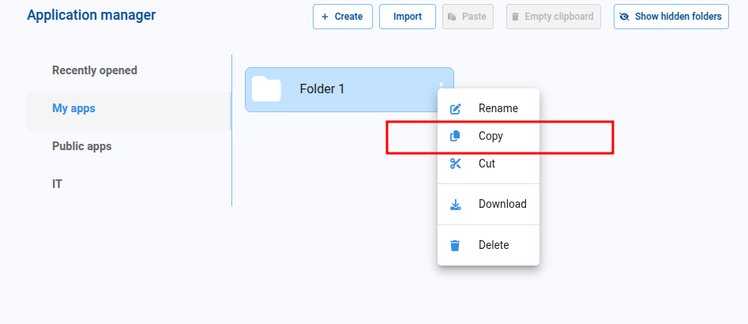
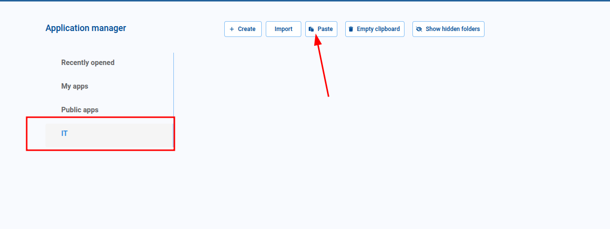
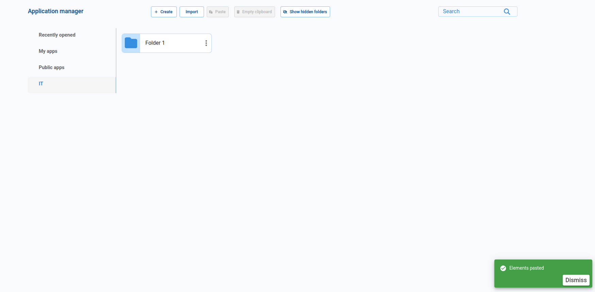

# Pyplan Application

A Pyplan application is built to solve a specific business problem by combining different capabilities of the platform. Using Pyplan, we can design applications for, among others:

- Demand planning
- Sales & Operations Planning
- Financial planning
- Pricing
- Budgeting and planning
- Forecasting

Each application brings together data, logic, and user interfaces to support a particular decision-making process.

## Application Elements

A Pyplan application usually includes several core elements:

- **External data sources:** Components that let us import data from different systems or files.
- **Data input forms:** Interfaces where users can enter or adjust input data.
- **Calculation and processing modules:** Logic that performs computations, transformations, and other data processing tasks.
- **Visualization interfaces:** Dashboards, charts, and tables that present results and insights in a clear, visual way.

> All these elements are organized and executed within a workspace.

## Workspaces

Users with permission to create applications have access to different types of workspaces:

- **Public workspace:** A shared area where applications are visible and accessible to all users.
- **My workspace:** A personal, private area where we can create, modify, and test our own applications.

> We can also access team workspaces, called **Teams**, to share applications and information with a restricted group of users.

## Teams

Teams are configured by system administrators. Access to each Team is defined by the **Department** (or departments) associated with each user.

A user can belong to multiple Departments, and therefore have access to multiple Teams and their corresponding applications.

## Application Manager

The **Application Manager** is the main interface for navigating, organizing, and managing the applications we can access. It provides tools not only to open applications and folders, but also to create, import, organize, and perform actions according to our permissions.

In the Application Manager we work on a mosaic of application cards and folders. From here we can:

- Create new applications or folders
- Import applications
- Show hidden folders (when we have permission)
- Manage our own applications and folders
- Manage Teams applications and folders
- Manage Public applications and folders
- Browse and search through all accessible applications

We can create both **applications** and **application folders** directly from the Application Manager.

To create a new application or folder, we click the **Create** button and choose:

- **Create App** – creates a new, empty application that we can later configure and edit.
- **New Folder** – creates a folder that can contain multiple applications and/or subfolders.

If we select **New Folder**, a dialog opens where we enter the folder name. The location of the new folder is determined by:

- The current tab selected (for example, _My apps_ or _Public apps_), and
- The current path, if we are already inside another folder.

The same logic is used when we create new applications.

### Actions on folders

For folders, we can perform the following actions:

- **Rename**
- **Copy**
- **Cut**
- **Download**
- **Delete**

### Actions on applications

For applications, we can perform the following actions:

- **Open as read-only:** open the application in read-only mode so no changes can be made.
- **Open application in new instance:** open the application in a separate instance, useful for working in parallel on different apps or versions.
- **Select version and open app:** choose a specific version of the application and open it, for example to review or reuse an earlier version.
- **Select resources and open app:** open the application with a specific set of resources, different from those assigned by our Department.
- **Direct access link:** generate a direct link to open the application, optionally selecting a version and enabling read-only access.
- **Rename**
- **Copy**
- **Cut**
- **Other copy options:** copy the application to another location, copy it to a Team or to Public, or create a new app from the existing one.
- **Set thumbnail:** assign a custom thumbnail image to the application.
- **Remove thumbnail:** remove the custom thumbnail and return to the default image.
- **Download**
- **Delete**

### Direct access link

We can generate a **direct access link** from the application contextual menu to open a specific application directly. This option is useful when we need to share quick access to an app and, if necessary, point to a specific version.

To generate a direct access link, we follow these steps:

1. In the **Application Manager**, we open the contextual menu of the application.
2. We select the **Direct access link** option.
3. In the dialog, we choose whether we want to use the default version or a specific version.
4. If needed, we enable **Open as read-only** so the application opens without allowing changes.
5. We click **Generate link**.
6. We copy the generated URL and share it with the corresponding users.

:::info
The generated link includes the selected application and can also include a specific version and the read-only mode configuration.
:::

### Move folder app example

We can move applications and folders to any path where we have access.
For example, we can take an application located inside a personal folder in **My apps** and move it to an **IT** Team workspace, so that members of that Team can see and use it.

