# Analysis & Visualization

Pyplan is a no‑code / low‑code platform designed so that we can perform many data manipulation and processing tasks without writing code.

One of Pyplan's main goals is to make the calculation logic transparent. We can:

- Navigate the influence diagram to understand the flow of calculations.
- Select individual steps (nodes), execute them, and see their results.

Each node's result can be displayed either as a table or as a chart, depending on the data type and the selected view.

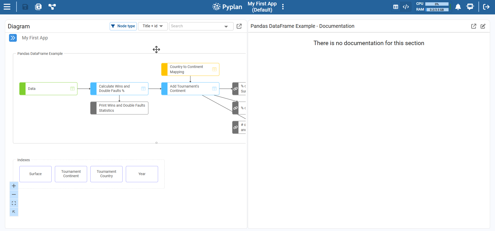

---

## Display in Table Format

By clicking on a node, we see its result panel.

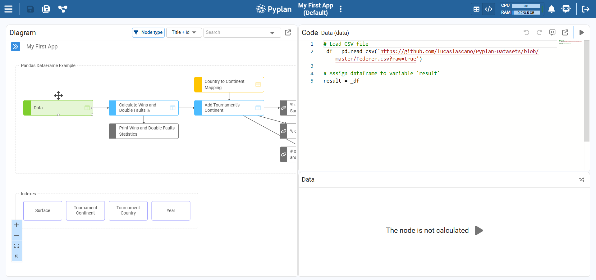

### Run the Node

To run the node, click the evaluation (Play) icon in the result area or in the node toolbar. After the node finishes executing, Pyplan displays the result as a table.

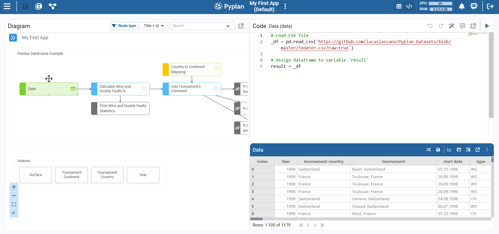

### Maximizing the Display Window

When we want to work more comfortably with a large table, we can maximize the result widget.

- Clicking the **maximize** icon (top‑right of the widget header) switches the table to maximized mode, stretching it to use all available width and height.
- Clicking **Minimize** returns the widget to its original size.

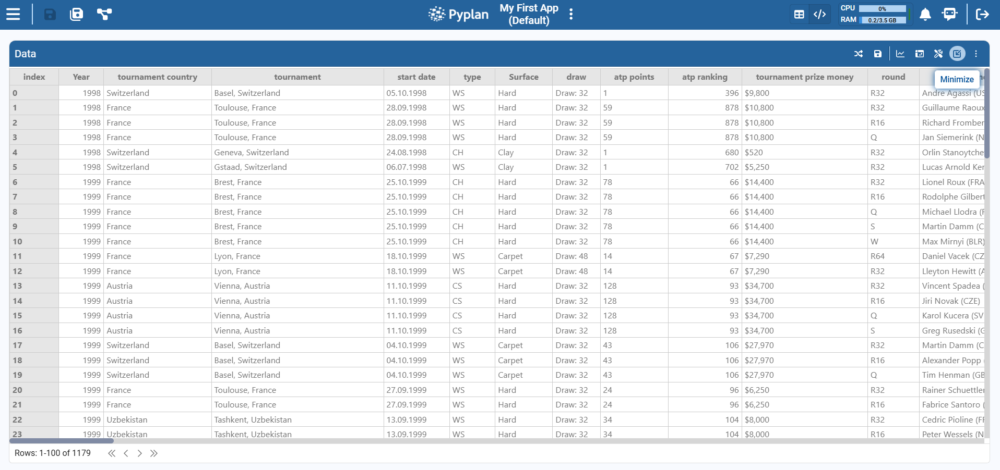

### Data Handling

Once the node result is displayed as a table, we can shape the data directly from the pivot‑style view. Click the **table configuration icon** in the top‑right corner of the result widget to access this view.

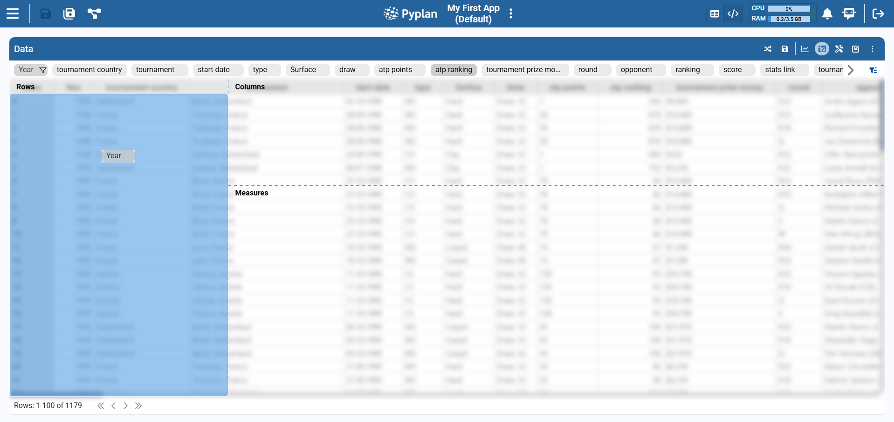

The left panel shows the **Fields list**:

- Each row corresponds to a column of the underlying DataFrame.
- The icon indicates the type (`#` for numeric, `T` for text).
- For numeric fields we also see the default aggregation (Sum, Avg, Min, Max, Count).

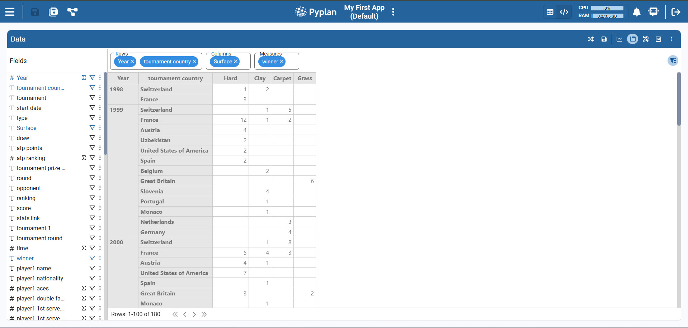

At the top of the table we see three areas — **Rows**, **Columns**, and **Measures** — which work like a pivot table:

1. Drag **dimensions** (categorical fields) from the Fields list to **Rows** or **Columns**.
2. Drag **measures** (numeric fields) to **Measures**.

Pyplan automatically rebuilds the table according to this configuration, aggregating the selected measure(s) using the chosen function.

---

## Table Format (Styles)

When we click the **Settings** icon in a table widget, Pyplan opens the table configuration panel with sections: General, Data, **Styles**, Index sync, and Scenarios.

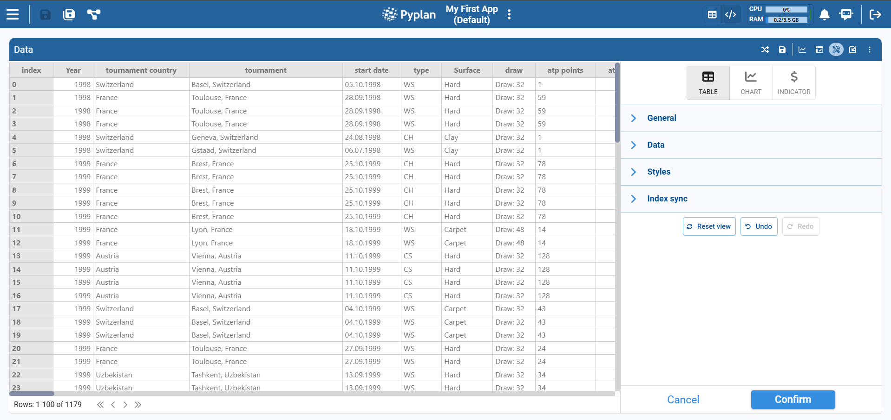

### Styles

Within the **Styles** section we control the visual appearance of the table cells.

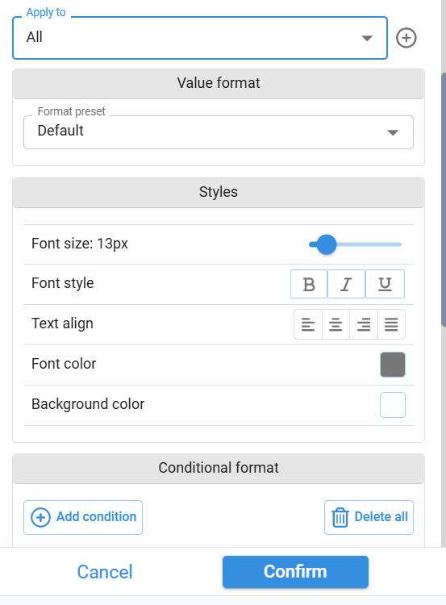

**Apply to** — Choose the scope of the style: All (entire table), a specific field, measure, or area.

**Value format** — Format preset: Default, Number, Percentage, Currency, etc.

**Styles options:**

- **Font size** — Slider to define the text size.
- **Font style** — Bold, Italic, Underline.
- **Text alignment** — Left, center, right, justified.
- **Font color** — Color picker to change the text color.
- **Background color** — Color picker to define the cell background.

#### Conditional Format

The **Conditional format** section lets us apply styles based on value‑based rules:

1. Add one or more conditions (e.g., "atp ranking < 50").
2. Choose the style to apply when the condition is met (font color, background color, bold, etc.).
3. Optionally add multiple rules for different value ranges.

#### Heatmap

The **Heatmap** option applies a color gradient to numeric values so that higher and lower values can be visually distinguished at a glance.

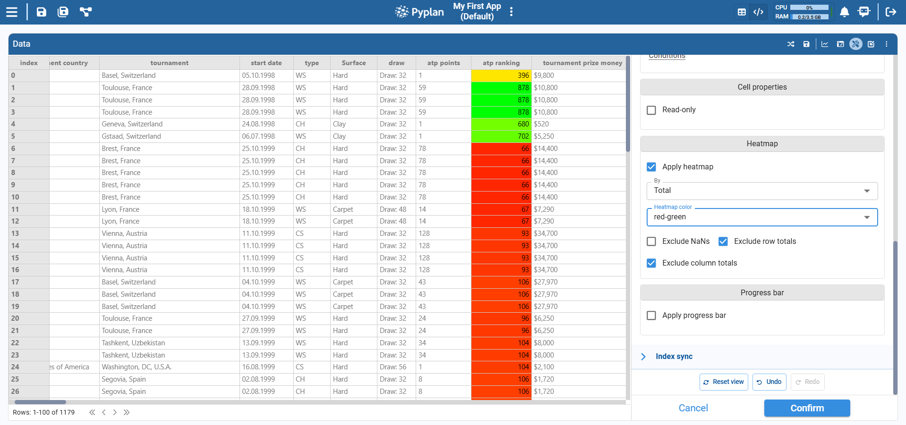

#### Progress Bar

The **Progress bar** format displays numeric values as horizontal bars inside each cell, making it easy to compare magnitudes visually.

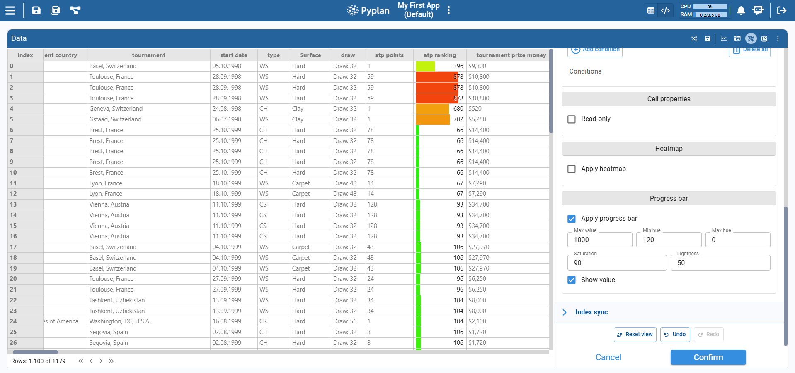

---

## Visualization in Graph Format

Clicking on the graph section switches the view from table to chart. Whenever the selected chart type allows it, Pyplan automatically assigns fields from the table to the chart.

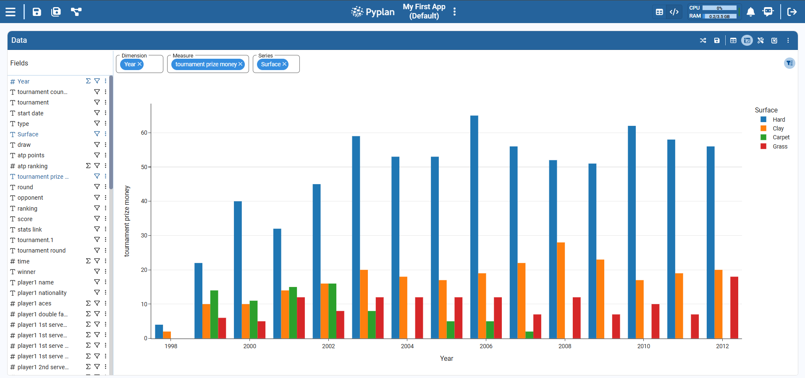

### Visualization Configuration

Pyplan supports multiple chart types to visualize data (bar, line, area, scatter, etc.). Each chart type has its own sub‑types and specific options. When we select a chart type, Pyplan automatically shows the set of properties required to build that chart (x‑axis, y‑axis, color, facet, aggregation, etc.).

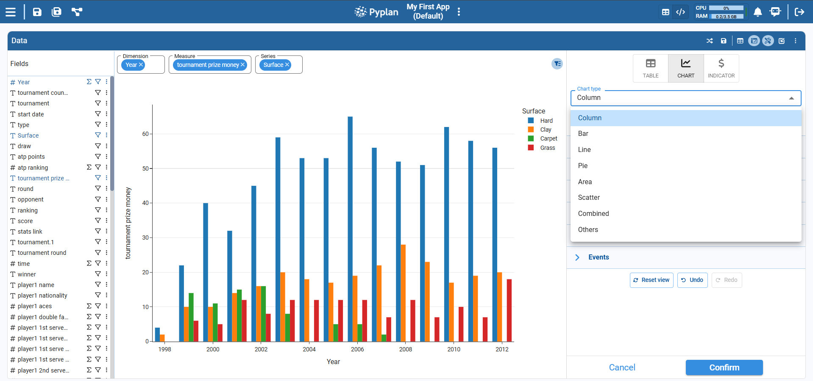

### Coding Visualizations

Many additional properties are available when we edit the component code. To customize a visualization via code:

1. In the chart widget, click the **component menu icon** (top‑right of the chart).
2. Select **Show component code**.
3. In the code panel, switch **Code** from **Default** to **Custom**.

Once set to **Custom**, we can edit the Python code that defines the Plotly Express chart to:

- Add or modify layout options (titles, legends, margins, annotations).
- Adjust colors, scales, templates, and interactions.
- Implement advanced Plotly features not available in the visual configuration.

See the full [Plotly Express documentation](https://plotly.com/python/plotly-express/) for all configurable properties.
