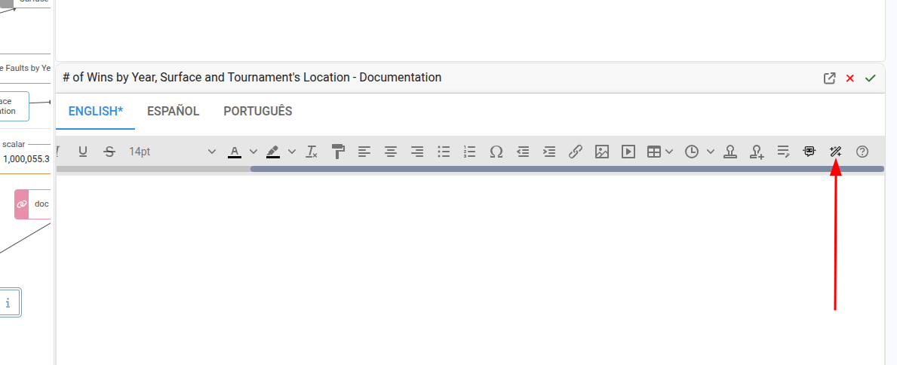
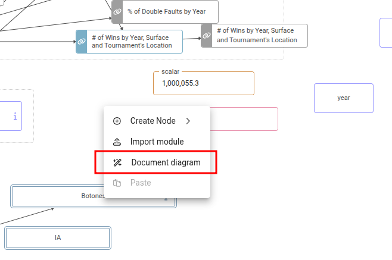
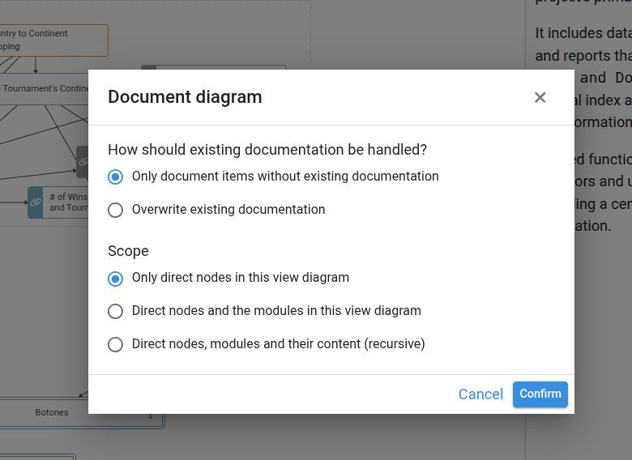
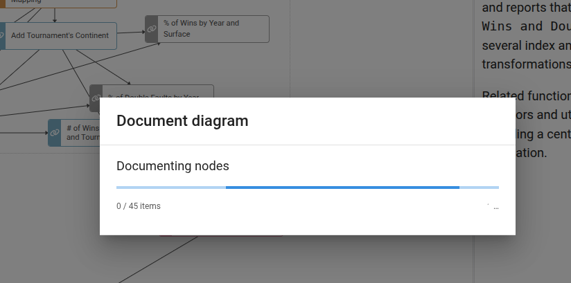
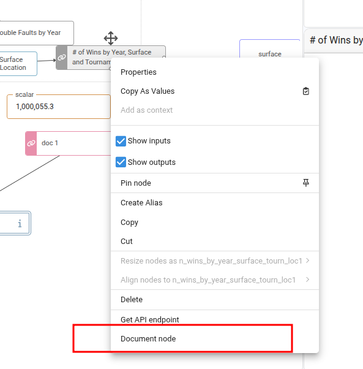
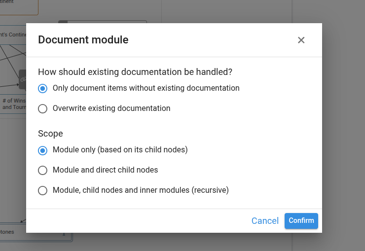

# Automatic Documentation

Pyplan can generate the documentation of nodes and modules of the influence diagram automatically. Instead of writing the description of each node by hand, we can ask Pyplan to analyze the code, the dependencies and the structure of the diagram and produce a description for us. The generated text is stored in the same **Documentation** field that we would normally edit manually, so we can review and refine it afterwards.

The automatic documentation runs in the background. While it is being generated we see a progress dialog with the current status, and the diagram is refreshed automatically once it finishes.

:::info
To generate documentation automatically, the application must have a **default language** configured in the **App properties**. If no language is configured, Pyplan shows a warning and the action is cancelled.
:::

---

## Documenting a Single Node or Module

The fastest way to generate documentation for the node we are currently working on is from the **Documentation** widget on the right side of the coding window.

When we select a node (or stand on a module) and no documentation has been written yet, the widget shows a **Generate automatically** button. Clicking it asks Pyplan to analyze the node and write its description. For a module, only the module-level description is generated; the child nodes are left untouched.

Once the description is generated, it appears in the widget and the diagram is refreshed so the documentation icon on the node is updated.

---

## Documenting the Current Diagram View

We can also document every node visible in the current diagram in one operation. To do this, we right-click on an empty area of the diagram (not on a node) and select **Document diagram** from the context menu.

A dialog opens where we choose **how** to document the view:

- **Scope** — which items in the current view to document:
  - **Only direct nodes in this view diagram** — documents the regular (non-module) nodes that are placed directly in the current view.
  - **Direct nodes and the modules in this view diagram** — also documents the modules visible in the view (using their immediate children).
  - **Recursive** — documents the modules and dives into their child nodes and sub-modules.
- **How should existing documentation be handled?**:
  - **Only document items without existing documentation** — items that already have a description are skipped.
  - **Overwrite existing documentation** — every targeted item is regenerated, replacing the previous description.

After confirming, a progress dialog shows how many items have been processed and how many failed (if any). We can keep using Pyplan in another tab while the process runs.

---

## Documenting Nodes or Modules from the Context Menu

When we right-click directly on a node (or on a group of selected nodes), the node context menu offers documentation actions tailored to the current selection:

- **Document node** — generates the description for the node we right-clicked on. Available for any non-module node.
- **Document module** — generates the description for the module we right-clicked on. Opens the same options dialog as **Document diagram**, with the three scopes (module only, module and direct child nodes, recursive).
- **Document N selected nodes** — appears when we have multiple non-module nodes selected. Documents all of them in batch.
- **Document N selected modules** — appears when we have multiple module nodes selected. Documents all of them with the chosen scope.

For modules, the dialog includes the same scope and overwrite options described above so we can decide whether to also document the child nodes of each selected module.

:::tip
For very large modules, the **Only document items without existing documentation** mode lets us re-run the process safely: previously documented nodes are kept untouched and only the missing ones are generated. This is useful to continue an interrupted run or to incrementally document a model.
:::

---

## What Pyplan Generates

For each node, Pyplan analyzes:

- The node title and identifier.
- The node code and its dependencies on other nodes.
- The position of the node inside its module.

For modules, Pyplan also takes into account the descriptions of the direct child nodes to produce a higher-level summary of the module's purpose.

The generated description is plain text written in the application language and is stored as the node or module documentation. We can edit, complete or rewrite it later from the Documentation widget like any manually written description.
