# Coding Window

## Creating the First Application

Pyplan is an integrated development environment for building analytical applications, designed so that we can model even without prior programming experience. Instead of writing all the logic in a single script, we build the calculation and data‑processing flow by dragging different types of nodes onto an influence diagram and connecting them visually.

When we click **Create an application**, Pyplan opens a dialog where we can choose whether to:

- Start **from scratch**, with an empty application, or
- Start **from an example**, using a prebuilt model as a template (Data Analytics or Business Planning).

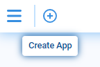

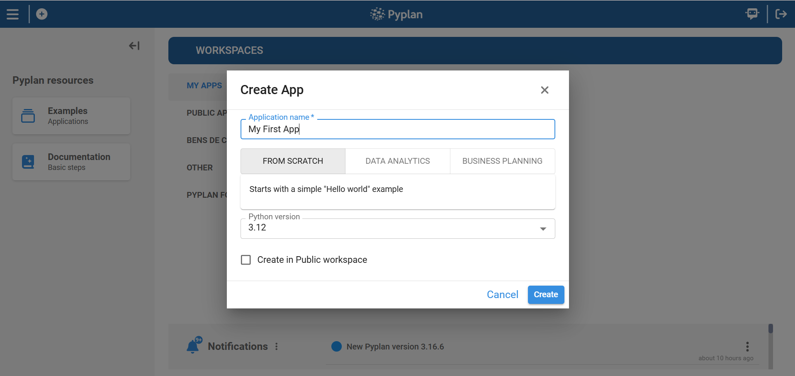

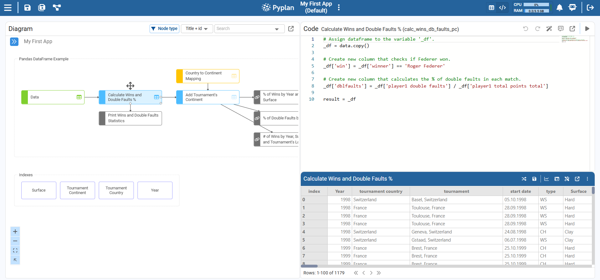

---

## Elements of the Coding Window

Once we click the **Code** icon in the main menu, we access the application's influence diagram and its coding window.

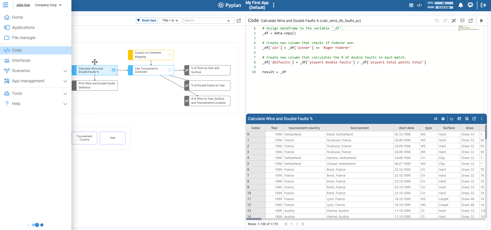

### Influence Diagram

Visual representation of the application logic. Each node corresponds to a step in the data flow (loading, transformation, calculation, output), and the arrows show dependencies between nodes. From here we can select nodes, open their coding window, and run them.

### Node Display Modes

Controls that define how the selected node is shown on the right side:

- **Result:** result widget at the top and documentation at the bottom.
- **Code + Result:** coding window at the top and result at the bottom.

### Assistant Bot

Assistant that interprets natural language questions about Pyplan. We can ask how to use features, shortcuts, or best practices directly from the modeling environment, without leaving the app.

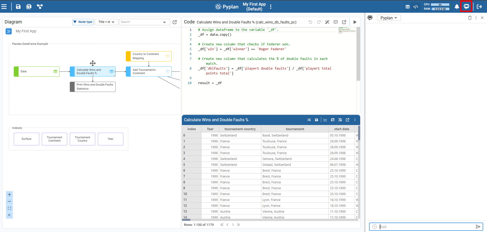

### Navigation Shortcuts

Quick links in the top bar:

- Clicking the Pyplan logo takes us to Pyplan Home.
- Clicking the application name opens the Application Home (overview of the current app).

### App Menu

The ellipsis menu to the right of the app title opens the App menu, where we can:

- Change the app version.
- Open the console.
- Take a screenshot of the current view.
- Reload the application.
- Close the application.

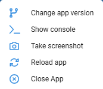

### Top‑Left Code Toolbar

**Save** — Saves the current application.

**Save as** — Opens a menu with options such as:
- Save as new version: creates a new version of the current application.
- Save application in my workspace: saves a copy of the app in My workspace.
- Save application in my team: saves a copy of the app in a Team workspace.

**Scenarios toolbar** — Opens a menu with:
- Save scenario: saves the current state of inputs/assumptions as a named scenario.
- Select scenarios: lets us choose one or more previously saved scenarios to compare or reuse.

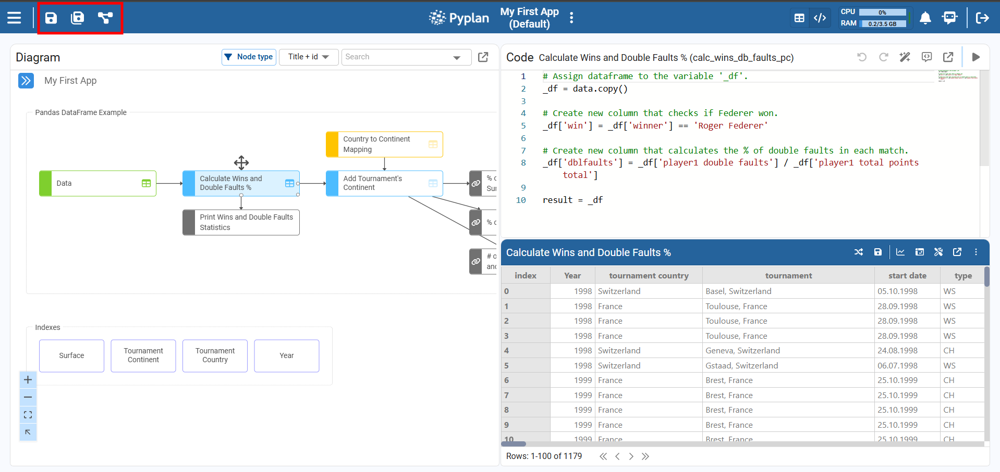

### Node‑Level Toolbar

In the top‑right of the coding area we find controls specific to the selected node, for example:

- Run the node.
- Undo/redo changes in the code.
- Expand the coding window.
- Open node tools (e.g., wizards or additional views).

---

## Features of a Node

A node is the smallest building block of the calculation process. To add a node, we drag the desired node type onto the diagram.

### Node Title

Text displayed inside the node on the diagram. It should briefly describe the purpose of the node (for example, "Company Demand" or "Revenue").

### Node Id

Unique identifier of the node, used to reference it from the Definition of other nodes.

- The Id is generated automatically from the title.
- We can edit it manually when we want a shorter or more meaningful identifier.

When writing code in the coding window, we use this Id to invoke the node.

### Unit

When a node represents a single measure, we can specify its unit (for example, USD, tons, %, hours). The unit appears in parentheses next to the title when the node's result is displayed.

:::note
Units are for display only. They do not affect calculations and are not used in any automatic unit conversion.
:::

### Evaluate on Start

When enabled, the node is evaluated automatically when the application is opened. This is useful for key inputs or summary nodes that we want to have ready before the user starts interacting with the model.

### Release Memory

When enabled, the node's result is not kept in RAM after evaluation. This helps free memory for intermediate nodes whose results are only needed once in the calculation chain.

- If another node later requires its result, the node will be recalculated.
- Typically used for heavy intermediate steps that are not directly viewed by users.

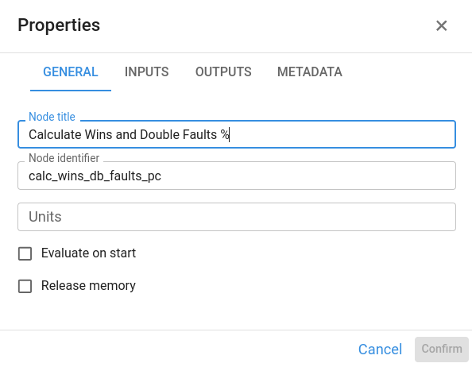

### Definition

The Definition is the transformation executed when the node is evaluated.

- It is written in Python in the node's coding window.
- The code must end by assigning the final value to the variable `result`, for example: `result = _df`

Pyplan evaluates this code when we run the node and stores the value of `result` as the node's output.

### Preview

Technical description of the node output. The Preview summarizes the structure of the result (for example, dimensions of an array, columns of a DataFrame) and is useful to quickly understand what the node returns without inspecting the full Result view.

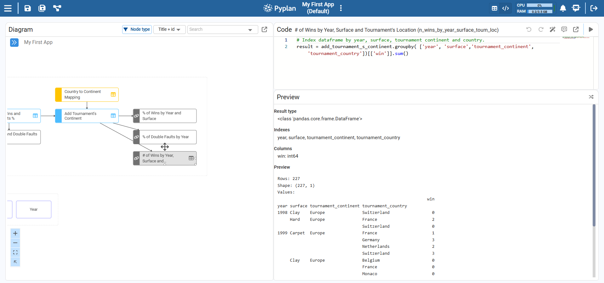

### Result

The Result is the output of executing the Definition code. When the result is a type understood by Pyplan (for example, a pandas DataFrame, a NumPy array, or an xarray object), Pyplan can display it in table format or as charts.

### Documentation

Documentation is the text that conceptually explains what a node does and how it fits into the calculation flow. It is shown at the bottom of the Result view for that node.

To add documentation:

1. Open the node from the influence diagram.
2. In the top‑right corner of the node panel, select the **Result** view.
3. The documentation panel becomes available at the bottom.
4. Enter descriptions, explanations, assumptions, or notes.
5. Save the changes using the save button in the documentation panel.

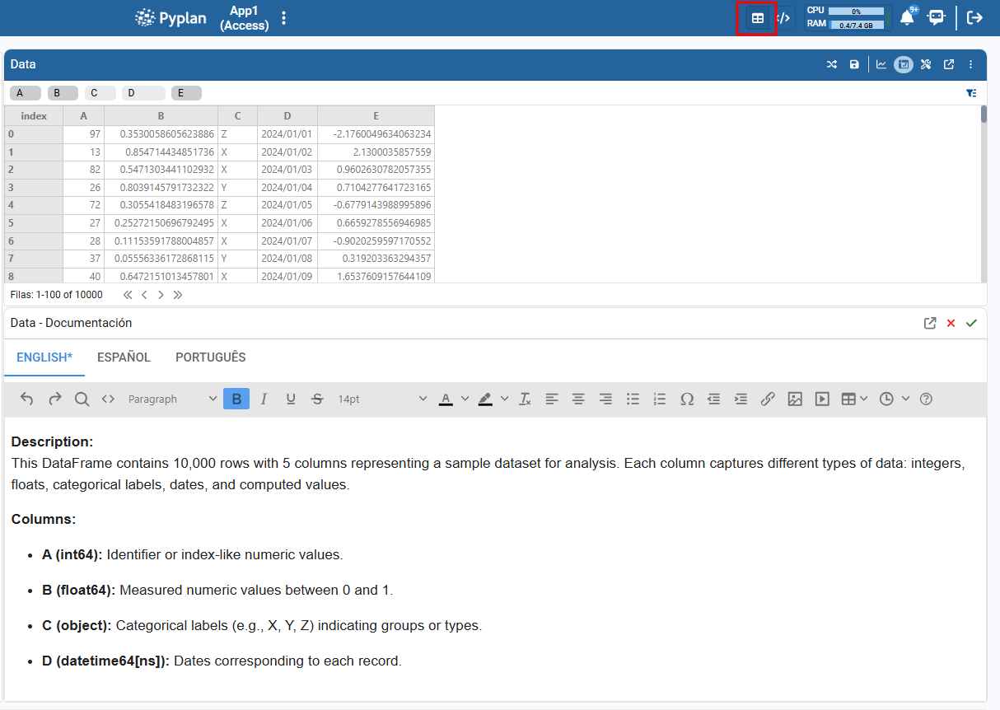

#### HTML Templates

HTML Templates allow us to save and reuse custom HTML content across our applications.

**Create an HTML template:**

1. Open the HTML editor and write or edit the content we want to save as a template.
2. Click the **Save Template** icon in the toolbar.

   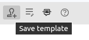

3. In the dialog that appears:

   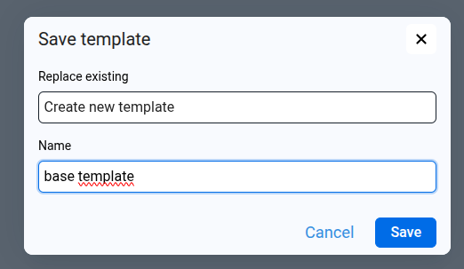

4. In the **Replace existing** selector, choose **Create new template**.
5. Enter the desired name for the new template and click **Save**.

**Use a template:**

1. Open the HTML editor.
2. Click the **Insert Template** icon in the toolbar.

   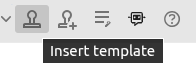

3. In the dialog, choose the template to use from the **Templates** selector. A preview is displayed below.

   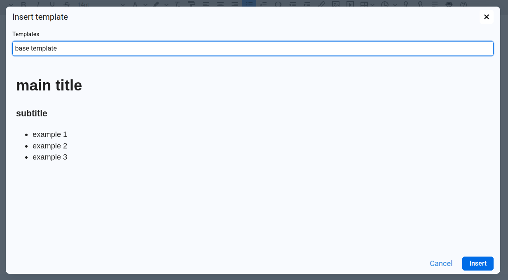

4. Click **Insert** to load the template into the editor.

**Update an existing template:**

1. Edit the HTML content to use as the updated template.
2. Click the **Save Template** icon.
3. In the **Replace existing** selector, choose the template to overwrite.

   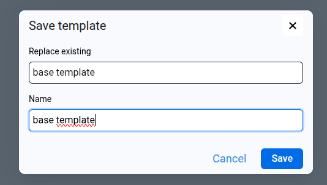

4. Click **Save** to confirm.

**Rename or delete a template:**

1. Click the **Rename or delete templates** icon.

   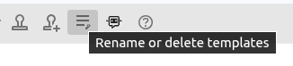

2. The Manage templates dialog opens.

   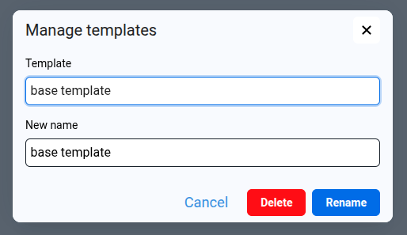

3. Select the template, enter a new name (for rename) or click **Delete** (for delete), and confirm.

### Inputs

The **Inputs** list shows all nodes referenced in the Definition of the selected node — the direct predecessors in the calculation flow.

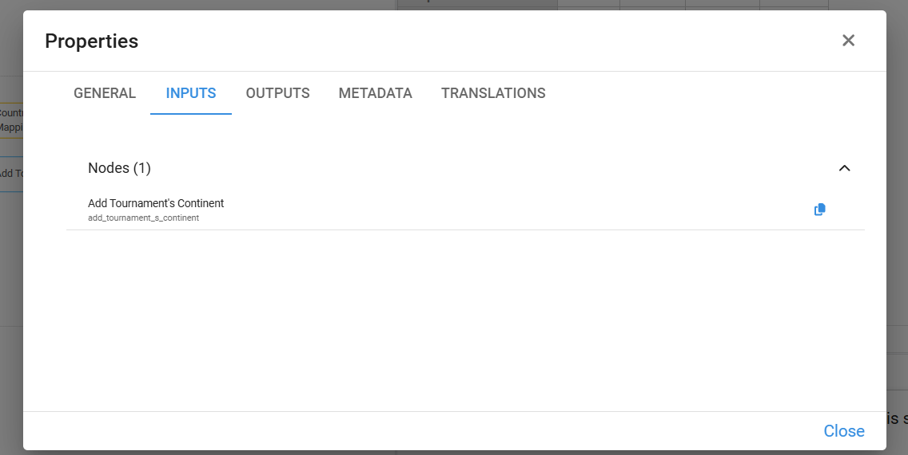

### Outputs

The **Outputs** list shows:

- All nodes that use the result of the selected node in their own Definition (direct successors).
- All interfaces where the selected node is used (for example, as a data source for a table or chart).

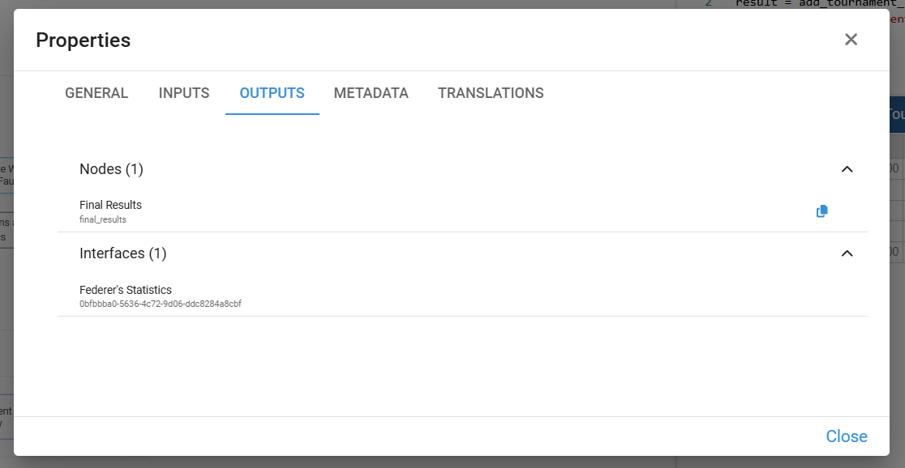

### Metadata

The **Metadata** tab shows basic audit information:

- Creation date.
- Last modification date and time.
- Last user that modified.

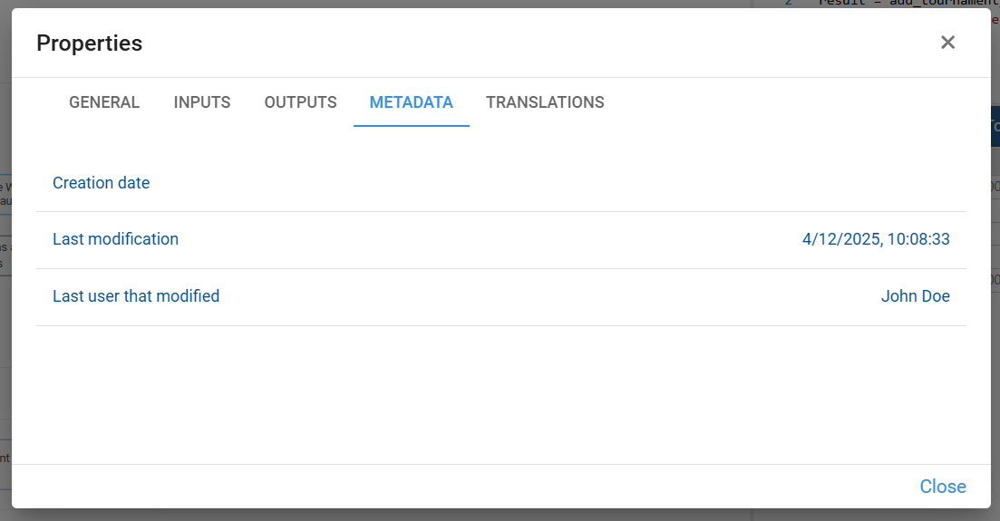

### Translations

The **Translations** tab lets us define the node title in multiple languages (Español, English, Português, etc.), so users see node titles in their preferred interface language.

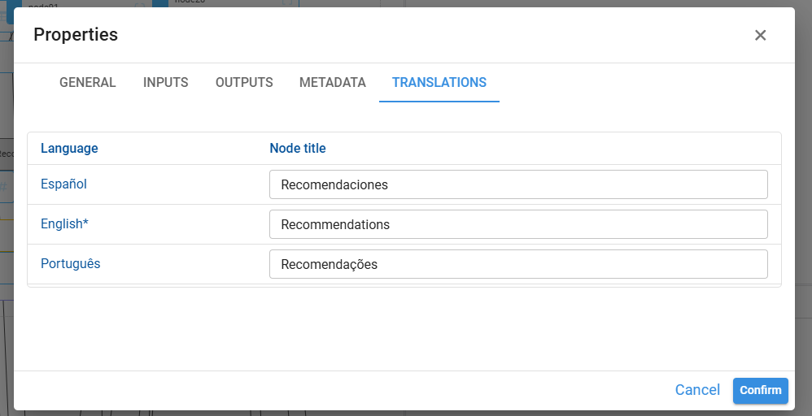

You can access all of these properties by right-clicking on the node and then clicking on **Properties**.

---

## Node Types

In Pyplan we use different node types for different purposes. Each type is designed to simplify the definition of the parameters needed for its execution and to make the influence diagram easier to read.

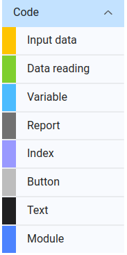

### Variable

Variable nodes are the most common node type. They contain generic calculation logic written in Python.

- By default, Variable nodes are **blue**.
- If a Variable node has no outputs, its color changes to **gray** (treated as a terminal result/report node).
- If a Variable node has outputs in modules outside the one it belongs to, it turns **red** (cross‑module dependencies).

### Data Reading

Data reading nodes connect the model to external data sources.

- When we drag a Data reading node onto the diagram, Pyplan opens a wizard that guides us through the connection to supported sources (files, databases, etc.).
- The wizard configures connection parameters and loads the data as a structured result (DataFrame or xarray object).

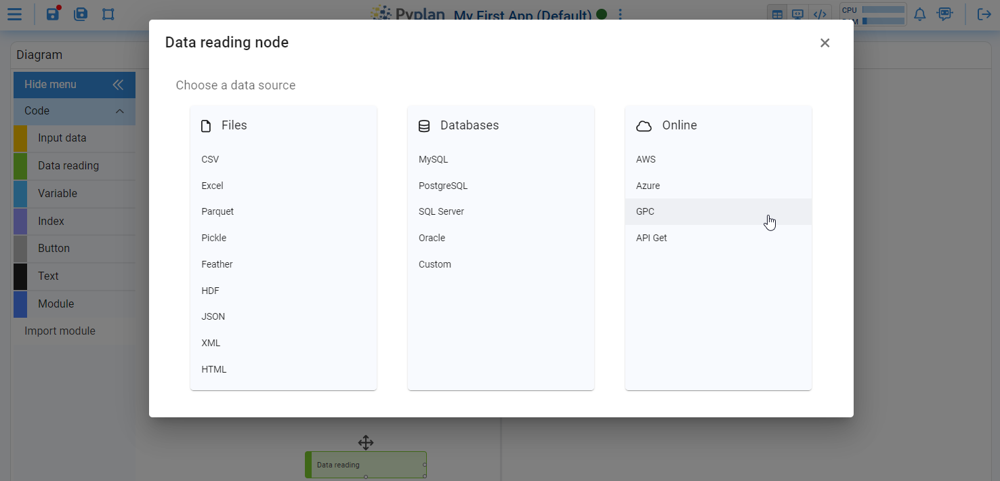

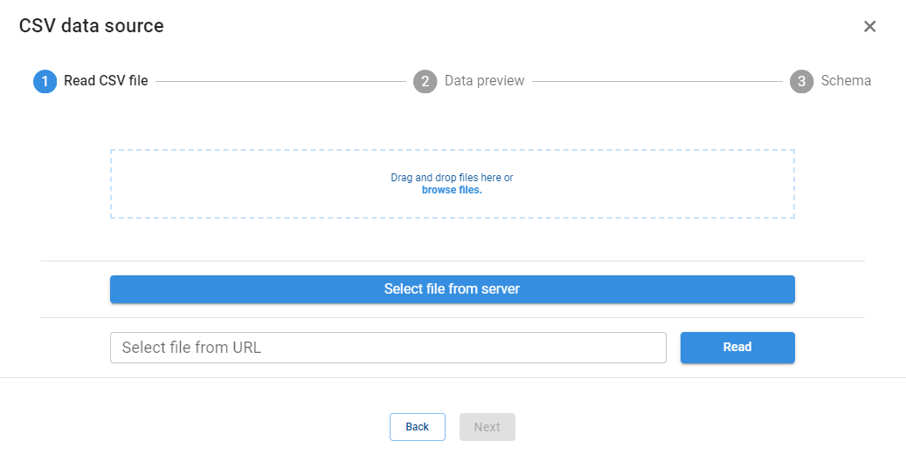

### Input Data

Input data nodes let us create manual data‑entry processes that can later be used in calculations.

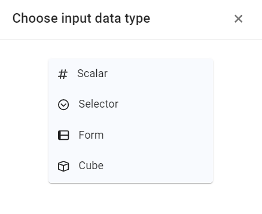

#### Form

A Form input allows us to design a simple screen where users can type or select values (assumptions, parameters, or configuration options). These values are then stored and used by other nodes.

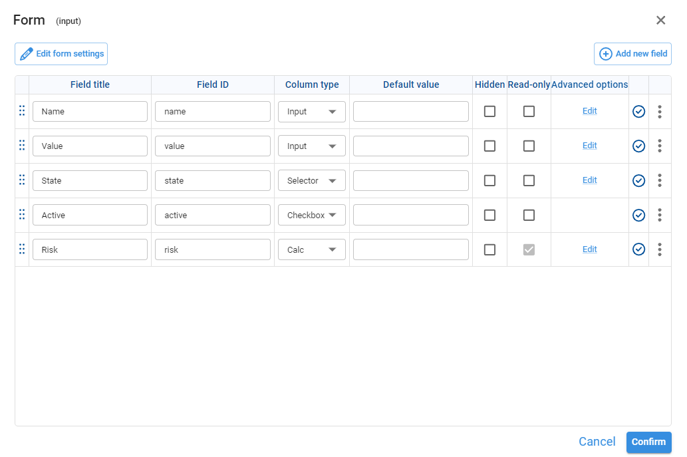

#### Cube

An InputCube node allows entering data in a multidimensional way, similar to working with a pivot table. Values entered in the cube are stored in a configurable database defined in the same wizard.

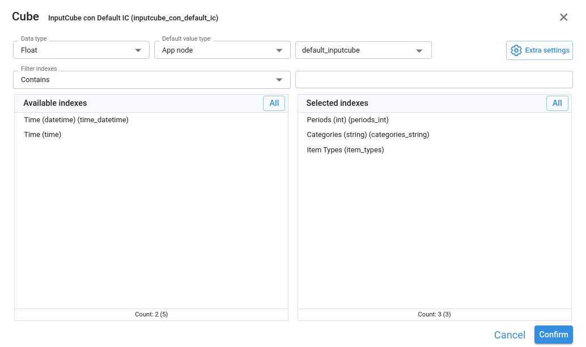

The initial configuration includes:

- **Data type:** Type of values the node accepts (number, text, etc.).
- **Default value type:** Scalar (literal value) or App node (value from another node).
- **Available indexes / Selected indexes:** Index‑type nodes that will define the dimensions of the cube.

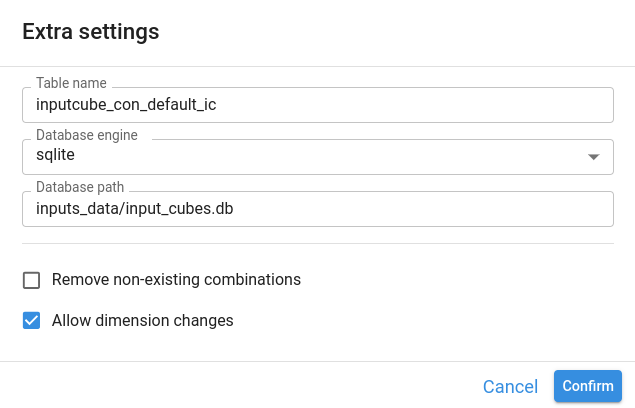

Extra settings include:

- **Table name:** Name of the table stored in the database.
- **Database engine:** `sqlite`, `postgresql`, or `custom`.
- **Database parameters:** Connection parameters (file path, server, user, etc.).
- **Remove non‑existing combinations:** Removes stored values for dimension members that no longer exist.
- **Allow dimension changes:** Controls whether adding/removing a dimension is permitted after the table has been created.

:::tip
To access the underlying `xarray.DataArray` of an InputCube node, use its `.value` property:

```python
result = sales_data.value
```
:::

### Report

A Report node lets us build a report from a list of concepts (items), assigning to each concept either a fixed value or the result of another node.

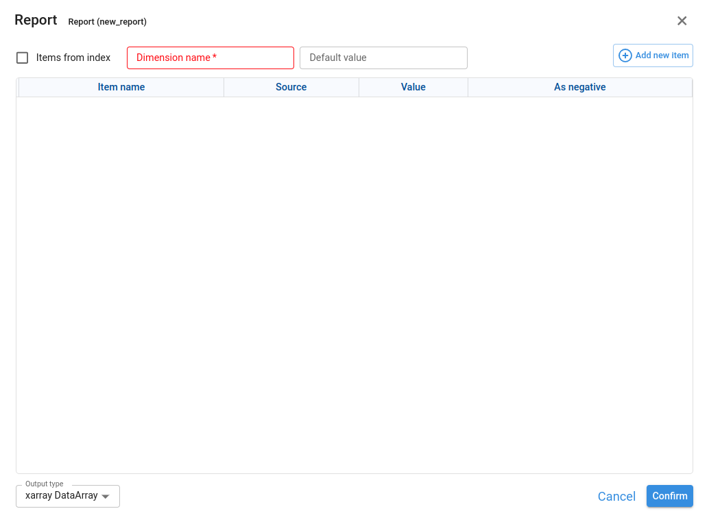

The **Items from index** checkbox controls how we define the list of concepts:

- **Unchecked** → we define the list of concepts manually (add titles and assign nodes or scalar values).
- **Checked** → the concepts come from an Index node.

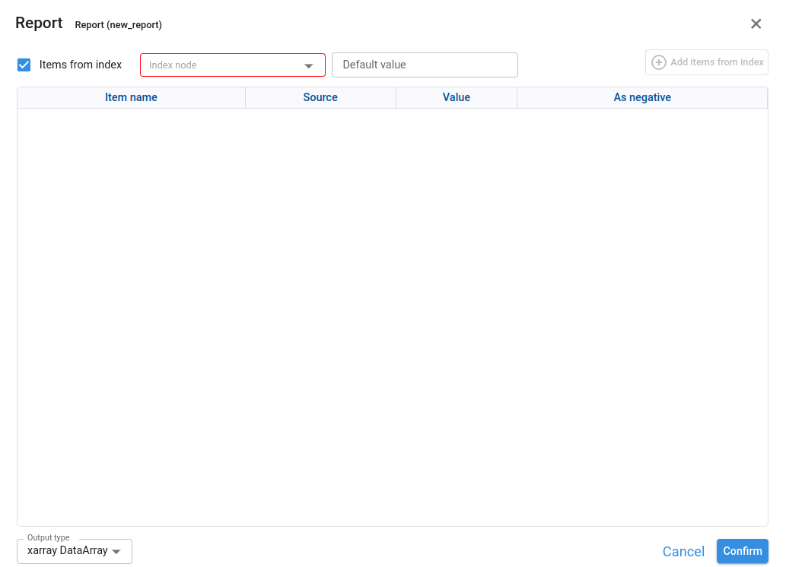

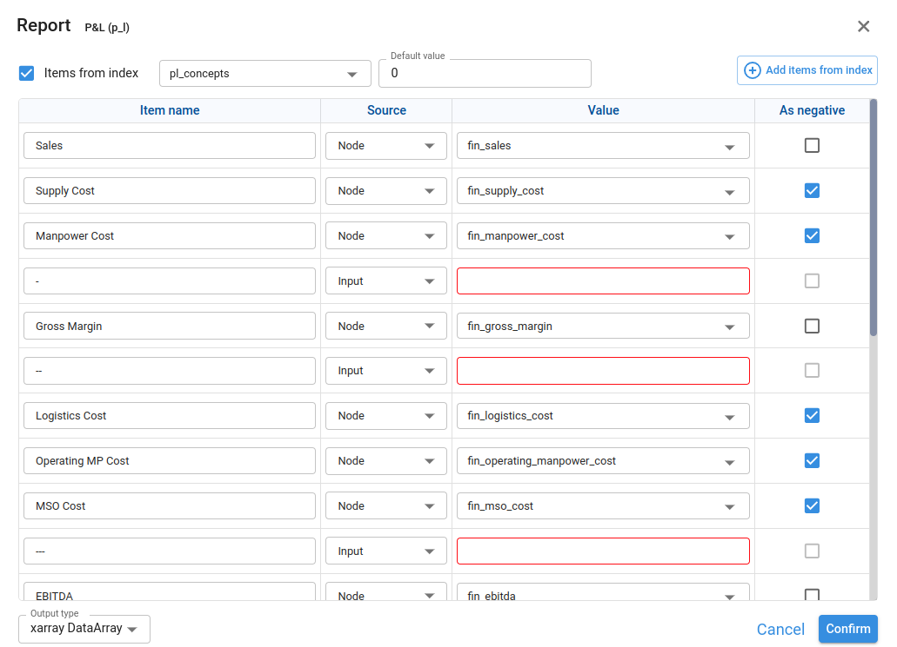

**Output type** defines the format of the final report:

- **xarray DataArray** — for nodes that return `DataArray` or scalars.
- **pandas DataFrame** — for nodes that return `DataFrame`, `Series`, or scalars.

### Button

A Button node executes Python code every time the user clicks it. It is typically used to trigger actions such as refreshing data, running scenarios, or updating interfaces. The result does not persist in memory.

### Index

An Index node defines and stores dimensions used across the calculation process (Product, Region, Year, etc.). Its Definition returns a list of elements that constitute the dimension. These indexes are referenced by other nodes and interface filters.

### Text

A Text node is a purely descriptive element. It is used to add comments, titles, or explanations to make the diagram easier to read. Text nodes do not participate in calculations.

### Module

A Module node is a container that can hold other nodes inside it. We use modules to organize complex calculations hierarchically.

- We enter a module by double‑clicking it.
- Modules can be nested without limit.

### Alias

An Alias node is a mirrored representation of another node, used to make influence diagrams clearer without duplicating logic.

- The Alias shows the same result as the original node.
- Editing the Definition in the Alias also changes the original node's Definition.
- We create an Alias by selecting a node and pressing **Ctrl+M** (Cmd+M on Mac).

---

## Operations in the Influence Diagram

### Navigation

- To **enter a module**, double‑click the module node.
- To **go back up** in the hierarchy, use the breadcrumb navigation shown above the diagram.

### Inspection of Node Properties

To inspect or edit the properties of a node:

1. Select the node in the diagram.
2. Right‑click it.

Pyplan opens the node properties window, where we can review and change title, Id, Definition, documentation, inputs, and outputs.

### Drag Nodes to the Diagram

To create new nodes, click the blue button in the upper‑left corner of the diagram to open the node palette. Then:

1. Choose a node type (Variable, Data reading, Input data, Index, etc.).
2. Drag and drop the node onto the diagram.

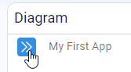

To select multiple nodes:

- Click each node while holding **Ctrl**, or
- Hold **Shift**, click on an empty area, and drag to draw a selection rectangle.

Keyboard shortcuts for node manipulation:

- **Ctrl+C** — Copy
- **Ctrl+X** — Cut
- **Ctrl+V** — Paste

### Results Display

When we select a node, the result panel indicates whether the node is already calculated or not.

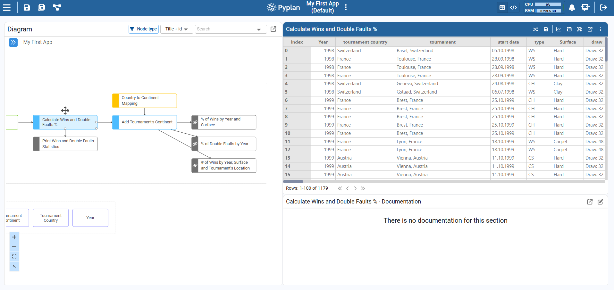

We can calculate (run) a node in three ways:

- Double‑click the node in the diagram.
- Click the **Play** icon in the result panel.
- Press **Ctrl+Enter** while the node is selected.

There are two main visualization modes, selectable in the upper‑right area:

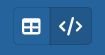

- **Result + Documentation** — Shows the node result together with its documentation.
- **Code + Result** — Shows the node Definition (Python code) together with the result.
