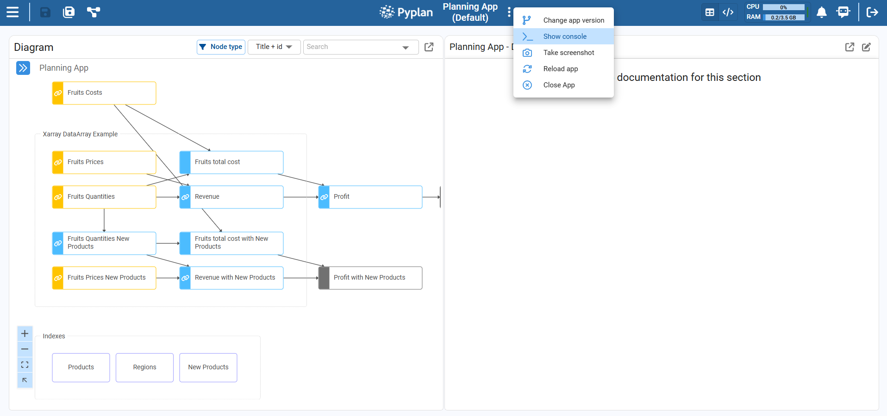
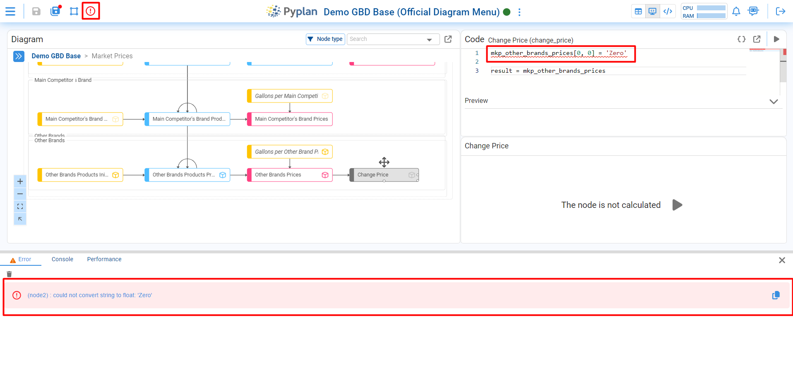
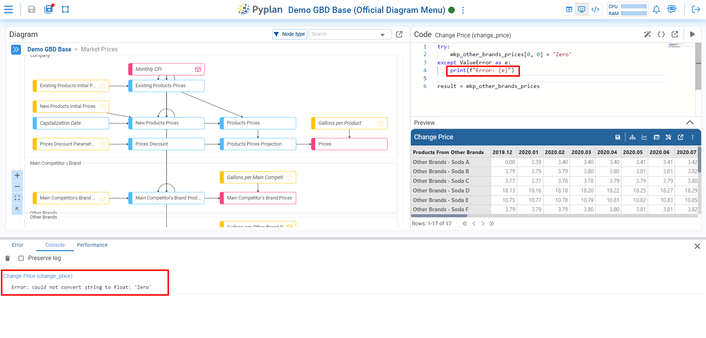
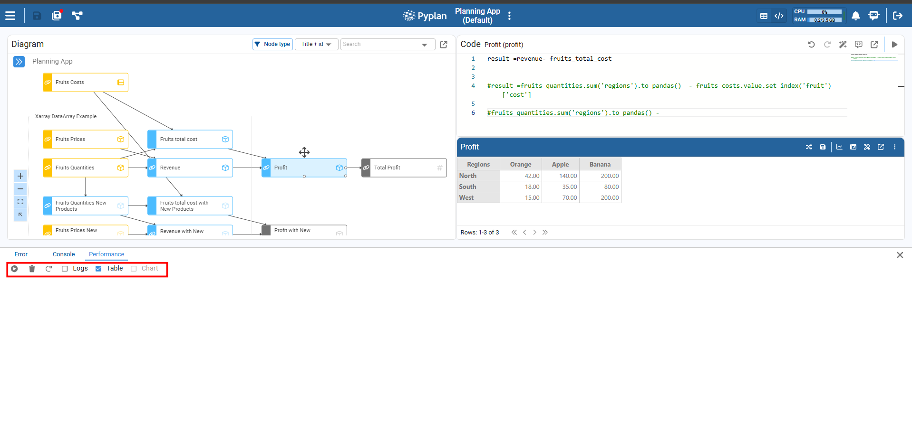
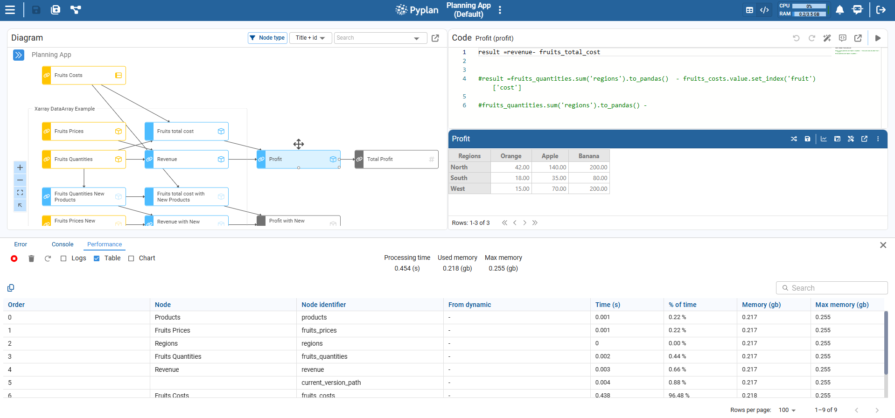

# Console and Tools

## Open the Console

To open the Console, go to the top bar of the application, click the **ellipsis menu** next to the app name, and select **Show console**.

The console appears as a panel at the bottom of the window and contains three tabs:

- **Error** — centralizes errors raised when nodes are executed.
- **Console** — shows the output of Python `print` statements.
- **Performance** — displays detailed timing and memory metrics for executed nodes.

We can close the console at any time using the **X** button on the right side of the panel.

---

## Error

The **Error** tab shows all errors generated by executed nodes, helping us quickly find which node failed and why.

When we run a node and there is an error:

- The problematic code is **underlined in red** in the Coding window.
- A **red warning icon** appears in the top bar of the app.

Clicking this warning icon automatically opens the Error tab, where we see:

- The node name and identifier.
- The full error message returned by Python.

From there we can adjust the code and re‑run the node until the error is resolved.

---

## Console

The **Console** tab captures everything sent to standard output using Python `print` statements inside our nodes.

Each time a node runs, any `print(...)` we added to its code appears here, grouped by node. This gives us a simple, real‑time trace of messages and intermediate values, which is especially useful when we want to understand the execution flow or quickly inspect data without adding extra nodes.

We can optionally preserve the log across runs so messages remain visible while we continue working.

---

## Performance

The **Performance** tab measures how long nodes take to run and how much memory they use.

As we execute nodes, this tab can display:

- A log of executed nodes.
- A table with detailed metrics per node.
- A chart that visualizes performance over the run.

This view helps us detect slow or memory‑intensive nodes and focus our optimization efforts.

### Analysis

To start collecting performance data:

1. Turn on the **Analysis** switch in the Performance tab.
2. Run one or more nodes from the diagram.

In the toolbar of the Performance tab we have:

- A **trash bin icon** to clear the collected data for the current analysis.
- A **circular arrow icon** to reset all nodes of the application, forcing every node to be recalculated the next time it is executed.

As nodes run, Pyplan records for each executed node:

- Execution time.
- Memory and maximum memory used.

When the run is complete, we see:

- A detailed table and optional chart with metrics per node.
- Overall indicators such as total execution time, used memory, and maximum memory during the whole process.

