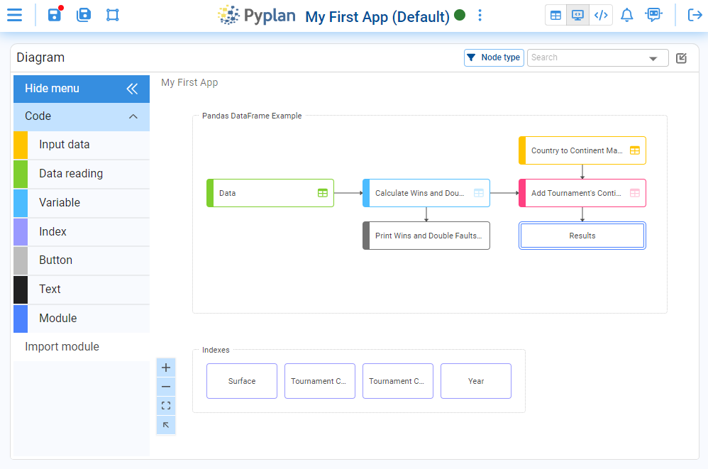

# Influence Diagram

One of the distinctive aspects of Pyplan is the way we organize code through a hierarchical influence diagram, where each node represents a step in the loading, transformation, or processing of information.

Nodes act as visual containers for model logic. In each node we define the underlying Python code in its coding window, either by writing the code directly or by using one of Pyplan's code assistants to help generate it.

We build the influence diagram by dragging node types from the left palette (Code, Input data, Data reading, Variable, Index, Button, Text, Module, etc.) onto the diagram area and arranging them into flows. Dependencies between steps are represented by arrows. These arrows are created automatically when a node's definition references another node.

Each node type has a specific color and style. This color scheme lets us quickly understand the role of each node and the structure of the model at a glance.

---

## Shortcuts

### Diagram Actions

- **Click:** Select or deselect nodes.
- **Double‑click:**
  - On a module node: open the module.
  - On a codable node: run the node and expand its result widget.
- **Right‑click:** Open the node menu (properties, wizards, etc.).
- **Middle‑click (scroll button) + drag:** Pan and move around the diagram.
- **Two‑finger drag on touchpad:** Pan and move around the diagram.
- **Scroll:** Vertical scroll.
- **Shift + Scroll:** Horizontal scroll.
- **Shift + Click & drag:** Select nodes by drawing a selection area.
- **Ctrl + Click:** Add/remove nodes to a multi‑selection.
- **Ctrl + Scroll:** Zoom in/out.
- **Escape:** Collapse any expanded widget (code or result).

### General Diagram Shortcuts

- **M:** Show or hide the minimap.
- **Ctrl+Y** (Cmd+Y on Mac): Toggle between showing node titles and node IDs.
- **Ctrl+A** (Cmd+A on Mac): Select all nodes in the current diagram.
- **Ctrl+S** (Cmd+S on Mac): Save the model.
- **Ctrl+F** (Cmd+F on Mac): Focus the node search bar.
- **Ctrl+Shift+H** (Cmd+Shift+H on Mac): Go back to the previously visited module.

### Selected Nodes Shortcuts (one or more selected)

- **Delete (Supr):** Delete the selected node(s).
- **Ctrl+C** (Cmd+C on Mac): Copy the selected node(s).
- **Ctrl+X** (Cmd+X on Mac): Cut the selected node(s).
- **Ctrl+V** (Cmd+V on Mac): Paste copied/cut nodes.
- **Ctrl+D** (Cmd+D on Mac): Duplicate the selected node(s).
- **Arrow keys:** Move the selected node(s) step by step.
- **Ctrl+M** (Cmd+M on Mac): Create aliases of the selected node(s).

### Single Selected Node Shortcuts

- **Ctrl+E** (Cmd+E on Mac): Evaluate the selected node (run and expand the code widget — codable nodes only).
- **Ctrl+R** (Cmd+R on Mac): Run the selected node and expand the result widget (codable nodes only).
- **Ctrl+H** (Cmd+H on Mac): Navigate to the original node from the selected alias node (alias nodes only).

### Multiple Selected Nodes Shortcuts

- **Ctrl+I** (Cmd+I on Mac): Set the width of all selected nodes to match the last selected node.
- **Ctrl+G** (Cmd+G on Mac): Set the height of all selected nodes to match the last selected node.
- **Ctrl+Alt+0** (Cmd+Option+0 on Mac): Set width and height of all selected nodes to match the last selected node.
- **Ctrl + Arrow keys** (Cmd + Arrow keys on Mac): Align all selected nodes to the corresponding border of the last selected node.

### Code Shortcuts (when the code editor is active)

- **Ctrl+Enter:** Confirm the node definition and run the node.
- **Alt + Click on another node:** Insert that node's ID into the current node definition.
- **Ctrl+Click (on a node ID in the code):** Navigate to that node in the diagram.
- **Ctrl+B:** Try to automatically fix the current node error in the code.
- **Ctrl+O:** Optimize the code to improve performance and readability.
- **Ctrl+M:** Autocomplete code based on comments.

### General Shortcuts (outside the diagram)

- **Ctrl+Shift+D** (Cmd+Shift+D on Mac): Go to (or return to) the influence diagram.
