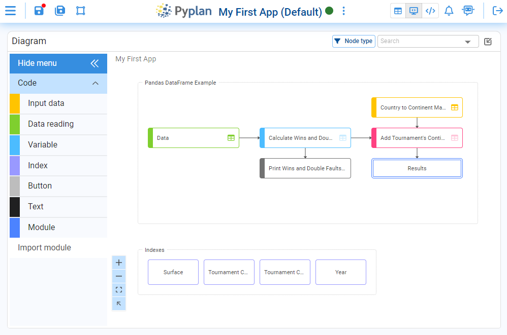
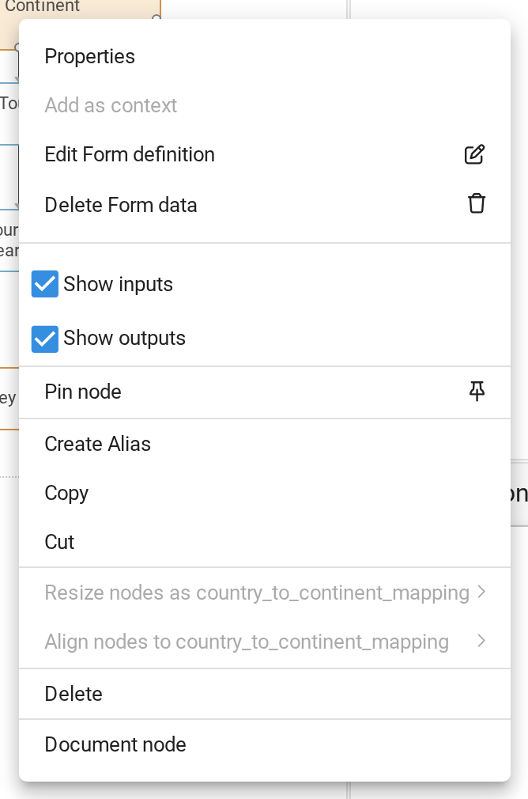
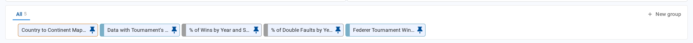
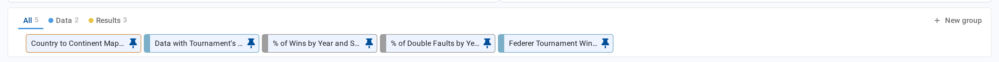
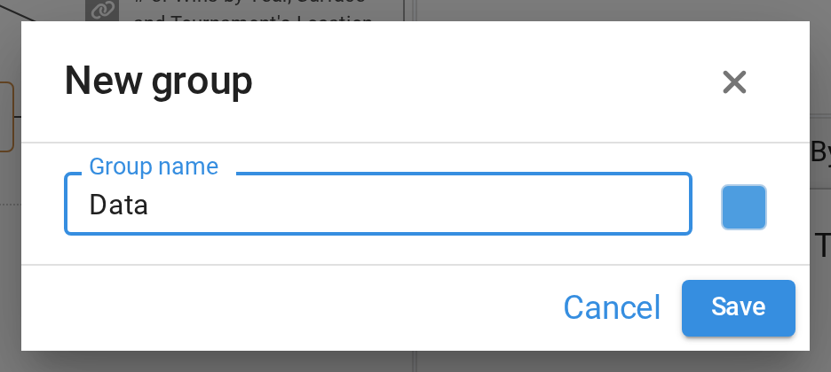
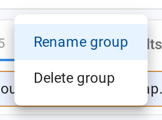
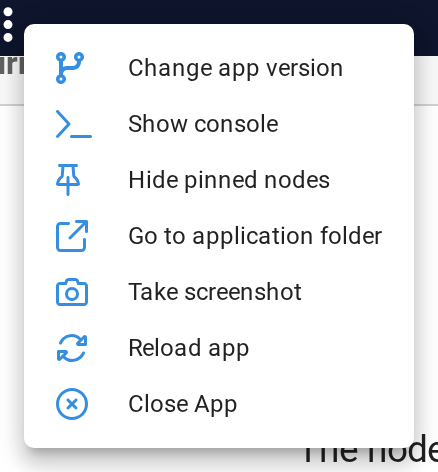

# Influence Diagram

One of the distinctive aspects of Pyplan is the way we organize code through a hierarchical influence diagram, where each node materializes a unique business concept — an input, a dimension, a calculated measure, an output (for example, *Projected Demand*, *Net Sales*, or *Transport Cost*) — and the arrows show how those concepts influence each other.

Nodes act as visual containers for model logic. In each node we define the underlying Python code in its coding window, either by writing the code directly or by using one of Pyplan's code assistants to help generate it. The mechanical steps needed to compute a concept (loading, filtering, merging, calculating) live inside a single node's definition as local variables — we create a separate node when the information is a different business concept, not to stage the calculation of the same one.

We build the influence diagram by dragging node types from the left palette (Code, Input data, Data reading, Variable, Index, Button, Text, Module, etc.) onto the diagram area and arranging them into flows. Dependencies between concepts are represented by arrows. These arrows are created automatically when a node's definition references another node.

Each node type has a specific color and style. This color scheme lets us quickly understand the role of each node and the structure of the model at a glance.

---

## Shortcuts

### Diagram Actions

- **Click:** Select or deselect nodes.
- **Double‑click:**
  - On a module node: open the module.
  - On a codable node: run the node and expand its result widget.
- **Right‑click:** Open the node menu (properties, wizards, etc.).
- **Middle‑click (scroll button) + drag:** Pan and move around the diagram.
- **Two‑finger drag on touchpad:** Pan and move around the diagram.
- **Scroll:** Vertical scroll.
- **Shift + Scroll:** Horizontal scroll.
- **Shift + Click & drag:** Select nodes by drawing a selection area.
- **Ctrl + Click:** Add/remove nodes to a multi‑selection.
- **Ctrl + Scroll:** Zoom in/out.
- **Escape:** Collapse any expanded widget (code or result).

### General Diagram Shortcuts

- **M:** Show or hide the minimap.
- **Ctrl+Y** (Cmd+Y on Mac): Toggle between showing node titles and node IDs.
- **Ctrl+A** (Cmd+A on Mac): Select all nodes in the current diagram.
- **Ctrl+S** (Cmd+S on Mac): Save the model.
- **Ctrl+F** (Cmd+F on Mac): Focus the node search bar.
- **Ctrl+Shift+H** (Cmd+Shift+H on Mac): Go back to the previously visited module.

### Selected Nodes Shortcuts (one or more selected)

- **Delete (Supr):** Delete the selected node(s).
- **Ctrl+C** (Cmd+C on Mac): Copy the selected node(s).
- **Ctrl+X** (Cmd+X on Mac): Cut the selected node(s).
- **Ctrl+V** (Cmd+V on Mac): Paste copied/cut nodes.
- **Ctrl+D** (Cmd+D on Mac): Duplicate the selected node(s).
- **Arrow keys:** Move the selected node(s) step by step.
- **Ctrl+M** (Cmd+M on Mac): Create aliases of the selected node(s).

### Single Selected Node Shortcuts

- **Ctrl+E** (Cmd+E on Mac): Evaluate the selected node (run and expand the code widget — codable nodes only).
- **Ctrl+R** (Cmd+R on Mac): Run the selected node and expand the result widget (codable nodes only).
- **Ctrl+H** (Cmd+H on Mac): Navigate to the original node from the selected alias node (alias nodes only).

### Multiple Selected Nodes Shortcuts

- **Ctrl+I** (Cmd+I on Mac): Set the width of all selected nodes to match the last selected node.
- **Ctrl+G** (Cmd+G on Mac): Set the height of all selected nodes to match the last selected node.
- **Ctrl+Alt+0** (Cmd+Option+0 on Mac): Set width and height of all selected nodes to match the last selected node.
- **Ctrl + Arrow keys** (Cmd + Arrow keys on Mac): Align all selected nodes to the corresponding border of the last selected node.

### Code Shortcuts (when the code editor is active)

- **Ctrl+Enter:** Confirm the node definition and run the node.
- **Alt + Click on another node:** Insert that node's ID into the current node definition.
- **Ctrl+Click (on a node ID in the code):** Navigate to that node in the diagram.
- **Ctrl+B:** Try to automatically fix the current node error in the code.
- **Ctrl+O:** Optimize the code to improve performance and readability.
- **Ctrl+M:** Autocomplete code based on comments.

### General Shortcuts (outside the diagram)

- **Ctrl+Shift+D** (Cmd+Shift+D on Mac): Go to (or return to) the influence diagram.

---

## Pinned Nodes

When we work on a large model, we can pin the nodes we visit most often so they stay one click away, no matter which module we are in.

To pin a node, we right-click it in the diagram and choose **Pin node**.

The pinned nodes bar appears at the bottom of the influence diagram, showing each pinned node with the color and style of its node type.

From the bar we can:

- **Navigate to a node:** click a pinned node to select it and center the diagram on it. Clicking a pinned module node opens that module.
- **Insert its ID into the code:** with a node open in the code editor, **Alt + click** a pinned node to insert its ID into the current definition.
- **See details and copy the ID:** hover a pinned node to display a tooltip with its title and ID, plus a button to copy the ID to the clipboard.
- **Unpin:** click the pin icon on the right of the pinned node, or right-click the node in the diagram and choose **Unpin node**.
- **Reorder:** drag a pinned node and drop it in a new position within the bar.

The bar is hidden automatically when no node is pinned.

### Groups of Pinned Nodes

Pinned nodes can be organized into groups, for example one group per topic, process, or work in progress.

The tabs at the top of the bar filter the nodes by group. The **All** tab lists every pinned node, and each tab shows a color dot and the number of nodes it contains.

- **Create a group:** click **New group**, then enter a name and choose a color.

- **Add nodes to a group:** select the group's tab and pin the nodes from the diagram. Nodes pinned while a group tab is active are added to that group, and an already pinned node is moved to it. Nodes pinned from the **All** tab keep the group they already had, or no group at all.
- **Move a node to another group:** drag a pinned node and drop it on the tab of the destination group. While we drag a node, every tab is highlighted as a drop target. Dropping the node on the **All** tab takes it out of its group, leaving it pinned without a group.
- **Rename a group:** double-click its tab, or right-click the tab and choose **Rename group**. We can also change its color.
- **Delete a group:** right-click its tab and choose **Delete group**. The nodes of that group stay pinned, without a group.

### Showing and Hiding the Bar

The application menu includes the **Hide pinned nodes** / **Show pinned nodes** option to toggle the bar without unpinning anything. The option is only available in the Code section and when at least one node is pinned.

:::note
Pinned nodes, their groups, and their order are stored per app in the browser we are working with, so they are not shared with other users or other browsers.
:::
