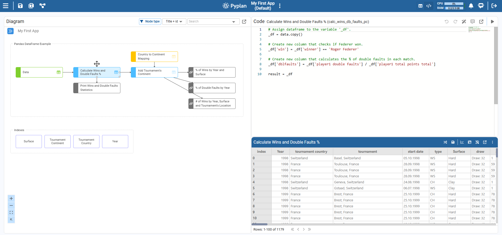
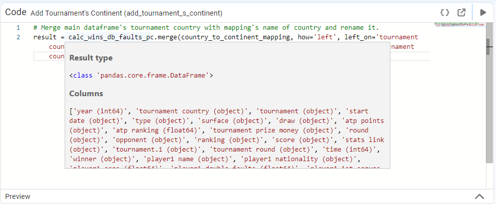
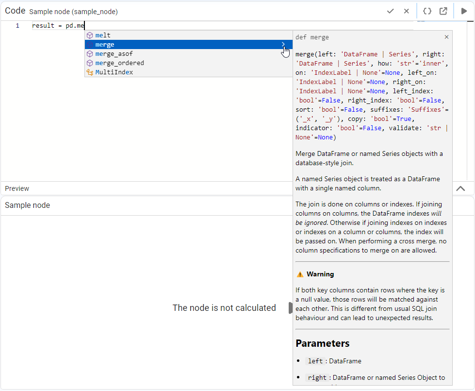
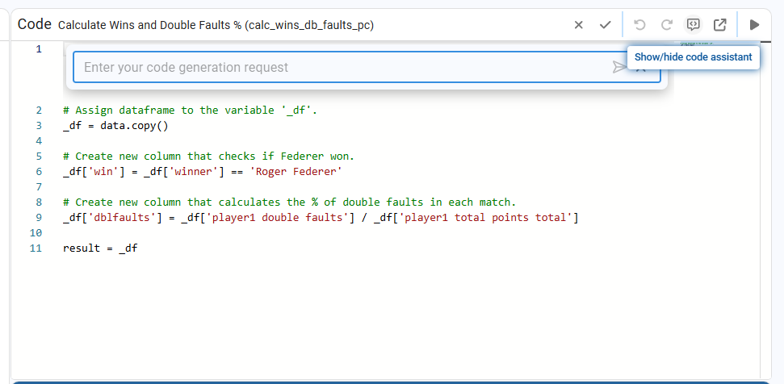
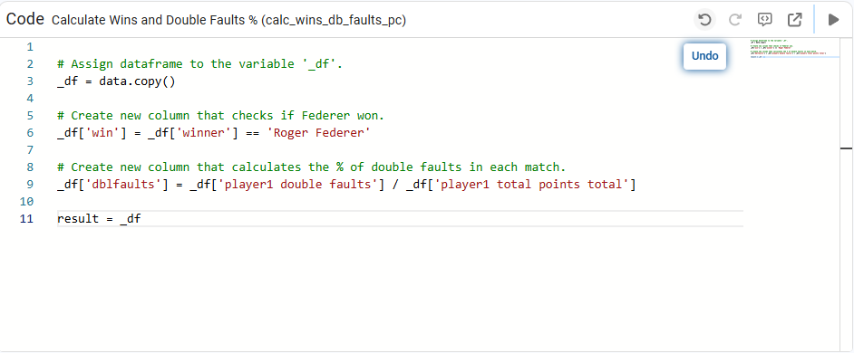

# Low Code

While many operations can be performed using Pyplan's wizards, more advanced tasks sometimes require editing the code of individual nodes. For this purpose, Pyplan provides a full code editor, available through the **Code+Result** view.

---

## Code Editor

To open the editor, select a node in the influence diagram and then choose the **Code+Result** view. This displays:

- The **coding window** at the top, where we write the node Definition in Python.
- The **result panel** at the bottom, where we see the output of that Definition.

Example code and result:



```python
# Assign dataframe to the variable '_df'.
_df = data

# Create new column that checks if Federer won.
_df['win'] = _df['winner'] == 'Roger Federer'

# Create new column that calculates the % of double faults in each match.
_df['dblfaults'] = _df['player1 double faults'] / _df['player1 total points total']

result = _df
```

We can freely modify the code in the coding window and then re‑run the node to immediately see how those changes affect the result.

---

## Coding Assistance

### Tooltip

When viewing a node's code, we can hover the cursor over a variable or function name to see a tooltip. After a short delay, Pyplan shows a small preview with helpful information about the selected element, such as its current value (when available) or a brief description.



### IntelliSense

IntelliSense is Pyplan's code‑completion assistant. It provides member lists, parameter information, quick info, and full‑word completion to help write Python code faster and with fewer errors.

Key behaviors:

- After typing a trigger character (for example, a dot `.`), IntelliSense shows a list of valid members (attributes, methods, or properties) for the current object or namespace.
- As we continue typing, the list is filtered to include only matching members.
- IntelliSense supports **camel‑case matching**: type the first letter of each word in a camel‑case name to filter the list (e.g., `NP` for `NetProfit`).
- Press **Tab** or **Space** to insert the selected item. Typing a period after the inserted item immediately shows the members of that new object.
- When we highlight an item in the list, IntelliSense shows quick info (short description or signature) about it.



### Pyplan Assistant (powered by GPT)

The Pyplan Assistant is an integrated code helper available directly from the coding window to generate or modify node definitions.

Click the **Show/hide code assistant** icon in the top‑right corner of the coding window to show a text bar with the message *"Enter your code generation request"*.



In this bar we can:

- Describe in natural language what we want the node to do (for example: *"Group matches by country and count how many times `win` is true"*).
- Optionally provide context from other nodes by selecting them with **Alt + Click** while writing the question. The Assistant reads the structure (not the data) of those nodes and uses it as a reference.

After we send the request, the Assistant returns Python code adapted to the current node. We can review this proposal and, if we agree, apply it so that the node definition is updated automatically.

Use the **Undo/Redo** (circular arrow icons) to navigate between previous and new versions of the generated code.


