# File Manager

Pyplan's file manager lets us manage files, folders, and applications in a clear and transparent way. The left panel shows a hierarchical tree of workspaces and folders, and the right panel shows the contents of the selected folder. From here we can create folders, rename, copy, move, duplicate, delete, upload, download, compress, decompress, and search for items.

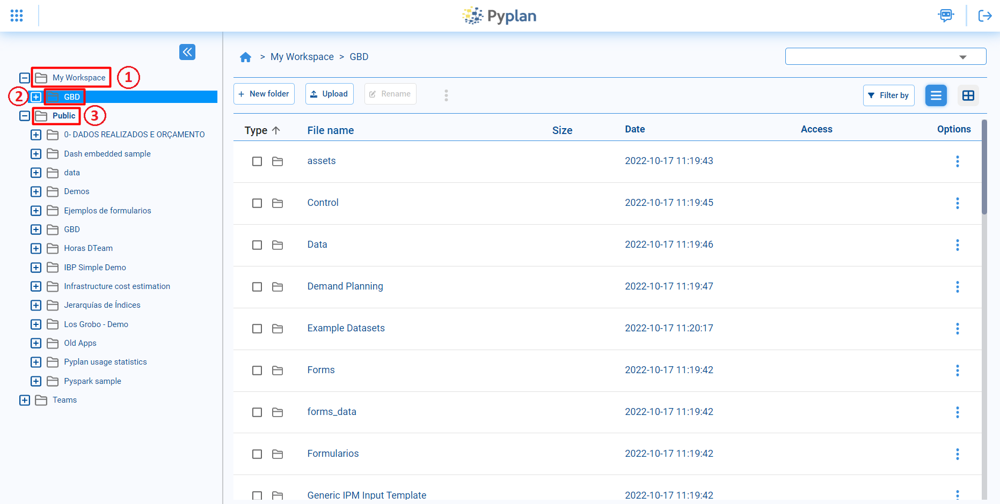

1. **My Workspace:** our personal space, where we store and organize our own applications and files.
2. **Selected folder:** the folder chosen in the left tree; its contents are displayed and managed in the right panel.
3. **Company public folder:** the Public area, which contains applications and files available to all authorized users in the company.

---

## Views

By default, the file manager shows items in a **list view**. In this view we see, for each file or folder:

- Type
- Name
- Size
- Last modified date

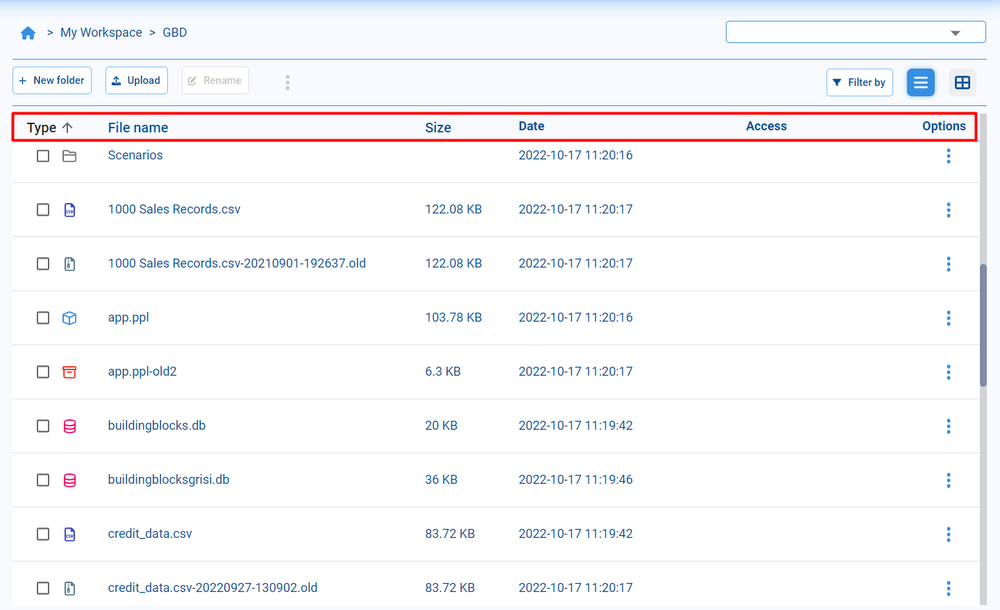

We can switch to a **grid / tile view** using the buttons in the upper‑right corner. In this view, folders appear first, followed by tiles representing each file, with an icon that indicates the file type.

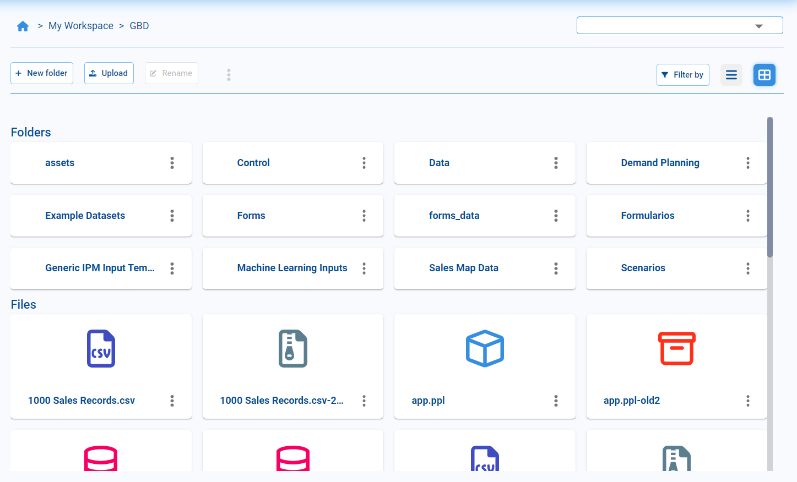

---

## Open Applications

In the file manager, we can identify Pyplan applications by their specific icon in the File name column. When we select a folder that corresponds to an application:

- An **Open app** button appears in the top toolbar, and
- The same option is available from the contextual (ellipsis) menu of that folder.

Selecting **Open app** loads the application so we can work with its nodes, models, and interfaces.

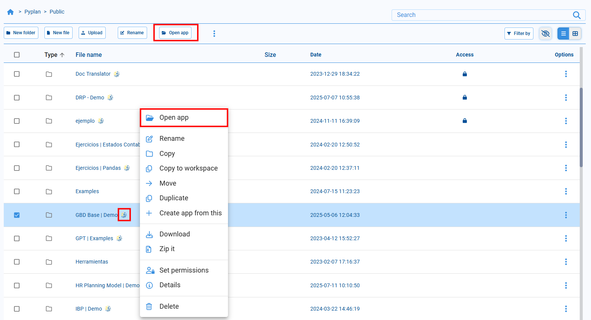

---

## Filter and Search

To simplify navigation, we can filter the list by data type using the **Filter by** button in the upper‑right area. This lets us display only files of the selected types (for example, applications, CSV files, databases, images, etc.).

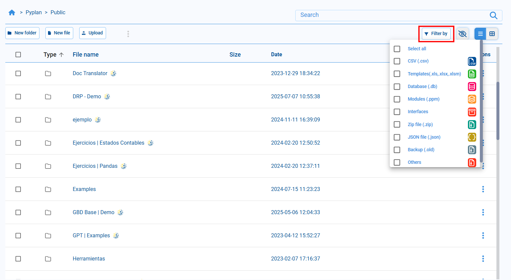

We can also use the **search box** to find files or folders. Entering part of a name returns all items in the current tree that contain that text in their name.

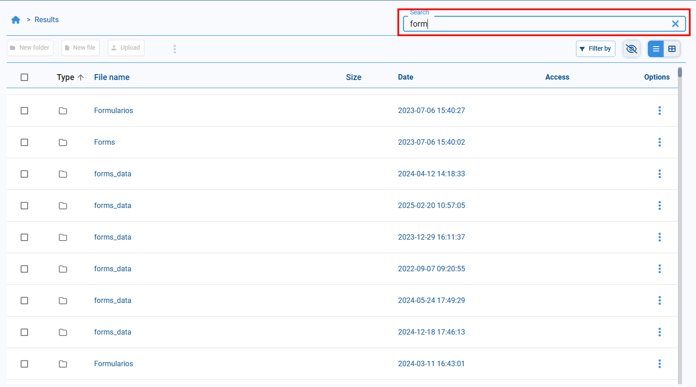

---

## Create Folders and Rename Files

To organize our content, we can create new folders:

1. Navigate to the directory where we want the new folder.
2. Click **New folder** in the top toolbar.
3. Enter the folder name in the dialog and confirm.

The new folder appears immediately in the current directory.

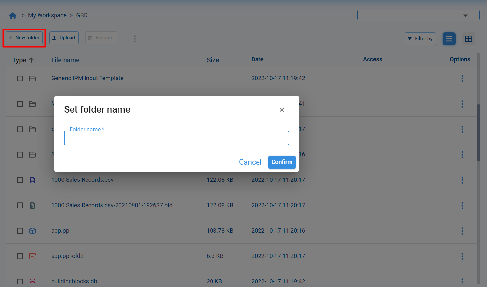

We can also rename files and folders:

1. Select the file or folder.
2. Choose **Rename** from the contextual menu or top toolbar.
3. Edit the name in the input field and confirm the change.

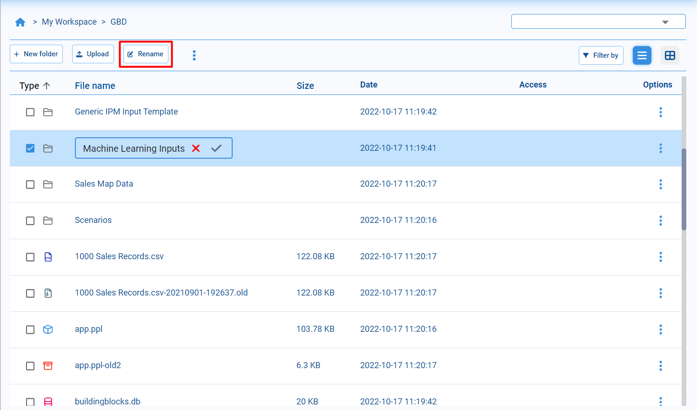

---

## Copy and Move

In the file manager we can copy and move files and folders between any locations we can access. These actions are available from the contextual menu (ellipsis on each row) and from the top toolbar when we select multiple items.

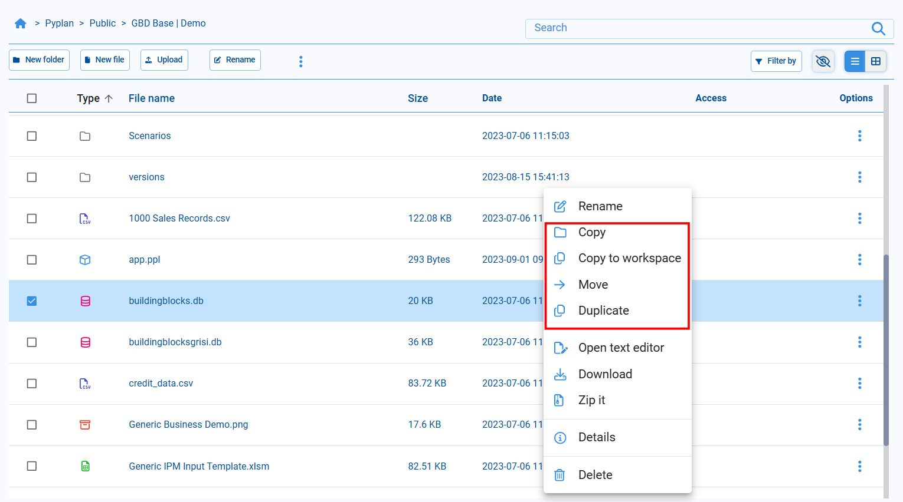

### Copy

Creates a copy of the selected item in a different folder within the same file system area.

**Workflow:**

1. Select **Copy** on the source item.
2. Navigate in the left tree or breadcrumb to the target folder.
3. Click **Paste here** in the toolbar to create the copy.

### Copy to Workspace

Copies the selected item from a shared area (for example, Public) into My Workspace. This is useful when we want our own editable copy of a shared file or dataset.

**Workflow:**

1. Select **Copy to workspace** on the item.
2. Go to My Workspace and choose **Paste here** in the folder where we want to place it.

### Move

Moves the selected file or folder to another location, removing it from the original directory.

**Workflow:**

1. Select **Move** on the source item.
2. Navigate to the destination folder.
3. Click **Paste here** to complete the move.

### Duplicate

Creates an immediate copy of the file or folder in the same directory. The new item appears next to the original, typically with a prefix such as `Copy of …`. This is the quickest way to create a local backup or variant of a file without changing folders.

---

## Copy and Move Multiple Files

We can apply Copy, Copy to workspace, or Move to multiple items at once:

1. Select the checkboxes of all files and folders we want to include.
2. Use the ellipsis menu in the top toolbar to choose **Copy**, **Copy to workspace**, or **Move**.
3. Navigate to the target location and click **Paste here**.

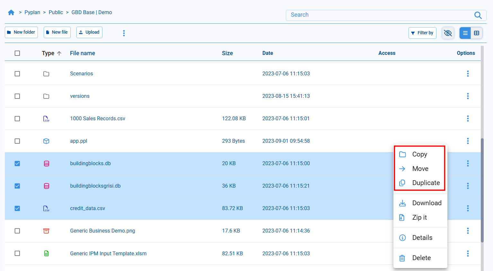

After choosing Copy or Move, navigate in the tree to the target location and click **Paste here** to complete the operation.

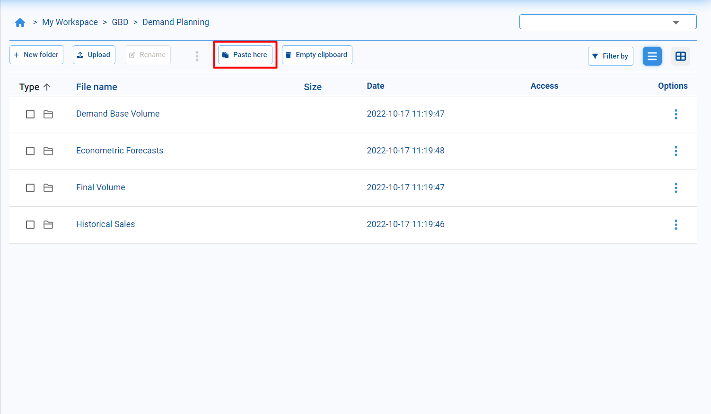

:::tip
Another way to manipulate files is to use the keyboard shortcuts **Ctrl+C** (copy), **Ctrl+X** (move), and **Ctrl+V** (paste).
:::

---

## Delete

To remove items, select the file or folder and choose **Delete** from the contextual menu. The selected elements are then removed from the directory, according to our permissions.

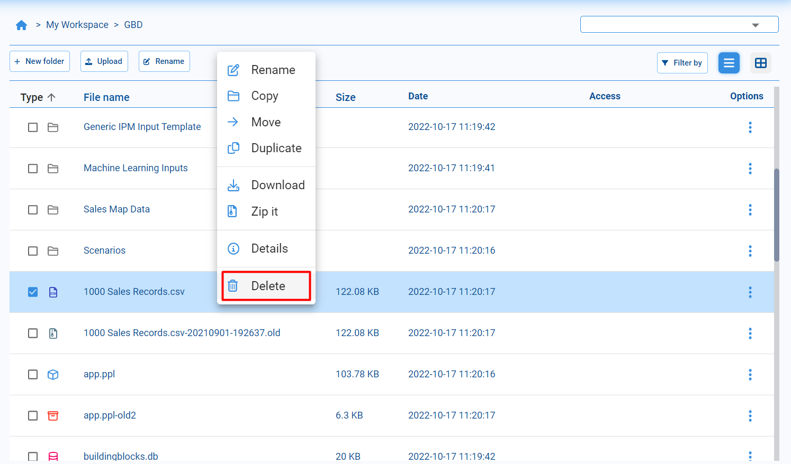

---

## Upload and Download

To **upload** files from our computer:

1. Click **Upload** in the top toolbar.
2. Drag files into the dialog or select them from our file system.
3. Confirm to upload them to the current directory.

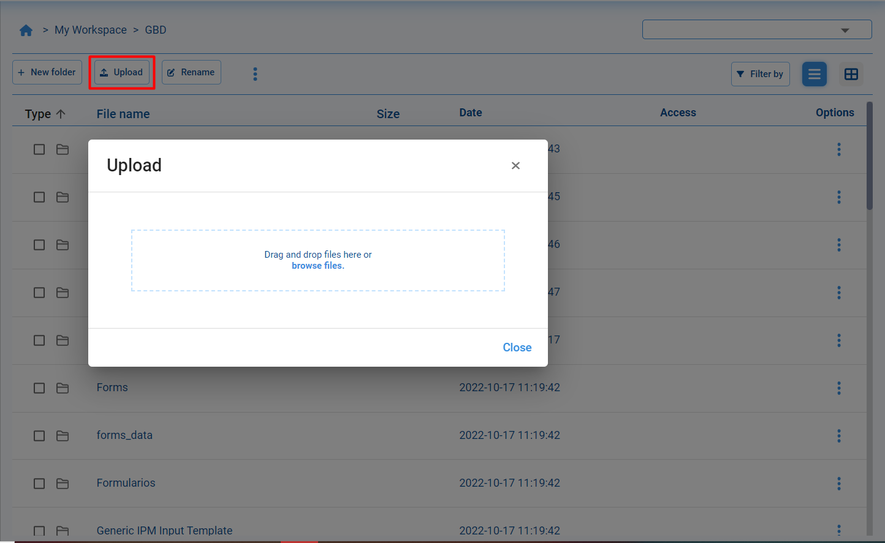

To **download** files or folders from Pyplan:

1. Select the items we want to download.
2. Choose **Download** from the contextual menu.

Pyplan packages the selection in a `.zip` file and starts the download automatically.

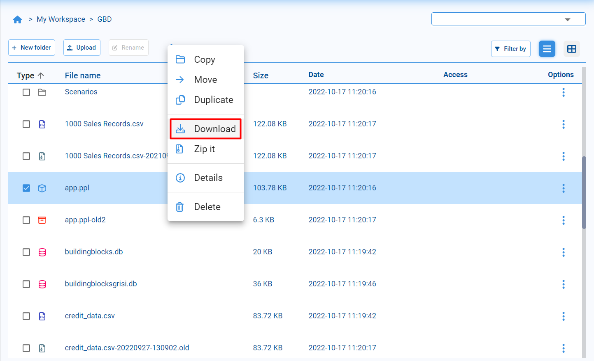

---

## Compress and Decompress

We can **compress** files and folders directly in Pyplan:

1. Select one or more items.
2. Choose **Zip it** (or **Compress**) from the contextual menu.

A new compressed `.zip` file is created in the same directory.

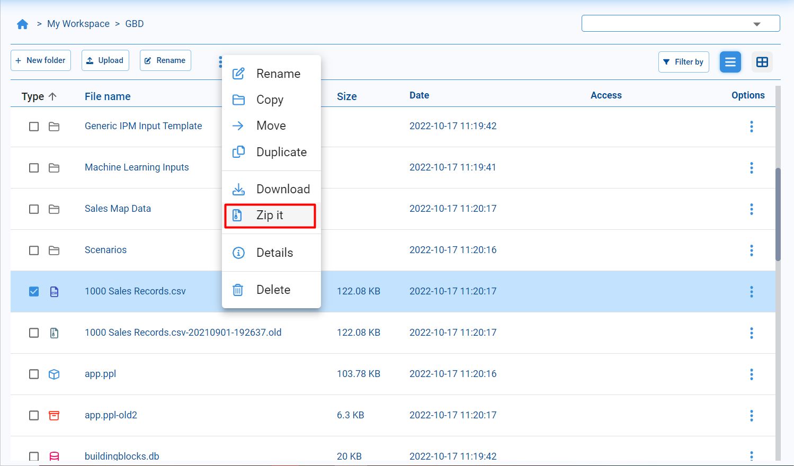

To **decompress** a `.zip` file:

1. Select the `.zip` file.
2. Click the **Unzip** button in the top toolbar.

Pyplan extracts the contents into the current directory, preserving the internal folder structure.

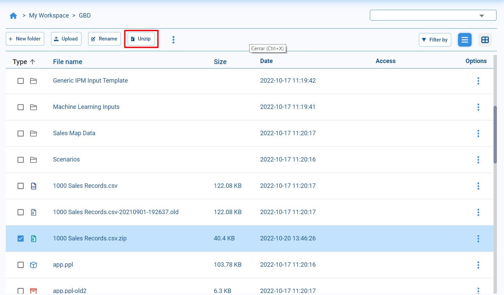
