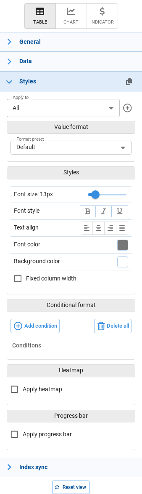
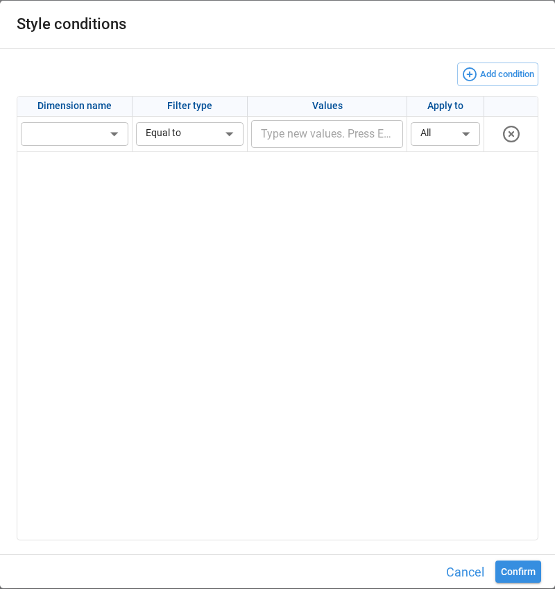
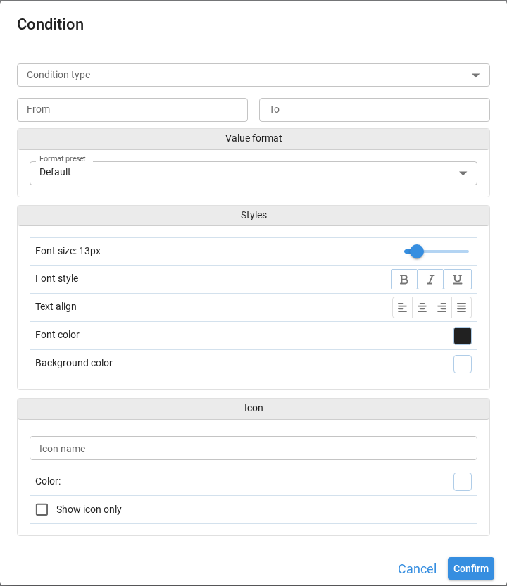
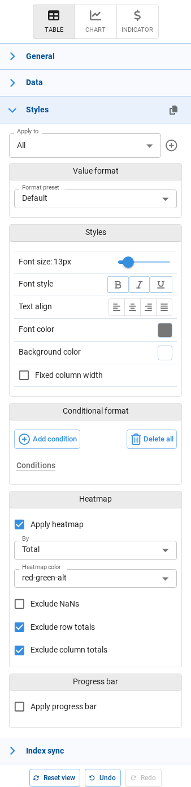
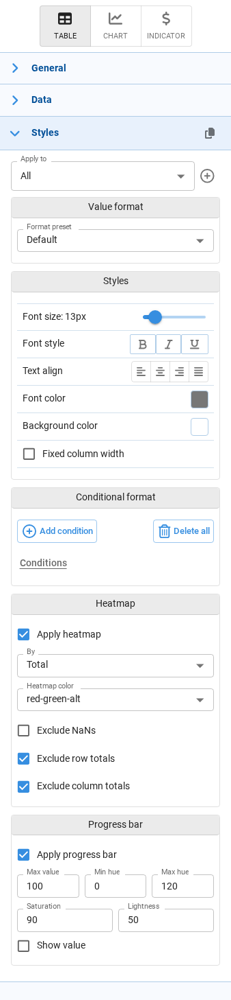
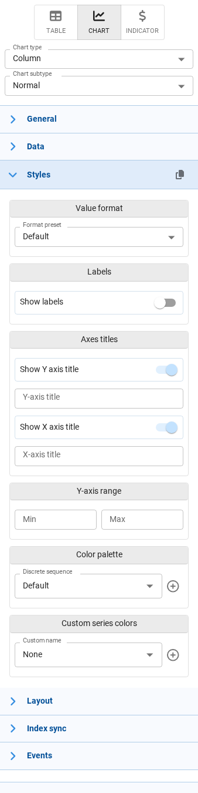
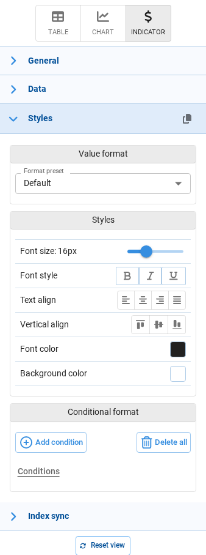

# Component Styles

The **Styles** section appears in the component configuration panel, on the right side of the screen, while we are editing an interface. It controls two related things: **how values are formatted** (number of decimals, currency symbol, date pattern) and **how the component looks** (fonts, colors, labels, icons, heatmaps).

Every component has a **Styles** section, but **its content depends on the type of component**. There are three different panels:

| Panel | Components |
|---|---|
| [Tables, inputs and forms](#tables-inputs-and-forms) | Table, Input (data array, cube, dataframe), Form |
| [Charts](#charts) | Chart |
| [Indicators](#indicators) | Indicator |

:::tip
The **copy** and **paste** icons in the **Styles** header let us copy the whole style configuration of a component and apply it to another component of the same kind, without repeating the setup. The paste icon only appears once something has been copied.
:::

## Tables, inputs and forms

This panel is organized into the following sections. Some of them only appear in certain situations:

| Section | When it appears |
|---|---|
| **Apply to** | Always |
| **Value format** | Always |
| **Styles** | Always |
| **Conditional format** | Always |
| **Cell properties** | Only for non-pivot tables |
| **Heatmap** | Only for **Table** components. Inputs and Forms do not offer it. |
| **Progress bar** | Always |

### Apply to

At the top of the panel, the **Apply to** selector decides *which cells* the settings below will affect.

- **All** — the settings apply to every cell of the component. This is the baseline style.
- **Custom styles** — additional styles that apply only to the cells matching a set of conditions (for example, only the *Revenue* column, or only the rows where the region is *North*).

Use the **+** button to create a new custom style. When a custom style is selected, the **pencil** and **trash** icons let us edit its conditions or delete it.

Custom styles are evaluated on top of the **All** style, so we only need to define in them what differs from the baseline.

#### Style conditions

Creating or editing a custom style opens the **Style conditions** dialog, where we define which cells the style targets. Each row is one condition, and **Add condition** adds more.

| Field | Description |
|---|---|
| **Apply condition to** | Whether the condition targets **Columns** or **Rows**. This selector is only available for non-pivot tables; in pivot tables conditions always target the index. |
| **Dimension name** / **Column** | The dimension or column the condition is evaluated against. |
| **Filter type** | How the values are matched: *Equal to*, *Not equal to*, *Contains*, *Does not contain*, *Begins with*, *Does not begin with*, *Equal to node values*, *Regular expression*. |
| **Values** | The values to match. With *Regular expression*, a single pattern is entered instead of a list. |
| **Apply to** | Which part of the matching cells is styled: **All**, only the **Values**, or only the **Labels**. |

### Value format

Controls how the value itself is rendered. Start from a **Format preset**; the fields below it change depending on the preset chosen.

| Preset | Example | Notes |
|---|---|---|
| **Default** | — | Inherits the format defined in the application's Default settings. |
| **Decimal** | `1,000.12` | Thousands separator, 2 decimals. |
| **Integer** | `1,000` | Thousands separator, no decimals. |
| **Currency** | `$ 1,000.12` | Adds a currency prefix. |
| **Currency (rounded)** | `$ 1,000` | Currency without decimals. |
| **Accounting** | `($ 1,000.12)` | Currency, negative values in parentheses. |
| **Accounting (rounded)** | `($ 1,000)` | Accounting without decimals. |
| **Finance** | `(1,000.12)` | Negative values in parentheses, no currency symbol. |
| **Finance (rounded)** | `(1,000)` | Finance without decimals. |
| **Percent** | `10.12%` | Renders the value as a percentage. |
| **Date** | `2022/04/23` | Uses the application's default date pattern unless a custom one is entered. |
| **Date time** | `2022/04/23 18:05:53` | Uses the application's default datetime pattern unless a custom one is entered. |
| **General** | `1000.12` | No thousands separator and no fixed number of decimals. |

Changing any field below the preset switches the selector to **Custom**, keeping the preset it was based on as a reference.

The available fields depend on the type of format:

| Field | Available for | Description |
|---|---|---|
| **Thousands separator** | Number, Percent | Groups digits in thousands. |
| **Show negative numbers in parentheses** | Number | Renders negative values as `(1,000)` instead of `-1,000`. |
| **Decimals** | Number, Percent | Number of decimal places, from 0 to 12. |
| **Prefix** / **Suffix** | Number | Text added before or after the value, for example a currency symbol or a unit. |
| **Date format** | Date, Date time | Custom date pattern, for example `dd/MM/yyyy`. |

This same **Value format** block is used by every panel, so the presets and fields described here apply to charts and indicators as well.

### Styles

Controls the appearance of the cells.

| Option | Description |
|---|---|
| **Font size** | Font size in pixels, from 9 to 30. Defaults to 13px in tables. |
| **Font style** | Bold, italic and underline. These can be combined. |
| **Text align** | Horizontal alignment: left, center, right or justified. |
| **Font color** | Text color of the cells. |
| **Background color** | Background color of the cells. |
| **Fixed column width** | Keeps columns at a fixed width instead of adjusting them to their content. When enabled, a slider sets the width between 50 and 500 pixels. Only available when **Apply to** is set to **All**. |

### Conditional format

Conditional formats change the appearance of a cell based on its value — for example, showing negative results in red, or adding a warning icon above a threshold.

- **Add condition** opens the condition editor.
- Existing conditions are listed below, each one with icons to edit or delete it.
- **Delete all** removes every condition of the currently selected style.

The condition editor has four parts:

**Condition type** — when the value must match for the format to apply:

| Type | Value to enter |
|---|---|
| **Range** | A **From** and a **To** value. |
| **Equal to** / **Not equal to** | A single value. |
| **Greater than** / **Greater than or equal to** | A single value. |
| **Less than** / **Less than or equal to** | A single value. |
| **Expression** | An expression where each column name is wrapped in `#`, for example `#Unit price# > 10.5`. Every column used must exist in the final table, and the expression must return a boolean series. |
| **Function** | A Python function that receives the DataFrame and returns a boolean series. |

:::note
**Expression** and **Function** are only available on custom styles. They are not offered when **Apply to** is set to **All**.
:::

**Value format** — an optional format applied only to the cells matching the condition, using the same options described in [Value format](#value-format).

**Styles** — the font and colors applied to the matching cells, using the same options described in [Styles](#styles).

**Icon** — an optional icon shown in the matching cells:

| Option | Description |
|---|---|
| **Icon name** | The icon to display, chosen from the icon selector. |
| **Color** | Color of the icon. |
| **Show icon only** | Replaces the value with the icon instead of showing both. |

### Cell properties

Only available for non-pivot tables.

| Option | Description |
|---|---|
| **Read-only** | Prevents end users from editing the cells targeted by the current style. Useful to make part of an input table non-editable. |

### Heatmap

Only available for **Table** components. Input tables and Forms do not offer this section.

A heatmap colors the cells according to their value, making the distribution visible at a glance.

| Option | Default | Description |
|---|---|---|
| **Apply heatmap** | Disabled | Enables the heatmap. The options below only appear once it is enabled. |
| **By** | Total | The scope used to compare values: **Total** compares against the whole table, **Row** compares within each row, and **Column** within each column. |
| **Heatmap color** | red-green-alt | The color scale. Besides the predefined combinations of red, green, white and blue, **Custom** lets us pick our own colors. |
| **Base background color** | — | With **Custom**, the background color the scale is built from. |
| **Text color** | — | With **Custom**, the color of the cell text. |
| **Exclude NaNs** | Disabled | Leaves cells without a value out of the color scale. |
| **Exclude row totals** | Enabled | Leaves row totals out of the scale, so they do not distort the color range. |
| **Exclude column totals** | Enabled | Leaves column totals out of the scale. |

### Progress bar

Renders each value as a horizontal bar inside its cell, useful for comparing magnitudes or showing progress towards a target.

| Option | Default | Description |
|---|---|---|
| **Apply progress bar** | Disabled | Enables the progress bar. The options below only appear once it is enabled. |
| **Max value** | 100 | The value that corresponds to a full bar. |
| **Min hue** | 0 | Color of the bar for the lowest values, as an HSL hue. 0 is red. |
| **Max hue** | 120 | Color of the bar for the highest values, as an HSL hue. 120 is green. |
| **Saturation** | 90 | Saturation of the bar color, from 0 to 100. |
| **Lightness** | 50 | Lightness of the bar color, from 0 to 100. |
| **Show value** | Disabled | Shows the numeric value on top of the bar. |

## Charts

Charts have a different **Styles** panel. There is no **Apply to** selector and no cell-level formatting: instead, the options describe the chart itself — its labels, its axes and its colors.

Which sections appear depends on the chart type selected in **Chart type**, so a given chart will only show the ones that make sense for it:

| Section | When it appears | Options |
|---|---|---|
| **Value format** | Always | The same presets and fields described in [Value format](#value-format). The *Date* and *Date time* presets are not offered, since chart values are numeric. |
| **Value format - Secondary axis** | Combined charts | Value format for the series plotted against the secondary axis. |
| **Labels** | Most chart types | **Show labels** turns the data labels on. Once enabled, **Field** chooses which value is shown, and for bar and column charts also **Position** (inside, outside), **Minimum size** and **Mode** (none, false, hide, show). |
| **Labels - Secondary axis** | Combined charts | The same label options for the secondary axis series. |
| **Axes titles** | Chart types with axes | **Show Y axis title** and **Show X axis title** toggles, each with a text field for the title. Leaving the text empty uses the field name. |
| **Y-axis range** | Bar, column, line, area, scatter and combined charts | **Min** and **Max** to fix the scale instead of letting it adjust to the data. In combined charts it also offers **Synchronize Y axes scales**. |
| **Y-axis range - Secondary axis** | Combined charts | The range of the secondary axis. |
| **Color palette** | Charts colored by category | **Discrete sequence** chooses the palette. The **+** button creates a custom palette, and the pencil and trash icons edit or delete the selected custom one. |
| **Color palette** (continuous) | Charts colored by a continuous value | A continuous color scale instead of a discrete sequence. |
| **Color palette** (waterfall) | Waterfall charts | Separate colors for **Increasing**, **Decreasing** and **Totals** bars. |
| **Custom series colors** | Charts with series | Assigns a specific color to individual series, so a given series always keeps the same color across charts. |
| **Series colors** | Combined charts without a color dimension | Colors for the first and second measure of the combined chart. |

## Indicators

Indicators show a single value, so their **Styles** panel is the shortest one. There is no **Apply to** selector, and no Heatmap, Progress bar or Cell properties sections.

| Section | Options |
|---|---|
| **Value format** | The same presets and fields described in [Value format](#value-format). |
| **Styles** | The same options described in [Styles](#styles), plus **Vertical align** to position the value inside the component. The default font size here is 16px. |
| **Conditional format** | The same editor described in [Conditional format](#conditional-format), used to change the look of the indicator based on its value — for example red when the value is negative. Since indicators have no custom styles, the **Expression** and **Function** condition types are not available. |

## Relationship with the application defaults

Many of these settings can also be defined once for the whole application, in the **Default settings** tab of the [App properties](../app-management/app-properties.md#default-settings) dialog.

The application defaults act as a baseline, and they only apply to components that do not define their own value. Whenever a component sets a property here, that value prevails over the application default.
