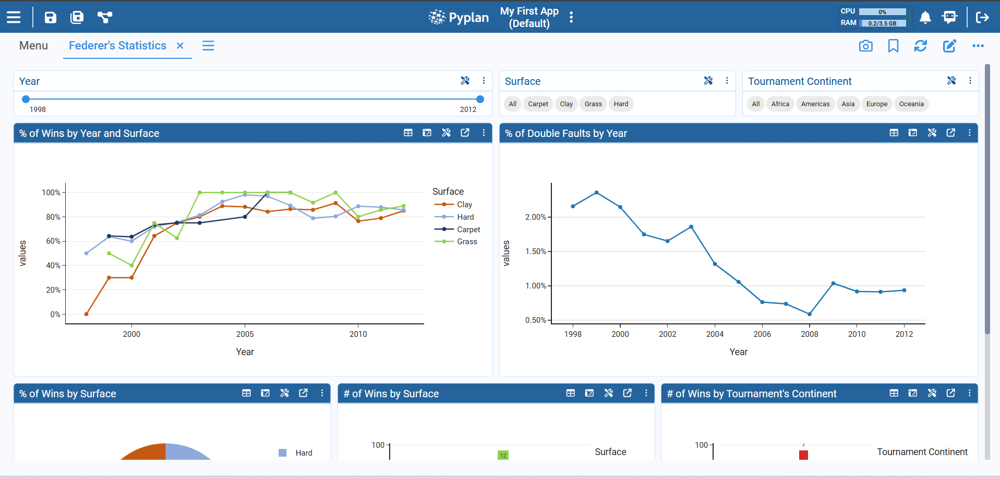
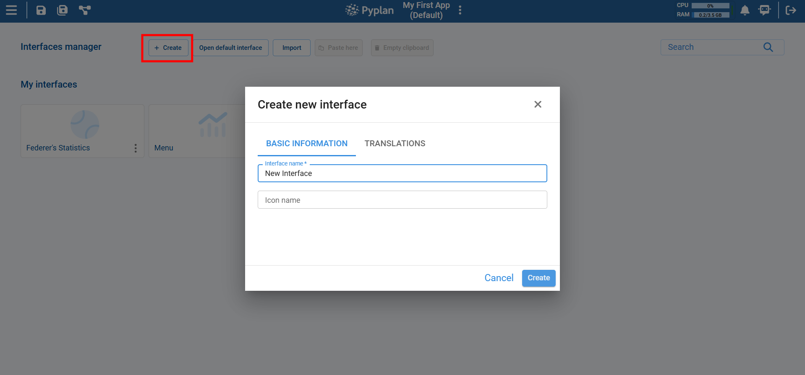
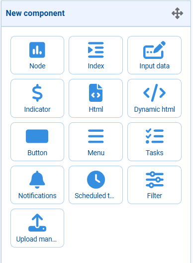
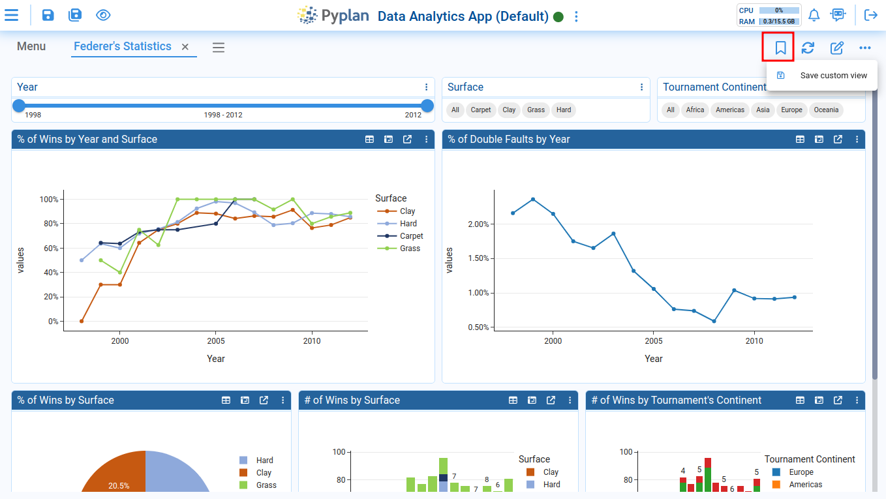
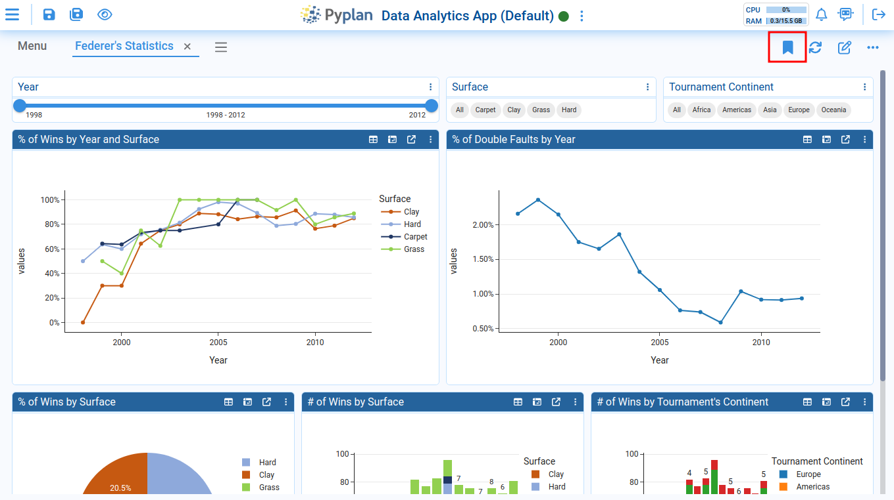
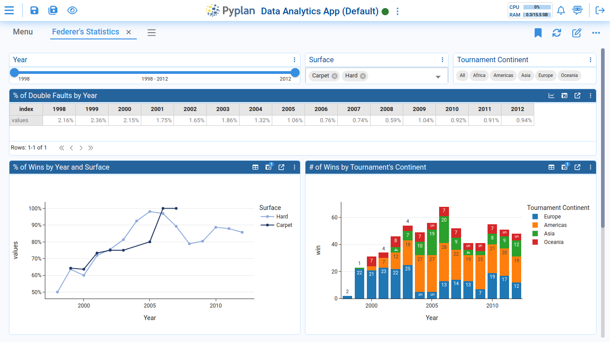
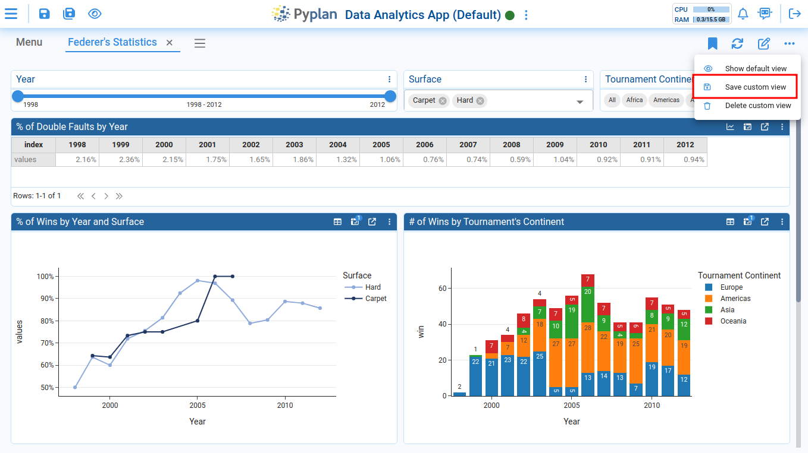
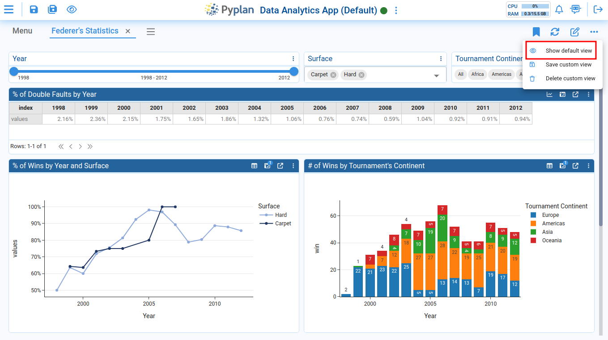
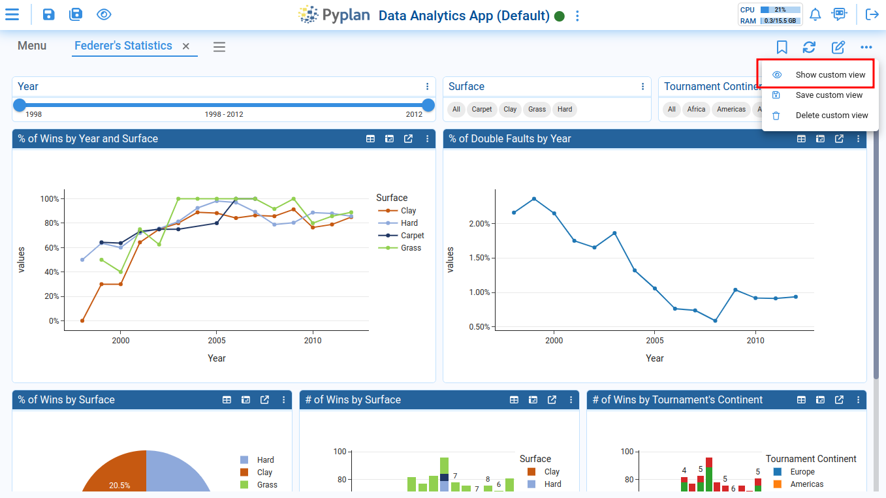
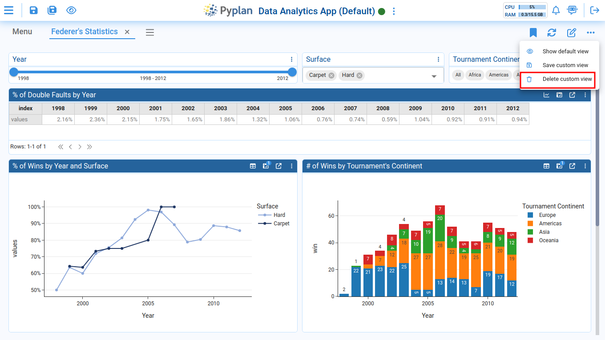

# Creating an Interface

Transform your data into actionable insights using user-friendly interfaces. Begin by clicking, and effortlessly tailor the experience to your needs. Easily visualize and comprehend your data without any complexity.

## Create an Interface

Begin by clicking on the **Create** button to initiate the process.

Next, personalize your interface by assigning a name and selecting an icon that best represents it. This step adds a touch of uniqueness to your analytics experience.

Dive into the design phase effortlessly. Click on the edit icon to start shaping your interface according to your preferences. This is where you get to tailor the visualization of your data exactly the way you want it.

## Components to Include in an Interface

Adding components to your interface opens up a world of possibilities for customization and functionality. Explore the diverse range of components available to tailor your interface to your specific needs.

## Saving a Custom View of an Interface

Each user can save their own custom view of an interface. A custom view may include different components from the default view, custom pre-applied filters, and a unique arrangement of components within the interface grid.

A custom view is only visible to the user who created it. No write permissions on the application are required for the user to create a custom view.

### Create a Custom View

To create a custom view, click the following button and then select the **Save custom view** option:

The custom view icon will turn solid when it becomes active:

Afterward, you can begin modifying various settings in the interface grid — for example, changing one of the components from a chart to a table, switching the Surface filter format to a selector, and selecting specific values. You can also rearrange the positions of certain components within the interface:

To save all the changes you've made, click on the **Save custom view** option:

### Switch from Custom View to Default View

When you open an interface with a custom view, Pyplan will automatically load your custom view the first time. To switch back to the default view, select the **Show default view** option.

To return to your custom view, click on the **Show custom view** option:

### Delete a Custom View

To delete your custom view, click on the **Delete custom view** option:

