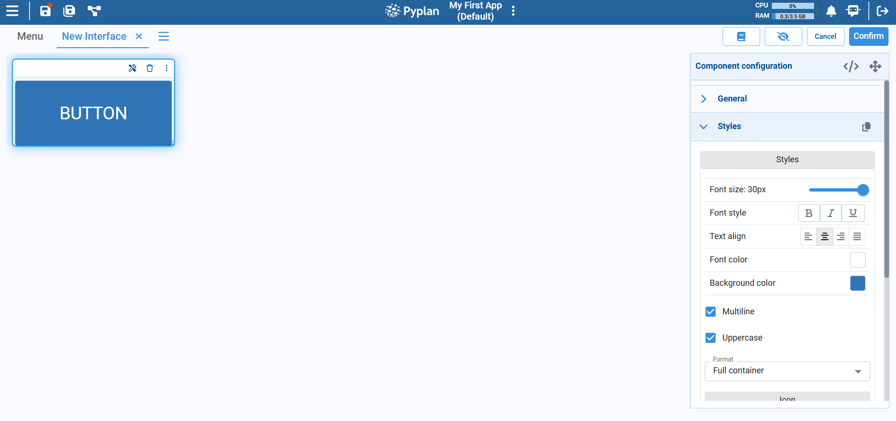

# Button Component

The Button component is an interface element used to execute code that interacts with the application. It is typically used to:

- Run application nodes (for example, run a model or calculation chain).
- Trigger processes such as sending emails or exporting results.
- Save or refresh data and update other components on the screen.

When a user clicks the button, Pyplan executes the action configured, usually by calling a specific node in the model.

## Configuration

After placing a Button on the interface, configure it from the **Component configuration** panel on the right.

In the **General** section:
- Define the **label** of the button (text displayed inside it).

In the **Styles** section:
- **Font size** (slider).
- **Font style** (bold, italic, underline).
- **Text alignment** (left, center, right, justified).
- **Font color** and **background color**.
- **Multiline**: whether the label can wrap onto multiple lines.
- **Uppercase**: whether the label text is automatically converted to uppercase.
- **Format**: layout options such as Full container or other size presets.
- Optional **icon** to display next to the label.

These options let you adapt the button to match the design of the interface and highlight important actions.

## Confirmation Dialog

For critical actions — such as running heavy models, overwriting results, or sending notifications — you can enable a confirmation dialog.

When this option is active:

1. Clicking the button first opens a confirmation popup instead of executing the action immediately.
2. You can define a custom confirmation message, for example:
   - "Are you sure you want to run the simulation?"
   - "This action will overwrite existing results. Continue?"
3. Only if the user confirms does Pyplan execute the configured action or node.

This extra step helps prevent accidental executions and gives users clear feedback about what the button will do.
