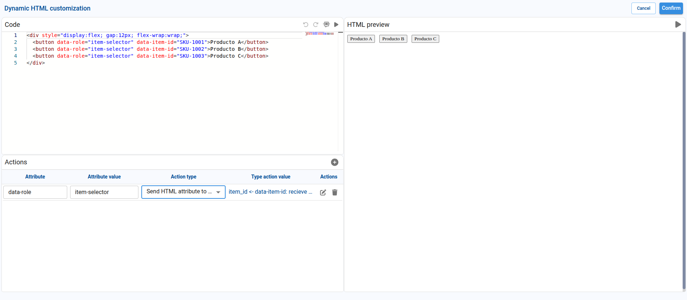
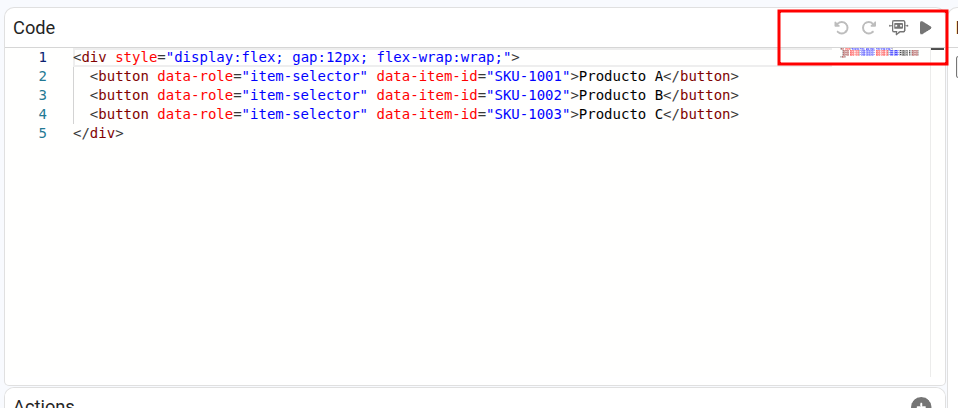
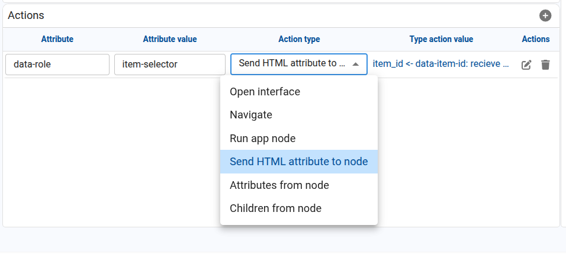
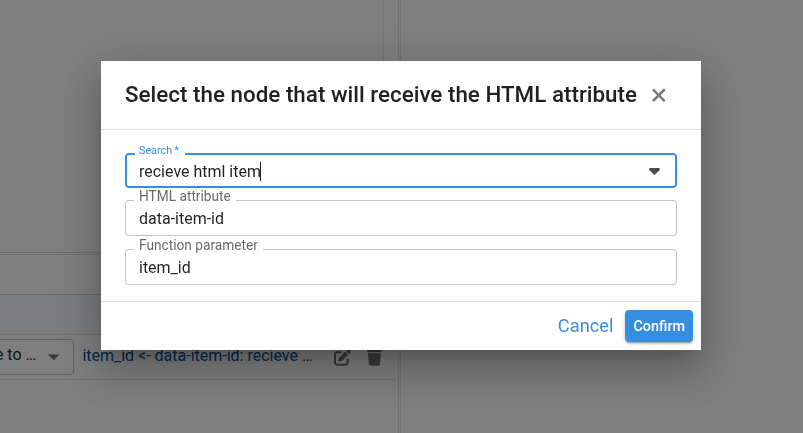

# Dynamic HTML Component

The **Dynamic HTML** component lets us embed custom HTML into a Pyplan interface and connect HTML elements to application actions without writing additional integration code. We can write or paste HTML and then configure actions that link specific elements to interfaces, application sections, nodes, or dynamic content returned by the model.

Using this component, we can build highly customized panels such as cards, buttons, alerts, banners, and summary blocks while keeping the interaction logic connected to the Pyplan model.



## Main Areas

When we add a Dynamic HTML component to an interface and open its configuration, we work with three main areas:

**Code**
- Large text area where we write or paste the HTML markup.
- Here we can define elements, inline styles, and stable attributes that we later reference from the action configuration.

### Code Widget Actions

In the **Code** area, the toolbar provides several actions that help us edit and test the HTML before saving it:

| Action | Description |
|---|---|
| **Undo** | Reverts the latest change made in the HTML editor. |
| **Redo** | Reapplies the last reverted change. |
| **AI assistant** | Opens the inline assistant so we can ask for help generating, refactoring, or explaining the HTML code. |
| **Run preview** | Executes the current HTML code and refreshes the **HTML preview** panel without needing to confirm all changes first. |

This toolbar is especially useful while we iterate on the HTML structure and verify that the configured actions still point to the expected elements.



**HTML preview**
- Live preview of how the HTML will be rendered in the interface.
- Updates when we run or confirm changes, allowing us to validate the layout and styling.

**Actions**
- A table at the bottom where you define dynamic behaviors for specific HTML elements.
- Each row links an HTML attribute, for example `id="execute-app"` or `data-role="customer-link"`, with an action type and its corresponding configuration.



## Defining Actions on HTML Elements

Each row in the **Actions** table describes how one or more HTML elements should behave. For each row we configure:

| Field | Description |
|---|---|
| **Attribute** | The HTML attribute used to identify the target element. Example: `id` or `data-role`. |
| **Attribute value** | The value of that attribute in the HTML. Example: `execute-app` or `customer-link`. |
| **Action type** | The behavior triggered when the element is interacted with, usually on click. |

### Available Action Types

**Open interface**
Opens a specific Pyplan interface. We select the target interface and optionally decide whether it opens in a new tab.

**Navigate**
Navigates to a specific section of the application, such as **Code**, **Interfaces**, **Scheduled tasks**, or other high-level areas.

**Run app node**
Executes an application node. We select the node to run from the configuration dialog.

Example:
- Attribute: `id`
- Attribute value: `execute-app`
- Action type: **Run app node**
- Type action value: node `fin_run_node`

**Send HTML attribute to node**
Executes a node function and sends to it the value of an attribute taken from the clicked HTML element. This action is useful when we want several HTML elements to call the same node while passing a different identifier, code, or parameter.

To configure this action, we define:
- The HTML element selector through **Attribute** and **Attribute value**.
- The target node.
- The **HTML attribute** that Pyplan should read from the clicked element.
- The **function parameter** that will receive that value in the node.

Example:
- Attribute: `data-role`
- Attribute value: `customer-link`
- Action type: **Send HTML attribute to node**
- HTML attribute: `data-customer-id`
- Function parameter: `customer_id`
- Node: `go_to_customer`

If the HTML contains several elements such as:

```html
<ul>
	<li data-role="customer-link" data-customer-id="CUST-001">Customer 001</li>
	<li data-role="customer-link" data-customer-id="CUST-002">Customer 002</li>
	<li data-role="customer-link" data-customer-id="CUST-003">Customer 003</li>
</ul>
```

then clicking **Customer 002** sends the value `CUST-002` to the configured node parameter.



**Attributes from node**
Sets one or more HTML attributes based on the result of a node. A typical use case is to dynamically assign values to attributes such as `src`, `href`, `title`, or `style`.

Example:
- Attribute: `id`
- Attribute value: `notification-block`
- Action type: *Attributes from node*
- Type action value: a node that returns a value such as an image URL, a link, or a CSS style string, which is then assigned to the configured target attribute of the matching element.

**Children from node**
Replaces the inner content (children) of an HTML element with the result of a node.

Example:
- Attribute: `id`
- Attribute value: `tasks-counter`
- Action type: *Children from node*
- Type action value: ID of a node that returns the string `"You have 2 pending tasks"`.

## Example: Sending a Dynamic Identifier to a Node

One common use case is a list of cards or links where all elements call the same node but each one sends a different identifier.

In this scenario, we can define the following HTML:

```html
<div style="display:flex; gap:12px; flex-wrap:wrap;">
	<button data-role="product-button" data-item-id="SKU-1001">Product A</button>
	<button data-role="product-button" data-item-id="SKU-1002">Product B</button>
	<button data-role="product-button" data-item-id="SKU-1003">Product C</button>
</div>
```

Then we configure one action row with these values:

| Field | Value |
|---|---|
| **Attribute** | `data-role` |
| **Attribute value** | `product-button` |
| **Action type** | `Send HTML attribute to node` |
| **HTML attribute** | `data-item-id` |
| **Function parameter** | `item_id` |
| **Node** | `receive_html_item` |

With this configuration, when we click **Product B**, Pyplan reads `data-item-id="SKU-1002"` from the clicked element and sends `SKU-1002` to the node function as the `item_id` parameter.

To test this flow, the target node can expose a function that receives the parameter and updates other nodes or returns the received value.

```python
def receive_html_item(item_id=None):
		value = item_id or 'no_value'
		getNode('last_selected_item').definition = f"result = {value!r}"
		return value

result = receive_html_item
```

## Example: Sending Data from a Selector to a Node

Another common use case is a selector that sends the current option to a node function every time the selection changes.

In this scenario, we can define the following HTML:

```html
<label for="customer-selector">Customer</label>
<select id="customer-selector" data-role="customer-selector">
	<option value="CUST-001">Customer 001</option>
	<option value="CUST-002">Customer 002</option>
	<option value="CUST-003">Customer 003</option>
</select>
```

Then we configure one action row with these values:

| Field | Value |
|---|---|
| **Attribute** | `data-role` |
| **Attribute value** | `customer-selector` |
| **Action type** | `Send HTML attribute to node` |
| **HTML attribute** | `value` |
| **Function parameter** | `customer_id` |
| **Node** | `receive_selected_customer` |

With this configuration, when we select **Customer 002**, Pyplan reads the current value of the `<select>` element and sends `CUST-002` to the node function as the `customer_id` parameter.

To test this flow, the target node can expose a function such as:

```python
def receive_selected_customer(customer_id=None):
	value = customer_id or 'no_customer'
	getNode('last_selected_item').definition = f"result = {value!r}"
	return value

result = receive_selected_customer
```

If we need to send a value stored as an attribute of the selected `<option>` instead of the visible `value`, we can define the selector like this:

```html
<select id="customer-selector" data-role="customer-selector">
	<option value="1" data-customer-id="CUST-001">Customer 001</option>
	<option value="2" data-customer-id="CUST-002">Customer 002</option>
	<option value="3" data-customer-id="CUST-003">Customer 003</option>
</select>
```

In that case, we use `selectedOption:data-customer-id` as the **HTML attribute** so Pyplan reads the attribute from the selected option and sends that value to the node.

## Recommended Practices

- We use stable selectors such as `id`, `data-role`, or `data-code` so the action configuration remains aligned with the HTML.
- We keep the HTML structure and the action table synchronized. If an action points to a selector that no longer exists in the HTML, the interaction no longer applies.
- We use **Attributes from node** when the model must update an HTML attribute and **Children from node** when the model must inject visible content inside an element.
- We use **Send HTML attribute to node** when the same node function must react differently depending on which element was clicked.
- For selectors, we use `value` when the node should receive the selected value directly, and `selectedOption:<attribute>` when the value must come from an attribute of the selected option.

:::tip
When we need to send different identifiers from several HTML elements, it is usually better to reuse the same selector and differentiate each element with a second attribute such as `data-item-id`, `data-customer-id`, or `data-code`.
:::

You can add as many rows as needed using the "+" button in the Actions section. Each row can have its own Attribute, Attribute value, and Action type, allowing multiple interactive elements within the same HTML block.
