# Filter Component

The Filter component groups all indices and selectors present in the interface into a single component. We add it during the editing phase, just like any other component.

:::note
Only one Filter component is allowed per interface. When added, it automatically positions itself at the top with a fixed width and height, and it cannot be moved.
:::

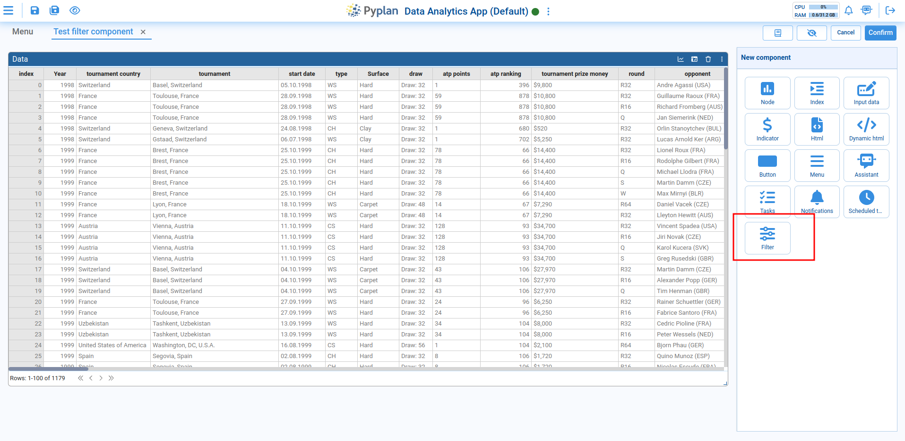

## Adding Filters

To add filters to the component, click on the button that appears on the left, which will open a modal where the desired filters can be added.

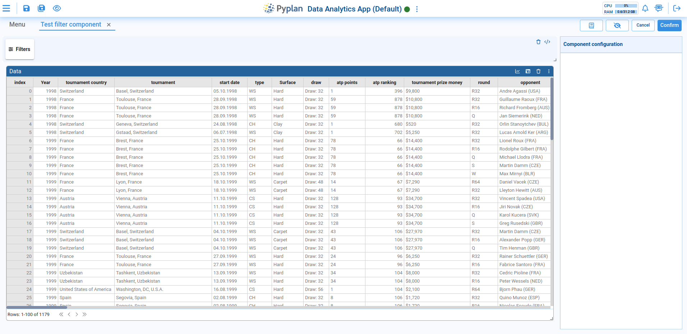

To add new filters, press the icon labeled **Add new filter**, which will display a node diagram with available indices and selectors.

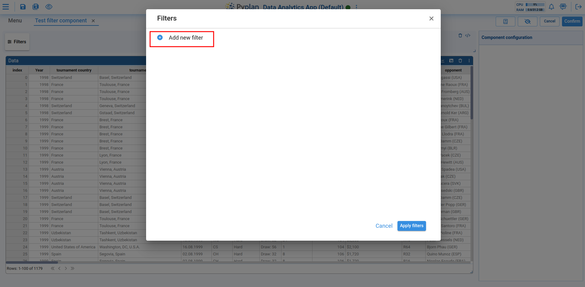

Once the desired indices or selectors are chosen, the nodes are added to the component.

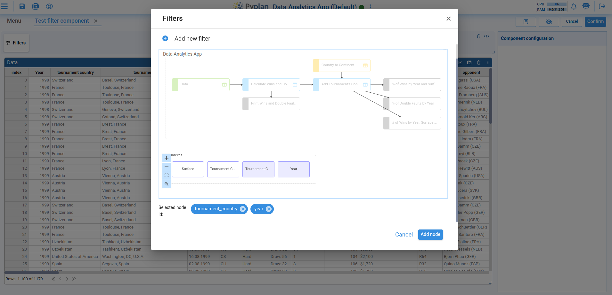

## Managing Filters

When indices or selectors are selected, they are added to a list of filters where the following operations can be performed for each filter:

**1. Select values to filter**

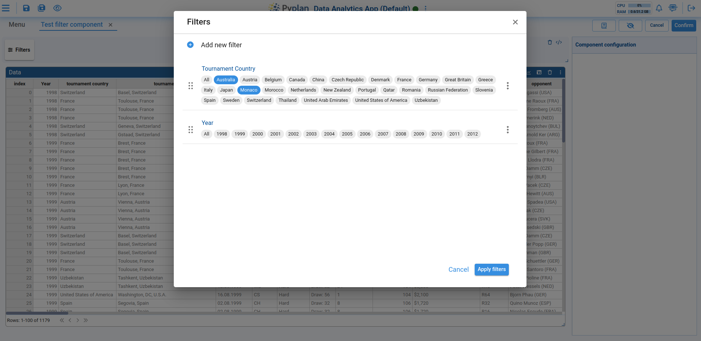

**2. Reorder the list by dragging the filter to the desired position**

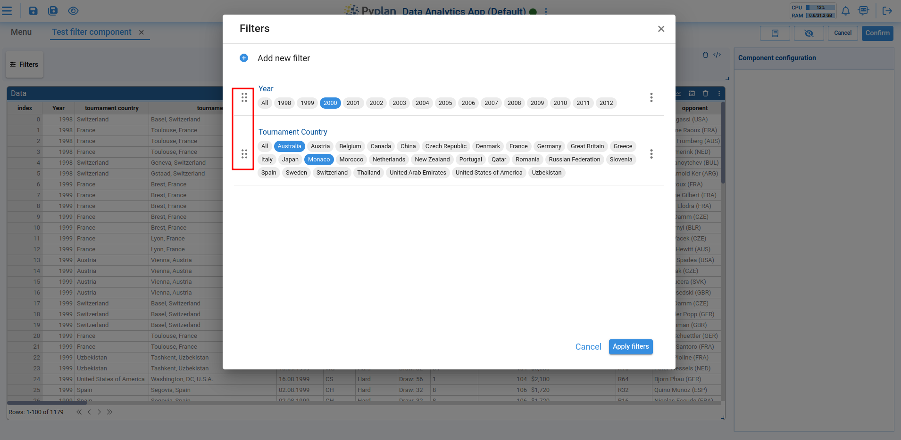

**3. Edit or remove the filter**

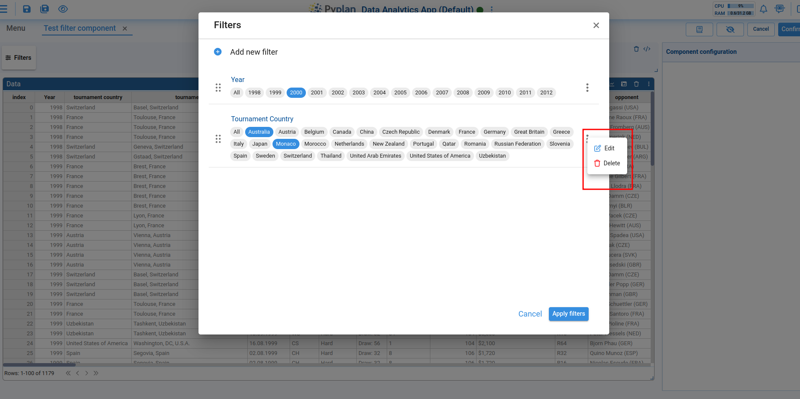

When editing, a new view opens allowing you to modify the format, mode, and other filter properties.

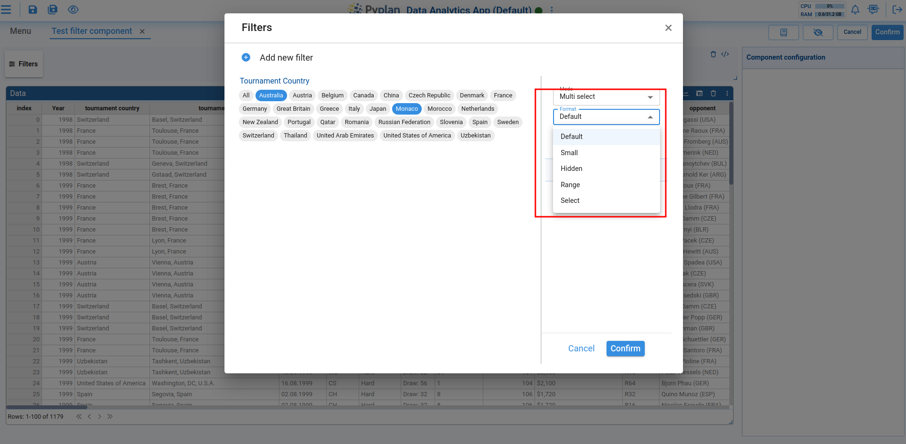

## Controlling Filter Visibility

The Filter component can use a **visibility controller** to decide which filters are shown in the interface. We configure this controller with a node that returns the ids of the indices and selectors that must remain visible inside the component.

### Configuring the Visibility Controller

1. Open the interface in edit mode.
2. Select the **Filter** component.
3. In the component toolbar, click **Select visibility controller**.
4. Choose the node that will control which filters remain visible.
5. Save the component configuration.

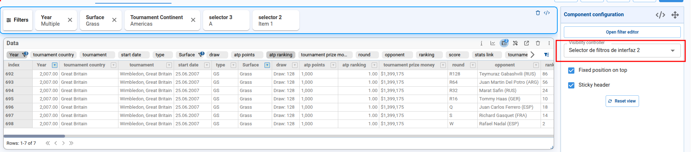

### How Visibility Works

Once the controller is configured, the Filter component only displays the filters whose ids are returned by that node.

1. In the **Filter component** interface, the Filter component initially shows all configured filters: **year**, **tournament_continent**, **surface**, **selector_2**, and **selector_3**.

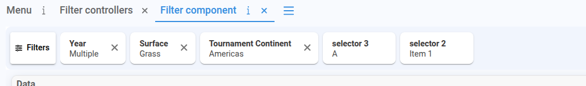

2. In the **filter controllers** interface, a selector node defines which filter ids must remain visible in the Filter component. In this example, we remove **tournament_continent** from that list, as indicated by the red arrow.

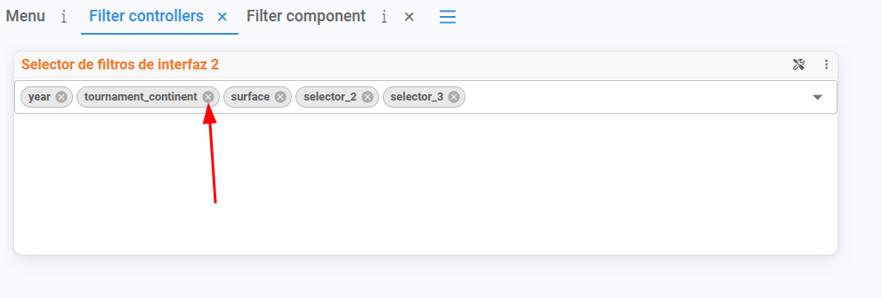

3. When we return to the **Filter component** interface, the Filter component updates its visible filters and **tournament_continent** is no longer displayed.

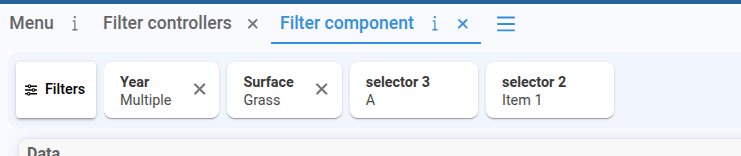

:::info
The visibility controller only affects how filters are displayed in the interface. It does not remove filters from the component and it does not clear the values already selected in hidden filters.
:::

:::tip
If no visibility controller is configured, the Filter component continues to display all filters normally.
:::

In edit mode, we can still open the Filter configuration and manage the complete list of filters, including the ones that are currently hidden in the interface.

## Applying Filters

Once the desired filters are added, they can be applied to the corresponding components by clicking **Apply filters**. This will close the modal and show only the filters with one or more selected values in the filter list. Filters with either all elements selected or none selected will not appear in the list.

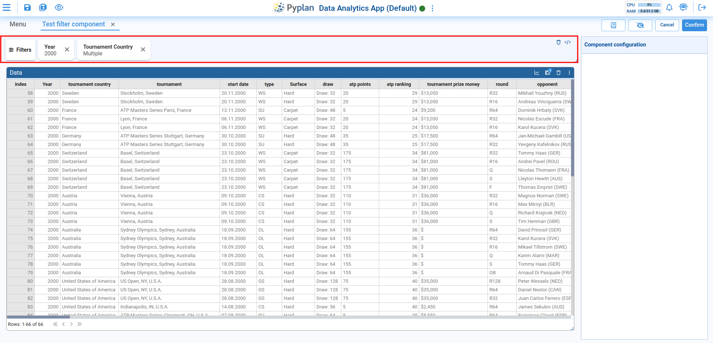

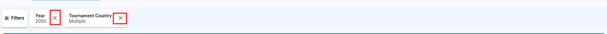

In the interface list, filters that allow all their values to be deselected will display a delete symbol. Clicking the delete symbol will deselect all the values.

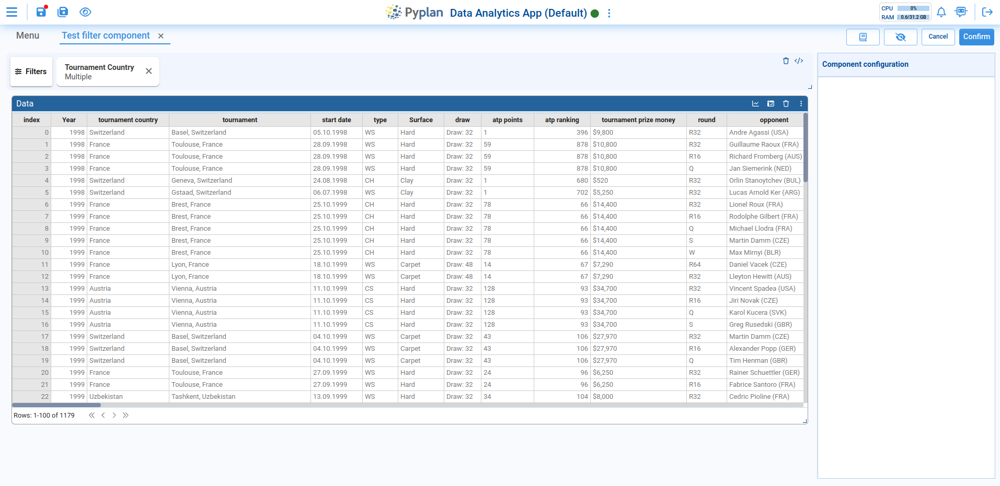
