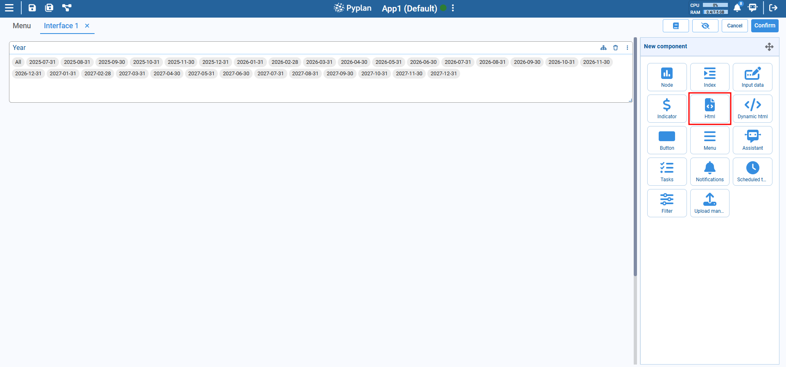
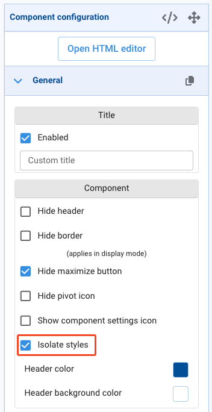
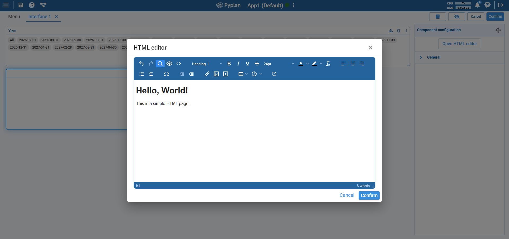
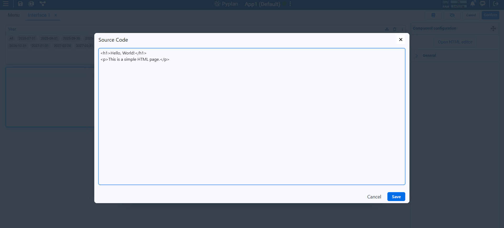

# HTML Component

The HTML component in Pyplan allows users to insert formatted content — such as text, images, links, and styling — into their dashboards or interfaces using HTML. It's especially useful for adding titles, descriptions, instructions, or branding elements.

You can use the visual editor or write raw HTML directly, offering both beginner-friendly and developer-oriented editing experiences.

## Key Features

- Supports standard HTML tags (`<h1>`, `
`, `<ul>`, `<table>`, etc.)
- WYSIWYG editor for non-technical users
- Code view for custom HTML styling and structure
- Dynamic resizing and layout compatibility
- Can embed media, images, links, and styled text
- **Isolated Styles** option (enabled by default) evaluates HTML, JavaScript, and CSS inside an `iframe`, isolating component rendering from the rest of the interface

## Configuration Options

### Editor Modes

**Visual editor**: User-friendly toolbar with formatting buttons for bold, italic, lists, etc.

**Source code**: Toggle to raw HTML for full control over formatting.

### Content

- Add headings, paragraphs, lists, tables, and more using either the editor or HTML code.
- Can include inline styles, image links, and embedded elements.

### Use Cases

- Display section headers or context in dashboards.
- Add formatted descriptions or instructions next to input fields.
- Embed logos, icons, etc.
- Present static summaries alongside dynamic content.

:::tip
- Use `<h1>`, `<h2>`, etc. for consistent headers.
- Prefer the visual editor for quick formatting, and switch to code for precise control.
- Combine with layout components to control spacing and alignment.
:::
