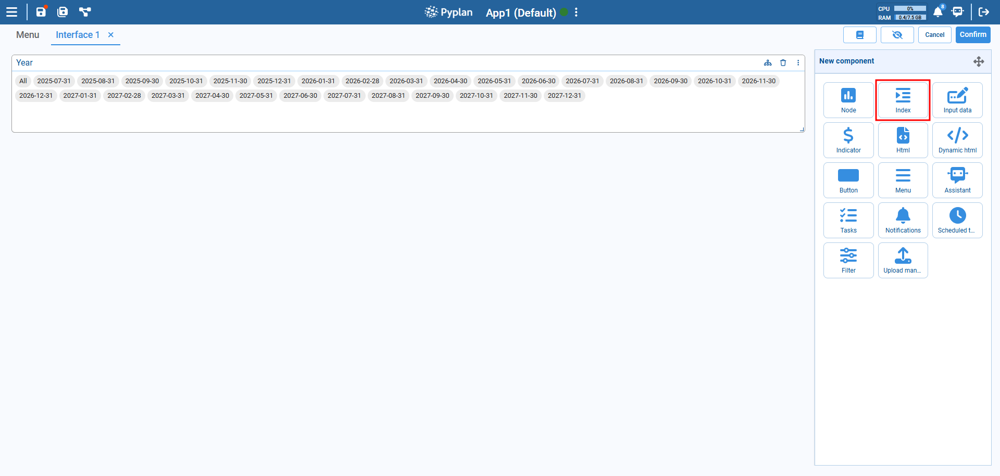
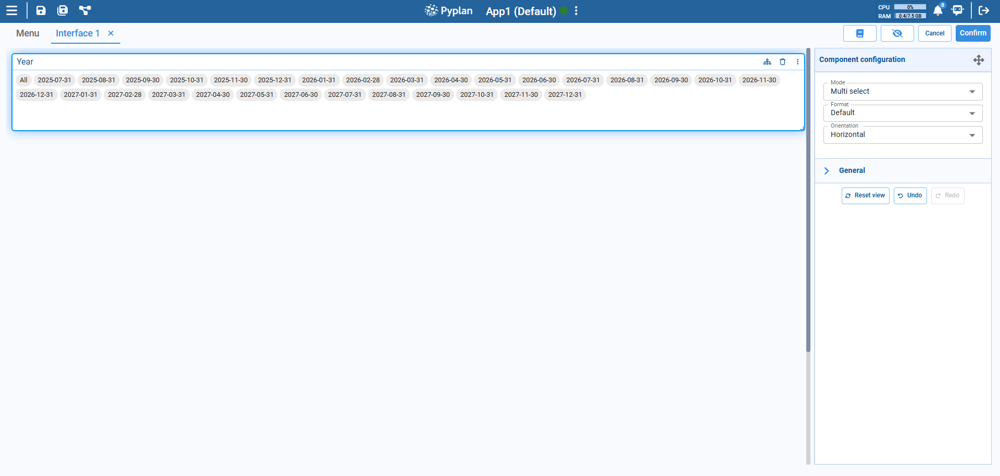
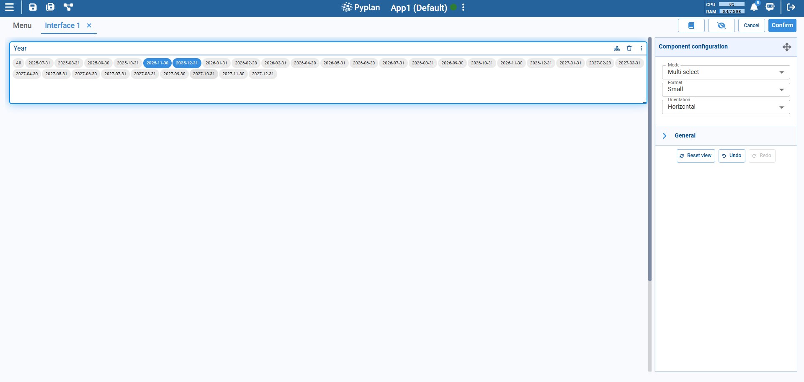
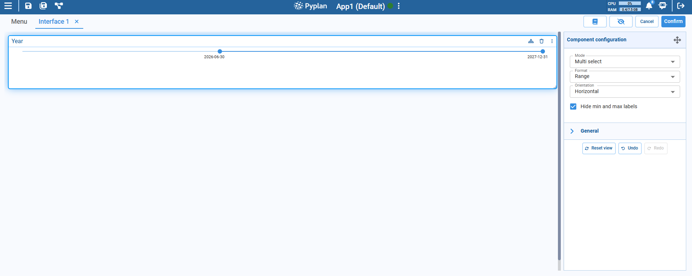
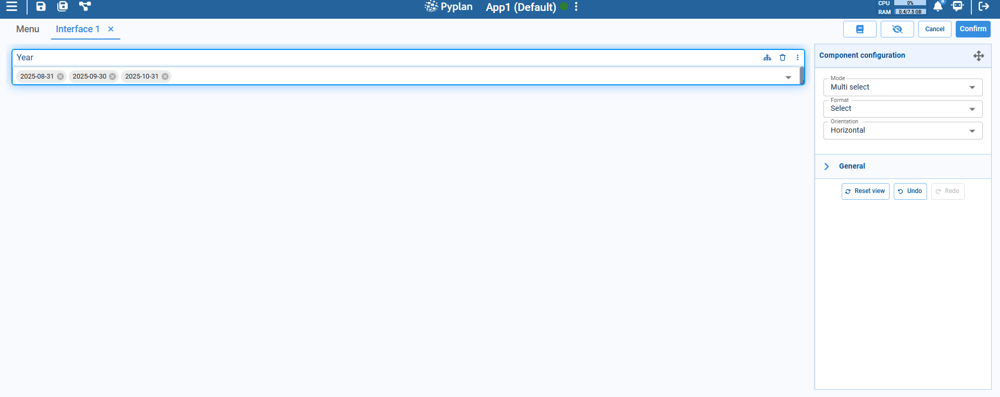
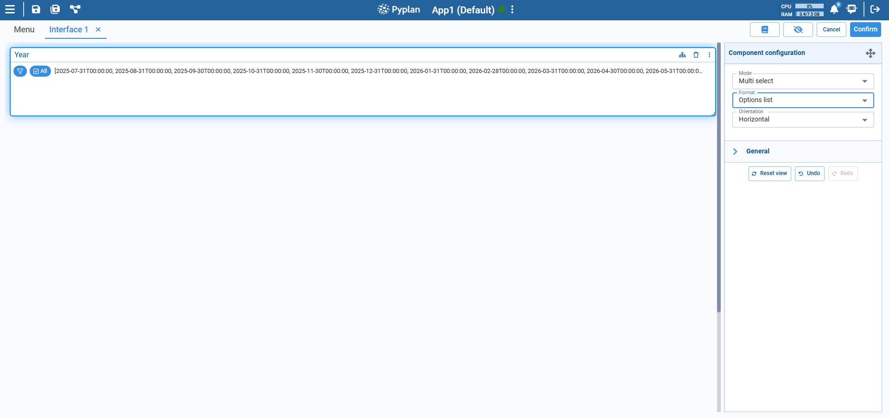

# Index Component

The Index component in Pyplan is designed to allow users to filter or select one or multiple values from a predefined list of index values — typically dates, categories, or labels. It's especially useful for driving dynamic filtering in dashboards or interfaces.

This component can be configured with different formats to suit the user experience and type of data being handled.

:::info
The Index component provides a way for users to interact with model indices (like time periods or product categories) through a visual interface. It can be linked to nodes or data views to filter and dynamically update content.
:::

## Configuration Options

### Mode

- **Single select**: Only one value can be selected at a time.
- **Multi select**: Allows selection of multiple values.
- **Range**: Select a continuous range (for time or numerical indices).

### Format Types

#### 1. Default

Displays index values as inline selectable tags, horizontally or vertically.

**Use case**: Best for short or medium-length index lists where clarity and visibility are important.

#### 2. Small

A more compact version of the default selectable tags. Useful when space is limited.

**Use case**: When you want users to quickly view and select multiple items with clarity.

#### 3. Range

Enables selection of a start and end value using a slider. Ideal for date or numeric ranges.

**Use case**: When working with time series or continuous data.

#### 4. Select

Provides a dropdown interface for selection (especially useful when dealing with long lists).

**Use case**: Compact view, less visual clutter.

#### 5. Options List

Displays a filter icon that opens a dialog box where users can select one or more index values. After selection, the chosen items are shown as tags below the control.

**Use case**: Best when working with large index sets or when space is limited. Provides a clean layout while still allowing flexible selection.

### Orientation

- **Horizontal**: Index items or sliders are displayed left to right.
- **Vertical**: Items stack top to bottom.

:::tip Tips
- Use **Range** when working with continuous time-based data.
- Use **Select** for large lists to improve UI clarity.
- Link the index to relevant nodes to enable dynamic filtering across visual components.
:::
