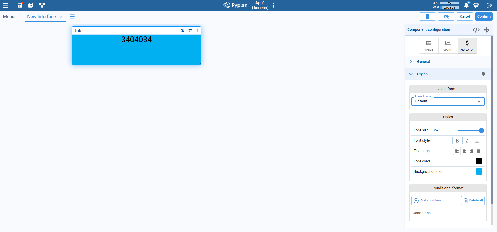

# Indicator Component

The Indicator component is used in interfaces to display a single KPI or aggregated value in a prominent way (for example, Total Sales, Profit, or Headcount). It is ideal for highlighting key metrics on dashboards and summary pages.

After placing an Indicator on the canvas, configure it from the **Component configuration** panel on the right side of the screen.

## Adding an Indicator

1. Open or create an interface.
2. From the component bar, select **INDICATOR** and click on the canvas to place it.
3. Link the Indicator to a node whose result returns a scalar value (or a reduced value from a table/cube).

Once linked, the Indicator shows the node value in the center of the card, with the node title (or a custom label) in the header.

## General Configuration

In the **General** section of the configuration panel you can:

- Select the source node that provides the value.
- Define the label to be displayed at the top of the card (e.g., "Total").
- Map node dimensions to explicit indexes when the node result is multidimensional (for example, fixing a specific Year or Region to show in the Indicator). This lets you decide exactly which slice of a cube or table is displayed.

## Styles

The **Styles** section controls the visual appearance of the Indicator. You can adjust:

**Value format**
- Choose a format preset (Default, number, percentage, currency, etc.) to control how the value is rendered.

**Font size**
- Slider to define the font size of the numeric value.

**Font style**
- Bold, italic, underline options for the value text.

**Text align**
- Horizontal alignment of the value (left, center, right, justified).

**Font color**
- Color of the value text.

**Background color**
- Color of the Indicator card background.

These options allow you to match the Indicator with the visual style of the rest of the interface and emphasize the most important metrics.

## Conditional Format

At the bottom of the panel you will find **Conditional format**:

- Use **Add condition** to define rules that change the style of the Indicator based on its value (for example, red when value < 0, green when value > target).
- Use **Delete all conditions** to remove conditional formatting.

Conditional formatting is useful to quickly highlight good or bad performance directly in the interface.
