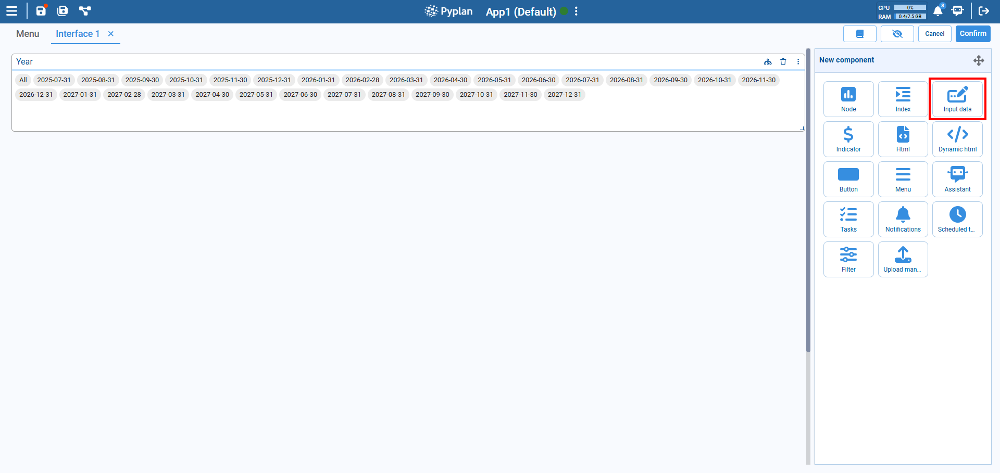
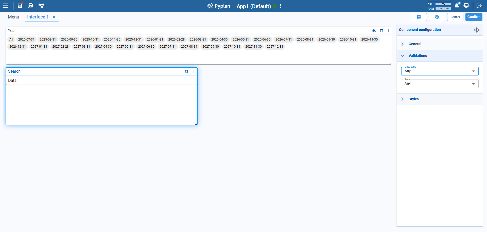

# Input Data Component

The Input Data component allows users to enter or modify data directly within the interface. It is a highly customizable field that supports validation rules, styling, and various data types, enabling user interaction within dashboards or planning models.

## How to Add

1. Go to the **New component** panel.
2. Select **Input Data**.
3. A new input box will appear in the interface with default settings.

## Configuration Options

### General

- **Title**: Sets the component title and supports translations for multiple languages.
- **Component**: Enables customization of colors and visibility for different parts of the component.

### Validations

#### Data Type

Restricts the type of value the user can input. The available options are:

- **Any**: Accepts any type of input (no validation).
- **Float**: Only allows decimal numbers (e.g., 3.14).
- **Integer**: Only allows whole numbers (e.g., 42).
- **String**: Only allows text input.

#### Rule

Applies additional constraints depending on the selected Data type:

**For `Float` and `Integer`:**

- `Range`: Value must be within a specific range (e.g., 0–100).
- `Not in range`: Value must be outside a specific range.
- `Equal to`: Value must exactly match a given number.
- `Not equal to`: Value must differ from a given number.
- `Greater than`: Value must be higher than a given number.
- `Less than`: Value must be lower than a given number.
- `Greater than or equal to`: Value must be equal to or higher than a given number.
- `Less than or equal to`: Value must be equal to or lower than a given number.

**For `String` (text input):**

- `Text Length`: Restricts the number of characters.

These validations help ensure the user inputs conform to model expectations.

### Styles

Located in the **Styles** section, you can adjust:

- Font size
- Input field alignment
- Background and border colors
- Padding/margin

:::tip Tips
- Use validation rules to maintain model integrity.
- Rename the label to make the field purpose clearer (e.g., "Enter Growth %").
:::
